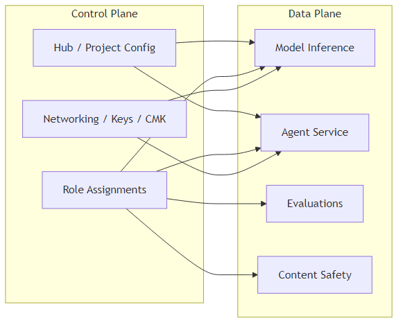
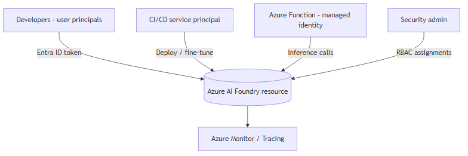

# Authentication and authorization options in Azure AI Foundry
<!--
Azure AI Foundry supports multiple authentication approaches to balance security, operational simplicity, and speed. This article explains the control plane and data plane model, compares API key and Microsoft Entra ID (formerly Azure AD) authentication, maps identities to roles, and describes common least privilege scenarios. Use this article with:

- [Role-based access control for Azure AI Foundry](rbac-azure-ai-foundry.md)
- [Configure keyless authentication with Microsoft Entra ID](../foundry-models/how-to/configure-entra-id.md)
- [Rotate API access keys](../../ai-services/rotate-keys.md?context=/azure/ai-foundry/context/context)
- [Azure built-in roles (AI + machine learning)](/azure/role-based-access-control/built-in-roles#ai-+-machine-learning)

> [!IMPORTANT]
> Use Microsoft Entra ID for production workloads to enable conditional access, managed identities, and least privilege RBAC. API keys are convenient for quick evaluation and legacy tooling but lack user level traceability.
## Control plane vs. data plane

Azure services separate management (_control plane_) from runtime operations (_data plane_).

| Plane | Scope in Azure AI Foundry | Typical operations | Example tools | Authorization surface |
|-------|---------------------------|--------------------|---------------|-----------------------|
| Control plane | Setting up and configuring hubs, projects, networking, encryption, and connections | Create or delete resources, assign roles, rotate keys, set up Private Link | Azure portal, Azure CLI, ARM templates and Bicep, Terraform | Azure RBAC (management actions and dataActions) |
| Data plane | Running and using model inference, agent interactions, evaluation jobs, and content safety calls | Chat completions, embedding generation, start fine-tune jobs, send agent messages, analyzer and classifier operations | SDKs, REST APIs, Azure AI Foundry portal playground | API key header or OAuth 2.0 (Microsoft Entra ID token) plus dataActions |

### Control and data plane diagram

_Source file: control-data-plane.mmd (stored alongside the image for maintenance; not published)._ 

> [!NOTE]
> This diagram is conceptual. Check current service documentation for the latest supported resources and operations.
## Authentication methods

### API keys

API keys are static secrets scoped to an Azure AI Foundry resource (formerly Azure AI Services).

**Recommended for:**
- Rapid prototyping and isolated test environments
- Systems where rotating a single secret across multiple callers is operationally acceptable

**Advantages:** Simple, language agnostic, and doesn't require a token acquisition flow.

**Limitations:** Can't express user identity, is difficult to scope granularly, and is harder to audit. Disable API keys after you complete Microsoft Entra ID adoption.

### Microsoft Entra ID (token-based and keyless)

Microsoft Entra ID uses OAuth 2.0 bearer tokens. Principals get tokens for the resource scope (`https://cognitiveservices.azure.com/.default`).

**Recommended for:**
- Production workloads
- Conditional Access, MFA, and just-in-time access
- Least privilege RBAC and managed identity integration

**Advantages:** Fine-grained role assignments, per-principal auditing, controllable token lifetimes, automatic secret hygiene, and managed identities for services.

**Limitations:** Has slightly higher initial setup complexity and requires custom subdomain endpoints for some services. See [Configure keyless authentication with Microsoft Entra ID](../foundry-models/how-to/configure-entra-id.md).

## Feature support matrix: API key vs. Microsoft Entra ID

> [!IMPORTANT]
> Validate features marked [**TO VERIFY**] against current release notes if you rely on them for compliance-critical scenarios.
| Capability or feature | API Key | Microsoft Entra ID | Notes |
|---------------------|---------|--------------------|-------|
| Basic model inference (chat, embeddings) | Yes | Yes | Fully supported. |
| Fine-tuning operations | Yes | Yes | Entra ID provides per-principal audit. [**TO VERIFY**] |
| Agents service interactions | Yes | Yes | Use Entra ID for managed identity tool access. |
| Content safety analyze calls | Yes | Yes | Use RBAC to limit high-risk operations. |
| Batch analysis jobs (Multimodal Intelligence) | Yes | Yes | Entra ID is recommended for large-scale labeling. [**TO VERIFY**] |
| Portal playground usage | Yes | Yes | Playground uses project connection authentication mode. |
| Network isolation with Private Link | Yes | Yes | Entra ID adds Conditional Access benefits. |
| Conditional Access and MFA enforcement | No | Yes | Key-based auth bypasses user identity. |
| Least privilege with built-in and custom roles | Limited | Yes | Keys provide all-or-nothing access per resource. |
| Managed identity (system-assigned or user-assigned) | No | Yes | Enables secretless service-to-service auth. |
| Per-request user attribution | No | Yes | Token includes tenant and object IDs. |
| Revocation (immediate) | Rotate key | Remove the role or disable the principal | Short token lifetime still applies. |
| Support in automation pipelines | Yes (secret) | Yes (service principal or managed identity) | Entra ID avoids secret rotation overhead. |

## Identity types

| Identity type | Description | Typical use in Foundry | Advantages | Considerations |
|---------------|-------------|------------------------|------------|----------------|
| User principal | Individual user in Entra ID | Portal, exploratory dev, model evaluation | Fine-grained auditing, Conditional Access policies | Not ideal for unattended jobs |
| Service principal (app registration) | Application identity that uses a client secret or certificate | CI/CD pipelines, batch orchestration, external systems | Supports automation, supports certificate auth | Secrets and certificates must be rotated, avoid assigning overly broad roles |
| Managed identity (system-assigned) | Azure resource-bound identity automatically managed by the platform | Deployed services calling Foundry (Functions, Web Apps, Container Apps) | No secret management, lifecycle tied to the resource | Works only in Azure, can't be used outside the cloud |
| Managed identity (user-assigned) | Standalone identity that attaches to multiple resources | Share a workload identity across apps and define a rotation boundary | Reusable across hosts, enables granular role scoping | Lifecycle is decoupled—you must manage it separately |

## Built-in roles overview

See the authoritative list in [Azure built-in roles (AI + machine learning)](/azure/role-based-access-control/built-in-roles#ai-+-machine-learning). Common examples:

| Scenario | Typical built-in role(s) | Notes |
|----------|--------------------------|-------|
| Consume inference only | Cognitive Services User or Cognitive Services OpenAI User | Grants data plane usage. Doesn't allow management plane writes. |
| Manage deployments or fine-tune models | Cognitive Services OpenAI Contributor | Includes permissions to create or update model deployments. |
| Rotate keys or manage resource | Cognitive Services Contributor | Broad. Consider a custom role for least privilege. |
| Observability and metric reads | (Varies) Cognitive Services User plus monitoring roles | Combine with Azure Monitor Reader if needed. |

> [!TIP]
> Create a custom role when a built-in role grants more permissions than you need.
## Set up Microsoft Entra ID

High-level steps. See the detailed guide: [Configure key-less authentication](../foundry-models/how-to/configure-entra-id.md).

1. Ensure your Azure AI Foundry resource has a custom subdomain configured. See [Custom subdomains](/azure/ai-services/cognitive-services-custom-subdomains).
1. Assign the needed built-in or custom role, such as Cognitive Services User, to each principal—user, service principal, or managed identity—at the resource or project scope.
1. For a service principal, create an app registration, add a client secret or certificate, and note the tenant ID, client ID, and secret or certificate.
1. For a managed identity, enable the system-assigned identity on the calling service or attach a user-assigned identity, then assign a role to it on the Azure AI Foundry resource.
1. Update project connections in Azure AI Foundry to use Microsoft Entra ID: Management center > Connected resources > Access details > Authentication > Microsoft Entra ID.
1. Remove key-based authentication after all callers use token authentication. Optionally disable local authentication in deployment templates.

### Example: Contoso mixed workload scenario

_Diagram source file: contoso-mixed-scenario.mmd (stored with the image for maintenance; not published)._ 

- Give developers the `Cognitive Services User` role for inference.
- Give the service principal a custom role that allows deployment and evaluation actions.
- Give the managed identity for the Azure Function only the inference dataActions.
- Security admin reviews role assignments regularly.

## Common setup scenarios

### Scenario: Restrict users to model inference but not agents
1. Create a custom role that excludes agent dataActions.
1. Assign users the custom role and the `Cognitive Services User` role if they need baseline inference.
1. Attempt an agent action to confirm it's denied.

### Scenario: Separate admins (configuration) from developers (build)
1. Assign a minimal management plane custom role to admins (resource write and delete plus networking; no dataActions).
1. Assign developers data plane roles (for example, Cognitive Services OpenAI User or a custom role) without management plane delete rights.
1. Review assignments periodically by using Azure Access Reviews.

### Scenario: Least-privileged project access
1. Inventory required operations (inference, fine-tuning, evaluation, content safety).
1. Start with the narrowest built-in role that covers most needs, and clone it into a custom role.
1. Add only needed dataActions for additional features; avoid wildcards.
1. Test with a nonprivileged principal. Expand incrementally.
1. Automate assignment by using IaC (Bicep/ARM) for consistency.

## Service authentication patterns

| Pattern | Description | Example | Recommended identity |
|---------|-------------|---------|----------------------|
| Server-to-service (headless) | Backend runs inference for users. | API layer that enriches chat responses. | Managed identity (preferred) or service principal |
| Client app direct call | Front end calls the inference service (don't expose secrets). | Native or mobile app | Use a secure backend token broker. Don't embed keys. |
| Data pipeline batch | Nightly batch fine-tunes models or runs evaluations. | Scheduled job | Service principal with limited custom role |
| Agent tool access to Azure resources | Agent calls other Azure services through tools. | Retrieval augmentation | Managed identity with least privilege |

## Auto role assignments

Some creation workflows can auto assign broad roles, such as granting the resource creator the Owner or Contributor role. Review roles and downgrade them to least privilege right after provisioning. Document any automation that depends on elevated roles.

## Auditing and monitoring

- Use Azure Monitor logs and activity logs to correlate RBAC changes with data plane usage.
- Enable diagnostic settings to export to Log Analytics or a SIEM.
- Scan regularly for principals that still use API keys and migrate them to Entra ID.

## Related content

- [Authenticate requests to Azure AI services](/azure/ai-services/authentication)
- [Configure key-less authentication with Microsoft Entra ID](../foundry-models/how-to/configure-entra-id.md)
- [Azure built-in roles (AI + machine learning)](/azure/role-based-access-control/built-in-roles#ai-+-machine-learning)
- [Managed identities for Azure resources](/entra/identity/managed-identities-azure-resources/overview)
-->
