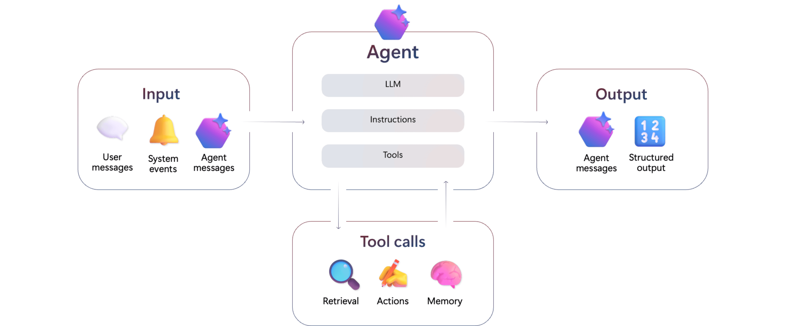

# Foundry Agent Service development overview

[!INCLUDE [version-banner](../../includes/version-banner.md)]

Foundry Agent Service is the runtime and orchestration layer for agents in Microsoft Foundry. It manages threads, messages, and runs; executes tool calls; applies safety controls; and integrates with identity, networking, and observability systems.

## Core AI agent components

- **Model (LLM)**: Provides reasoning and language capabilities.
- **Instructions**: Define goals, constraints, and behavior. In Foundry, instructions can be prompt-based, workflow definitions, or hosted agent code.
- **Tools**: Provide access to data or actions, such as search, file operations, or API calls.



## Create your first agent

The following code samples show how to create an agent, start a conversation, and get a response. If it's your first time using Microsoft Foundry, see the [quickstart](../tutorials/quickstart-create-foundry-resources.md) to set up your project first. 

### Prerequisites

To follow the code samples in this article, you need:

- A [Microsoft Foundry project](../tutorials/quickstart-create-foundry-resources.md) with a deployed model
    - Foundry Agent Service is available in [supported regions](./concepts/limits-quotas-regions.md). Verify your project is in a supported region before proceeding.
- The **Contributor** or **Azure AI Developer** [RBAC role](../../concepts/rbac-foundry.md) on the project

# [Python](#tab/python)

> [!NOTE]
> Install the package: `pip install azure-ai-projects>=2.0.0b1`
>
> Package: [`azure-ai-projects`](https://pypi.org/project/azure-ai-projects/) | Python 3.8+

### Create agent

:::code language="python" source="~/foundry-samples-main/samples/python/quickstart/quickstart-create-agent.py":::

### Chat with agent

:::code language="python" source="~/foundry-samples-main/samples/python/quickstart/quickstart-chat-with-agent.py":::

Set these environment variables before running the samples:

| Variable | Description | Where to find it |
| -------- | ----------- | ---------------- |
| `PROJECT_ENDPOINT` | Your Foundry project endpoint | Overview page in the Foundry portal |
| `MODEL_DEPLOYMENT_NAME` | Your model deployment name | **Models + endpoints** tab in your project |
| `AGENT_NAME` | The name for your new aent | You can use a name of your choice, for example `MyAgent`. |

For more samples, see [Azure SDK for Python agent samples](https://github.com/Azure/azure-sdk-for-python/tree/main/sdk/ai/azure-ai-projects/samples/agents).

# [C#](#tab/csharp)

> [!NOTE]
> Install the package: `dotnet add package Azure.AI.Projects --version 2.0.0-beta.1` or use your IDE's package manager.
>
> Package: [`Azure.AI.Projects`](https://www.nuget.org/packages/Azure.AI.Projects) | .NET 8.0+

### Create agent

:::code language="csharp" source="~/foundry-samples-main/samples/csharp/quickstart/quickstart-create-agent.cs":::

### Chat with agent

:::code language="csharp" source="~/foundry-samples-main/samples/csharp/quickstart/quickstart-chat-with-agent.cs":::

Set these environment variables before running the samples:

| Variable | Description | Where to find it |
| -------- | ----------- | ---------------- |
| `PROJECT_ENDPOINT` | Your Foundry project endpoint | Overview page in the Foundry portal |
| `MODEL_DEPLOYMENT_NAME` | Your model deployment name | **Models + endpoints** tab in your project |
| `AGENT_NAME` | The name for your new aent | You can use a name of your choice, for example `MyAgent`. |

For more samples, see [Azure SDK for .NET agent samples](https://github.com/Azure/azure-sdk-for-net/tree/main/sdk/ai/Azure.AI.Projects/samples).

# [TypeScript](#tab/typescript)

> [!NOTE]
> Install the package: `npm install @azure/ai-projects@2.0.0-beta.1`
>
> Package: [`@azure/ai-projects`](https://www.npmjs.com/package/@azure/ai-projects) | Node.js 20+

### Create agent

:::code language="typescript" source="~/foundry-samples-main/samples/typescript/quickstart/src/quickstart-create-agent.ts":::

### Chat with agent

:::code language="typescript" source="~/foundry-samples-main/samples/typescript/quickstart/src/quickstart-chat-with-agent.ts":::

Set these environment variables before running the samples:

| Variable | Description | Where to find it |
| -------- | ----------- | ---------------- |
| `PROJECT_ENDPOINT` | Your Foundry project endpoint | Overview page in the Foundry portal |
| `MODEL_DEPLOYMENT_NAME` | Your model deployment name | **Models + endpoints** tab in your project |

For more samples, see [Azure SDK for JavaScript agent samples](https://github.com/Azure/azure-sdk-for-js/tree/main/sdk/ai/ai-projects/samples).

# [Java](#tab/java)

> [!NOTE]
> Add the prerelease dependency to your `pom.xml`:
> ```xml
> <dependency>
>     <groupId>com.azure</groupId>
>     <artifactId>azure-ai-agents</artifactId>
>     <version>1.0.0-beta.1</version>
> </dependency>
> ```
>
> Package: [`com.azure:azure-ai-agents`](https://central.sonatype.com/artifact/com.azure/azure-ai-agents) | Java 17+

### Create agent

:::code language="java" source="~/foundry-samples-main/samples/java/quickstart/src/main/java/com/microsoft/foundry/samples/CreateAgent.java":::

### Chat with agent

:::code language="java" source="~/foundry-samples-main/samples/java/quickstart/src/main/java/com/microsoft/foundry/samples/ChatWithAgent.java":::

Set these environment variables before running the samples:

| Variable | Description | Where to find it |
| -------- | ----------- | ---------------- |
| `PROJECT_ENDPOINT` | Your Foundry project endpoint | Overview page in the Foundry portal |
| `MODEL_DEPLOYMENT_NAME` | Your model deployment name | **Models + endpoints** tab in your project |
| `AGENT_NAME` | The name for your new aent | You can use a name of your choice, for example `MyAgent`. |

For more samples, see [Azure SDK for Java agent samples](https://github.com/Azure/azure-sdk-for-java/tree/main/sdk/ai/azure-ai-agents/src/samples).

---

## How agents manage conversations

Agents operate through a structured conversation/response model. For details, see [Agent runtime components](concepts/runtime-components.md).

> [!TIP]
> To understand the complete agent development process from creation to production deployment, see [Agent development lifecycle](concepts/development-lifecycle.md).

## Choosing the right agent type

The Foundry Agent Service supports three approaches to building agents, each suited to different scenarios:

| Agent Type | Best For | Development | Complexity | Deployment |
| ---------- | -------- | ----------- | ---------- | ---------- |
| **Prompt-based** | Single-purpose tasks, quick prototypes, conversational agents | Portal + SDK | Low | Managed by Foundry |
| **Workflow** | Multi-step processes, agent orchestration, conditional logic | Portal + SDK (YAML/code) | Medium | Managed by Foundry |
| **Hosted** | Custom frameworks, bring-your-own containers, full control | SDK + containers | High | Self-managed or Foundry-hosted |

**Start with prompt-based agents** if you're new to Agent Service. They're the simplest way to build conversational agents with tools like file search, code interpreter, and web search. The code example above creates a prompt-based agent.

**Move to workflows** when you need to orchestrate multiple agents or implement complex conditional logic that goes beyond single-agent conversations. Workflows let you chain agents, implement branching logic, and create sophisticated automation.

**Use hosted agents** when you need to bring existing agent frameworks (LangChain, Semantic Kernel, AutoGen) or require full control over the agent runtime environment.

For details on each type, see [Agent development lifecycle](concepts/development-lifecycle.md).

## Understand the agent execution stages

Foundry organizes agent development into six runtime stages:


1. **Models** - Select a model (GPT-4.1, GPT-4, Llama) that provides reasoning and language capabilities for your agent.
2. **Customizability** - Configure the model with fine-tuning, distillation, or domain-specific prompts.
3. **Knowledge and tools** - Connect tools for data retrieval (Bing, SharePoint, Azure AI Search) and external actions (Azure Functions, OpenAPI).
4. **Orchestration** - Use [workflows](concepts/workflow.md) to coordinate tool calls, conversation state, retries, and multi-agent processes.
5. **Observability** - [Trace agent decisions](../../how-to/develop/trace-agents-sdk.md) and monitor with [Application Insights](../../agents/how-to/metrics.md) to inspect every tool call, model response, and execution flow.
6. **Trust** - Apply identity controls via Microsoft Entra, role-based access control (RBAC), content filters, encryption, and network isolation.

For details on each stage, see [Agent development lifecycle](concepts/development-lifecycle.md).

## Available tools for agents

Agent Service provides tools organized into several categories:

**Search and retrieval**
- [Azure AI Search](how-to/tools/ai-search.md) - Query your vector indexes
- [File search](how-to/tools/file-search.md) - Upload and search documents
- [Foundry IQ](concepts/what-is-foundry-iq.md) - Enterprise knowledge bases
- [Web search](how-to/tools/web-search.md) and [Bing grounding](how-to/tools/bing-tools.md)

**Code execution and automation**
- [Code Interpreter](how-to/tools/code-interpreter.md) - Run Python code
- [Browser automation](how-to/tools/browser-automation.md) - Automate web interactions
- [Computer Use](how-to/tools/computer-use.md) - Control desktop applications

**Enterprise integration**
- [SharePoint](how-to/tools/sharepoint.md) - Access SharePoint content
- [Fabric data agent](how-to/tools/fabric.md) - Query Microsoft Fabric
- [OpenAPI tool](how-to/tools/openapi.md) - Call any REST API

**Advanced protocols**
- [Model Context Protocol (MCP)](how-to/tools/model-context-protocol.md) - Connect to MCP servers
- [Agent-to-Agent (A2A)](how-to/tools/agent-to-agent.md) - Multi-agent communication
- [Function calling](how-to/tools/function-calling.md) - Custom functions

For the full catalog, see the [tool catalog](concepts/tool-catalog.md). For guidance on using tools effectively, see [Tool best practices](concepts/tool-best-practice.md).

## Capabilities

Agent Service provides the following runtime features:

| Capability | Agent Service |
| ---------- | ------------- |
| **Visibility into conversations** | Full access to structured [conversations](concepts/runtime-components.md#what-is-a-conversation), including both user-to-agent and agent-to-agent messages. Useful for UI integration, debugging, and training. |
| **Multiple-agent coordination** | Built-in support for agent-to-agent messaging. |
| **Tool orchestration** | Server-side execution and retry of tool calls with structured logging. No manual orchestration is required. |
| **Trust and safety** | Integrated [content filters](../../openai/how-to/content-filters.md) to help prevent misuse and mitigate prompt injection risks (XPIA). All outputs are policy governed. |
| **Enterprise integration** | Ability to bring your own [storage](../../agents/how-to/use-your-own-resources.md#use-an-existing-azure-cosmos-db-for-nosql-account-for-conversation-storage), [Azure AI Search index](../../agents/how-to/use-your-own-resources.md#use-an-existing-azure-ai-search-resource), and [virtual network](../../agents/how-to/virtual-networks.md) to meet compliance needs. |
| **Observability and debugging** | [Full traceability](../../how-to/develop/trace-agents-sdk.md) of conversations, tool invocations, and message traces; [Application Insights integration](../../agents/how-to/metrics.md) for usage data. |
| **Identity and policy control** | Built on Microsoft Entra with full support for RBAC, audit logs, and enterprise conditional access. |

## Security, privacy, and compliance

Agent Service provides controls for identity, networking, data handling, and safety.

- **Safety controls**: Use integrated [content filters](../../openai/how-to/content-filters.md) to help reduce unsafe outputs and mitigate prompt injection risks, including cross-prompt injection attacks (XPIA).
- **Tool governance**: Control which tools agents can use and enforce enterprise policies. See [Tool governance](how-to/tools/governance.md).
- **Network isolation and data residency controls**: Use [virtual networks](../../agents/how-to/virtual-networks.md) and bring-your-own resources to meet your requirements.
- **Bring your own resources**: Use your own Azure resources (for example, storage, Azure AI Search, and Azure Cosmos DB for conversation state) to meet compliance and operational needs. See [Use your own resources](../../agents/how-to/use-your-own-resources.md).
- **Responsible AI guidance**: For a broader set of recommendations and governance resources, see [Responsible AI for Microsoft Foundry](../../responsible-use-of-ai-overview.md).

## Choose your development path

You can build agents using the portal, code, or a combination of both:

| Approach | Best For | Advantages | Limitations |
| -------- | -------- | ---------- | ----------- |
| **Portal** | Prototyping, no-code users, testing | Visual interface, immediate feedback, no setup | Limited to prompt-based agents and workflows |
| **SDK (Python/C#)** | Production apps, version control, CI/CD | Programmatic control, reusable code, automation | Requires dev environment setup |
| **REST API** | Custom integrations, any language | Language-agnostic integration | Manual orchestration, more complex |

Most developers use a hybrid approach: prototype in the portal to validate concepts, then export to code for production deployment and version control.

For SDK details, see [Microsoft Foundry SDKs](../../how-to/develop/sdk-overview.md).

> [!TIP]
> Agent Service usage is billed based on model tokens consumed and tool executions. For production planning, see [Azure AI Foundry pricing](https://azure.microsoft.com/pricing/details/azure-ai-foundry/).

## Troubleshooting

### Authentication errors

If you receive authentication errors, verify that:

- You're signed in with an account that has access to the Foundry project.
- Your `DefaultAzureCredential` is configured correctly. See [Azure Identity authentication](/azure/developer/python/sdk/authentication/overview).
- You have the required permissions (Contributor or Azure AI Developer role) on the project.

### Model not found

If the model deployment isn't found:

- Verify that `MODEL_DEPLOYMENT_NAME` matches the deployment name in your project (not the model name).
- Check that the model is deployed in the **Models + endpoints** section of your Foundry project.

### Quota exceeded

If you receive quota errors:

- Check your [quota limits](../../how-to/quota.md) in the Azure portal.
- Request a quota increase through the Azure portal or contact support.

### Network or firewall errors

If you receive connection timeouts or network errors:

- Verify your network allows outbound connections to `*.services.ai.azure.com`.
- If using a virtual network, ensure the [required endpoints](../../agents/how-to/virtual-networks.md) are accessible.
- Check if a proxy or firewall is blocking HTTPS traffic on port 443.

### Tool configuration errors

If tools fail to execute:

- Verify the tool connection is properly configured in your project's **Connected resources** section.
- Check that your identity has permissions to access the connected resource (for example, Azure AI Search or SharePoint).
- Review the tool's specific prerequisites in the [tool catalog](concepts/tool-catalog.md).

### Rate limiting

If you receive HTTP 429 errors:

- Your requests are exceeding the model's rate limits. Wait and retry with exponential backoff.
- Consider using a model deployment with higher [token-per-minute quota](../../how-to/quota.md).
- For production workloads, request a quota increase through the Azure portal.

For more help, see the [Azure AI services support options](/azure/ai-services/cognitive-services-support-options).

## Clean up resources

If you created resources for testing, delete them to avoid ongoing charges:

- In the Foundry portal, go to **Agents** and delete test agents.
- If you deployed a model for testing, consider stopping or deleting the deployment in **Models + endpoints**.

## Related content

- [Models that support agents](./concepts/limits-quotas-regions.md)
- [Agent development lifecycle](concepts/development-lifecycle.md)
- [Agent runtime components](concepts/runtime-components.md)
- [Tool catalog](concepts/tool-catalog.md)
- [Agent memory concepts](concepts/what-is-memory.md)
- [Agent identity and authentication](concepts/agent-identity.md)
- [Microsoft Foundry SDKs](../../how-to/develop/sdk-overview.md)
- [Build agent workflows in VS Code](how-to/vs-code-agents-workflow-low-code.md)
- [Migrate from Azure OpenAI Assistants](how-to/migrate.md)
- [Business continuity and disaster recovery](../../how-to/high-availability-resiliency.md)

> [!div class="nextstepaction"]
> [Create your first agent with the quickstart](../../quickstarts/get-started-code.md)
