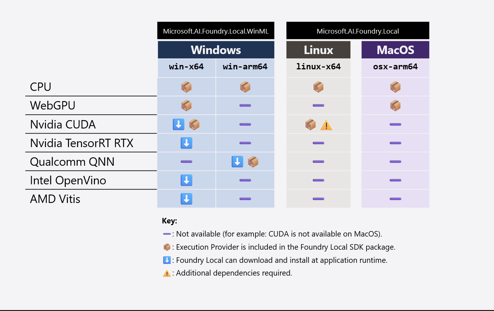

## C# SDK Reference

### Project setup guide

There are two NuGet packages for the Foundry Local SDK - a WinML and a cross-platform package - that have the same API surface but are optimized for different platforms:

- **Windows**: Uses the `Microsoft.AI.Foundry.Local.WinML` package that's specific to Windows applications, which uses the Windows Machine Learning (WinML) framework.
- **Cross-platform**: Uses the `Microsoft.AI.Foundry.Local` package that can be used for cross-platform applications (Windows, Linux, macOS).

Depending on your target platform, follow these instructions to create a new C# application and add the necessary dependencies:

[!INCLUDE [project-setup](./../csharp-project-setup.md)]

### Quickstart

Use this snippet to verify that the SDK can initialize and access the local model catalog.

```csharp
using Microsoft.AI.Foundry.Local;
using Microsoft.Extensions.Logging;
using System.Linq;

var config = new Configuration
{
  AppName = "app-name",
  LogLevel = Microsoft.AI.Foundry.Local.LogLevel.Information,
};

using var loggerFactory = LoggerFactory.Create(builder =>
{
  builder.SetMinimumLevel(Microsoft.Extensions.Logging.LogLevel.Information);
});
var logger = loggerFactory.CreateLogger<Program>();

await FoundryLocalManager.CreateAsync(config, logger);
var manager = FoundryLocalManager.Instance;

var catalog = await manager.GetCatalogAsync();
var models = await catalog.ListModelsAsync();

Console.WriteLine($"Models available: {models.Count()}");
```

This example prints the number of models available for your hardware.

References:

- [Integrate with inference SDKs](../../how-to/how-to-integrate-with-inference-sdks.md)

### Redesign

To improve your ability to ship applications using on-device AI, there are substantial changes to the architecture of the C# SDK in version `0.8.0` and later. In this section, we outline the key changes to help you migrate your applications to the latest version of the SDK.

> [!NOTE]
> In the SDK version `0.8.0` and later, there are breaking changes in the API from previous versions.

The following diagram shows how the previous architecture - for versions earlier than `0.8.0` - relied heavily on using a REST webserver to manage models and inference like chat completions:

:::image type="content" source="../../media/architecture/current-sdk-architecture.png" alt-text="Diagram of the previous architecture for Foundry Local." lightbox="../../media/architecture/current-sdk-architecture.png":::

The SDK would use a Remote Procedural Call (RPC) to find Foundry Local CLI executable on the machine, start the webserver, and then communicate with it over HTTP. This architecture had several limitations, including:

- Complexity in managing the webserver lifecycle.
- Challenging deployment: End users needed to have the Foundry Local CLI installed on their machines *and* your application.
- Version management of the CLI and SDK could lead to compatibility issues.

To address these issues, the redesigned architecture in version `0.8.0` and later uses a more streamlined approach. The new architecture is as follows:

:::image type="content" source="../../media/architecture/new-sdk-architecture.png" alt-text="Diagram of the new architecture for Foundry Local." lightbox="../../media/architecture/new-sdk-architecture.png":::

In this new architecture:

- Your application is **self-contained**. It doesn't require the Foundry Local CLI to be installed separately on the end user's machine making it easier for you to deploy applications.
- The REST **web server is *optional***. You can still use the web server if you want to integrate with other tools that communicate over HTTP. Read [Use chat completions via REST server with Foundry Local](../../how-to/how-to-integrate-with-inference-sdks.md) for details on how to use this feature.
- The SDK has **native support for chat completions and audio transcriptions**, allowing you to build conversational AI applications with fewer dependencies. Read [Use Foundry Local native chat completions API](../../how-to/how-to-use-native-chat-completions.md) for details on how to use this feature.
- On Windows devices, you can use a Windows ML build that handles **hardware acceleration** for models on the device by pulling in the right runtime and drivers.


#### API changes

Version `0.8.0` and later provides a more object-orientated and composable API. The main entry point continues to be the `FoundryLocalManager` class, but instead of being a flat set of methods that operate via static calls to a stateless HTTP API, the SDK now exposes methods on the `FoundryLocalManager` instance that maintain state about the service and models.

| Primitive | Versions < 0.8.0 | Versions >= 0.8.0 |
| --- | --- | --- |
| **Configuration** | N/A | `config = Configuration(...)` |
| **Get Manager** | `mgr = FoundryLocalManager();` | `await FoundryLocalManager.CreateAsync(config, logger);`<br>`var mgr = FoundryLocalManager.Instance;` |
| **Get Catalog** | N/A | `catalog = await mgr.GetCatalogAsync();` |
| **List Models** | `mgr.ListCatalogModelsAsync();` | `catalog.ListModelsAsync();` |
| **Get Model** | `mgr.GetModelInfoAsync("aliasOrModelId");` | `catalog.GetModelAsync(alias: "alias");` |
| **Get Variant** | N/A | `model.SelectedVariant;` |
| **Set Variant** | N/A | `model.SelectVariant();` |
| **Download a model** | `mgr.DownloadModelAsync("aliasOrModelId");` | `model.DownloadAsync()` |
| **Load a model** | `mgr.LoadModelAsync("aliasOrModelId");` | `model.LoadAsync()` |
| **Unload a model** | `mgr.UnloadModelAsync("aliasOrModelId");` | `model.UnloadAsync()` |
| **List loaded models** | `mgr.ListLoadedModelsAsync();` | `catalog.GetLoadedModelsAsync();` |
| **Get model path** | N/A | `model.GetPathAsync()` |
| **Start service** | `mgr.StartServiceAsync();` | `mgr.StartWebServerAsync();` |
| **Stop service** | `mgr.StopServiceAsync();` | `mgr.StopWebServerAsync();` |
| **Cache location** | `mgr.GetCacheLocationAsync();` | `config.ModelCacheDir` |
| **List cached models** | `mgr.ListCachedModelsAsync();` | `catalog.GetCachedModelsAsync();` |

The API allows Foundry Local to be more configurable over the web server, logging, cache location, and model variant selection. For example, the `Configuration` class allows you to set up the application name, logging level, web server URLs, and directories for application data, model cache, and logs:

```csharp
var config = new Configuration
{
    AppName = "app-name",
    LogLevel = Microsoft.AI.Foundry.Local.LogLevel.Information,
    Web = new Configuration.WebService
    {
        Urls = "http://127.0.0.1:55588"
    },
    AppDataDir = "./foundry_local_data",
    ModelCacheDir = "{AppDataDir}/model_cache",
    LogsDir = "{AppDataDir}/logs"
};
```

References:

- [Integrate with inference SDKs](../../how-to/how-to-integrate-with-inference-sdks.md)

In the previous version of the Foundry Local C# SDK, you couldn't configure these settings directly through the SDK, which limited your ability to customize the behavior of the service.

### Reduce application package size

The Foundry Local SDK pulls in `Microsoft.ML.OnnxRuntime.Foundry` NuGet package as a dependency. The `Microsoft.ML.OnnxRuntime.Foundry` package provides the *inference runtime bundle*, which is the set of libraries required to efficiently run inference on specific vendor hardware devices. The inference runtime bundle includes the following components:

- **ONNX Runtime library**: The core inference engine (`onnxruntime.dll`).
- **ONNX Runtime Execution Provider (EP) library**. A hardware-specific backend in ONNX Runtime that optimizes and executes parts of a machine learning model a hardware accelerator. For example:
    - CUDA EP: `onnxruntime_providers_cuda.dll`
    - QNN EP: `onnxruntime_providers_qnn.dll`
- **Independent Hardware Vendor (IHV) libraries**. For example:
    - WebGPU: DirectX dependencies (`dxcompiler.dll`, `dxil.dll`)
    - QNN: Qualcomm QNN dependencies (`QnnSystem.dll`, etc.)

The following table summarizes what EP and IHV libraries are bundled with your application and what WinML will download/install at runtime:



In all platforms and architectures, the CPU EP is required. The WebGPU EP and IHV libraries are small in size (for example, WebGPU only adds ~7MB to your application package) and are required in Windows and macOS. However, the CUDA and QNN EPs are large in size (for example, CUDA adds ~1GB to your application package) so we recommend excluding these EPs from your application package. WinML will download/install CUDA and QNN at runtime if the end user has compatible hardware.

> [!NOTE]
> We're working on removing the CUDA and QNN EPs from the `Microsoft.ML.OnnxRuntime.Foundry` package in future releases so that you don't need to include an `ExcludeExtraLibs.props` file to remove them from your application package.

To reduce the size of your application package, you can create an `ExcludeExtraLibs.props` file in your project directory with the following content, which excludes the CUDA and QNN EP and IHV libraries when you publish your application:

```xml
<Project>
  <!-- we want to ensure we're using the onnxruntime libraries from Foundry Local Core so 
  we delete the WindowsAppSdk versions once they're unzipped. -->
  <Target Name="ExcludeOnnxRuntimeLibs" AfterTargets="ExtractMicrosoftWindowsAppSDKMsixFiles">
    <Delete Files="$(MicrosoftWindowsAppSDKMsixContent)\onnxruntime.dll"/>
    <Delete Files="$(MicrosoftWindowsAppSDKMsixContent)\onnxruntime_providers_shared.dll"/>
    <Message Importance="Normal" Text="Deleted onnxruntime libraries from $(MicrosoftWindowsAppSDKMsixContent)." />
  </Target>

  <!-- Remove CUDA EP and IHV libraries on Windows x64 -->
  <Target Name="ExcludeCudaLibs" Condition="'$(RuntimeIdentifier)'=='win-x64'" AfterTargets="ResolvePackageAssets">
    <ItemGroup>
      <!-- match onnxruntime*cuda.* (we're matching %(Filename) which excludes the extension) -->
      <NativeCopyLocalItems Remove="@(NativeCopyLocalItems)"
                            Condition="$([System.Text.RegularExpressions.Regex]::IsMatch('%(Filename)', 
                                      '^onnxruntime.*cuda.*', RegexOptions.IgnoreCase))" />
    </ItemGroup>
    <Message Importance="Normal" Text="Excluded onnxruntime CUDA libraries from package." />
  </Target>

  <!-- Remove QNN EP and IHV libraries on Windows arm64 -->
  <Target Name="ExcludeQnnLibs" Condition="'$(RuntimeIdentifier)'=='win-arm64'" AfterTargets="ResolvePackageAssets">
    <ItemGroup>
      <NativeCopyLocalItems Remove="@(NativeCopyLocalItems)"
                            Condition="$([System.Text.RegularExpressions.Regex]::IsMatch('%(Filename)%(Extension)', 
                                      '^QNN.*\.dll', RegexOptions.IgnoreCase))" />
      <NativeCopyLocalItems Remove="@(NativeCopyLocalItems)"
                            Condition="$([System.Text.RegularExpressions.Regex]::IsMatch('%(Filename)', 
                                      '^libQNNhtp.*', RegexOptions.IgnoreCase))" />
      <NativeCopyLocalItems Remove="@(NativeCopyLocalItems)"
                            Condition="'%(FileName)%(Extension)' == 'onnxruntime_providers_qnn.dll'" />
    </ItemGroup>
    <Message Importance="Normal" Text="Excluded onnxruntime QNN libraries from package." />
  </Target>

  <!-- need to manually copy on linux-x64 due to the nuget packages not having the correct props file setup -->
  <ItemGroup Condition="'$(RuntimeIdentifier)' == 'linux-x64'">
    <!-- 'Update' as the Core package will add these dependencies, but we want to be explicit about the version -->
    <PackageReference Update="Microsoft.ML.OnnxRuntime.Gpu" />
    <PackageReference Update="Microsoft.ML.OnnxRuntimeGenAI.Cuda" />
    <OrtNativeLibs Include="$(NuGetPackageRoot)microsoft.ml.onnxruntime.gpu.linux/$(OnnxRuntimeVersion)/runtimes/$(RuntimeIdentifier)/native/*" />
    <OrtGenAINativeLibs Include="$(NuGetPackageRoot)microsoft.ml.onnxruntimegenai.cuda/$(OnnxRuntimeGenAIVersion)/runtimes/$(RuntimeIdentifier)/native/*" />
  </ItemGroup>

  <Target Name="CopyOrtNativeLibs" AfterTargets="Build" Condition=" '$(RuntimeIdentifier)' == 'linux-x64'">
    <Copy SourceFiles="@(OrtNativeLibs)" DestinationFolder="$(OutputPath)"></Copy>
    <Copy SourceFiles="@(OrtGenAINativeLibs)" DestinationFolder="$(OutputPath)"></Copy>
  </Target>
</Project>
```

In your project file (`.csproj`), add the following line to import the `ExcludeExtraLibs.props` file:

```xml
<!-- other project file content -->
  
<Import Project="ExcludeExtraLibs.props" />
```


#### Windows: CUDA dependencies

The CUDA EP is pulled into your Linux application via `Microsoft.ML.OnnxRuntime.Foundry`, but we don't include the IHV libraries. If you want to allow your end users with CUDA-enabled devices to benefit from higher performance, you need *add* the following CUDA IHV libraries to your application:

- CUBLAS v12.8.4 ([download from NVIDIA Developer](https://developer.download.nvidia.com/compute/cuda/redist/libcublas/windows-x86_64/libcublas-windows-x86_64-12.8.4.1-archive.zip))
    - cublas64_12.dll
    - cublasLt64_12.dll
- CUDA RT v12.8.90 ([download from NVIDIA Developer](https://developer.download.nvidia.com/compute/cuda/redist/cuda_cudart/windows-x86_64/cuda_cudart-windows-x86_64-12.8.90-archive.zip))
    - cudart64_12.dll
- CUDNN v9.8.0 ([download from NVIDIA Developer](https://developer.download.nvidia.com/compute/cudnn/redist/cudnn/windows-x86_64/cudnn-windows-x86_64-9.8.0.87_cuda12-archive.zip))
    - cudnn_graph64_9.dll
    - cudnn_ops64_9.dll
    - cudnn64_9.dll
- CUDA FFT v11.3.3.83 ([download from NVIDIA Developer](https://developer.download.nvidia.com/compute/cuda/redist/libcufft/windows-x86_64/libcufft-windows-x86_64-11.3.3.83-archive.zip))
    - cufft64_11.dll

> [!WARNING]
> Adding the CUDA EP and IHV libraries to your application increase the size of your application package by 1GB.

### Samples

- For sample applications that demonstrate how to use the Foundry Local C# SDK, see the [Foundry Local C# SDK Samples GitHub repository](https://aka.ms/foundrylocalSDK).

### API reference

- For more details on the Foundry Local C# SDK read [Foundry Local C# SDK API Reference](https://aka.ms/fl-csharp-api-ref).