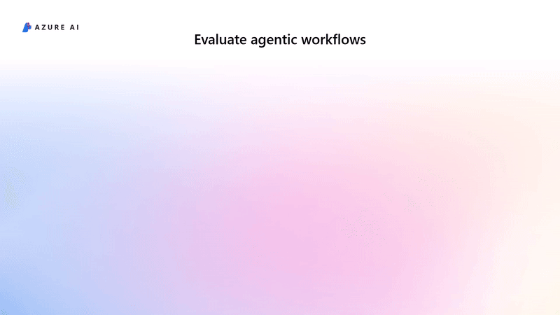

# Evaluate your AI agents locally with the Azure AI Evaluation SDK

[!INCLUDE [feature-preview](../../includes/feature-preview.md)]


AI Agents are powerful productivity assistants to create workflows for business needs. However, they come with additional challenges for observability due to their complex interaction patterns. To build production-ready agentic applications and enable observability and transparency, developers need tools to assess not just the final output from an agent’s workflows, but the quality and efficiency of the workflows themselves. For example, consider a typical agentic workflow: 




Triggered by a user query about “weather tomorrow”, the agentic workflow may include multiple steps, such as reasoning through user intents, tool calling, and utilizing retrieval-augmented generation to produce a final response. In this process, assessing the quality and safety of each step — along with the final output of an agentic workflow — is crucial.

In this article, you learn how to run built-in evaluators locally on simple agent data as well as agent messages with built-in evaluators to thoroughly assess the performance of your AI agents. 

## Getting started

First install the evaluators package from Azure AI evaluation SDK:

```python
pip install azure-ai-evaluation

```


### Evaluators with agent message support

Our built-in evaluators can accept simple data types such as strings in `query`, `response`, `ground_truth` as with the [single-turn data input requirements](./evaluate-sdk.md#data-requirements-for-built-in-evaluators). However, to extract simple data from agent messages can be a formidable challenge, due to its complex interaction patterns. For example, as mentioned, a single user query can trigger a long list of agent messages, typically with tool calls invoked. 

Therefore, we have specifically enabled agent message suport for these built-in evaluators:

| Evaluator       | `query`      | `response`      | `tool_calls`       | `tool_definitions`  | 
|----------------|---------------|---------------|---------------|---------------|-----------|
| `IntentResolutionEvaluator`   | Required: Union[String, list[Message]] | Required: Union[String, list[Message]]  | N/A | Optional: list[dict]  |
| `ToolCallAccuracyEvaluator`   | Required: Union[String, list[Message]] | Optional: Union[String, list[Message]]| Optional: Union[dict, list[ToolCall]] | Required: list[ToolDefinition]  |
| `TaskAdherenceEvaluator`         | Required: Union[String, list[Message]] | Required: Union[String, list[Message]]  | N/A | Optional: list[dict]  |

- `Messages`: `dict` of openai-style messages describing agent interactions with a user
- `ToolCall`: `dict` specifying tool calls invoked during agent interactions with a user
- `ToolDefinition`: `dict` describing the tools available to an agent 

For `ToolCallAccuracyEvaluator`, either `response` or  `tool_calls` must be provided. See examples below to showcase the two data formats: simple agent data, and agent messages. 
  


#### Simple agent data

In simple agent data format, `query` and `response` are simple python strings. For example:  

```python
import os
from azure.ai.evaluation import AzureOpenAIModelConfiguration
from azure.identity import DefaultAzureCredential
from azure.ai.evaluation import IntentResolutionEvaluator


model_config = AzureOpenAIModelConfiguration(
    azure_endpoint=os.environ["AZURE_OPENAI_ENDPOINT"],
    api_key=os.environ["AZURE_OPENAI_API_KEY"],
    api_version=os.environ["AZURE_OPENAI_API_VERSION"],
    azure_deployment=os.environ["MODEL_DEPLOYMENT_NAME"],
)

intent_resolution_evaluator = IntentResolutionEvaluator(model_config)

# Evaluating query and response as strings
# A successful example. Intent is identified and understood and the response correctly resolves user intent
result = intent_resolution_evaluator(
    query="What are the opening hours of the Eiffel Tower?",
    response="Opening hours of the Eiffel Tower are 9:00 AM to 11:00 PM.",
)
print(result)
```

Tool calls are typically made within the agent response messages, you can also extract them in this format: 

```python
query = "How is the weather in Seattle ?"
tool_calls = [{
                    "type": "tool_call",
                    "tool_call_id": "call_CUdbkBfvVBla2YP3p24uhElJ",
                    "name": "fetch_weather",
                    "arguments": {
                        "location": "Seattle"
                    }
            },
            {
                    "type": "tool_call",
                    "tool_call_id": "call_CUdbkBfvVBla2YP3p24uhElJ",
                    "name": "fetch_weather",
                    "arguments": {
                        "location": "London"
                    }
            }]

tool_definition = {
                    "name": "fetch_weather",
                    "description": "Fetches the weather information for the specified location.",
                    "parameters": {
                        "type": "object",
                        "properties": {
                            "location": {
                                "type": "string",
                                "description": "The location to fetch weather for."
                            }
                        }
                    }
                }
response = tool_call_accuracy(query=query, tool_calls=tool_calls, tool_definitions=tool_definition)
print(response)
```

#### Agent messages

In agent message format, `query` and `response` are list of openai-style messages. Specifically, `query` requires the system message (of the agent) on top of the list:   
```python
# user asked a question
query = [
    {
        "role": "system",
        "content": "You are a friendly and helpful customer service agent."
    },
    {
        "createdAt": "2025-03-14T06:14:20Z",
        "role": "user",
        "content": [
            {
                "type": "text",
                "text": "Hi, I need help with the last 2 orders on my account #888. Could you please update me on their status?"
            }
        ]
    }
]
# the agent emits multiple messages to fulfill the request
response = [
    {
        "createdAt": "2025-03-14T06:14:30Z",
        "run_id": "0",
        "role": "assistant",
        "content": [
            {
                "type": "text",
                "text": "Hello! Let me quickly look up your account details."
            }
        ]
    },
    {
        "createdAt": "2025-03-14T06:14:35Z",
        "run_id": "0",
        "role": "assistant",
        "content": [
            {
                "type": "tool_call",
                "tool_call_id": "tool_call_20250310_001",
                "name": "get_orders",
                "arguments": {
                    "account_number": "888"
                }
            }
        ]
    },
    ...
    # here is the agent's final response 
    {
        "createdAt": "2025-03-14T06:15:05Z",
        "run_id": "0",
        "role": "assistant",
        "content": [
            {
                "type": "text",
                "text": "The order with ID 123 has been shipped and is expected to be delivered on March 15, 2025. However, the order with ID 124 is delayed and should now arrive by March 20, 2025. Is there anything else I can help you with?"
            }
        ]
    }
]

# An example of tool definitions available to the agent 
tool_definitions = [
    {
        "name": "get_orders",
        "description": "Get the list of orders for a given account number.",
        "parameters": {
            "type": "object",
            "properties": {
                "account_number": {
                    "type": "string",
                    "description": "The account number to get the orders for."
                }
            }
        }
    },
    ...
]

result = intent_resolution_evaluator(
    query=query,
    response=response,
    # optionally provide the tool definitions
    tool_definitions=tool_definitions 
)
print(result)


```


#### Converter support


If you use [Azure AI Agent Service](https://learn.microsoft.com/azure/ai-services/agents/overview), you can seamlessly evaluate your agents via our converter support for Azure AI agent threads and runs. To create an Azure AI agent and some data, you need:

```bash
pip install azure-ai-projects azure-identity
```

#### Create agent threads and runs
```python
import os, json
import pandas as pd
from azure.ai.projects import AIProjectClient
from azure.identity import DefaultAzureCredential
from azure.ai.projects.models import FunctionTool, ToolSet

from dotenv import load_dotenv


load_dotenv()

# Define some custom python function
def fetch_weather(location: str) -> str:
    """
    Fetches the weather information for the specified location.

    :param location (str): The location to fetch weather for.
    :return: Weather information as a JSON string.
    :rtype: str
    """
    # In a real-world scenario, you'd integrate with a weather API.
    # Here, we'll mock the response.
    mock_weather_data = {"Seattle": "Sunny, 25°C", "London": "Cloudy, 18°C", "Tokyo": "Rainy, 22°C"}
    weather = mock_weather_data.get(location, "Weather data not available for this location.")
    weather_json = json.dumps({"weather": weather})
    return weather_json


user_functions: Set[Callable[..., Any]] = {
    fetch_weather,
}

# Adding Tools to be used by Agent 
functions = FunctionTool(user_functions)

toolset = ToolSet()
toolset.add(functions)


# Create the agent
AGENT_NAME = "Seattle Tourist Assistant"

project_client = AIProjectClient.from_connection_string(
    credential=DefaultAzureCredential(),
    conn_str=os.environ["PROJECT_CONNECTION_STRING"],
)

agent = project_client.agents.create_agent(
    model=os.environ["MODEL_DEPLOYMENT_NAME"],
    name=AGENT_NAME,
    instructions="You are a helpful assistant",
    toolset=toolset,
)
print(f"Created agent, ID: {agent.id}")

thread = project_client.agents.create_thread()
print(f"Created thread, ID: {thread.id}")

# Create message to thread
MESSAGE = "Can you fetch me the weather in Seattle?"

message = project_client.agents.create_message(
    thread_id=thread.id,
    role="user",
    content=MESSAGE,
)
print(f"Created message, ID: {message.id}")

run = project_client.agents.create_and_process_run(thread_id=thread.id, agent_id=agent.id)

print(f"Run finished with status: {run.status}")

if run.status == "failed":
    print(f"Run failed: {run.last_error}")

print(f"Run ID: {run.id}")

# display messages
for message in project_client.agents.list_messages(thread.id, order="asc").data:
    print(f"Role: {message.role}")
    print(f"Content: {message.content[0].text.value}")
    print("-" * 40)
```

##### Convert agent runs (single-run)

Now you use our converter to transform the agent thread or run data, into required evaluation data that the evaluators can understand. 
```python
import json
from azure.ai.evaluation import AIAgentConverter

# Initialize the converter for Azure AI agents
converter = AIAgentConverter(project_client)

# Sepcify the thread and run id
thread_id = thread.id
run_id = run.id

converted_data = converter.convert(thread_id, run_id)
print(json.dumps(converted_data, indent=4))
```

##### Convert agent threads (multi-run) 
```python
import json
from azure.ai.evaluation import AIAgentConverter

# Initialize the converter
converter = AIAgentConverter(project_client)

# specify a file path to save agent output (which is evaluation input data)
filename = os.path.join(os.getcwd(), "evaluation_input_data.jsonl")

evaluation_data = converter.prepare_evaluation_data(thread_ids=thread_id, filename=filename) 

print(f"Evaluation data saved to {filename}")
```

#### Batch evaluation on agent thread data

Select the evaluators to assess the agent quality (for example, intent resolution, tool call accuracy, and task adherence), and submit a batch 
```python
from azure.ai.evaluation import IntentResolutionEvaluator, TaskAdherenceEvaluator, ToolCallAccuracyEvaluator
from azure.ai.projects.models import ConnectionType
import os


project_client = AIProjectClient.from_connection_string(
    credential=DefaultAzureCredential(),
    conn_str=os.environ["PROJECT_CONNECTION_STRING"],
)
model_config = project_client.connections.get_default(
                                            connection_type=ConnectionType.AZURE_OPEN_AI,
                                            include_credentials=True) \
                                         .to_evaluator_model_config(
                                            deployment_name=os.environ["MODEL_DEPLOYMENT_NAME"],
                                            api_version=os.environ["MODEL_DEPLOYMENT_API_VERSION"],
                                            include_credentials=True
                                          )


intent_resolution = IntentResolutionEvaluator(model_config=model_config)
task_adherence = TaskAdherenceEvaluator(model_config=model_config)
tool_call_accuracy = ToolCallAccuracyEvaluator(model_config=model_config)

# batch run API
from azure.ai.evaluation import evaluate

response = evaluate(
    data=file_path,
    evaluation_name="agent demo - batch run",
    evaluators={
        "intent_resolution": intent_resolution,
        "task_adherence": task_adherence,
        "tool_call_accuracy": tool_call_accuracy,
    },
    # optionally, log your results to your Azure AI Foundry project for rich visualization 
    azure_ai_project={
        "subscription_id": os.environ["AZURE_SUBSCRIPTION_ID"],
        "project_name": os.environ["PROJECT_NAME"],
        "resource_group_name": os.environ["RESOURCE_GROUP_NAME"],
    }
)
# look at the average scores 
print(response["metrics"])

print(f'AI Foundary URL: {response.get("studio_url")}')
```


### Samples
Now, you are ready to try a sample for each of these evaluators:
- [Intent resolution](https://aka.ms/intentresolution-sample)
- [Task adherence](https://aka.ms/taskadherence-sample)
- [Tool call accuracy](https://aka.ms/toolcallaccuracy-sample)
- [End-to-end Azure AI agent evaluation](https://aka.ms/e2e-agent-eval-sample)


## Related content

- [Azure AI Evaluation Python SDK client reference documentation](https://aka.ms/azureaieval-python-ref)
- [Azure AI Evaluation SDK client Troubleshooting guide](https://aka.ms/azureaieval-tsg)
- [Learn more about the evaluation metrics](../../concepts/evaluation-metrics-built-in.md)
- [Evaluate your Generative AI applications remotely on the cloud](./cloud-evaluation.md)
- [Learn more about simulating test datasets for evaluation](./simulator-interaction-data.md)
- [View your evaluation results in Azure AI project](../../how-to/evaluate-results.md)
- [Get started building a chat app using the Azure AI Foundry SDK](../../quickstarts/get-started-code.md)
- [Get started with evaluation samples](https://aka.ms/aistudio/eval-samples)
