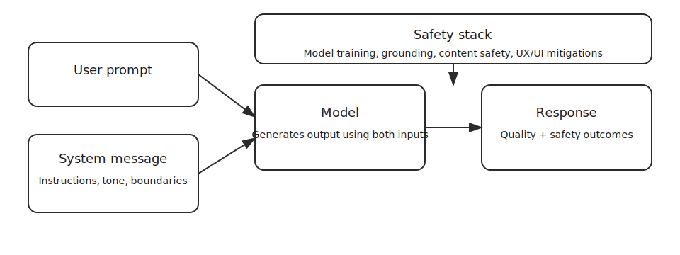

# System message design

System messages help you steer an Azure OpenAI chat model toward the behavior, tone, and output format you want. This article explains what system messages are, how they affect responses, and how to design them for consistency and safety.

## What this article covers

This article focuses on the **system message** (sometimes called a *system prompt* or *metaprompt*) for chat-based experiences.

If you want broader prompt guidance (few-shot examples, ordering, and token efficiency), see [Prompt engineering techniques](prompt-engineering.md).

## Prerequisites

To use system messages, you need access to an Azure OpenAI resource with a chat completion model deployment. For setup instructions, see [Create and deploy an Azure OpenAI resource](../how-to/create-resource.md).

## What is a system message?

A system message is a set of instructions and context you provide to the model to guide its responses. You typically use it to:

- Define the assistant’s role and boundaries.
- Set tone and communication style.
- Specify output formats (for example, JSON).
- Add safety and quality constraints for your scenario.

A system message can be one short sentence:

```
You are a helpful AI assistant.
```

Or it can be multiple lines with structured rules and formatting requirements.

> [!IMPORTANT]
> A system message influences the model, but it doesn’t guarantee compliance. You still need to test and iterate, and you should layer system messages with other mitigations (for example, filtering and evaluation).

## How system messages work

In chat-based APIs, you send a set of messages that include roles such as **system**, **user**, and **assistant**. The system message typically appears first and acts as the highest-level set of instructions for the conversation.



System messages are most effective when you:

- Keep instructions unambiguous.
- Avoid conflicting rules.
- Make the “fallback behavior” explicit (what the assistant does when it lacks information or the request is out of scope).

## Key concepts

### Role and scope

Define what the assistant is (role) and what it is and isn’t allowed to do (scope). Scope statements are especially important for domain-specific assistants.

### Output contract

If your app needs structured output, specify an output contract (for example, JSON with fixed keys). Keep the contract small and stable.

### Safety constraints

Add constraints that reduce risky behavior for your scenario, such as refusing disallowed requests or avoiding disclosure of sensitive information.

If you want guidance and templates designed for safety, see [Safety system messages](system-message.md) and [Safety system message templates](safety-system-message-templates.md).

## System message examples

The following example shows a system message and the resulting model response.

| System message | User | Assistant |
|---|---|---|
| You're an AI assistant that helps people find information and responds in rhyme. If the user asks you a question you don't know the answer to, say so. | What can you tell about me, John Doe? | Dear John, I'm sorry to say,<br>But I don't have info on you today.<br>I'm just an AI with knowledge in my brain,<br>But without your input, I can't explain.<br>So tell me more about what you seek,<br>And I'll do my best to give you an answer unique. |

Here are a few more examples you can adapt.

### Example: technical support assistant with a fallback

```
You are a technical support assistant for an internal product.
If you don't have enough information to answer, ask a clarifying question.
If you still can't answer, say you don't know.
```

### Example: structured entity extraction

```
You extract entities from user text.
Return only JSON, using this schema:
{
   "name": "",
   "company": "",
   "phone_number": ""
}
```

## Design checklist

Use this checklist to design a system message that’s easier to maintain and evaluate.

### 1. Start with the assistant’s job

State the role and the expected outcome for a typical request.

### 2. Define boundaries

List the topics, actions, and content types the assistant must avoid for your scenario.

### 3. Specify the output format

If you need a specific format, specify it plainly and keep it consistent.

### 4. Add a “when unsure” policy

Tell the model what to do when:

- The user’s request is ambiguous.
- The request is out of scope.
- The model lacks information.

### 5. Test, measure, and iterate

System messages can overfit to specific examples or fail in edge cases. Test with realistic and adversarial prompts, and iterate based on results.

If you’re tuning prompts as part of an evaluation workflow, you can also use the broader guidance in [Prompt engineering techniques](prompt-engineering.md).

## Common pitfalls

- **Conflicting instructions**: for example, “be brief” and “be comprehensive” without prioritization.
- **Overly long system messages**: longer messages can consume context window and reduce room for user content.
- **Hidden requirements**: if the output format matters, state it explicitly.

## Limitations

- System messages don’t guarantee the model follows every rule.
- Responses can vary across models and versions.
- Behavior can change when user content conflicts with system instructions, especially in long conversations.

## Next steps

- Read [Prompt engineering techniques](prompt-engineering.md) for broader prompt patterns.
- Use [Safety system messages](system-message.md) if you need safety-focused frameworks.
- Start from [Safety system message templates](safety-system-message-templates.md) when you want a ready-made baseline.


