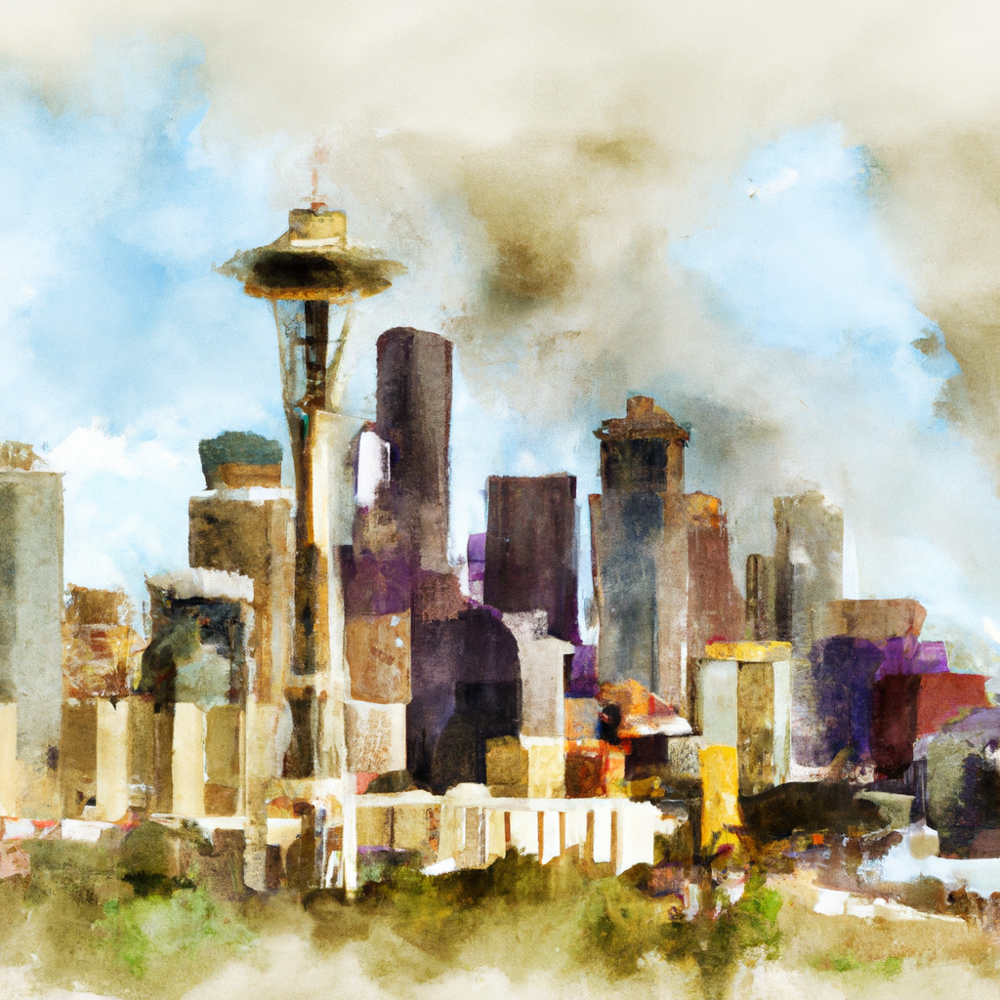
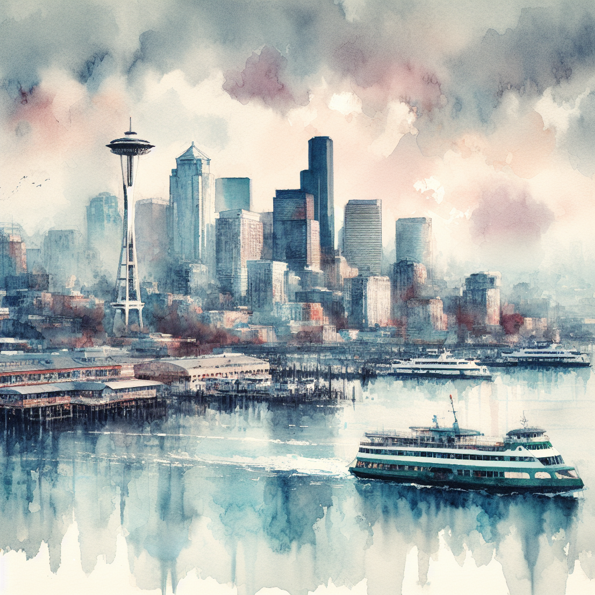

# Prompt transformation

[!INCLUDE [version-banner](../../includes/version-banner.md)]


## Scope

Prompt transformation (also called *prompt revision*) applies to Azure OpenAI image generation requests that support the `revised_prompt` field, including DALL-E 3 deployments. If your deployment doesn't return `revised_prompt`, prompt transformation isn't available for that model.

> [!NOTE]
> In API responses, this feature appears as the `revised_prompt` field. This article uses "prompt transformation" and "prompt revision" to refer to the same behavior.

## Overview

Prompt transformation is a process included in the DALL-E 3 models that applies a safety and quality system message to your original prompt. It uses a large language model (LLM) to add a message before sending your prompt to the image generation model. This system message enriches your original prompt with the goal of generating more diverse and higher-quality images while maintaining intent.

The processing flow works as follows:

1. Your input prompt is revised to improve quality and add safety guidance.
1. Azure OpenAI content filtering evaluates the prompt and, when applicable, the generated output.
1. If filtering blocks the request, the service returns a response indicating the filtered category and severity.

For more information about content filtering, see [Content filtering](./content-filter.md).

> [!TIP]
> Learn more about image generation prompting in OpenAI's [Image generation documentation](https://platform.openai.com/docs/guides/image-generation?image-generation-model=gpt-image-1).

## Prompt transformation example

The following table shows an example prompt and the difference in generated images with and without prompt transformation.

> [!NOTE]
> The images shown are illustrative. Because image generation and prompt revision are non-deterministic, your outputs might differ.

| **Example text prompt** | **Example generated image without prompt transformation** | **Example generated image with prompt transformation** |
|---|---|---|
|"Watercolor painting of the Seattle skyline" |  |  |


## Why is prompt transformation needed?

Prompt transformation is essential for responsible and high-quality generations. Not only does prompt transformation improve the safety of your generated image, but it also enriches your prompt in a more descriptive manner, leading to higher quality and descriptive imagery.

Default prompt transformation includes safety-oriented guidance intended to reduce requests for disallowed content, such as copyrighted or trademarked characters, public figures, and content in categories such as sexual, hate and unfairness, violence, and self-harm. For enforcement behavior details, see [Content filtering](./content-filter.md).

## Use prompt transformation

Prompt transformation is applied by default to all Azure OpenAI DALL-E 3 requests. No extra setup is required to benefit from prompt transformation enhancements.

> [!IMPORTANT]
> Prompt transformation can't be disabled or customized for DALL-E 3 deployments in Azure OpenAI. The revised prompt is always generated automatically.

Like image generation, prompt transformation is non-deterministic due to the nature of large language models. A single original prompt might lead to many image variants.

## Availability

- Prompt transformation applies to Azure OpenAI DALL-E 3 image generation requests.
- Availability can vary by region and by model deployment. For region availability, see [Azure OpenAI models](/azure/ai-services/openai/concepts/models).
- The transformed prompt is returned via the API regardless of whether you use the Foundry portal or call the REST API or SDK directly.

## View prompt transformations

Your revised or transformed prompt is visible in the API response object as shown here, in the `revised_prompt` field. 

```json
Input Content:
{
    "prompt": "Watercolor painting of the Seattle skyline",
    "n": 1,
    "size": "1024x1024"
}
 
Output Content:
{
  "created": 1720557218,
  "data": [
    {
      "content_filter_results": {
        ...
      },
      "prompt_filter_results": {
        ...
      },
      "revised_prompt": "A soft and vivid watercolor painting capturing the scenic beauty of the Seattle skyline. The painting illustrates a setting sun casting warm hues over the sprawling cityscape, with the Space Needle prominently standing tall against the sky. Imagine the scattered high-rise buildings, a soothing blend of the lush green of the parks with the winding blue water of the Puget Sound, and the snow-covered peak of Mount Rainier in the distance. A play of light and shadow adds depth and dynamism to this multihued urban panorama."
    }
}
```

## Next step

> [!div class="nextstepaction"]
> [Image generation quickstart](../dall-e-quickstart.md)
