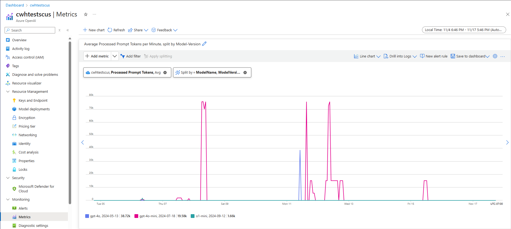

# Performance and latency

This article provides you with background around how latency and throughput works with Azure OpenAI and how to optimize your environment to improve performance.

## Understanding throughput vs latency
There are two key concepts to think about when sizing an application: (1) System level throughput measured in tokens per minute (TPM) and (2) Per-call response times (also known as latency). 

### System level throughput
This looks at the overall capacity of your deployment – how many requests per minute and total tokens that can be processed.

For a standard deployment, the quota assigned to your deployment partially determines the amount of throughput you can achieve. However, quota only determines the admission logic for calls to the deployment and isn't directly enforcing throughput. Due to per-call latency variations, you might not be able to achieve throughput as high as your quota. 

In a provisioned deployment, a set amount of model processing capacity is allocated to your endpoint. The amount of throughput that you can achieve on the endpoint is a factor of the workload shape including input token amount, output amount, call rate and cache match rate. The number of concurrent calls and total tokens processed can vary based on these values. 

For all deployment types, understanding system level throughput is a key component of optimizing performance. It is important to consider system level throughput for a given model, version, and workload combination as the throughput will vary across these factors. 

#### Estimating system level throughput 

##### Estimating TPM with Azure Monitor metrics

One approach to estimating system level throughput for a given workload is using historical token usage data. For Azure OpenAI workloads, all historical usage data can be accessed and visualized with the native monitoring capabilities offered within Azure OpenAI. Two metrics are needed to estimate system level throughput for Azure OpenAI workloads: (1) **Processed Prompt Tokens** and (2) **Generated Completion Tokens**. 

When combined, the **Processed Prompt Tokens** (input TPM) and **Generated Completion Tokens** (output TPM) metrics provide an estimated view of system level throughput based on actual workload traffic. This approach does not account for benefits from prompt caching, so it will be a conservative system throughput estimate. These metrics can be analyzed using minimum, average, and maximum aggregation over 1-minute windows across a multi-week time horizon. It is recommended to analyze this data over a multi-week time horizon to ensure there are enough data points to assess. The following screenshot shows an example of the **Processed Prompt Tokens** metric visualized in Azure Monitor, which is available directly through the Azure portal. 



##### Estimating TPM from request data

A second approach to estimated system level throughput involves collecting token usage information from API request data. This method provides a more granular approach to understanding workload shape per request. Combining per request token usage information with request volume, measured in requests per minute (RPM), provides an estimate for system level throughput. It is important to note that any assumptions made for consistency of token usage information across requests and request volume will impact the system throughput estimate. The token usage output data can be found in the API response details for a given Azure OpenAI in Microsoft Foundry Models chat completions request.

```json
{
  "body": {
    "id": "chatcmpl-7R1nGnsXO8n4oi9UPz2f3UHdgAYMn",
    "created": 1686676106,
    "choices": [...],
    "usage": {
      "completion_tokens": 557,
      "prompt_tokens": 33,
      "total_tokens": 590
    }
  }
}
```
Assuming all requests for a given workload are uniform, the prompt tokens and completion tokens from the API response data can each be multiplied by the estimated RPM to identify the input and output TPM for the given workload. 

##### How to use system level throughput estimates


Once system level throughput has been estimated for a given workload, these estimates can be used to size Standard and Provisioned deployments. For Standard deployments, the input and output TPM values can be combined to estimate the total TPM to be assigned to a given deployment. For Provisioned deployments, the request token usage data or input and output TPM values can be used to estimate the number of PTUs required to support a given workload with the deployment capacity calculator experience. 

Here are a few examples for the GPT-4o mini model:

| Prompt  Size (tokens) |Generation size (tokens) |Requests per minute |Input TPM|Output TPM|Total TPM|PTUs required |
|--|--|--| -------- | -------- | -------- |--|
|800	 |150 |30 |24,000|4,500|28,500|15|
|5,000 |50 |1,000|5,000,000|50,000|5,050,000|140|
|1,000 |300 | 500 |500,000|150,000|650,000|30|

The number of PTUs scales roughly linearly with call rate when the workload distribution remains constant.

### Latency: The per-call response times 

The high level definition of latency in this context is the amount of time it takes to get a response back from the model. For completion and chat completion requests, latency is largely dependent on model type, the number of tokens in the prompt and the number of tokens generated. In general, each prompt token adds little time compared to each incremental token generated.

Estimating your expected per-call latency can be challenging with these models. Latency of a completion request can vary based on four primary factors: (1) the model, (2) the number of tokens in the prompt, (3) the number of tokens generated, and (4) the overall load on the deployment & system. One and three are often the main contributors to the total time. The next section goes into more details on the anatomy of a large language model inference call.

## Improve performance
There are several factors that you can control to improve per-call latency of your application.

### Model selection

Latency varies based on what model you're using. For an identical request, expect that different models have different latencies for the chat completions call. If your use case requires the lowest latency models with the fastest response times, we recommend the latest [GPT-4o mini model](../../foundry-models/concepts/models-sold-directly-by-azure.md).

### Generation size and Max tokens

When you send a completion request to the Azure OpenAI endpoint, your input text is converted to tokens that are then sent to your deployed model. The model receives the input tokens and then begins generating a response. It's an iterative sequential process, one token at a time. Another way to think of it is like a for loop with `n tokens = n iterations`. For most models, generating the response is the slowest step in the process.  

At the time of the request, the requested generation size (`max_tokens` parameter) is used as an initial estimate of the generation size. The compute-time for generating the full size is reserved by the model as the request is processed. Once the generation is completed, the remaining quota is released. Ways to reduce the number of tokens:
- Set the `max_tokens` parameter on each call as small as possible.
- Include stop sequences to prevent generating extra content.
- Generate fewer responses: The best_of & n parameters can greatly increase latency because they generate multiple outputs. For the fastest response, either don't specify these values or set them to 1.

In summary, reducing the number of tokens generated per request reduces the latency of each request.

> [!NOTE]
> `max_tokens` only changes the length of a response and in some cases might truncate it. The parameter doesn't change the quality of the response.

### Streaming
Setting `stream: true` in a request makes the service return tokens as soon as they're available, instead of waiting for the full sequence of tokens to be generated. It doesn't change the time to get all the tokens, but it reduces the time for first response. This approach provides a better user experience since end-users can read the response as it is generated. 

Streaming is also valuable with large calls that take a long time to process. Many clients and intermediary layers have timeouts on individual calls. Long generation calls might be canceled due to client-side time outs. By streaming the data back, you can ensure incremental data is received.


**Examples of when to use streaming**:

Chat bots and conversational interfaces.

Streaming impacts perceived latency. With streaming enabled you receive tokens back in chunks as soon as they're available. For end-users, this approach often feels like the model is responding faster even though the overall time to complete the request remains the same.

**Examples of when streaming is less important**:

Sentiment analysis, language translation, content generation.

There are many use cases where you're performing some bulk task where you only care about the finished result, not the real-time response. If streaming is disabled, you won't receive any tokens until the model has finished the entire response.

### Content filtering

Azure OpenAI includes a [content filtering system](content-filters.md) that works alongside the core models. This system works by running both the prompt and completion through an ensemble of classification models aimed at detecting and preventing the output of harmful content.

The content filtering system detects and takes action on specific categories of potentially harmful content in both input prompts and output completions.

The addition of content filtering comes with an increase in safety, but also latency. There are many applications where this tradeoff in performance is necessary, however there are certain lower risk use cases where disabling the content filters to improve performance might be worth exploring.

Learn more about requesting modifications to the default, [content filtering policies](content-filters.md).


### Separation of workloads
Mixing different workloads on the same endpoint can negatively affect latency. This is because (1) they're batched together during inference and short calls can be waiting for longer completions and (2) mixing the calls can reduce your cache hit rate as they're both competing for the same space. When possible, it's recommended to have separate deployments for each workload.

### Prompt Size
While prompt size has smaller influence on latency than the generation size it affects the overall time, especially when the size grows large. 

### Batching
If you're sending multiple requests to the same endpoint, you can batch the requests into a single call. This reduces the number of requests you need to make and depending on the scenario it might improve overall response time. We recommend testing this method to see if it helps. 

## How to measure your throughput
We recommend measuring your overall throughput on a deployment with two measures:
-	Calls per minute: The number of API inference calls you're making per minute. This can be measured in Azure-monitor using the Azure OpenAI Requests metric and splitting by the ModelDeploymentName
-	Total Tokens per minute: The total number of tokens being processed per minute by your deployment. This includes prompt & generated tokens. This is often further split into measuring both for a deeper understanding of deployment performance. This can be measured in Azure-Monitor using the Processed Inference tokens metric. 

You can learn more about [Monitoring Azure OpenAI](monitor-openai.md).

## How to measure per-call latency
The time it takes for each call depends on how long it takes to read the model, generate the output, and apply content filters. The way you measure the time will vary if you're using streaming or not. We suggest a different set of measures for each case. 

You can learn more about [Monitoring Azure OpenAI](monitor-openai.md).

### Non-Streaming:
-	 End-to-end Request Time: The total time taken to generate the entire response for non-streaming requests, as measured by the API gateway. This number increases as prompt and generation size increases.

### Streaming:
-	Time to Response: Recommended latency (responsiveness) measure for streaming requests. Applies to PTU and PTU-managed deployments. Calculated as time taken for the first response to appear after a user sends a prompt, as measured by the API gateway. This number increases as the prompt size increases and/or 	 hit size reduces.
-	Average Token Generation Rate
Time from the first token to the last token, divided by the number of generated tokens, as measured by the API gateway. This measures the speed of response generation and increases as the system load increases. Recommended latency measure for streaming requests.


## Summary

* **Model latency**: If model latency is important to you, we recommend trying out the [GPT-4o mini model](../../foundry-models/concepts/models-sold-directly-by-azure.md).

* **Lower max tokens**: OpenAI has found that even in cases where the total number of tokens generated is similar the request with the higher value set for the max token parameter will have more latency.

* **Lower total tokens generated**: The fewer tokens generated the faster the overall response will be. Remember this is like having a for loop with `n tokens = n iterations`. Lower the number of tokens generated and overall response time will improve accordingly.

* **Streaming**: Enabling streaming can be useful in managing user expectations in certain situations by allowing the user to see the model response as it is being generated rather than having to wait until the last token is ready.

* **Content Filtering** improves safety, but it also impacts latency. Evaluate if any of your workloads would benefit from [modified content filtering policies](content-filters.md).
