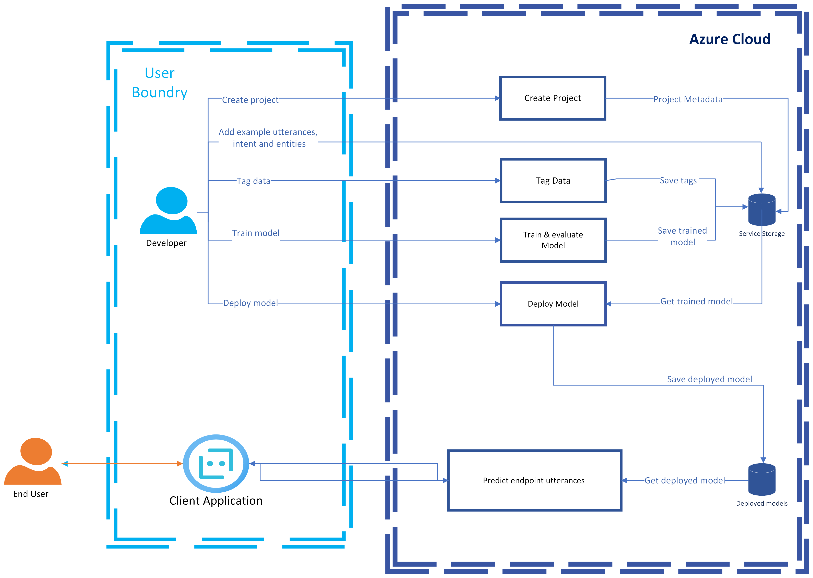

# Data and privacy for conversational language understanding

[!INCLUDE [non-english-translation](../includes/non-english-translation.md)]

This article provides high-level information about how data is processed by conversational language understanding (CLU). You're responsible for your use and implementation of this technology, which includes complying with all laws and regulations that apply to you. For example, it's your responsibility to:

* Understand where your data is processed and stored by CLU to meet regulatory obligations for your application.
* Ensure that you have all necessary licenses, proprietary rights, or other permissions required for the content in your dataset that's used as the basis for building your CLU models.

It's your responsibility to comply with all applicable laws and regulations in your jurisdiction.

## What data does CLU process?

CLU processes the following types of data:

* **Example utterances**: [Example utterances](/azure/ai-services/language-service/conversational-language-understanding/how-to/tag-utterances) are the tagged text utterances provided by the customer to train the custom CLU model. Providing the example utterances and tagging them are prerequisites before you train the model. CLU users can provide example utterances interactively through the [Language Studio portal](https://language.cognitive.azure.com/) or programmatically by using CLU APIs.

  Example utterances are split into train and test sets, where the split can either be predefined by developers during tagging or chosen at random during training. The train set and the tags file are processed during training to create the CLU model. The test set is later processed by the trained model to evaluate its performance.
* **Natural language understanding (NLU) CLU model**: Based on the user's request to train the model, CLU processes the provided example utterances and tags to output a trained NLU model. The user can choose to train a new model or overwrite an existing one. The trained model is then stored on the service's side and used for processing the model evaluation.

    After you're content with the model's performance, you can request to deploy the model for consumption use. The deployed model will also be stored on the service's side, which is used to process the user's requests for prediction through the analyze conversation API.
* **Endpoint utterances**: Endpoint utterances are the user's text utterances sent from a customer's client application, for example, a chat bot, and received by the deployed CLU model. Endpoint utterances are processed in real time in the Microsoft Azure cloud.

  Output of the processed data contains predictions for the overall meaning and extractions of the detailed information of the incoming text based on the customer's customized model. Output is then returned to the client application to perform an action to fulfill the user's request.

CLU doesn't collect customer data to improve its machine-learned models or for product improvement purposes. We use aggregate telemetry, such as which APIs are used and the number of calls from each subscription and resource, for service monitoring purposes.

## How does CLU process data?

The following diagram illustrates how your data is processed.

## How is data retained, and what customer controls are available?

CLU is a data processor for General Data Protection Regulation (GDPR) purposes. In compliance with GDPR policies, CLU users have full control to view, export, or delete any user content either through the [Language Studio](https://language.cognitive.azure.com/) or programmatically by using CLU APIs. For more information, see [Export and delete your customer data](/azure/ai-services/).

Customer controls include:

* Example utterances and tags provided by the CLU user as a prerequisite to train the model are saved until the customer deletes this data. Customers can add example utterances, edit them, or add and remove tags at any time.
* Trained CLU models persist in Azure Storage accounts until the customer deletes the CLU model or the whole project this model is part of.
* Deployed CLU models persist in Azure Storage accounts until the customer deletes the CLU model or the whole project this model is part of. The model is overridden each time the user deploys to the same deployment name.

## Security for customers' data

Azure services are implemented while maintaining appropriate technical and organizational measures to protect customer data in the cloud.

To learn more about Microsoft's privacy and security commitments, see the [Microsoft Trust Center](https://www.microsoft.com/trust-center).

## Next steps

* [Introduction to conversational language understanding](/azure/ai-services/language-service/conversational-language-understanding/overview)
* [Language Understanding transparency note](clu-transparency-note.md)

* [Microsoft AI principles](https://www.microsoft.com/ai/responsible-ai?rtc=1&activetab=pivot1%3aprimaryr6)
* [Building responsible bots](https://www.microsoft.com/research/uploads/prod/2018/11/Bot_Guidelines_Nov_2018.pdf)
