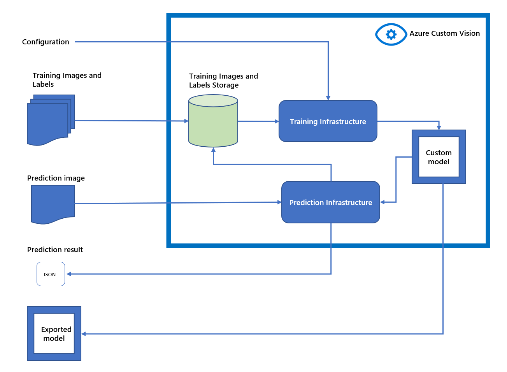

# Data and privacy for Custom Vision

[!INCLUDE [non-english-translation](../includes/non-english-translation.md)]

## What data does Custom Vision process?

Custom Vision processes the following types of data:

- **Configuration:** Data that configures the selection of the base model that's altered by using Transfer Learning with the customer-provided training images and training labels.
- **Training images:** Customer-provided images that are labeled and then used for the purpose of training the base model. You upload these images when you create a project. The training images are stored in Custom Vision service.
- **Training labels:** These are the metadata resulting from the data labeling process of annotating the training images. The labels are stored with the training images and are associated with a project in Custom Vision.
- **Prediction images:** Customer-provided images sent to Custom Vision to run prediction. After the images are processed, you can store them and associate them with the project for further labeling and training. You can also choose not to store them in Custom Vision.
- **Prediction results:** These are the results of Custom Vision running an inference on prediction images by using a model. These results are returned to the caller that sent the prediction image to the service. 
- **Custom model:** After you've trained the custom model, it can be hosted in Custom Vision and invoked with prediction images. You can also export the model to embed in your application.

## How does Custom Vision process data?

The following diagram illustrates how your data is processed.

Azure AI Custom Vision stores your training images and labels for the purpose of training with Transfer Learning, and to generate the custom model for your use case.

Custom Vision Service models are hosted in Azure AI Custom Vision service. Alternatively, you can train models using the compact domains which you can export and embed in your own application. The models generated by compact domains are optimized for the constraints of real-time classification on mobile devices. Model built with a compact domain may be slightly less accurate than a standard domain with the same amount of training data.

You can use the custom model for inference with prediction images. You can store the prediction images for future training iterations for the custom model.

The prediction results are returned to the caller that provided the prediction image.

## How is data retained and what customer controls are available?

The configuration, training images, training labels, and custom model are associated with the project. Custom Vision stores all of them for the lifetime of the project. The prediction images can also be stored with the project, to be used later for model training. When the images aren't used for training for 30 days, they're deleted automatically.

You have full control over viewing and deleting your data. For more information, see [View or delete user data in Custom Vision](/azure/ai-services/custom-vision-service/export-delete-data). When you delete a project, the data associated with the project is deleted within 30 days from the Azure AI Custom Vision service. Note that if the Azure subscription is deleted, the project data is also deleted after 90 days.

To learn more about privacy and security commitments, see the [Microsoft Trust Center](https://www.microsoft.com/trust-center).

## Next steps

* [Guidance for integration and responsible use with Custom Vision](custom-vision-cvs-guidance-integration-responsible-use.md)
