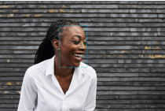
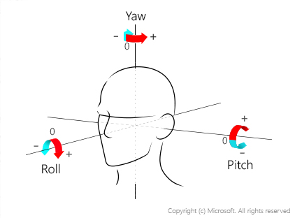
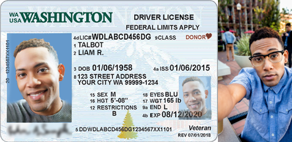

# Characteristics, limitations, and best practices for improving accuracy

[!INCLUDE [non-english-translation](../includes/non-english-translation.md)]

Azure Vision in Foundry Tools Face API (“Face API”) is a building block for creating a facial AI system to which other building blocks must be added, so it is not possible to provide a universally applicable estimate of accuracy for the actual system you are planning to deploy. Companies may share accuracy as measured by public benchmark competitions, but these accuracies depend on details of each benchmark methodology and therefore won’t be the same as the accuracy of a deployed system. 

Ultimately, system accuracy depends on several factors, including the camera technology and how it is configured, environmental conditions, the use case for the system, how people to be recognized interact with the camera, and how people interpret the system’s output. The following section is intended to help you understand key concepts that describe accuracy in the context of a facial recognition and liveness system. With that understanding, we then describe system design choices, how they influence accuracy, and reference metrics. 

## Defining accuracy

The accuracy of a facial recognition system is based on a combination of two things: how often the system correctly matches a person who is enrolled in the system and how often the system correctly finds no match for a person who is not enrolled. These two conditions, which are referred to as the “true” conditions, combine with two “false” conditions to describe all possible outcomes of a facial recognition system: 

| Condition         | Definition      |
|----|---------|
| True positive or correct match  | The person in the [probe image](transparency-note.md) is [enrolled](transparency-note.md) and they are correctly matched.    |
| True negative or correct reject          | The person in the probe image is not enrolled and the system finds no match.    |
| False positive or incorrect match      | Either the person in the probe image is not *enrolled* but is matched to an *enrolled* person OR the person in the probe image is enrolled but is matched with the wrong person. |
| False negative or incorrect reject    | The person in the probe image is enrolled, but the system finds no match.|

The consequences of a false positive or a false negative vary depending on the purpose of the facial recognition system. The examples below illustrate this variation and how choices you make in designing the system affect the experience of those people who are subject to it. 

## How accurate is the facial recognition model?

Measuring the accuracy of facial recognition technology is a very difficult problem and methodologies vary across the industry. To learn about our commitment to Fairness and improving the accuracy of our AI systems, review the [Responsible AI Resources](https://aka.ms/ResponsibleAIResources).

You can use the [Fairness Assessment Sample Notebook](https://go.microsoft.com/fwlink/?linkid=2174387) to assess the fairness of face verification on your own data. It is a Jupyter notebook using the Fairlearn Python package.

## How accurate is the facial liveness detection model? 

The facial liveness detection solution from Microsoft achieved a 0% penetration rate in [iBeta Level 1 and Level 2 Presentation Attack Detection (PAD) tests](https://servicetrust.microsoft.com/DocumentPage/ea3fa18f-3940-4c0b-aa96-41cb50898aee), conducted by a NIST/NVLAP-accredited laboratory and conformant to the [ISO/IEC 30107-3 PAD international standard](https://www.iso.org/standard/79520.html).

## Tradeoffs

### Recognition confidence threshold tuning

The purpose of this section is to help you understand how system configuration influences system accuracy and the trade-off between false positives and false negatives. 

The recognition confidence threshold influences system accuracy and the trade-off between false positives and false negatives. It is not related to confidence intervals. 

#### Recognition confidence score

A recognition confidence score describes the similarity between a probe template and an enrolled template. Recognition confidence scores range from 0 to 1. High recognition confidence scores indicate that it is more likely that the two images are of the same person. 

#### Recognition confidence threshold

A recognition confidence threshold is a configurable value between 0 and 1 that determines the recognition confidence score required to be considered a positive match. 

When using the Verify API  for authentication, if the recognition confidence score between the probe template and the enrollment template associated with the primary identifier is at least as high as the recognition confidence threshold, Face will indicate that the probe image represents the person presenting identification. 

When using the Identify API function, it can be useful for a person to review a list of candidates ranked by recognition confidence scores to make a final determination. Face customers can choose how many candidate templates that reach the recognition confidence threshold will be returned in ranked order of similarity to the probe template. These matches are referred to as a "candidate list". Face will only return candidates with recognition confidence scores at least as high as the recognition confidence threshold. When no templates have recognition confidence scores that reach the recognition confidence threshold, no matches are returned. 

#### Why choose a recognition confidence threshold less than one?

Setting a recognition confidence threshold lets you balance the errors between false positives and false negatives to best address your specific scenario. The overall accuracy of the system is unlikely to be 100%, and when the recognition confidence threshold is set to 1, the strictest value, all errors that occur will be false negatives: the system will return “no match” because the submitted probe template will not perfectly match any enrolled templates. 

If the recognition confidence threshold is set to 0, then any probe template will match any enrollment template. Because recognition confidence scores are affected by the quality of the probe and the enrollment images, a lower recognition confidence score can indicate poor quality images, rather than less similarity between people in the images. When doing Identification, if the recognition confidence threshold is set too high, the system may not return enough candidates to find the true match. 

On the other hand, a low recognition confidence threshold may return low quality matches and can reduce the efficiency and accuracy of the humans reviewing the matches. 

**The default recognition confidence threshold is 0.5**, which is a balance applicable to many identity verification applications, but you can change the recognition confidence threshold to suit each application. 

#### How should a recognition confidence threshold be selected?

The best recognition confidence threshold for your system is based on:

- The system’s purpose,
- The impact of false positives and false negatives on the people who will be subject to facial recognition,
- Whether the final judgments are made by a human, and
- How the whole system, including the experience design, supports resolution of errors.

Before selecting a recognition confidence threshold, Microsoft recommends that you, as a facial recognition system owner, collect accurately labeled evaluation data on site to determine how the recognition confidence threshold affects the achievement of your goals and affects people subject to and interpreting the output of the system. 

Accurately labeled data can be compared to the output of the system to establish the overall accuracy and error rates, and the distribution of errors between false positives and false negatives. This accurately labeled evaluation data should include adequate sampling of people with diverse characteristics who will be subject to recognition so that performance differences can be understood, and corrective action taken. Based on the results of this evaluation, you can iteratively adjust the recognition confidence threshold until the trade-off between false positives and false negatives meets your objectives. 

#### Example of a scenario minimizing false positives

Facial recognition can help users log on to access controlled applications such as a banking app. A false positive in this scenario reduces customer security because it results in an incorrect match, while a false negative could prevent the customer from accessing their account. Because the purpose of the system is security, false positives must be minimized and as a result, most errors will be false negatives (account access fails). The application developer should set a high recognition confidence threshold to minimize false positives. Because a higher confidence threshold will create more false negatives, system owners can provide a fallback mechanism, like pushing a notification to the customer’s phone with an access code. The customer’s experience may be less efficient in this case, but account access is not blocked, and security is prioritized. 

#### Example of a scenario optimizing true positives

Applications with deeply involved human review may want to provide more matches because humans can manually eliminate false positives. For example, consider a photo gallery application that surfaces possible photos of the user. In this case, the application builder would choose a lower recognition confidence threshold number, leaving the user (who is also the human reviewer in this case) with room to eliminate false positives (surfaced photos that are not of the user). 

Here is a list of expected theoretical false positive rates for a given confidence score based on a dataset for the recognition_03 recognition model; there may be variations in real life: 

| Recognition Confidence Threshold | False Positive Rate |
|----------------------------------|---------------------|
| 0.1                              | 1 in 10             |
| 0.2                              | 1 in 100            |
| 0.3                              | 1 in 1,000          |
| 0.4                              | 1 in 10,000         |
| 0.5                              | 1 in 100,000        |
| 0.6                              | 1 in 1,000,000      |
| 0.7                              | 1 in 10,000,000     |
| 0.8                              | 1 in 100,000,000    |
| 0.9                              | 1 in 1,000,000,000  |

## Best practices for improving accuracy

Facial recognition technology is improving and many systems, including Face API, can perform well even when conditions are not ideal. However, these are specific actions that you can take to ensure the best-quality results from your facial recognition system. 

### Plan for an evaluation phase

As discussed in selecting a recognition confidence threshold, before a large-scale deployment or rollout of any facial recognition system, Microsoft strongly recommends that system owners conduct an evaluation phase in the context where the system will be used and with the people who will interact with the system. 

You should work with your analytics and research teams to collect ground truth evaluation data to: 
- Establish baseline accuracy, false positive and false negative rates. 
- Choose an appropriate recognition confidence threshold to meet your objectives. 
- Determine whether the error distribution is skewed towards specific groups of people. 

This is likely to be an iterative process with adjustments to sensor position, lighting, and other factors that influence accuracy, as discussed in this section. This evaluation should reflect your deployment environment and any variations in that environment, such as lighting or sensor placement, as well as ground truth evaluation data that represents the diversity of people who will interact with your system. 

In addition to telemetry data, you may also want to analyze feedback from the people making judgments based on the system output, satisfaction data from the people who are subject to recognition, and feedback from existing customer voice channels to help tune the system and ensure successful engagement. 

### Face size

Making sure the face in an enrollment or probe image is sufficiently large is critical to high quality matches. 

Faces are detectable when their size is as small as 36x36 pixels, but for best performance Microsoft recommends a minimum size of 200x200 pixels with at least 100 pixels between the eyes. Note that higher image resolution increases latency, but [there are ways to optimize latency](/azure/ai-services/computer-vision/how-to/mitigate-latency). The maximum size allowed is 4096 x 4096.

### Face orientation  

Faces looking away from the camera may not be detected. Faces should be oriented looking towards the camera within 35 degrees for both the pitch (head tilt towards the front or back) and the yaw (head rotation to the left or to the right); the roll (head tilt to the left or to the right) doesn't matter. 

 

### Control image capture environment

#### Lighting and camera calibration

Pay attention to how well the details of people’s faces can be seen in images. 

- Capture images in appropriate lighting conditions. Is the lighting too bright, too dark? Are faces backlit? Is there too much light from one side and not enough from the other? When possible, place sensors away from areas with extreme lighting. 
- Is the lighting adequate to accurately capture the details of people’s faces with different skin tones? 

#### Face liveness detection

Facial liveness detection uses the device’s screen to change the lighting of a person’s face to test for liveness. Excessively bright lighting conditions can overwhelm this effect and cause facial liveness detection to fail. If you detect this situation, you should instruct the person to move to a less bright environment. 

#### Backgrounds

- Strive for neutral, non-reflective backgrounds. Avoid backgrounds containing faces, for instance where there are pictures of people displayed, or where people other than the person to be recognized are prominent in the photo. 

#### Sensor placement and maintenance

- Position sensors at face level to best capture images that meet the quality specifications. 
- Ensure sensors are regularly checked for dust, smudges, and other obstructions.

### Plan for variations in subject appearance and behavior

#### Facial occlusions

Facial recognition works best when the person’s entire face is visible. Faces may be partially or entirely occluded for a variety of reasons, including: 

- Religion: Head wear that covers or partially obscures faces. 
- Personal Protective Equipment (PPE): PPE such as face protective masks that cover or partially obscure faces
- Weather: Garments like scarves wrapped across the face. 
- Injury: Eye patches or large bandages. 
- Glasses: Very opaque glasses and pinhole glasses (other glasses and lenses should be fine). 
- Personal style: Bangs over eyebrows, baseball caps, large facial tattoos, etc.

Enrolling occluded faces can result in errors. While it's possible for facial recognition to verify a face that has occlusions, we recommend the following mitigations for addressing occlusion challenges, in addition to sensor placement: 

- A fallback method, such as a non-biometric alternative, is critical. For some people, the fallback may be the option they consistently use. 
- Pay attention to challenges that people face during evaluation and deployment to identify remediations that work best for your environment.
- Use the [Recogniton_04 model](/azure/ai-services/computer-vision/how-to/specify-recognition-model) in the Verify, Identify, Group, and FindSimilar APIs which can recognize people wearing face coverings (surgical masks, N95 masks, cloth masks).

#### Significant changes in appearance

Dramatic changes in appearance, like the removal of a full beard or many years passing between enrollment and probe images (for adults), or even short periods of time between photos of children, can result in errors. 
- In addition to supporting a fallback method, designing the user experience to support immediate reenrollment following a recognition failure can improve user satisfaction. 
- Facial recognition systems are generally less accurate for children. Microsoft recommends using Face for recognition of people over 18. Facial recognition can be especially challenging with people 13 and younger.

#### Motion, blur, and extreme expressions

Blurry faces caused by fast movement, or even extreme expression (like yawning widely with eyes closed), makes recognition challenging. To address these challenges: 

- Design the user experience so people understand how to provide high-quality images. 
- Create an environment where people naturally face the camera and slow down. Otherwise movement could result in blurry images that would be difficult to recognize. 
- Provide clear instructions for how people should behave during recognition (eyes open, mouth closed, stand still, etc.).

#### Biological twins

Twins, family members, and other people who look very similar to each other will be difficult for facial recognition systems to distinguish from one another. This is another reason to support a fallback method.

### Design the system to support human judgment

In most cases, Microsoft recommends using Face AI’s facial recognition capabilities to support people making more accurate and efficient judgments rather than fully automating a process. Meaningful human review is important to:
- Detect and resolve cases of misidentification or other failures. 
- Provide support to people who believe their results were incorrect. 
- Identify and resolve changes in accuracy due to changing conditions (like lighting or sensor cleanliness).

For example, when using Face for admittance into a building, a trained security officer can help when the facial recognition system fails to match someone who believes they are enrolled by deciding whether the person should be admitted to the building. In this case, Face helps the security officer work more efficiently, requiring a judgment to admit someone only when the person is not recognized. 

The user experience that you create to support the people who will use the system output should be designed and evaluated with those people to understand how well they can interpret the output, what additional information they might need, how they can get answers to their questions, and ultimately, how well the system supports their ability to make more accurate judgments. 

### Use multiple factors for authentication

Use Face API along with one or more other identification factors when creating authentication systems, such as confirming passengers who are about to board a plane or confirming a banking transaction. As discussed above, facial verification makes use of facial recognition as a second factor for identifying someone rather than a single or primary factor. Facial identification does not require another factor; however, facial identification is a more technically difficult problem because the probe template is compared to ALL enrolled templates instead of just the template for the primary identifier associated with the probe template. It is often still possible to use other signals to support authentication when using facial identification, such as narrowing the set of enrolled templates to compare by limiting the search to people who have a ticket for a specific flight. While it is not possible to choose facial verification for all scenarios, Microsoft recommends facial verification for uses including secure access to buildings and for other key business and security functions. 

### Use the latest models
Use [the latest detection and recognition models](/azure/ai-services/computer-vision/how-to/specify-recognition-model) in your applications. By default, the oldest detection and recognition models are used for backwards compatibility, so you need to specify the latest models in your API requests. 

### Use the provided quality attributes to provide user feedback and determine if the image is good enough for facial recognition

From our investigation, many issues are caused by low quality images affected by the limitations and tradeoffs described above used for facial recognition purposes. In such cases, even a human can struggle to make the correct decision. To support the capture of high-quality images, the facial detection API offers an image quality attribute which flags issues that pertain to lighting, blur, occlusions or head angle that may limit the usability of images for facial recognition. See the face [QuickStart](/azure/ai-services/computer-vision/quickstarts-sdk/identity-client-library?tabs=visual-studio&pivots=programming-language-csharp) for how to add users into a face using the quality filter and how to call Face Detect using the face client SDKs, and visit the [API Console](https://go.microsoft.com/fwlink/?linkid=2175142) to test out the endpoint.

## Best practices for improving facial recognition with facial liveness detection abuse monitoring

Facial recognition technology, when used for access authorization, can be a target for adversaries attempting to bypass it or the liveness detection technology. Often, these bypass attempts involve brute forcing different materials like various printed photos in front of the system, which is considered system abuse. To mitigate such brute force attacks, specific actions around retry count and rate limiting should be implemented.

### Create a session with conservative call and time limits 

A session serves as the first line of defense, ensuring the liveness detection process is secure and consistent, thereby deterring brute force compromises. A session authorization token is generated for each session and is usable for a preset quota of recognition or liveness detection attempts. If an application user fails to succeed within the attempt limits, a new token is required. This allows for a reassessment of the risk associated with further retries. By setting a conservatively low number of allowed calls per session, you can reevaluate this risk more frequently before issuing a new token. 

### Use the appropriate correlation identifier when creating a session 

Device correlation ID guides the automatic abuse monitoring heuristics within Face API to help you deny abusive traffic to your system that implements facial liveness detection. When a threshold of abusive attempts is reached by a particular correlation identifier, no more sessions can be created using that identifier.

Generate a random GUID string and associate it with sequential attempts from the same individual primary identifier within your system. The choice of identifier or identifier set to map depends on your application needs and other parameters used to assess access risk. Do not use your application’s primary identifier as you may need to regenerate a new random GUID to map to the identifier when necessary.

### Design the system to support human judgment

When a device correlation ID is flagged and no more sessions can be created with the identifier, implement a meaningful human review process to ensure that failures are not due to abusive traffic or brute forcing attempts. If after review you decide to allow more attempts from the same entity because previous failures are deemed legitimate, reset the association by generating a new random GUID mapped to the individual identifier.

## Next steps

* [Quickstart your Face use case development](/azure/ai-services/computer-vision/quickstarts-sdk/identity-client-library)
* [Responsible deployment of Face](/azure/ai-foundry/responsible-ai/face/guidance-integration-responsible-use)
