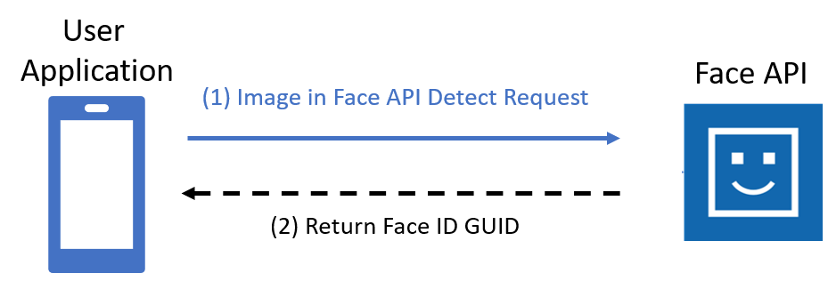

# Data and privacy for Face

[!INCLUDE [non-english-translation](../includes/non-english-translation.md)]

This article provides some high level details regarding how Face processes data provided by customers. Face was designed with compliance, privacy, and security in mind. Biometric identification technologies are intended to process personal data that may be considered sensitive personal information.  Please be aware that the laws governing biometric recognition technologies often vary internationally and domestically, including at the federal, state and local levels.  In addition to regulating allowed use cases, some  jurisdictions impose special legal requirements for the permissions governing collection, transfer, online processing, and storage of biometric data, particularly when used for identification or verification. Before using Face and our Azure services for the collection, transfer, processing and storage of any data subject’s biometric data, you must ensure compliance with the relevant legal requirements that apply to your service application.

* Inform people in your locations with conspicuous disclosure about use of image data and use of facial recognition.
* Comply with all applicable laws and regulations in your jurisdiction.

>[!NOTE]
>
>For our customer’s convenience, please consider utilizing the following disclosure regarding Microsoft's role when you use of Foundry Tools Face with your end users:
[Company] uses Microsoft face recognition technology to process [Company’s] users’ biometric data as its service provider (“Processor”).  Microsoft may process and store face templates for the purposes of providing face verification and/or identification services on [Company]’s behalf, and only as instructed by [Company].  Microsoft will store this data as long as [Company] requests, which shall be no longer than a limited grace period after the date when (i) [Company] ceases to have a relationship with Microsoft or (ii) when [Company] requests deletion.

## What data does Face process, how long is it retained and what protections are in place?

Descriptions of Face API processes use the key terms defined [here](/azure/ai-foundry/responsible-ai/face/transparency-note#key-terms).

Face maintains GDPR data processor classification across all supported regions. 

| Face API operation | Feature | Input data | Output  | Retention of face template | Customer controls for data retention|
|------|-------|--------|-------|------------|-------|
| **[Face Detection without faceID](/rest/api/face/face-detection-operations/detect)**| Detects faces within images  Includes the following parameters:<ul><li>returnFaceLandmarks</li><li>returnFaceAttributes</li><li>detectionModel</li></ul> **Scenario**: Face detection | Image (binary or URL download)| Coordinates of the bounding box location(s) of the face(s) are generalized regardless of who is in the image. Cannot be used to recognize faces or otherwise uniquely identify individuals. | No template is created | N/A |
| **[Face Detection with faceID](/rest/api/face/face-detection-operations/detect)** | Returns a face ID to be used for the [Face recognition APIs](/rest/api/face/face-recognition-operations) (Identify,  Verify API, Group API, and Find Similar).  Face ID is only supported for customers who have been approved for access.  Includes the following parameters:<ul><li>returnFaceId=true</li><li>recognitionModel</li><li>returnRecognitionModel</li><li>*faceIdTimeToLive*</li></ul>**Scenario**: Facial Verification and Facial Identification (approved customers only) | Image (binary or URL download) | FaceID, a randomly generated identifier assigned to a new face feature template for each image submitted to Face API. The FaceID changes for each image submitted, even if the image is of the same face. There's no matching or comparison in Detect API with FaceID. | The face template expires within 24 hours. | The FaceId template expiration date can be adjusted to less than 24 hours with the *faceIdTimeToLive* parameter. |
| **Face Liveness Client SDK ([Kotlin](https://github.com/Azure-Samples/azure-ai-vision-sdk/tree/main), [Swift](https://github.com/Azure-Samples/azure-ai-vision-sdk/tree/main))**| Detects face liveness.  (approved customers only) | Video | Enumeration of real, spoof, or uncertain. | One or more templates may be created. Templates are not stored locally after analysis.| N/A|
| **[Verify](/rest/api/face/face-recognition-operations/verify-face-to-face)**| Performs a one-to-one match between a FaceID and either another FaceID, a PersonGroupPerson, a LargePersonGroupPerson, or a PersonDirectoryPerson.  **Scenario**: Facial Verification and Facial Identification (approved customers only) | Both of:<ul><li>A FaceID array from the [Detect API](/rest/api/face/face-detection-operations/detect) (with `returnFaceId=true`)</li><li>One of the following:<ul><li>Another FaceID array from the [Detect API](/rest/api/face/face-detection-operations/detect) (with `returnFaceId=true`)</li><li>A PersonId and one of the following:<ul><li>GroupPersonId from [PersonGroup Create API](/rest/api/face/person-group-operations/create-person-group)</li><li>LergePersonGroupId from [LargePersonGroup Create API](/rest/api/face/person-group-operations/create-large-person-group)</li><li>DynamicPersonGroupId from [PersonDirectoryDynamicPersonGroup Create API](/rest/api/face/person-directory-operations/create-dynamic-person-group)</li></ul></li></ul></li></ul> | Determines whether a FaceID is a match compared to the other FaceID. | The FaceID array and associated face template created with Face Detect’s FaceID feature expire within 24 hours.    The input PersonGroupId, LargePersonGroupId, or PersonDirectory face templates will not expire. | The FaceId template expiration date can be adjusted to less than 24 hours with *faceIdTimeToLive*.   PersonGroupId, LargePersonGroupId, PersonIds, and their persistedFaceIds can be managed and deleted by the customer with the following APIs:  Person deletion (Deleting a Person also deletes their associated Face templates):<ul><li>PersonGroupPerson - Delete</li><li>LargePersonGroupPerson - Delete</li><li>PersonDirectoryPerson - Delete</li></ul>Person Face deletion<ul><li>PersonGroupPersonFace -  Delete</li><li>LargePersonGroupPersonFace - Delete</li><li>PersonDirectoryPersonFace - Delete</li></ul> |
| **[Identify](/rest/api/face/face-recognition-operations/identify-from-dynamic-person-group)** | Given a FaceID, performs a 1-to-N search for similar-looking persons in a FaceID array, a personGroupId, a largePersonGroupId, a dynamicPersonGroupId, or a list of PersonDirectory persons.    **Scenario**: Facial Identification **(Approved Customer Only)** | <ul><li>FaceID Array From [Detect API](/rest/api/face/face-detection-operations/detect) with returnFaceId=true</li><li>One of the following:</li><ul><li>PersonGroupId from [PersonGroup Create API](/rest/api/face/person-group-operations/create-person-group)</li><li>LargePersonGroupId from [LargePersonGroup – Create API](/rest/api/face/person-group-operations/create-large-person-group)</li><li>DynamicPersonGroupId from [PersonDirectory DynamicPersonGroup – Create API](/rest/api/face/person-directory-operations/create-dynamic-person-group)</li><li>Array of Persons from [PersonDirectory Person Create API](/rest/api/face/person-directory-operations/create-person)</li></ul></ul>|For each FaceID provided, a list of candidate PersonIds from the corresponding input search group.| The faceID array and associated face template created with [Face Detect’s FaceId feature](/rest/api/face/face-detection-operations/detect) expire within 24 hours.  The input PersonGroupId created by [PersonGroup Create API](/rest/api/face/person-group-operations/create-person-group) contains PersonGroupPersons with associated persistedFaceId face templates that will not expire.  The input LargePersonGroupId created by [LargePersonGroup Create API](/rest/api/face/person-group-operations/create-large-person-group) contains LargePersonGroupPersons with associated persistedFaceIds face templates that will not expire.  The input PersonDirectory Persons created by [PersonDirectory Person Create API](/rest/api/face/person-directory-operations/create-person) and referenced by [DynamicPersonGroup Create](/rest/api/face/person-directory-operations/create-dynamic-person-group) contains PersonDirectoryPersons with associated persistedFaceIds face templates that will not expire.  | The FaceIDs array template's expiration can be adjusted to less than 24 hours with the [Detect API](/rest/api/face/face-detection-operations/detect) query parameter *faceIdTimeToLive*  faceListId; largeFaceListId; and persistentFaceIds can be managed and deleted by customers with the Face API commands. |
| **[Find Similar](/rest/api/face/face-recognition-operations/find-similar)** | Given a face, searches for similar-looking faces from a faceID array, a faceListId or a largeFaceListId.  Depending on the type of Customer request (for a faceID array or a faceListID), the results returned to customers contain faceIDs or persistedFaceIDs ranked by similarity.   **Scenario**: Facial Identification **(Approved Customer Only)** | The FaceID or FaceID Array From [Detect API](/rest/api/face/face-detection-operations/detect) returnFaceId=true  faceListID; largeFaceListID | The matching persistedFaceID, with confidence score |  The input faceID array may contain multiple faces detected by [Detect API](/rest/api/face/face-detection-operations/detect). These faceID array and associated face template expires within 24 hours.  The input faceListID is created by [FaceList – Create API](/rest/api/face/face-list-operations/create-face-list) containing persistedFaceIDs and associated face template that will not expire.  The input largeFaceListID is created by [LargeFaceList – Create API](/rest/api/face/face-list-operations/create-large-face-list) containing persistedFaceIDs and associated face template that will also not expire. | FaceIDs array template expiration can be adjusted to less than 24 hours with  [Detect API](/rest/api/face/face-detection-operations/detect) query parameter *faceIdTimeToLive*  faceListID; LargeFaceListID; and PersistentFaceIDs can be managed and deleted by Customers via the Face API commands. |
| **[Group](/rest/api/face/face-recognition-operations/group)** | Group similar faces together  **Scenario:** Facial Identification **(Approved Customer Only)** | FaceID Array From [Detect API](/rest/api/face/face-detection-operations/detect) returnFaceId=true   | One or more groups of faceIDs | The grouping of faceID’s is not persisted beyond request.  The faceID array and associated face template expires within 24 hours. | FaceIDs array template expiration can be adjusted to less than 24 hours with  [Detect API](/rest/api/face/face-detection-operations/detect) query parameter *faceIdTimeToLive* |
| **[FaceList](/rest/api/face/face-list-operations/create-face-list)**  **[LargeFaceList](/rest/api/face/face-list-operations/create-large-face-list)** | Data structures for storing face templates in FaceLists or LargeFaceLists for use with future **FindSimilar** or **Verify** operations.  **Scenario:** Facial Verification & Facial Identification **(Approved Customer Only)** | Image | persistedFaceIds |   The input faceListID is created by [FaceList – Create API](/rest/api/face/face-list-operations/create-face-list) containing persistedFaceIDs and associated face template that will not expire.  The input largeFaceListID is created by [LargeFaceList – Create API](/rest/api/face/face-list-operations/create-large-face-list) containing persistedFaceIDs and associated face template that will also not expire. | faceListID; LargeFaceListID; and PersistentFaceIDs can be managed and deleted by customer using the corresponding REST CRUD APIs for each data structure. |
| **[PersonGroup](/rest/api/face/person-group-operations/create-person-group)**  **[LargePersonGroup](/rest/api/face/person-group-operations/create-large-person-group)**  **[PersonDirectory](/rest/api/face/person-directory-operations/create-dynamic-person-group)** | Data structures for storing multiple face templates per Person. PersonGroup(Persons), LargePersonGroup(Persons), PersonDirectory(Persons) are for use with future Identify or Verify operations.   **Scenario:** Facial Verification & Facial Identification **(Approved Customer Only)** | Image | persistedFaceIds |  The input PersonGroupId created by [PersonGroup - Create API](/rest/api/face/person-group-operations/create-person-group) contains PersonGroupPersons with associated persistedFaceIds face templates that will not expire.  The input LargePersonGroupId created by [LargePersonGroup - Create API](/rest/api/face/person-group-operations/create-large-person-group) contains LargePersonGroupPersons with associated persistedFaceIds face templates that will not expire.  The input PersonDirectory Persons created by [PersonDirectory Person - Create API](/rest/api/face/person-directory-operations/create-person) and referenced by [DynamicPersonGroup - Create API](/rest/api/face/person-directory-operations/create-dynamic-person-group) contains PersonDirectoryPersons with associated persistedFaceIds face templates that will not | PersonGroupPersonIds, LargePersonGroupPersonIds, and PersonDirectoryPersonIds can be managed and deleted by customer using the corresponding REST CRUD APIs for each data structure. |
| **[Detect Liveness Session](/rest/api/face/liveness-session-operations/create-liveness-session)** | Detects whether face within an image is a genuine presentation instead of a spoofing specimen  **Scenario:** Liveness Detection **(Approved Customers Only)** | deviceCorrelationId: a non-PII identifier provided by the customer to link sessions from the same device together over a 48-hour period.  Liveness Images | SessionId: a random generated Identifier (GUID), history of session-associated operations (such as facial liveness detection) are linked.  Authorization Token: for a client device to authenticate to Face API directly. |  No face template is created in v1.2 and prior version.  Since v1.3-preview and later version, Face template is created and stored up to 48 hours unless abuse monitoring feature is turned off by using [Liveness Setting API](/rest/api/face/liveness-session-operations/patch-settings?view=rest-face-v1.3-preview).| Session data is automatically deleted after 48 hours or may be deleted by the customer using [DetectLivenessSession - Delete API](/rest/api/face/liveness-session-operations/delete-liveness-session) |
| **[Detect Liveness With Verify Session](/rest/api/face/liveness-session-operations/create-liveness-with-verify-session)** | Detects whether face within an image is a genuine presentation instead of a spoofing specimen and compares it to a known image of the person providing a face match confidence score to help ensure identity of the individual is the same.    **Scenario:** Liveness Detection & Facial Verification **(Approved Customers Only)** | deviceCorrelationId: a non-PII identifier provided by the customer to link sessions from the same device together over a 48 hour period.  Liveness Images  Reference Image | SessionId: a random generated Identifier (GUID), history of session-associated operations (such as facial liveness detection) are linked.  Authorization Token: for a client device to authenticate to Face API directly.  Face Rectangle and classification result of either live or spoofed faces  Target Rectangle of reference image and confidence score of match  | In v1.2 and prior versions, if Verification reference image is provided during [DetectLivenessWithVerify Session - Create API](/rest/api/face/liveness-session-operations/delete-liveness-with-verify-session), Face templates is stored for up to 48 hours or session is deleted by the customer.  Since v1.3-preview and later versions, Face template is created and stored up to 48 hours unless abuse monitoring feature is turned off by using [Liveness Setting API](/rest/api/face/liveness-session-operations/patch-settings?view=rest-face-v1.3-preview). | Session data is automatically deleted after 48 hours or may be deleted by the customer using [DetectLivenessWithVerify Session - Delete API](/rest/api/face/liveness-session-operations/delete-liveness-with-verify-session) |

> [!NOTE]
> No images sent to the Face service are stored after analysis. Microsoft does not use input or output data to train, retrain, or improve the Face API.

## How does the Face process data? 

The diagram below illustrates how your data is processed for Face Detection with Face ID (approved customers only).   

## Security for customers’ data

The security of customer data is a shared responsibility.

The following are a few best practices for further securing Foundry Tools Face: 
* **Customer managed encryption keys** [are available.](/azure/ai-services/computer-vision/identity-encrypt-data-at-rest)
* [**Foundry Tools Face supports VNET**](/azure/ai-services/cognitive-services-virtual-networks?tabs=portal) to restrict access to certain IP addresses, IP ranges, or a list of subnets.
* **Azure Active Directory (Azure AD) authentication** allows you to authenticate to Foundry Tools using Azure AD. This capability provides greater flexibility for managing access to Foundry Tools and makes it easier to use existing policies for credential rotation and to enforce custom password standards.
   - You can also further protect access to sensitive facial feature templates by using [Azure role-based access control (Azure RBAC)](/azure/ai-services/authentication?tabs=powershell#authenticate-with-azure-active-directory) to use the *Cognitive Services Face Recognizer* role that restricts access to detect, verify, identify, group, and find similar operations on Face. This role does not allow create or delete enroll operations, which makes it well suited for endpoints that only need inferencing capabilities, following “least privilege” best practices.

For additional security best practices and information, visit [Foundry Tools security baseline](/azure/ai-services/security-features?tabs=command-line%2Ccsharp)

Should you have any additional questions or concerns, please let us know by opening a support ticket in the Azure portal. 

To learn more about Microsoft's privacy and security commitments visit the [Microsoft Trust Center](https://www.microsoft.com/trust-center).

## Next steps
* [Quickstart your Face use case development](/azure/ai-services/computer-vision/quickstarts-sdk/identity-client-library)
