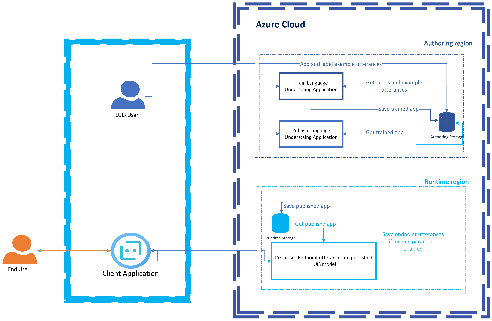

# Data and privacy for Language Understanding

[!INCLUDE [non-english-translation](../includes/non-english-translation.md)]

## What data does Language Understanding process?

Language Understanding (LUIS) processes the following types of data:

* **Example utterances**: [Example utterances](/azure/ai-services/luis/concepts/utterances) are the labeled text utterances provided by the customer to train the custom LUIS model. Providing the example utterances and labeling them are prerequisites before training the model. LUIS users can provide example utterances interactively through the [LUIS web portal](https://www.luis.ai) or programmatically by using LUIS APIs.
* **Natural language understanding (NLU) LUIS model**: Based on the user's request to train the model, LUIS processes the provided example utterances and labels to output a trained NLU model. The trained model is overridden every time the LUIS user requests another training after having done updates to the example utterances and labels. A good practice is to [clone the current active model](/azure/ai-services/luis/luis-how-to-manage-versions) to a different version of the app before making changes to the model. After the user is satisfied with a model, the user requests to publish the NLU model to receive user text utterances at runtime.
* **Endpoint utterances**: Endpoint utterances are the user's text utterances sent from a customer's client application, for example, a chat bot, and received by the trained NLU LUIS model. Endpoint utterances are processed in real time in the Microsoft Azure cloud, unless they're running on a [LUIS hosted container](/azure/ai-services/luis/luis-container-howto?tabs=v3). Output of the processed data contains predictions for the overall meaning and extractions of the detailed information of the incoming text based on the customer's customized model. Output is then returned to the client application to perform an action to fulfill the user's request.
* **Logged endpoint utterances**: Endpoint utterances can be logged to help LUIS customers [improve the performance of the LUIS application](/azure/ai-services/luis/how-to/improve-application). LUIS users have the option to [turn off or turn on query logging as needed](/azure/ai-services/luis/faq#how-can-i-disable-the-logging-of-utterances).

LUIS doesn't collect customer data to improve its machine-learned models or for product improvement purposes. We use aggregate telemetry, such as which APIs are used and the number of calls from each subscription and resource, for service monitoring purposes.

## How does LUIS process data?

The following diagram illustrates how your data is processed.

## How is data retained, and what customer controls are available?

LUIS is a data processor for GDPR purposes. In compliance with GDPR policies, LUIS users have full control to view, export, or delete any user content either through the [LUIS web portal](https://www.luis.ai) or programmatically by using LUIS APIs. For more information, see [Export and delete your customer data](/azure/ai-services/luis/luis-user-privacy).

Customer controls include:

* Example utterances and labels provided by the LUIS user as prerequisite to train the LUIS model are saved until the customer deletes this data.
* Trained LUIS models persist in Azure Storage accounts until the customer deletes the LUIS application. The model is overridden each time the user retrains the model.
* Published LUIS models persist in Azure Storage accounts until the customer deletes the LUIS application. The model is overridden each time the user republishes the model.
* Endpoint utterances are saved only if the LUIS customer (model owner) enables logging them for [review to enhance the performance of the LUIS application](/azure/ai-services/luis/how-to/improve-application). When utterances are logged, they're saved for only 30 days. Otherwise, text utterances are only processed in memory in real time to output the LUIS response and never saved.

## Optional: Security for customers' data

Azure services are implemented while maintaining appropriate technical and organizational measures to protect customer data in the cloud.

To maintain security and data governance requirements, run Docker containers for LUIS in your own environment. For more information on installing and running LUIS containers, see [Install and run Docker containers for LUIS](/azure/ai-services/luis/luis-container-howto?tabs=v3). For more information on the security model of Foundry Tools, see [Foundry Tools container security](/azure/ai-services/cognitive-services-container-support?tabs=luis#azure-cognitive-services-container-security). You're responsible for securing and maintaining the equipment and infrastructure required to operate LUIS's containers located on your premises.

To learn more about Microsoft's privacy and security commitments, see the [Microsoft Trust Center](https://www.microsoft.com/trust-center).

## Next steps

* [Introduction to Language Understanding](/azure/ai-services/luis/what-is-luis)
* [Language Understanding transparency note](luis-transparency-note.md)
* [Microsoft AI principles](https://www.microsoft.com/ai/responsible-ai?rtc=1&activetab=pivot1%3aprimaryr6)
* [Building responsible bots](https://www.microsoft.com/research/uploads/prod/2018/11/Bot_Guidelines_Nov_2018.pdf)
