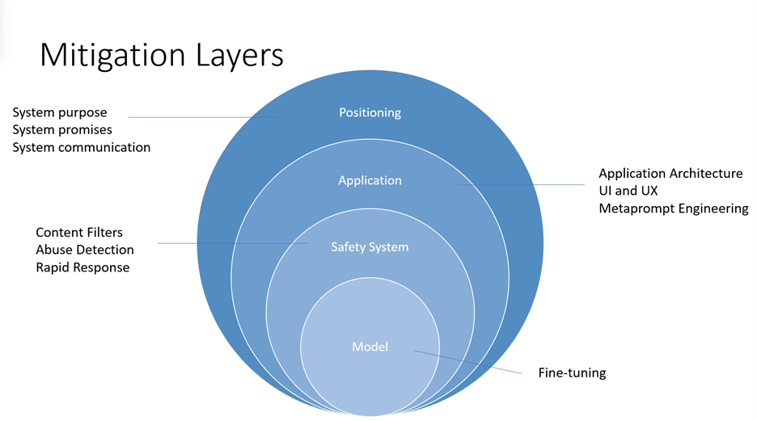

# Overview of responsible AI practices for Azure OpenAI models 

[!INCLUDE [non-english-translation](../includes/non-english-translation.md)]

Many of the Azure OpenAI models are generative AI models that demonstrate improvements in advanced capabilities such as content and code generation, summarization, and search. With many of these improvements also come increased responsible AI challenges related to harmful content, manipulation, human-like behavior, privacy, and more. For more information about the capabilities, limitations, and appropriate use cases for these models, review the [Transparency Note](/azure/ai-foundry/responsible-ai/openai/transparency-note).  

In addition to the Transparency Note, we provide technical recommendations and resources to help customers design, develop, deploy, and use AI systems that implement the Azure OpenAI models responsibly. Our recommendations are grounded in the [Microsoft Responsible AI Standard](https://aka.ms/RAI), which sets policy requirements that our own engineering teams follow. Much of the content of the Standard follows a pattern, asking teams to identify, measure, and mitigate potential harms, and plan for how to operate the AI system. In alignment with those practices, these recommendations are organized into four stages:

1. **Identify** : Identify and prioritize potential harms that could result from your AI system through iterative red-teaming, stress-testing, and analysis.
1. **Measure** : Measure the frequency and severity of those harms by establishing clear metrics, creating measurement test sets, and completing iterative, systematic testing (both manual and automated).
1. **Mitigate** : Mitigate harms by implementing tools and strategies such as [prompt engineering](/azure/ai-foundry/openai/concepts/prompt-engineering) and using our [Guardrails (previously content filters)](/azure/ai-foundry/openai/concepts/content-filter). Repeat measurement to test effectiveness after implementing mitigations.
1. **Operate** : Define and execute a deployment and operational readiness plan.

In addition to their correspondence to the Microsoft Responsible AI Standard, these stages correspond closely to the functions in the [NIST AI Risk Management Framework](https://www.nist.gov/itl/ai-risk-management-framework).

## Identify

The first stage of the Responsible AI lifecycle is identifying potential harms that could occur in or be caused by an AI system. The earlier you begin to identify potential harms, the more effective you can be at mitigating them. When assessing potential harms, develop an understanding of the types of harms that could result from using the Azure OpenAI Service in your specific contexts. This section provides recommendations and resources you can use to identify harms through an impact assessment, iterative red team testing, stress-testing, and analysis. Red teaming and stress-testing are approaches where a group of testers intentionally probe a system to identify its limitations, risk surface, and vulnerabilities.

These steps produce a prioritized list of potential harms for each specific scenario.

1. **Identify harms that are relevant** for your specific model, application, and deployment scenario.
   1. Identify potential harms associated with the model and model capabilities (for example, GPT-3 model versus GPT-4 model) that you use in your system. Each model has different capabilities, limitations, and risks.
   1. Identify any other harms or increased scope of harm presented by the intended use of the system you're developing. Consider using a [Responsible AI Impact Assessment](https://aka.ms/rai) to identify potential harms.
      1. For example, consider an AI system that summarizes text. Some uses of text generation are lower risk than others. If the system is used in a healthcare domain for summarizing doctor's notes, the risk of harm arising from inaccuracies is higher than if the system is summarizing online articles.
1. **Prioritize harms based on elements of risk such as frequency and severity**. Assess the level of risk for each harm and the likelihood of each risk occurring to prioritize the list of harms you identified. Consider working with subject matter experts and risk managers within your organization and with relevant external stakeholders when appropriate.
1. **Conduct red team testing and stress testing** starting with the highest priority harms. Develop a better understanding of whether and how the identified harms occur in your scenario. Identify new harms you didn't initially anticipate.
1. **Share this information with relevant stakeholders** by using your organization's internal compliance processes.

At the end of this Identify stage, you have a documented, prioritized list of harms. When new harms and new instances of harms emerge through further testing and use of the system, update and improve this list.

## Measure

After you identify a prioritized list of harms, develop an approach for systematic measurement of each harm and conduct evaluations of the AI system. You can use manual and automated approaches to measurement. We recommend you use both approaches, starting with manual measurement.

Manual measurement is useful for:

* Measuring progress on a small set of priority issues. When mitigating specific harms, it's often most productive to keep manually checking progress against a small dataset until the harm is no longer observed before moving to automated measurement.
* Defining and reporting metrics until automated measurement is reliable enough to use alone.
* Spot-checking periodically to measure the quality of automatic measurement.

Automated measurement is useful for:

* Measuring at a large scale with increased coverage to provide more comprehensive results.
* Ongoing measurement to monitor for any regression as the system, usage, and mitigations evolve.

The following recommendations help you measure your AI system for potential harms. We recommend you first complete this process manually and then develop a plan to automate the process:

1. **Create inputs that are likely to produce each prioritized harm:** Create measurement sets by generating many diverse examples of targeted inputs that are likely to produce each prioritized harm.

1. **Generate System Outputs:** Pass in the examples from the measurement sets as inputs to the system to generate system outputs. Document the outputs.

1. **Evaluate System Outputs and Report Results to Relevant Stakeholders** 
    1. **Define clear metrics.** For each intended use of your system, establish metrics that measure the frequency and degree of severity of each potentially harmful output. Create clear definitions to classify outputs that you consider harmful or problematic in the context of your system and scenario, for each type of prioritized harm you identified.
    1. **Assess the outputs** against the clear metric definitions. Record and quantify the occurrences of harmful outputs. Repeat the measurements periodically to assess mitigations and monitor for any regression.
    1. **Share this information with relevant stakeholders** by using your organization's internal compliance processes.

At the end of this measurement stage, you should have a defined measurement approach to benchmark how your system performs for each potential harm as well as an initial set of documented results. As you continue implementing and testing mitigations, refine the metrics and measurement sets. For example, add metrics for new harms that you initially didn't anticipate. Update the results.

## Mitigate

Mitigating harms presented by large language models such as the Azure OpenAI models requires an iterative, layered approach that includes experimentation and continual measurement. We recommend developing a mitigation plan that encompasses four layers of mitigations for the harms you identified in the earlier stages of this process:

1. At the **model level**, understand the model(s) you use and what fine-tuning steps the model developers take to align the model toward its intended uses and to reduce the risk of potentially harmful uses and outcomes.
   1. For example, developers use reinforcement learning methods as a responsible AI tool to better align GPT-4 toward the designers' intended goals.
1. At the **safety system level**, understand the platform level mitigations that the developers implement, such as the [Azure OpenAI Guardrails (previously content filters)](/azure/ai-foundry/openai/concepts/content-filter) which help to block the output of harmful content.
1. At the **application level**, application developers can implement metaprompt and user-centered design and user experience mitigations. Metaprompts are instructions you provide to the model to guide its behavior. Their use can make a critical difference in guiding the system to behave in accordance with your expectations. User-centered design and user experience (UX) interventions are also key mitigation tools to prevent misuse and overreliance on AI.
1. At the **positioning level**, educate the people who use or are affected by your system about its capabilities and limitations.

The following sections provide specific recommendations to implement mitigations at the different layers. Not all of these mitigations are appropriate for every scenario. Conversely, these mitigations might be insufficient for some scenarios. Give careful consideration to your scenario and the prioritized harms you identified. As you implement mitigations, develop a process to **measure and document their effectiveness** for your system and scenario.

1. **Model level Mitigations:** Review and identify which Azure OpenAI base model best suits the system you're building. Educate yourself about its capabilities, limitations, and any measures taken to reduce the risk of the potential harms you identified. For example, if you use GPT-4, in addition to reading this Transparency Note, review OpenAI's [GPT-4 System Card](https://cdn.openai.com/papers/gpt-4-system-card.pdf) that explains the safety challenges presented by the model and the safety processes that OpenAI adopted to prepare GPT-4 for deployment. Experiment with different versions of the model(s) (including through red teaming and measuring) to see how the harms present differently.

1. **Safety System Level Mitigations:** Identify and evaluate the effectiveness of platform level solutions such as the [Azure OpenAI Guardrails (previously content filters)](/azure/ai-foundry/openai/concepts/content-filter) to help mitigate the potential harms that you identified.

1. **Application Level Mitigations:** Prompt engineering, including **metaprompt tuning, can be an effective mitigation** for many different types of harm. Review and implement metaprompt (also called the "system message" or "system prompt") guidance and best practices documented [here](/azure/ai-foundry/openai/concepts/prompt-engineering).

   Implement the following user-centered design and user experience (UX) interventions, guidance, and best practices to guide users to use the system as intended and to prevent overreliance on the AI system:

   1. **Review and edit interventions:** Design the user experience (UX) to encourage people who use the system to review and edit the AI-generated outputs before accepting them (see [HAX G9](https://www.microsoft.com/en-us/haxtoolkit/library/?taxonomy_guideline-term%5B%5D=11): Support efficient correction).
   1. **Highlight potential inaccuracies in the AI-generated outputs** (see [HAX G2](https://www.microsoft.com/en-us/haxtoolkit/library/?taxonomy_guideline-term%5B%5D=4): Make clear how well the system can do what it can do), both when users first start using the system and at appropriate times during ongoing use. In the first run experience (FRE), notify users that AI-generated outputs might contain inaccuracies and that they should verify information. Throughout the experience, include reminders to check AI-generated output for potential inaccuracies, both overall and in relation to specific types of content the system might generate incorrectly. For example, if your measurement process determines that your system has lower accuracy with numbers, mark numbers in generated outputs to alert the user and encourage them to check the numbers or seek external sources for verification.
   1. **User responsibility.** Remind people that they're accountable for the final content when they're reviewing AI-generated content. For example, when offering code suggestions, remind the developer to review and test suggestions before accepting.
   1. **Disclose AI's role in the interaction.** Make people aware that they're interacting with an AI system (as opposed to another human). Where appropriate, inform content consumers that content is partly or fully generated by an AI model. Such notices might be required by law or applicable best practices. They can reduce inappropriate reliance on AI-generated outputs and can help consumers use their own judgment about how to interpret and act on such content.
   1. **Prevent the system from anthropomorphizing.** AI models might output content containing opinions, emotive statements, or other formulations that could imply that they're human-like. Such content could be mistaken for a human identity. Such content could mislead people to think that a system has certain capabilities when it doesn't. Implement mechanisms that reduce the risk of such outputs or incorporate disclosures to help prevent misinterpretation of outputs.
   1. **Cite references and information sources.** If your system generates content based on references sent to the model, clearly citing information sources helps people understand where the AI-generated content is coming from.
   1. **Limit the length of inputs and outputs, where appropriate.** Restricting input and output length can reduce the likelihood of producing undesirable content, misuse of the system beyond its intended uses, or other harmful or unintended uses.
   1. **Structure inputs and/or system outputs.** Use [prompt engineering](/azure/ai-foundry/openai/concepts/prompt-engineering) techniques within your application to structure inputs to the system to prevent open-ended responses. You can also limit outputs to be structured in certain formats or patterns. For example, if your system generates dialog for a fictional character in response to queries, limit the inputs so that people can only query for a predetermined set of concepts.
   1. **Prepare pre-determined responses.** There are certain queries to which a model might generate offensive, inappropriate, or otherwise harmful responses. When harmful or offensive queries or responses are detected, you can design your system to deliver a predetermined response to the user. Predetermined responses should be crafted thoughtfully. For example, the application can provide prewritten answers to questions such as "who/what are you?" to avoid having the system respond with anthropomorphized responses. You can also use predetermined responses for questions like, "What are your terms of use?" to direct people to the correct policy.
   1. **Restrict automatic posting on social media.** Limit how people can automate your product or service. For example, you might choose to prohibit automated posting of AI-generated content to external sites (including social media), or to prohibit the automated execution of generated code.
   1. **Bot detection.** Devise and implement a mechanism to prohibit users from building an API on top of your product.

1. **Positioning Level Mitigations:**
   1. **Be appropriately transparent.** Provide the right level of transparency to people who use the system, so that they can make informed decisions around the use of the system.
   1. **Provide system documentation.** Produce and provide educational materials for your system, including explanations of its capabilities and limitations. For example, this content could be in the form of a "learn more" page accessible via the system.
   1. **Publish user guidelines and best practices.** Help users and stakeholders use the system appropriately by publishing best practices, for example on prompt crafting, reviewing generations before accepting them, and so on. Such guidelines can help people understand how the system works. When possible, incorporate the guidelines and best practices directly into the UX.

As you implement mitigations to address potential identified harms, develop a process for ongoing measurement of the effectiveness of such mitigations. Document measurement results. Review those measurement results to continually improve the system.

## Operate

After you put measurement and mitigation systems in place, define and execute a deployment and operational readiness plan. This stage includes completing appropriate reviews of your system and mitigation plans with relevant stakeholders, establishing pipelines to collect telemetry and feedback, and developing an incident response and rollback plan.

Consider the following recommendations for deploying and operating a system that uses the Azure OpenAI service with appropriate, targeted harms mitigations:

1. Work with compliance teams within your organization to understand what types of reviews are required for your system and when to complete them. Reviews might include legal review, privacy review, security review, accessibility review, and others.

1. Develop and implement the following components:
   1. **Phased delivery plan.** Launch systems that use the Azure OpenAI service gradually with a phased delivery approach. This approach gives a limited set of people the opportunity to try the system, provide feedback, report issues and concerns, and suggest improvements before the system is released more widely. It also helps you manage the risk of unanticipated failure modes, unexpected system behaviors, and unexpected concerns being reported.
   1. **Incident response plan.** Develop an incident response plan and evaluate the time needed to respond to an incident.
   1. **Rollback plan.** Ensure you can roll back the system quickly and efficiently if an unanticipated incident occurs.
   1. **Immediate action for unanticipated harms.** Build the necessary features and processes to block problematic prompts and responses as they're discovered and as close to real-time as possible. When unanticipated harms occur, block the problematic prompts and responses as quickly as possible. Develop and deploy appropriate mitigations. Investigate the incident and implement a long-term solution.
   1. **Mechanism to block people who misuse your system.** Develop a mechanism to identify users who violate your content policies (for example, by generating hate speech) or are otherwise using your system for unintended or harmful purposes. Take action against further abuse. For example, if a user frequently uses your system to generate content that is blocked or flagged by content safety systems, consider blocking them from further use of your system. Implement an appeal mechanism where appropriate.
   1. **Effective user feedback channels.** Implement feedback channels through which stakeholders (and the general public, if applicable) can submit feedback or report issues with generated content or that otherwise arise during their use of the system. Document how you process, consider, and address such feedback. Evaluate the feedback and work to improve the system based on user feedback. One approach could be to include buttons with generated content that allow users to identify content as "inaccurate," "harmful," or "incomplete." This approach could provide a more widely used, structured, and feedback signal for analysis.
   1. **Telemetry data.** Identify and record (consistent with applicable privacy laws, policies, and commitments) signals that indicate user satisfaction or their ability to use the system as intended. Use telemetry data to identify gaps and improve the system.

This document is not intended to be, and should not be construed as providing, legal advice. The jurisdiction in which you're operating may have various regulatory or legal requirements that apply to your AI system. Consult a legal specialist if you are uncertain about laws or regulations that might apply to your system, especially if you think those might impact these recommendations. Be aware that not all of these recommendations and resources are appropriate for every scenario, and conversely, these recommendations and resources may be insufficient for some scenarios.

## Learn more about responsible AI

- [Microsoft AI principles](https://www.microsoft.com/ai/responsible-ai)
- [Microsoft responsible AI resources](https://www.microsoft.com/ai/responsible-ai-resources) 
- [Microsoft Azure Learning courses on responsible AI](/training/paths/responsible-ai-business-principles/)

## Learn more about Azure OpenAI

- [Limited access to Azure OpenAI Service - Foundry Tools | Microsoft Learn](/azure/ai-foundry/responsible-ai/openai/limited-access) 
- [Code of Conduct for the Azure OpenAI Service | Microsoft Learn](/legal/ai-code-of-conduct?context=%2Fazure%2Fcognitive-services%2Fopenai%2Fcontext%2Fcontext) 
- [Data, privacy, and security for Azure OpenAI Service - Foundry Tools | Microsoft Learn](/azure/ai-foundry/responsible-ai/openai/data-privacy)
