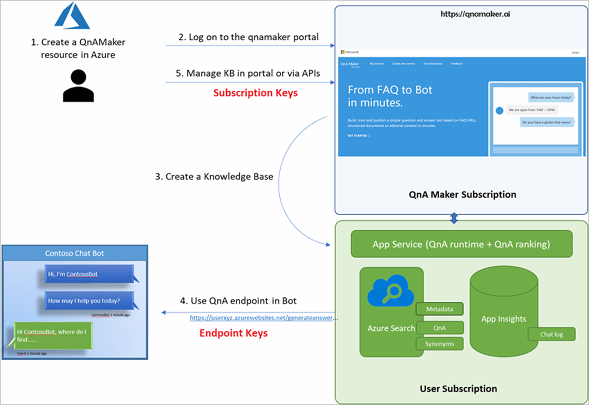

# Data and privacy for QnA Maker

[!INCLUDE [non-english-translation](../includes/non-english-translation.md)]

This article provides some high level details regarding how data is processed by QnA Maker. Its important to remember that you are responsible for your use and the implementation of this technology, including complying with all applicable laws and regulations that apply to you. For example, it's your responsibility to:

- Understand where your data is processed and stored by the QnA Maker service in order to meet regulatory obligations 
 for your application.

- Inform the users of your applications that information like chat logs
    will be logged and can be used for further processing.

- Ensure that you have all necessary licenses, proprietary rights or other permissions required to the content in your knowledge base that is used as the basis for developing the QnAs.

## What data does QnA Maker process?

QnA Maker uses several Azure services, each with a different purpose. For a detailed explanation of how these services are used read the documentation [here](https://aka.ms/qnamaker-azure-resources).

The QnA Maker stack is divided into two parts. The management service
(in blue), which is hosted by Microsoft, and the runtime service
(in green), which is hosted in the customer's Azure subscription.

QnA Maker handles two kinds of customer data:

- **Data sources:** Any sources (documents or URLs) added to QnA Maker via the portal or APIs are parsed to extract the QnA pairs. These QnAs are stored in a [Azure Cognitive Search service](https://azure.microsoft.com/services/search/) in the customer's subscription. After extracting QnA pairs the management service discards the data sources, so no customer data is stored with the QnA Maker service. 

- **Chat logs:** If [Application Insights](/azure/azure-monitor/app/app-insights-overview) is turned on, all chat logs are stored in the Application Insights service in the customer's subscription.

In both of these cases, Microsoft acts as a data processor. Data is stored and served directly from Azure App Service in the customer's subscription.

## How does QnA Maker process data?

There are two main parts in the QnA Maker stack that process data:

-   **Extraction of question and answer pairs:** Any data sources added by
    the user to the knowledge base are parsed to extract these pairs. The algorithm looks for a repeating pattern in the source documents, or for a particular layout of the content, to
    determine which sections constitute a question and answer. QnA Maker optimizes the extraction for display in a chat bot, which typically has a small surface area.
    The extracted QnAs are stored in Azure Cognitive Search.

-   **Search for the best answer match:** When the Azure Cognitive Search
    index is built, the ranking looks for the best match for any incoming user question. It does so by applying natural language processing techniques.

### How is data retained and what customer controls are available?

The QnA Maker knowledge base and the user chat logs are stored in Azure Cognitive Search and Application Insights in the user's subscription itself.

-   Only users who have access to the customer's Azure subscription can view the chat logs stored in Application Insights. The owner of the subscription can control who has access by using [role-based access control](/azure/role-based-access-control/overview).

-   To control access to a QnA Maker knowledge base, you can assign the appropriate roles to users by using [QnA Maker specific roles](/azure/ai-services/qnamaker/concepts/role-based-access-control).

To learn more about privacy and security commitments, see the [Microsoft Trust Center](https://www.microsoft.com/TrustCenter/CloudServices/Azure/default.aspx).

## Next steps

* [Microsoft AI principles](https://www.microsoft.com/ai/responsible-ai)

* [Microsoft responsible AI resources](https://www.microsoft.com/ai/responsible-ai-resources)

* [Microsoft principles for developing and deploying facial recognition technology](https://blogs.microsoft.com/wp-content/uploads/prod/sites/5/2018/12/MSFT-Principles-on-Facial-Recognition.pdf)

* [Identify principles and practices for responsible AI](/training/paths/responsible-ai-business-principles/)

* [Building responsible bots](https://www.microsoft.com/research/uploads/prod/2018/11/Bot_Guidelines_Nov_2018.pdf)
