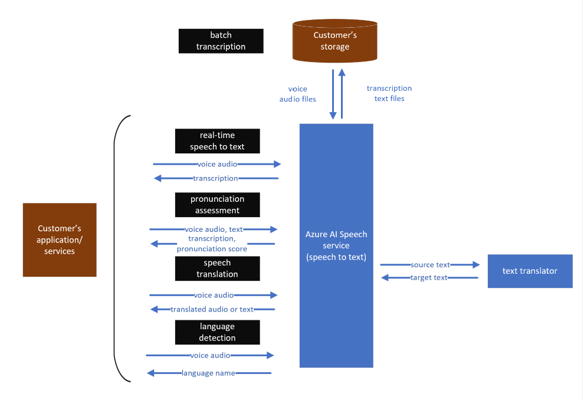

# Data and Privacy for Speech to text

[!INCLUDE [non-english-translation](../../includes/non-english-translation.md)]

> [!NOTE]
> This article is provided for informational purposes only and not for the purpose of providing legal advice. We strongly recommend seeking specialist legal advice when implementing Speech Services.

This article provides some high-level details regarding how speech to text processes data provided by customers. Note that audio data of humans speaking and the related text transcripts may be considered personal data and/or sensitive data under various privacy regulations and laws because it contains not only the voice of humans, but the content of the audio may also contain personal information depending on the context within which the audio was collected. Audio data and the related text transcripts may also be regulated under various communications laws or other law and regulations. As an important reminder, you are responsible for the implementation of this technology and are required to obtain all necessary permissions for processing of the data, as well as any licenses, permissions or other proprietary rights required for the content you input into the speech to text service. It is your responsibility to comply with all applicable laws and regulations in your jurisdiction.

## What data does speech to text process?

Speech to text processes the following types of data:

- **Audio input or voice audio:**  All speech to text features accept voice audio as an input that is streamed through the Speech SDK/REST API into the service endpoint. In batch transcription, audio input will be sent to a storage location instructed by the customer, and the Speech service accesses and processes the audio input for the purposes of providing the transcription services requested. See more information about how to specify storage in [How to use batch transcription](/azure/cognitive-services/speech-service/batch-transcription).
- **Input transcription text:**  In the pronunciation assessment, transcribed text is sent together with an input voice audio as "correct" text. Pronunciations are assessed based on the input transcriptions.
- **Transcription for speech translation:**  When the speech translation feature is used, transcribed text that speech to text generated is translated into a specified language through the [Translator service](/azure/cognitive-services/translator/translator-info-overview).

The text translation service is used only to convert text from one language to another. No input/output data is retained by Speech service after the completion of a translation request. See [What is the Translator service](/azure/cognitive-services/translator/translator-info-overview) for more information about the text translation service.

If users need transcribed/translated text in an audio format, the feature sends the output text to [text to speech](/azure/cognitive-services/speech-service/text-to-speech). Again, no data is persisted in the text to speech data processing.

## How does speech to text process data?

### Real-time speech to text

When a client application sends audio input to speech to text, the speech recognition engine parses audio and converts it to text. Relying upon its acoustic and linguistic or language understanding features, speech to text selects candidate words and phrases that may be uttered in the audio input. The transcription output represents the best inference or prediction in text format of what was spoken in the audio input.

For real-time speech to text, audio input is processed only on the Azure's server memory, and no data is stored at rest. All data in-transit are encrypted for protection. See [Trusted Cloud: security, privacy, compliance, resiliency, and IP](https://azure.microsoft.com/blog/trusted-cloud-security-privacy-compliance-resiliency-and-ip/) for more information about Azure-wide security and privacy protection.

### Batch transcription

In batch transcription, customers specify their chosen storage location of both audio input and output transcription text files for Speech service to access, process, and provide the transcription output. The customer controls the storage of this data, including the retention of such data. Customers may set a retention time for generated transcription text files by using a parameter called "timeToLive". See [Batch Transcription -- Configuration Properties](/azure/cognitive-services/speech-service/batch-transcription#configuration-properties) for more detail.

See the data flows for each Speech to text feature: 

### Speaker diarization/separation

This feature is available for both real-time and batch API. When customers enable the speaker separation (diarization) option (disabled by default), the speech to text engine analyzes and extracts unique voice characteristics signals from the audio input to differentiate the audio between speakers. These voice characteristics signals are used and temporarily retained for the sole purpose of annotating the transcription output with markers next to text for Speaker 1 (Guest-1) or Speaker 2 (Guest-2). Upon completion of the process, all signal data used to separate the speakers is discarded. The speaker separation feature supports the separation of two or more speakers in a single audio file. Speaker Separation does not support speaker identity recognition enrollment or the ability to track unique speakers across multiple audio files.

### Language detection

Language detection is similar to speech recognition except that the model calculates probabilities of mapping between phonemes and languages. Each language has specific phonemes and phoneme combinations, which characterize the language. The language detection model identifies the characteristics in phonemes to calculate likelihood of languages used in an input voice.

### Speech translation

When speech translation is used, first, an audio input is used to generate machine-transcribed text with speech to text. Then the machine-transcribed text is sent to the text translation service to convert the text (in the source language) to another language. If customers need translated text in an audio format, this feature can send the translated text to [text to speech](/azure/cognitive-services/speech-service/text-to-speech). Customers have the option to produce translated text only or translated voice output.

### Speech containers

With speech containers, customers deploy Speech services APIs to their own environment through Docker containers. Since all speech components run on customers' controlled environment, audio data inputs and transcription outputs are processed within customers' container and is not sent to the cloud based Speech service. See [Install and run Docker containers for the Speech service APIs](/azure/cognitive-services/speech-service/speech-container-howto?tabs=stt%2Ccsharp%2Csimple-format) for more information.

### Security for customers' data in speech container

The security of customer data is a shared responsibility. Details on the security model of Azure AI containers, like the speech container can be found in [Foundry Tools container security](/azure/cognitive-services/cognitive-services-container-support?tabs=luis#azure-cognitive-services-container-security).

You are responsible for securing and maintaining the equipment and infrastructure required to operate speech containers located on your premises, such as your edge device and network.

To learn more about Microsoft's privacy and security commitments visit [the Microsoft Trust Center](https://www.microsoft.com/TrustCenter/CloudServices/Azure/default.aspx).

## Data storage and retention

### No data trace

When doing real-time speech to text, fast transcription, pronunciation assessment, and speech translation, Microsoft does not retain or store the data provided by customers. In batch transcription, customers specify their own storage locations to send the audio input. Generated transcription text may be stored either in customer's own storage or Microsoft storage if no storage is specified. If output transcriptions are stored in Microsoft storage, customers may delete the data either by calling a deletion API or setting the timeToLive parameter to automatically delete the data in a specified time. See more details in [How to use batch transcription - Speech service - Foundry Tools](/azure/cognitive-services/speech-service/batch-transcription).

To learn more about Microsoft's privacy and security commitments visit the Microsoft [Trust Center](https://www.microsoft.com/TrustCenter/CloudServices/Azure/default.aspx).
