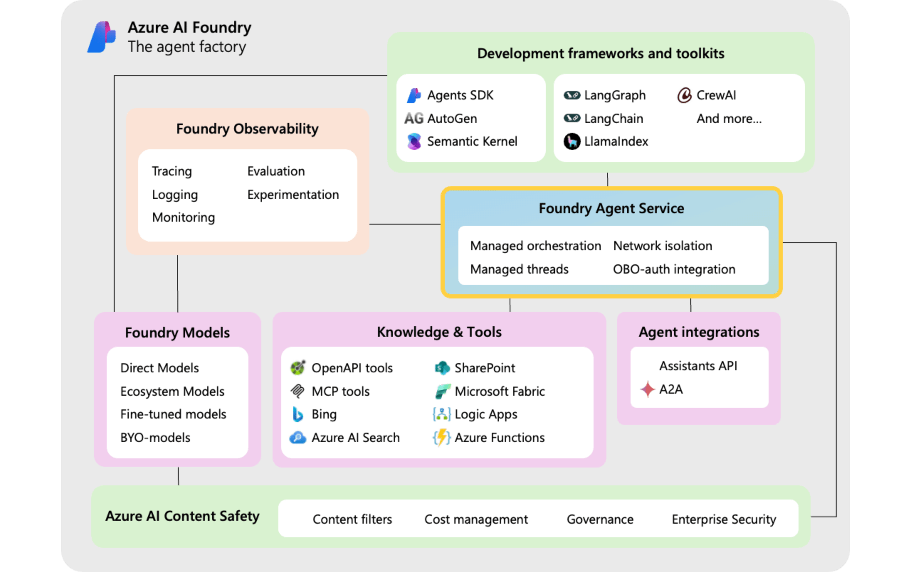
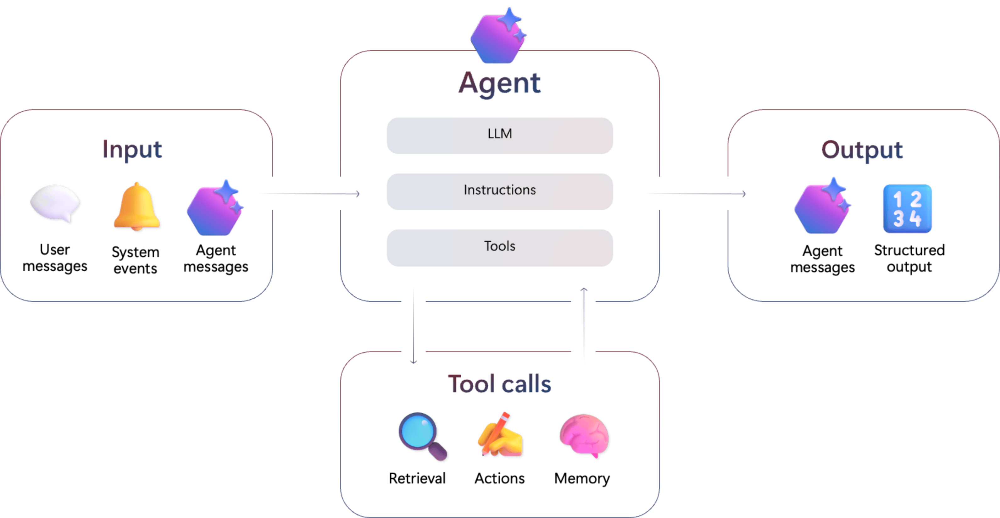
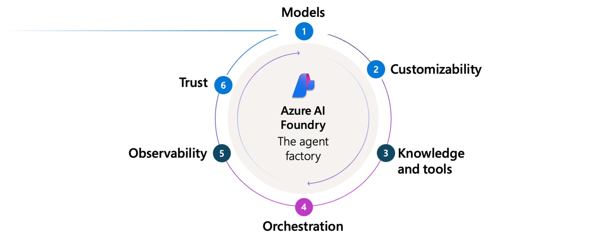

# What is Azure AI Foundry Agent Service?

Most businesses don’t want chatbots—they want automation. They want more work done with fewer errors, faster, and at lower cost. That might mean summarizing documents, processing invoices, managing support tickets, or publishing blog posts. In all cases, the goal is the same: free people to focus on higher-value work by offloading repetitive and predictable tasks.

Large language models (LLMs) opened the door to a new kind of automation—systems that could understand unstructured data, make decisions, and generate content. But in practice, most companies have struggled to move beyond demos. LLMs drift, hallucinate, and lack accountability. Without visibility, policy enforcement, and orchestration, these models are difficult to trust in real business workflows.

:::row:::
    :::column span="1":::
**Azure AI Foundry** is designed to change that. It’s the Agent Factory: a platform that combines models, tools, frameworks, and governance into a unified system for building intelligent agents. At the center of this system is **Azure AI Foundry Agent Service**—the glue that operationalizes agents across development, deployment, and production.
    :::column-end:::
    :::column span="3":::

    :::column-end:::
:::row-end:::

Foundry Agent Service connects the core pieces of Azure AI Foundry—models, tools, and frameworks—into a single runtime. It manages threads, orchestrates tool calls, enforces content safety, and integrates with identity, networking, and observability systems to ensure agents are secure, scalable, and production-ready.

By abstracting away infrastructure complexity and enforcing trust and safety by design, Foundry Agent Service makes it easy to move from prototype to production with confidence.

## What is an AI Agent?

Agents make decisions, invoke tools, and participate in workflows—sometimes independently, sometimes in collaboration with other agents or humans. What sets agents apart from assistants is autonomy: assistants support people, agents complete goals. They are foundational to real process automation.

Agents created using Foundry are not monoliths. They are composable units—each with a specific role, powered by the right model, equipped with the right tools, and deployed within a secure, observable, and governable runtime.

Each agent has three core components:
- **Model (LLM)**: Powers reasoning and language understanding
- **Instructions**: Define the agent’s goals, behavior, and constraints
- **Tools**: Let the agent retrieve knowledge or take action

Agents receive unstructured inputs—such as user prompts, alerts, or messages from other agents—and produce outputs in the form of tool results or messages. Along the way, they may call tools to perform retrieval, trigger actions, or (in the future) access scoped memory.

## How does the Agent Factory work?

Think of Azure AI Foundry as an assembly line for intelligent agents. Like any modern factory, it brings together different specialized stations—each responsible for shaping part of the final product. Instead of machines and conveyor belts, the Agent Factory uses models, tools, policies, and orchestration to build agents that are secure, testable, and production-ready. Here’s how the factory works—step by step:

:::row:::
    :::column span="1":::
### 1. Models

The assembly line starts by selecting a model that gives your agent its intelligence. Choose from a growing catalog of large language models including GPT-4o, GPT-4, GPT-3.5 (Azure OpenAI), and open models like Llama 3, Mistral, and Cohere. This is the reasoning core of the agent—the engine that powers its decisions.
    :::column-end:::
    :::column span="1":::
### 2. Customization

Next, shape that model to fit your use case. Customize your agent with fine-tuning, distillation, or domain-specific prompts. This step allows you to encode agent behavior, role-specific knowledge, and patterns from prior performance—using data captured from real thread content and tool results.
    :::column-end:::
    :::column span="1":::
### 3. AI Tools

Then, equip your agent with tools. These let it access enterprise knowledge (e.g. Bing, SharePoint, Azure AI Search) and take real-world actions (via Logic Apps, Azure Functions, OpenAPI, and more). Think of this step as installing the arms and sensors on a robotic worker—so the agent can perceive and interact with its environment.
    :::column-end:::
:::row-end:::

:::row:::
    :::column span="1":::
### 4. Orchestration

Once the agent has a brain and hands, it needs coordination. This is where the **Azure AI Foundry Agent Service** comes in. It orchestrates the full lifecycle—handling tool calls, updating thread state, managing retries, and logging outputs. All of this happens server-side, automatically. No custom glue code needed.

    :::column-end:::
    :::column span="1":::
### 5. Trust

Before leaving the factory floor, each agent is checked for safety and compliance. Azure AI Foundry applies enterprise-grade trust features including identity via Microsoft Entra, RBAC, content filters, encryption, and network isolation. You choose how and where your agents run—using platform-managed or bring-your-own infrastructure.
    :::column-end:::
    :::column span="1":::
### 6. Observability

Finally, agents are tested and monitored. The factory captures logs, traces, and evaluations at every step. With full thread-level visibility and Application Insights integration, teams can inspect every decision and continuously improve agents over time.
    :::column-end:::
:::row-end:::

The result? An agent that’s ready for production—reliable, extensible, and safe to deploy across your most critical workflows.

## Why Use Azure AI Foundry Agent Service?

Azure AI Foundry Agent Service provides a production-ready foundation for deploying intelligent agents in enterprise environments. Here's how it compares across key capabilities:

| Capability | Azure AI Foundry Agent Service | 
|------------|--------------------------------|
| **1. Visibility into conversations** | Full access to structured [threads](./concepts/threads-runs-messages.md#threads), including both user↔agent and agent↔agent messages—ideal for UIs, debugging, and training |
| **2. Multi-agent coordination** | Built-in support for agent-to-agent messaging using structured protocols like A2A |
| **3. Tool orchestration** | Server-side execution and retry of [tool calls](./how-to/tools/overview.md) with structured logging—no manual orchestration required |
| **4. Trust and safety** | Integrated [content filters](../openai/how-to/content-filters.md) help prevent misuse and mitigate prompt injection risks (XPIA); all outputs are policy-governed |
| **5. Enterprise integration** | Bring your own [storage](./how-to/use-your-own-resources.md#use-an-existing-azure-cosmos-db-for-nosql-account-for-thread-storage), [Azure AI Search index](./how-to/use-your-own-resources.md#use-an-existing-azure-ai-search-resource), and [virtual network](./how-to/virtual-networks.md) to meet compliance needs |
| **6. Deployment flexibility** | Supports multiple API heads including Assistants API and A2A; SDK-neutral, protocol-aligned |
| **7. Observability and debugging** | Threads, tool invocations, and message traces are [fully inspectable](./concepts/tracing.md); [Application Insights integration](./how-to/metrics.md) for telemetry |
| **8. Identity and policy control** | Built on Microsoft Entra with full support for RBAC, audit logs, and enterprise conditional access |

## Get started with Azure AI Foundry Agent Service

To get started with Azure AI Agent Service, you need to create an Azure AI Foundry project in your Azure subscription. 

Start with the [quickstart](./quickstart.md) guide if it's your first time using the service.
1. You can create a project with the required resources. 
1. After you create a project, you can deploy a compatible model such as GPT-4o.
1. When you have a deployed model, you can also start making API calls to the service using the SDKs.

## Next steps

Learn more about the [models that power agents](./concepts/model-region-support.md).