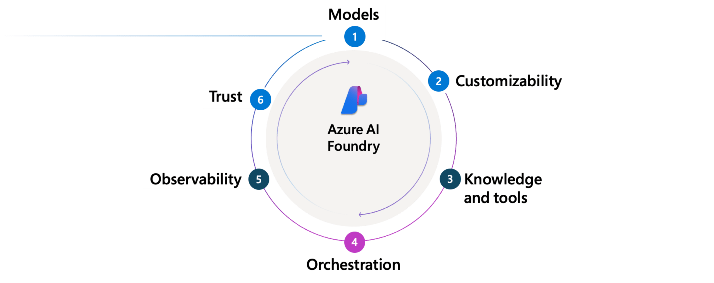

# What is Azure AI Foundry Agent Service?

Most businesses don’t want chatbots—they want automation. They want more work done with fewer errors, faster, and at lower cost. That might mean summarizing documents, processing invoices, managing support tickets, or publishing blog posts. In all cases, the goal is the same: free people to focus on higher-value work by offloading repetitive and predictable tasks.

Large language models (LLMs) opened the door to a new kind of automation—systems that could understand unstructured data, make decisions, and generate content. But in practice, most companies have struggled to move beyond demos. LLMs drift, hallucinate, and lack accountability. Without visibility, policy enforcement, and orchestration, these models are difficult to trust in real business workflows.

**Azure AI Foundry** is designed to change that. It’s the Agent Factory: a platform for composing, customizing, and orchestrating intelligent agents. **Azure AI Foundry Agent Service** is the managed runtime that powers those agents in production—providing identity, state management, orchestration, and security as first-class capabilities.

Agents built in Foundry behave like smart microservices. They interpret requests, reason about context, call tools, and return results—all while maintaining structured interaction history and logging each decision. Agent Service runs this lifecycle entirely server-side, allowing you to build systems that are observable, governable, and secure by design.

## What is an AI Agent?

An AI agent is a system that responds to input—whether from a user, another agent, or a system event—and takes purposeful action toward a goal. Unlike traditional automation systems, agents can interpret unstructured input—like natural language—and decide how to respond using models, instructions, and tools.

Each agent has three core components:
- **Model (LLM)**: Powers reasoning and language understanding
- **Instructions**: Define the agent’s goals, behavior, and constraints
- **Tools**: Let the agent retrieve knowledge or take action

Agents receive unstructured inputs—such as user prompts, alerts, or messages from other agents—and produce outputs in the form of tool results or messages. Along the way, they may call tools to perform retrieval, trigger actions, or (in the future) access scoped memory.

## Why Use Azure AI Foundry Agent Service?

Azure AI Foundry Agent Service provides a production-ready foundation for deploying intelligent agents in enterprise environments. Here's how it compares across key capabilities:

| Capability | Azure AI Foundry Agent Service | 
|------------|--------------------------------|
| **Visibility into conversations** | Full access to structured [threads](./concepts/threads-runs-messages.md#threads), including both user↔agent and agent↔agent messages—ideal for UIs, debugging, and training |
| **Multi-agent coordination** | Built-in support for agent-to-agent messaging using structured protocols like A2A |
| **Tool orchestration** | Server-side execution and retry of [tool calls](./how-to/tools/overview.md) with structured logging—no manual orchestration required |
| **Trust and safety** | Integrated [content filters](../openai/how-to/content-filters.md) help prevent misuse and mitigate prompt injection risks (XPIA); all outputs are policy-governed |
| **Enterprise integration** | Bring your own [storage](./how-to/use-your-own-resources.md#use-an-existing-azure-cosmos-db-for-nosql-account-for-thread-storage), [Azure AI Search index](./how-to/use-your-own-resources.md#use-an-existing-azure-ai-search-resource), and [virtual network](./how-to/virtual-networks.md) to meet compliance needs |
| **Deployment flexibility** | Supports multiple API heads including Assistants API and A2A; SDK-neutral, protocol-aligned |
| **Observability and debugging** | Threads, tool invocations, and message traces are [fully inspectable](./concepts/tracing.md); [Application Insights integration](./how-to/metrics.md) for telemetry |
| **Identity and policy control** | Built on Microsoft Entra with full support for RBAC, audit logs, and enterprise conditional access |

## The Agent Factory: Six Capabilities for Enterprise-Ready Agents

Azure AI Foundry provides the building blocks to create trustworthy, production-grade agents:

### 1. **Models**  
Choose from a growing catalog of LLMs, including GPT-4o, GPT-4, GPT-3.5 (Azure OpenAI), and open models like Llama 3, Mistral, and Cohere. Bring-your-own model endpoints are also supported for advanced customization.

### 2. **Customization**  
Fine-tune or distill models using the data generated by your agents, including tool calls, structured thread content, and evaluation outcomes. Foundry supports the full lifecycle of agent learning—from authoring to improvement.

### 3. **Knowledge and Tools**  
Enable agents to take real-world action with tools such as SharePoint search, Azure AI Search, Bing, OpenAPI endpoints, Azure Functions, Logic Apps, and even other agents. Tools act as the agent’s capabilities—grounding its responses and enabling automation.

### 4. **Orchestration**  
Foundry automates the full tool calling lifecycle: invoking tools, updating thread state, logging responses, and managing retries—all server-side. This removes the need to build or operate your own orchestration infrastructure.

### 5. **Trust**  
Foundry includes enterprise-grade trust features: identity management through Microsoft Entra, support for RBAC, content filtering, encryption, and secure networking. You can bring your own storage, index, or virtual network as needed.

### 6. **Observability**  
Foundry exposes structured telemetry across threads, tools, and messages. Application Insights integration allows you to trace behavior, monitor health, and run evaluations to continuously improve agent performance.

## Get started with Azure AI Foundry Agent Service

To get started with Azure AI Agent Service, you need to create an Azure AI Foundry project in your Azure subscription. 

Start with the [quickstart](./quickstart.md) guide if it's your first time using the service.
1. You can create a project with the required resources. 
1. After you create a project, you can deploy a compatible model such as GPT-4o.
1. When you have a deployed model, you can also start making API calls to the service using the SDKs.

## Next steps

Learn more about the [models that power agents](./concepts/model-region-support.md).