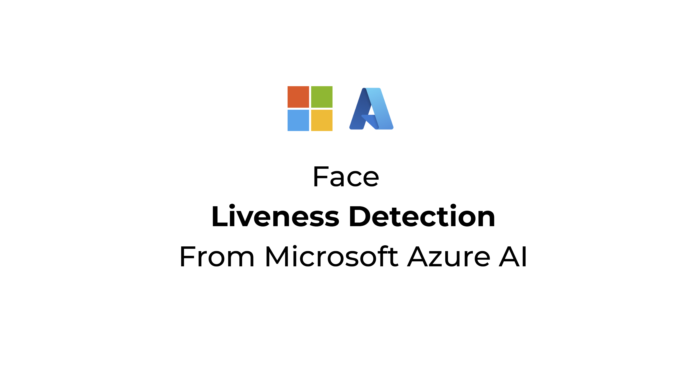

# Face liveness detection

This article explains the concept of Face liveness detection, its input and output schema, and related concepts.

## Introduction

Face Liveness detection is used to determine if a face in an input video stream is real (live) or fake (spoofed). It's an important building block in a biometric authentication system to prevent imposters from gaining access to the system using a photograph, video, mask, or other means to impersonate another person.

The goal of liveness detection is to ensure that the system is interacting with a physically present, live person at the time of authentication. These systems are increasingly important with the rise of digital finance, remote access control, and online identity verification processes.

The Azure AI Face liveness detection solution successfully defends against various spoof types ranging from paper printouts, 2D/3D masks, and spoof presentations on phones and laptops. Liveness detection is an active area of research, with continuous improvements being made to counteract increasingly sophisticated spoofing attacks. Continuous improvements are rolled out to the client and the service components over time as the overall solution gets more robust to new types of attacks.

The Azure AI Face liveness detection API achieved a 0% penetration rate in [iBeta Level 1 and Level 2 Presentation Attack Detection (PAD) tests](https://servicetrust.microsoft.com/DocumentPage/ea3fa18f-3940-4c0b-aa96-41cb50898aee), conducted by a NIST/NVLAP-accredited laboratory and conformant to the [ISO/IEC 30107-3 PAD international standard](https://www.iso.org/standard/79520.html).

## How it works

The liveness solution integration involves two distinct components: a frontend mobile/web application and an app server/orchestrator.

:::image type="content" source="./media/liveness/liveness-diagram.jpg" alt-text="Diagram of the liveness workflow in Azure AI Face." lightbox="./media/liveness/liveness-diagram.jpg":::

- **Orchestrate Foundry Tool in app server**: The app server serves as a backend server to create liveness detection sessions and obtain a short-lived authorization token from the Face service for a particular session. This token authorizes the frontend application to perform liveness detection. The app server's objectives are to manage the sessions, grant authorization for frontend application, and view the results of the liveness detection process.
- **Integrate Azure Vision SDK into frontend application**: The frontend application should embed the Azure Vision Face SDK (iOS, Android, or JavaScript). The SDK opens the camera, guides the user through the passive or passive-active flow, encrypts video frames, and streams them—together with the short-lived liveness-session token received from your server—directly to the Azure AI Face endpoint. 
- **Optional quick link path**: It is possible to avoid embedding the client SDK. The backend service can swap the same session token for a one-time Liveness Quick Link (`https://liveness.face.azure.com/?s=…`). Redirect the user to that URL, and Azure hosts the entire capture experience in the browser, then notices the completion through optional callback. This option lowers integration cost and automatically keeps you on Azure’s always-up-to-date experience.

## Liveness detection modes

Azure Face liveness detection API includes options for both Passive and Passive-Active detection modes.

The **Passive mode** utilizes a passive liveness technique that requires no extra actions from the user. It requires a non-bright lighting environment to succeed and might fail in bright lighting environments with an "Environment not supported" error. It also requires high screen brightness for optimal performance which is configured automatically in the Mobile (iOS and Android) solutions. This mode can be chosen if you prefer minimal end-user interaction and expect end-users to primarily be in non-bright environments. A Passive mode check takes around 12 seconds on an average to complete.

The **Passive-Active mode** behaves the same as the Passive mode in non-bright lighting environments and only trigger the Active mode in bright lighting environments. This mode is preferable on Web browser solutions due to the lack of automatic screen brightness control available on browsers which hinders the Passive mode's operational envelope. This mode can be chosen if you want the liveness-check to work in any lighting environment. If the Active check is triggered due to a bright lighting environment, then the total completion time may take up to 20 seconds on average.

You can set the detection mode during the session creation step (see [Perform liveness detection](./tutorials/liveness.md#perform-liveness-detection)).

## Optional face verification

You can combine face verification with liveness detection to verify that the face in question belongs to the particular person designated. The following table describes details of the liveness detection features:

| Feature | Description |
| -- |--|
| Liveness detection | Determine an input is real or fake, and only the app server has the authority to start the liveness check and query the result. |
| Liveness detection with face verification | Determine an input is real or fake and verify the identity of the person based on a reference image you provided. Either the app server or the frontend application can provide a reference image. Only the app server has the authority to initial the liveness check and query the result. |

## Output format

The liveness detection API returns a JSON object with the following information:
- A Real or a Spoof Face Liveness Decision. We handle the underlying accuracy and thresholding, so you don’t have to worry about interpreting “confidence scores” or making inferences yourself. This makes integration easier and more seamless for developers.
- Optionally a Face Verification result can be obtained if the liveness check is performed with verification (see [Perform liveness detection with face verification](./tutorials/liveness.md#perform-liveness-detection-with-face-verification)).
- A quality filtered "session-image" that can be used to store for auditing purposes or for human review or to perform further analysis using the Face service APIs.

## Data privacy

We do not store any images or videos from the Face Liveness Check. No image/video data is stored in the liveness service after the liveness session has been concluded. Moreover, the image/video uploaded during the liveness check is only used to perform the liveness classification to determine if the user is real or a spoof (and optionally to perform a match against a reference image in the liveness-with-verify-scenario), and it cannot be viewed by any human and will not be used for any AI model improvements.

## Security

> [!IMPORTANT]
> It is important for developers to be aware of the security implications when choosing the right solution — either Web or Mobile. While both the Web and Mobile solutions conform to iBeta Level 1 and Level 2 ISO/IEC 30107-3 PAD standards, the Mobile solution includes additional Runtime Application Self-Protections (RASP) provided by [GuardSquare](https://www.guardsquare.com/blog/why-guardsquare), which are not available in the Web solution.  
> Notably, the Web solution has limitations inherent to running in browser environments and may be more vulnerable to certain types of attacks. So we recommend using the Mobile solution whenever possible.  
> If you do choose the Web solution, it is critical that you closely follow the [shared-responsibility best practices](./liveness-detection-shared-responsibility.md), ensure that the camera in use is a trusted physical device, and consider implementing additional safeguards and monitoring to mitigate potential runtime attacks. 

## Abuse Detection

We include built-in abuse detection capabilities designed to help developers identify liveness sessions that may present a high risk of fraudulent or malicious activity. The abuse detection feature performs multiple checks, including IP-based risk assessments, to provide actionable signals you can use in your own application logic or review workflows.

This feature is particularly useful in high-security environments or scenarios with elevated fraud risk (e.g., account onboarding, identity verification, or remote authentication). It allows you to proactively detect suspicious activity patterns before completing verification steps.

For detailed guidance on how to interpret and act on abuse detection results, see:
[Liveness Abuse Monitoring](./concept-liveness-abuse-monitoring.md)

## Network isolation

Optionally, we allow network isolation capabilities to give developers more control over how liveness detection calls are made from front-end clients. With this option, you can disable public network access entirely for Liveness Detection API calls, ensuring they are only accessible within your defined private network boundaries.

This capability is especially valuable in regulated or enterprise environments where compliance policies require all service calls to remain within a controlled network perimeter. It also helps reduce the attack surface by preventing direct calls from untrusted or unknown networks. [Learn more](./how-to/liveness-use-network-isolation.md)

## Support options

In addition to using the main [Foundry Tools support options](../cognitive-services-support-options.md), you can also post your questions in the [issues](https://github.com/Azure-Samples/azure-ai-vision-sdk/issues) section of the SDK repo. 

## Next step

Now that you're familiar with liveness detection concepts, implement liveness detection in your app.

> [!div class="nextstepaction"]
> [Face liveness detection](./tutorials/liveness.md)
