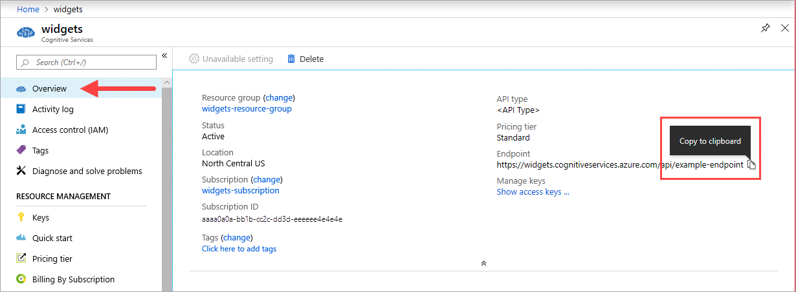

## Gather required parameters

Three primary parameters for all Azure AI containers are required. The Microsoft Software License Terms must be present with a value of **accept**. An Endpoint URI and API key are also needed.

### Endpoint URI

The `{ENDPOINT_URI}` value is available on the Azure portal **Overview** page of the corresponding Foundry Tools resource. Go to the **Overview** page, hover over the endpoint, and a **Copy to clipboard**  icon appears. Copy and use the endpoint where needed.

### Keys

The `{API_KEY}` value is used to start the container and is available on the Azure portal's **Keys** page of the corresponding Foundry Tools resource. Go to the **Keys** page, and select the **Copy to clipboard**  icon.

> [!IMPORTANT]
> These subscription keys are used to access your Foundry Tools API. Don't share your keys. Store them securely. For example, use Azure Key Vault. We also recommend that you regenerate these keys regularly. Only one key is necessary to make an API call. When you regenerate the first key, you can use the second key for continued access to the service.
