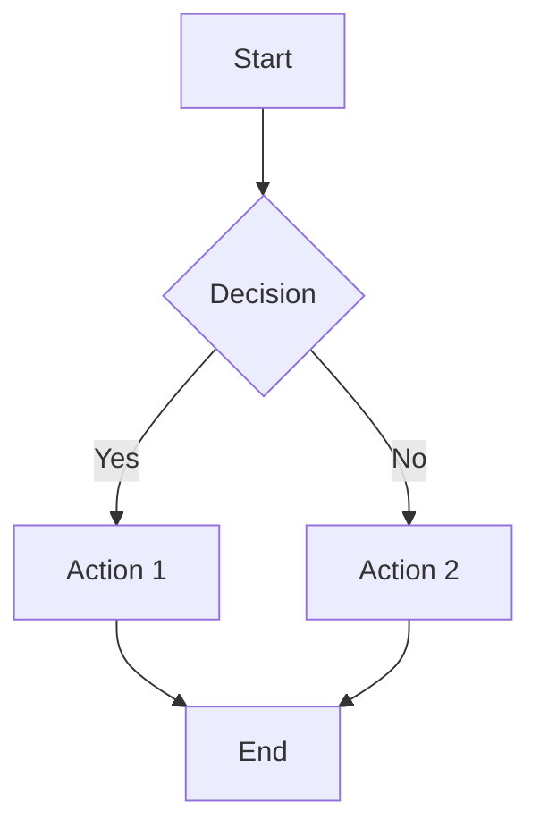

# Document analysis: Markdown representation

Azure Content Understanding in Foundry Tools converts unstructured documents into [GitHub Flavored Markdown](https://github.github.com/gfm), while maintaining content and layout for accurate downstream use. This article describes how each content and layout element is represented in Markdown.

## Words and selection marks

Recognized words and detected selection marks are represented in Markdown as plain text. Selection marks are encoded by using the Unicode characters `☒` (selected) and `☐` (cleared). Content might be escaped to avoid ambiguity with Markdown formatting syntax.

## Barcodes

Barcodes are represented as Markdown images with alt text and title: ``.

| Content type | Markdown pattern | Example |
| --- | --- | --- |
| Barcode | `` | `` |

## Formulas

Mathematical formulas are encoded by using LaTeX in Markdown:

* Inline formulas are enclosed in single dollar signs (`$...$`) to maintain text flow.
* Display formulas use double dollar signs (`$$...$$`) for standalone display.
* Multiline formulas are represented as consecutive display formulas without intervening empty lines. This structure preserves mathematical relationships.

| Formula kind | Markdown | Visualization |
| --- | --- | --- |
| Inline | `$\sqrt { -1 } $ is $i$` | $\sqrt { -1 } $ is $i$
| Display | `$$a^2 + b^2 = c^2$$` | $a^2 + b^2 = c^2$ |
| Multiline | `$$( x + 2 ) ^ 2 = x ^ 2 + 4 x + 4$$`<br/>`$$= x ( x + 4 ) + 4$$` | $$( x + 2 ) ^ 2 = x ^ 2 + 4 x + 4$$ $$= x ( x + 4 ) + 4$$ |

## Images

Detected images, including figures and charts, are represented using standard Markdown image syntax. The alt text contains the detected text inside the figure, and the syntax varies based on configuration options.

### Image representation patterns

| Configuration | Markdown pattern | Description |
| --- | --- | --- |
| Basic | `` | Standard image without description |
| enableFigureDescription | `` | Includes generated image description |
| enableFigureDescription + enableFigureAnalysis | `` followed by a chart, markdown table, or mermaid diagram | Image with description and appended figure analysis (chart, table, or diagram) |
| enableFigureAnalysis only | `` followed by a chart, markdown table, or mermaid diagram | Image without description and appended figure analysis (chart, table, or diagram) |
 

### Examples

#### Image without enableFigureDescription

``` md

```

#### Image with enableFigureDescription

``` md

```

#### Image with enableFigureDescription and enableFigureAnalysis

``` md

```

##### Option 1: Chart figure analysis
```chart
{ ...chart config... }
```

###### Option 2: Markdown table figure analysis
```markdown
| Month | Value |
|-------|-------|
| Jan   | 100   |
| Feb   | 150   |
| Mar   | 200   |
| Apr   | 250   |
| May   | 300   |
| Jun   | 275   |
```

#### Image without enableFigureDescription and enableFigureAnalysis

``` md


```mermaid
{ ...mermaid diagram... }
```

## Figure analysis

Charts and diagrams detected in documents are represented as structured figure content with specialized rendering formats.

### Charts

Charts are represented in figure content using Chart.js syntax in JSON format. Depending on the `config.chartFormat` setting (`chartJs` or `markdown`), charts can be represented as Chart.js code blocks or Markdown tables.

#### Chart.js format (chartFormat=chartJs)

``` chart
{
  "type": "bar",
  "data": {
    "labels": ["Jan", "Feb", "Mar", "Apr", "May", "Jun"],
    "datasets": [{
      "label": "Values",
      "data": [100, 150, 200, 250, 300, 275],
      "backgroundColor": "rgba(54, 162, 235, 0.2)",
      "borderColor": "rgba(54, 162, 235, 1)",
      "borderWidth": 1
    }]
  },
  "options": {
    "scales": {
      "y": {
        "beginAtZero": true
      }
    }
  }
}
```

#### Markdown table format (chartFormat=markdown)

| Month | Values |
| --- | --- |
| Jan | 100 |
| Feb | 150 |
| Mar | 200 |
| Apr | 250 |
| May | 300 |
| Jun | 275 |

### Diagrams

Diagrams are represented in figure content using Mermaid syntax and rendered as Mermaid code blocks in Markdown.



### Rendering support

Popular Markdown extensions and viewers support visual rendering of both Chart.js and Mermaid code blocks:

- **Chart.js**: Renders interactive charts and graphs
- **Mermaid**: Renders flowcharts, sequence diagrams, and other diagram types
- Most modern Markdown processors include plugins for both formats

## Lines and paragraphs

Paragraphs are represented in Markdown as a block of text separated by blank lines. When lines are available, each document line maps to a separate line in the Markdown.

## Sections

Paragraphs with a title or section heading roles are converted into Markdown headings. The title, if any, is assigned with the level-1 heading. The heading levels of all other sections are assigned to preserve the detected hierarchical structure.

## Tables

Tables are currently represented in Markdown by using HTML table markup (`<table>`, `<tr>`, `<th>`, and `<td>`) to enable support for merged cells via `rowspan` and `colspan` attributes and rich headers via `<th>`. Any caption is represented via a `<caption>` element. Any associated footnotes appear as text immediately after the table.

:::row:::
:::column:::

```markdown
<table>
<caption>Table 1. Example</caption>
<tr><th>Header A</th><th>Header B</th></tr>
<tr><td>Cell 1A</td><td>Cell 1B</td></tr>
<tr><td>Cell 2A</td><td>Cell 2B</td></tr>
</table>
This is a footnote.
```

:::column-end:::
:::column:::


<table>
<caption>Table 1. Example</caption>
<tr><th>Header A</th><th>Header B</th></tr>
<tr><td>Cell 1A</td><td>Cell 1B</td></tr>
<tr><td>Cell 2A</td><td>Cell 2B</td></tr>
</table>
This is a footnote.

:::column-end:::
:::row-end:::

## Page metadata

Markdown doesn't natively encode page metadata, such as page numbers, headers, footers, and breaks. Because this information might be useful for downstream applications, we encode such metadata as HTML comments.

| Metadata | Markdown |
| --- | --- |
| Page number | `<!-- PageNumber="1" -->` |
| Page header | `<!-- PageHeader="Header" -->` |
| Page footer | `<!-- PageFooter="Footer" -->` |
| Page break | `<!-- PageBreak -->` |

## Hyperlinks

Detected hyperlinks from digital content are represented using standard Markdown link syntax. The service preserves both the display text and the target URL from the original document.

| Link type | Markdown pattern | Example |
| --- | --- | --- |
| Standard link | `[display text](url)` | `[Visit Microsoft](https://www.microsoft.com)` |

### Examples

```markdown
For more information, visit the [Microsoft Foundry](https://aka.ms/ai-foundry) portal.

Contact our support team at [support@contoso.com](mailto:support@contoso.com "Email support").

See the [official documentation][docs] for detailed instructions.

[docs]: https://docs.microsoft.com
```

## Annotations

Document annotations such as highlights, underlines, and comments can be represented in Markdown using different formats controlled by the `annotationFormat` parameter.

### Annotation formats

| Format | Description | Use case |
| --- | --- | --- |
| `none` | No annotation information in Markdown | Full control over annotation representation |
| `frontMatter` | Annotations in YAML front matter with HTML spans | Simple RAG scenarios with full document context |
| `markdown` | Native Markdown annotation syntax | Standard Markdown compatibility |

### Format: none

When you set `annotationFormat=none`, the Markdown contains no annotation information. Set both `enableAnnotation` and `returnDetails` to `true` to extract annotations.

```markdown
This is the document content without any annotation markers.
Use the annotations JSON property to customize representation.
```

### Format: frontMatter (default)

Encodes annotations in YAML front matter with HTML spans containing `id` attributes that reference annotation details.

```markdown
---
fields:
  title: "Document Title"
annotations:
- id: underline-1
  author: Paul
  type: underline
  comments:
  - message: "Please review this section"
    author: Paul
    tags: "approved,👍3"
- id: highlight-2
  author: Sarah
  type: highlight
  comments:
  - message: "Important information"
    author: Sarah
---

This is <span id="underline-1">underlined text</span> in the document.

This section contains <span id="highlight-2">highlighted content</span> for emphasis.

<!-- Annotations without spans appear at page end -->
<span id="note-3" />
```

### Format: markdown

Uses native Markdown syntax for annotations when supported by the target Markdown processor.

```markdown
This text has ==highlighted content== for emphasis.

This text has ++underlined content++ for attention.

> **Note:** This is an annotation comment.
```

## Conclusion

The Content Understanding Markdown elements provide a powerful way to represent the structure and content of analyzed documents. When you understand and use these Markdown elements properly, you can enhance your document processing workflows. You can also build more sophisticated content extraction applications.

## Related content

* Try processing your document content by using [Content Understanding Studio](https://aka.ms/cu-studio).
* Check out the [Content Understanding Studio quickstart](../quickstart/content-understanding-studio.md).
* Learn to analyze document content using [analyzer templates](../concepts/analyzer-templates.md).
* Review code samples with [visual document search](https://github.com/Azure-Samples/azure-ai-search-with-content-understanding-python/blob/main/notebooks/search_with_visual_document.ipynb).
* Review the code sample [analyzer templates](https://github.com/Azure-Samples/azure-ai-content-understanding-python/tree/main/analyzer_templates).
