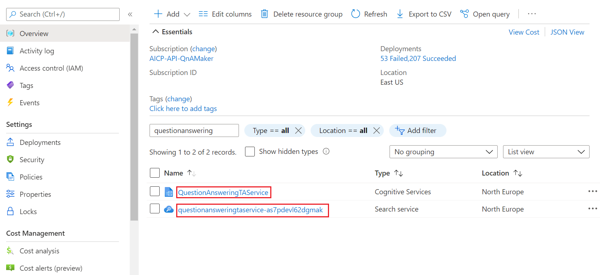
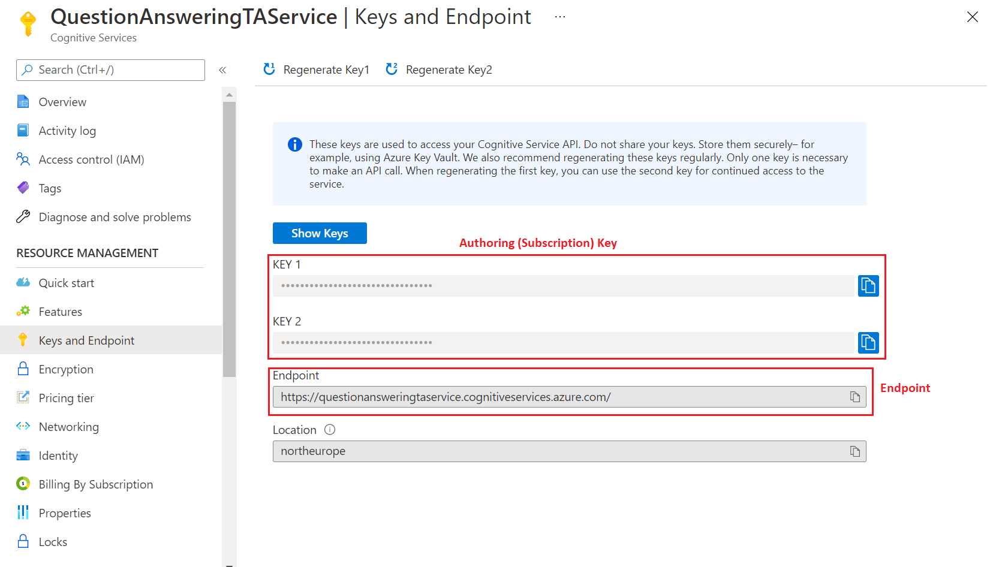

# Plan your custom question answering app

To plan your custom question answering app, you need to understand how custom question answering works and interacts with other Azure services. You should also have a solid grasp of project concepts.

## Azure resources

Each [Azure resource](#resource-purposes) created with custom question answering has a specific purpose. Each resource has its own purpose, limits, and [pricing tier](#pricing-tier-considerations). It's important to understand the function of these resources so that you can use that knowledge in your planning process.

| Resource | Purpose |
|--|--|
| [Language resource](#resource-purposes) resource | Authoring, query prediction endpoint, and telemetry|
| [Azure AI Search](#azure-ai-search-resource) resource | Data storage and search |

### Resource planning

Custom question answering throughput is currently capped at 10 text records per second for both management APIs and prediction APIs. To target 10 text records per second for your service, we recommend the S1 (one instance) SKU of Azure AI Search.

### Language resource

A single language resource with the custom question answering feature enabled can host more than one project. The number of projects is determined by the Azure AI Search pricing tier's quantity of supported indexes. Learn more about the [relationship of indexes to projects](#index-usage).

### Project size and throughput

When you build a real app, plan sufficient resources for the size of your project and your expected query prediction requests.

Project size control factors:
* [Azure AI Search resource](/azure/search/search-limits-quotas-capacity) pricing tier limits
* [Custom question answering limits](./limits.md)

The web app plan and web app control the project query prediction request. Refer to [recommended settings](#recommended-settings) to plan your pricing tier.

### Understand the impact of resource selection

Proper resource selection means your project answers query predictions successfully.

If your project isn't functioning properly, it's typically an issue of improper resource management.

Improper resource selection requires investigation to determine which [resource needs to change](#pricing-tier-considerations).

## Project

A project is directly tied its language resource. It holds the question and answer (QnA) pairs that are used to answer query prediction requests.

### Language considerations

You can now have projects in different languages within the same language resource where the custom question answering feature is enabled. When you create your first project, you can decide whether to set a single language for all future projects or to select a language each time you start a new one. This choice determines if the resource applies to projects in one language or allow for language selection with each new project.

### Ingest data sources

Custom question answering also supports unstructured content. You can upload a file that has unstructured content.

Currently we don't support URLs for unstructured content.

The ingestion process converts supported content types to markdown. All further editing of the *answer* is done with markdown. After you create a project, you can edit QnA pairs with rich text authoring.

### Data format considerations

Because the final format of a QnA pair is markdown, it's important to understand markdown support.

### Bot personality

Add a bot personality to your project with [chit-chat](../how-to/chit-chat.md). This personality comes through with answers provided in a certain conversational tone such as *professional* and *friendly*. This chit-chat is provided as a conversational set, which you have total control to add, edit, and remove.

A bot personality is recommended if your bot connects to your project. You can include chit-chat in your project even if you're connecting to other services. However, it's important to review how the bot service interacts with these integrations to ensure this approach fits your overall architectural design.

### Conversation flow with a project

Conversation flow usually begins with a salutation from a user, such as `Hi` or `Hello`. Your project can answer with a general answer, such as `Hi, how can I help you`, and it can also provide a selection of follow-up prompts to continue the conversation.

Design your conversational flow so that users always know how to interact with your bot and are never left without guidance. By including a loop or clear navigation, you ensure users aren't abandoned during the conversation. [Follow-up prompts](../tutorials/guided-conversations.md) provide linking between QnA pairs, which allow for the conversational flow.

### Authoring with collaborators

Collaborators may be other developers who share the full development stack of the project application or may be limited to just authoring the project.

Project authoring supports several role-based access permissions you apply in the Azure portal to limit the scope of a collaborator's abilities.

## Integration with client applications

Integration with client applications is accomplished by sending a query to the prediction runtime endpoint. A query is sent to your specific project with an SDK or REST-based request to your custom question answering web app endpoint.

To authenticate a client request correctly, the client application must send the correct credentials and project ID. If you're using an Azure AI Bot Service, configure these settings as part of the bot configuration in the Azure portal.

### Conversation flow in a client application

Conversation flow in a client application, such as an Azure bot, may require functionality before and after interacting with the project.

Does your client application support conversation flow, either by providing alternate means to handle follow-up prompts or including chit-chit? If so, design these features early and make sure the client application query is handled correctly via another service or when sent to your project.

### Active learning from a client application

Custom question answering uses _active learning_ to improve your project by suggesting alternate questions to an answer. The client application is responsible for a part of this [active learning](../tutorials/active-learning.md). Through conversational prompts, the client application can determine that the project returned an answer that's not useful to the user, and it can determine a better answer. The client application needs to send that information back to the project to improve the prediction quality.

### Providing a default answer

If your project doesn't find an answer, it returns the _default answer_. This answer is configurable on the **Settings** page.

This default answer is different from the Azure bot default answer. You configure the default answer for your Azure bot in the Azure portal as part of configuration settings. The default answer is then returned when the score threshold isn't met.

## Prediction

The prediction is the response from your project, and it includes more information than just the answer. To get a query prediction response, use the custom question answering API.

### Prediction score fluctuations

A score can change based on several factors:

* Number of answers you requested in response with the `top` property
* Variety of available alternate questions
* Filtering for metadata
* Query sent to `test` or `production` project.

### Analytics with Azure Monitor

In custom question answering, telemetry is offered through the [Azure Monitor service](/azure/azure-monitor/). Use our [top queries](../how-to/analytics.md) to understand your metrics.

## Development lifecycle

The development lifecycle of a project is ongoing: editing, testing, and publishing your project.

### Project development of question answer pairs

Your QnA pairs should be designed and developed based on your client application usage.

Each pair can contain:
* Metadata - filterable when querying to allow you to tag your QnA pairs with additional information about the source, content, format, and purpose of your data.
* Follow-up prompts - helps to determine a path through your project so the user arrives at the correct answer.
* Alternate questions - important to allow search to match to your answer from different  forms of the question. [Active learning suggestions](../tutorials/active-learning.md) turn into alternate questions.

### DevOps development

Developing a project to insert into a DevOps pipeline requires that the project is isolated during batch testing.

A project shares the Azure AI Search index with all other projects on the language resource. While the project is isolated via a partition, sharing the index can cause a difference in the score when compared to the published project.

To have the _same score_ on the `test` and `production` projects, isolate a language resource to a single project. In this architecture, the resource only needs to live as long as the isolated batch test.

## Azure resource details

Custom question answering uses several Azure sources, each with a different purpose. Understanding how they're used individually allows you to plan for and select the correct pricing tier or know when to change your pricing tier. Understanding how resources are used _in combination_ allows you to find and fix problems when they occur.

### Resource planning for development and production

> [!TIP]
> "Knowledge base" and "project" are equivalent terms in custom question answering and can be used interchangeably.

When you first develop a project, in the prototype phase, it's common to have a single resource for both testing and production.

When you move into the development phase of the project, consider:

* How many languages will your project hold?
* In how many regions do you need your project to be available?
* How many documents will your system hold in each domain?

### Pricing tier considerations

Typically, consider these three parameters:

* **The throughput you need**:

    * The throughput for custom question answering currently caps at 10 text records per second for both management APIs and prediction APIs.

    * The throughput cap should also influence your **Azure AI Search** selection. For more information, *see* [Azure AI Search](/azure/search/search-sku-tier). Additionally, you might need to adjust Azure AI Search [capacity](/azure/search/search-capacity-planning) with replicas.

* **Size and the number of projects**: Choose the appropriate [Azure search SKU](https://azure.microsoft.com/pricing/details/search/) for your scenario. Typically, you decide the number of projects you need based on the number of different subject domains. One subject domain (for a single language) should be in one project.

    With custom question answering, you have a choice to set up your language resource in a single language or multiple languages.

    > [!IMPORTANT]
    > You can publish N-1 projects  with a single language resource or N-2 projects with multiple language resources in a single tier. The `N` notation is the maximum indexes allowed in the tier.
    > Also, check the maximum size and the number of documents allowed per tier.

    For example, if your tier has 15 allowed indexes, you can publish 14 projects of the same language (one index per published project). The 15th index is used for all the projects for authoring and testing. If you choose to have projects in different languages, then you can only publish seven projects.

* **Number of documents as sources**: There are no limits to the number of documents you can add as sources in custom question answering.

The following table gives you some high-level guidelines.

|                            |Azure AI Search | Limitations                      |
| -------------------------- |------------ | -------------------------------- |
| **Experimentation**        |Free Tier    | Publish Up to 2-KBs, 50-MB size  |
| **Dev/Test Environment**   |Basic        | Publish Up to 14-KBs, 2-GB size    |
| **Production Environment** |Standard     | Publish Up to 49-KBs, 25-GB size |

### Recommended settings

The throughput for custom question answering is currently capped at 10 text records per second for both management APIs and prediction APIs. To target 10 text records per second for your service, use the S1 (one instance) tier of Azure AI Search.

### Keys in custom question answering

The custom question answering feature uses two kinds of keys: **authoring keys** and **Azure AI Search keys**. Use these keys to access the service in your subscription.

Use these keys when making requests to the service through APIs.

|Name|Location|Purpose|
|--|--|--|
|Authoring/Subscription key|[Azure portal](https://azure.microsoft.com/pricing/purchase-options/azure-account?cid=msft_learn)|These keys are used to access Azure Language APIs). These APIs let you edit the questions and answers in your project, and publish your project. These keys are created when you create a new resource.  Find these keys on the **Foundry Tools** resource on the **Keys and Endpoint** page.|
|Azure AI Search Admin Key|[Azure portal](/azure/search/search-security-api-keys)|These keys are used to communicate with the Azure AI Search service deployed in the user's Azure subscription. When you associate an Azure AI Search resource with the custom question answering feature, the admin key is automatically passed to custom question answering.   You can find these keys on the **Azure AI Search** resource on the **Keys** page.|

#### Find authoring keys in the Azure portal

You can view and reset your authoring keys from the Azure portal, where you added the custom question answering feature in your language resource.

1. Go to the language resource in the Azure portal and select the resource that has the *Foundry Tools* type:

    > [!div class="mx-imgBorder"]
    > 

2. Go to **Keys and Endpoint**:

    > [!div class="mx-imgBorder"]
    > 

#### Management service region

In custom question answering, both the management and the prediction services are colocated in the same region.

### Resource purposes

Each Azure resource created with custom question answering feature has a specific purpose:

* Language resource (Also referred to as a Text Analytics resource depending on the context of where you're evaluating the resource.)
* Azure AI Search resource

#### Language resource purpose

The language resource with custom question answering feature provides access to the authoring and publishing APIs, hosts the ranking runtime and provides telemetry.

#### Azure AI Search resource

The [Azure AI Search](/azure/search/) resource is used to:

* Store the question and answer pairs
* Provide the initial ranking (ranker #1) of the question and answer pairs at runtime

##### Index usage

You can publish N-1 projects of a single language or N/2 projects of different languages in a particular tier, where N is the maximum number of indexes allowed in the Azure AI Search tier. Also check the maximum size and the number of documents allowed per tier.

For example, if your tier has 15 allowed indexes, you can publish 14 projects of the same language (one index per published project). The 15th index is used for all the projects for authoring and testing. If you choose to have projects in different languages, then you can only publish seven projects.

##### Language usage

With custom question answering, you have a choice to set up your service for projects in a single language or multiple languages. You make this choice during the creation of the first project in your language resource.

## Next steps

* Learn about the custom question answering [projects](../how-to/manage-knowledge-base.md)
