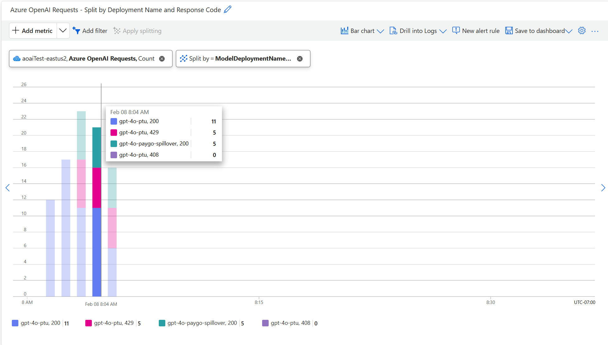

# Manage traffic with spillover for provisioned deployments (Preview)

Spillover manages traffic fluctuations on provisioned deployments by routing overage traffic to a corresponding standard deployment. Spillover is an optional capability that can be set for all requests on a given deployment or can be managed on a per-request basis. When spillover is enabled, Azure OpenAI Service sends any overage traffic from your provisioned deployment to a standard deployment for processing.

## Prerequisites
- A global provisioned or data zone provisioned deployment to be used as your primary deployment.
- A global or data zone standard deployment to be used as your spillover deployment. 

- The provisioned and standard deployments must be in the same Azure OpenAI Service resource to be eligible for spillover.

- The data processing level of your standard deployment must match your provisioned deployment (e.g. global provisioned deployment must be used with a global standard spillover deployment).

## When to enable spillover on provisioned deployments
To maximize the utilization of your provisioned deployment, it is recommended to enable spillover for all global and data zone provisioned deployments. With spillover, bursts or fluctuations in traffic can be automatically managed by the service. This capability reduces the risk of experiencing disruptions when a provisioned deployment is fully utilized. Alternatively, spillover is configurable per-request to provide flexibility across different scenarios and workloads.  

## When does spillover come into effect?
When spillover is enabled for a deployment or configured for a given inference request, spillover is initiated when a non-200 response code is received for a given inference request. When a request results in a non-200 response code, the Azure OpenAI Service automatically sends the request from your provisioned deployment to your standard deployment to be processed. Even if a subset of requests is routed to the standard deployment, the service prioritizes sending requests to the provisioned deployment before sending any overage requests to the standard deployment.

## How does spillover impact cost?
Since spillover uses a combination of provisioned and standard deployments to manage traffic fluctuations, billing for spillover involves two components:

- For any requests processed by your provisioned deployment, only the hourly provisioned deployment cost applies. No additional costs are incurred for these requests.

- For any requests routed to your standard deployment, the request is billed at the associated input token, cached token, and output token rates for the specified model version and deployment type.

## How to enable spillover
The spillover capability can be enabled for all requests on a provisioned deployment using a deployment property or it can be managed on a per-request basis using request headers. The following section explains how to configure spillover for each of these scenarios. 

### Enable spillover for all requests on a provisioned deployment
To enable spillover for all requests on a provisioned deployment, set the deployment property `spilloverDeploymentName` to the standard deployment target for spillover requests. This property can be set during the creation of a new provisioned deployment or can be added to an existing provisioned deployment. The `spilloverDeploymentName` property needs to be set to the name of a standard deployment within the same Azure OpenAI Service resource as your provisioned deployment. 

```Bash
curl -X PUT https://management.azure.com/subscriptions/00000000-0000-0000-0000-000000000000/resourceGroups/resource-group-temp/providers/Microsoft.CognitiveServices/accounts/docs-openai-test-001/deployments/spillover-ptu-deployment?api-version=2024-10-01 \
  -H "Content-Type: application/json" \
  -H 'Authorization: Bearer YOUR_AUTH_TOKEN' \
  -d '{"sku":{"name":"GlobalProvisionedManaged","capacity":100},"properties": {"spilloverDeploymentName": "spillover-standard-deployment", "model":{"format": "OpenAI","name": "gpt-4o-mini","version": "2024-07-18"}}}'
```
### Enable spillover for select inference requests
To selectively enable spillover on a per-request basis, set the `x-ms-spillover-deployment` inference request header to the standard deployment target for spillover requests. If the `x-ms-spillover-deployment` header is not set on a given request, spillover is initiated in the event of a non-200 response. The use or omission of this header provides the flexibility to control when spillover should or should not be initiated for a given workload or scenario.

```bash
curl $AZURE_OPENAI_ENDPOINT/openai/deployments/spillover-ptu-deployment/chat/completions?api-version=2025-02-01-preview \
  -H "Content-Type: application/json" \
  -H "x-ms-spillover-deployment: spillover-standard-deployment" \
  -H 'Authorization: Bearer YOUR_AUTH_TOKEN' \
  -d '{"messages":[{"role": "system", "content": "You are a helpful assistant."},{"role": "user", "content": "Does Azure OpenAI support customer managed keys?"},{"role": "assistant", "content": "Yes, customer managed keys are supported by Azure OpenAI."},{"role": "user", "content": "Do other Azure AI services support this too?"}]}'

```
> [!NOTE]
> If the spillover capability is enabled for the deployment using the `spilloverDeploymentName` property and also enabled at the request level using the `x-ms-spillover-deployment` header, the system defaults to the setting of the deployment property. If you would like to ensure that spillover is only enabled on per-request basis, do not set the `spilloverDeploymentName` property on the provisioned deployment and only rely on the `x-ms-spillover-deployment` header on a per-request basis. 

## How do I monitor my spillover usage?
Since the spillover capability relies on a combination of provisioned and standard deployments to manage traffic overages, monitoring can be conducted at the deployment level for each deployment. To view how many requests were processed on the primary provisioned deployment versus the spillover standard deployment, apply the splitting feature within Azure Monitor metrics to view the requests processed by each deployment and their respective status codes. Similarly, the splitting feature can be used to view how many tokens were processed on the primary provisioned deployment versus the spillover standard deployment for a given time period. For more information on observability within Azure OpenAI, review the [Monitor Azure OpenAI](./monitor-openai.md) documentation. 

The following Azure Monitor metrics chart provides an example of the split of requests between the primary provisioned deployment and the spillover standard deployment when spillover is initiated. As shown in the chart, for every request that has a non-200 response code for the provisioned deployment ("gpt-4o-ptu"), there is a corresponding request with a 200-response code on the spillover standard deployment ("gpt-4o-paygo-spillover"), indicating that these overage requests were routed to the spillover standard deployment for successful processing. 

## See also

* [What is provisioned throughput](../concepts/provisioned-throughput.md)
* [Onboarding to provisioned throughput](./provisioned-throughput-onboarding.md)