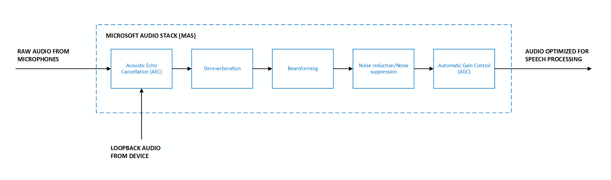

# DSP-based audio processing with the Microsoft Audio Stack

The default DSP-based pipeline (`AUDIO_INPUT_PROCESSING_ENABLE_DEFAULT`) in the Microsoft Audio Stack uses traditional digital signal processing algorithms to enhance input audio. See the [Audio processing overview](audio-processing-overview.md) for a comparison of available pipelines. For model-based echo cancellation, see [Model-based echo cancellation with the Microsoft Audio Stack](audio-processing-model-based-echo-cancellation.md).

## DSP enhancements

The DSP-based pipeline provides the following enhancements on the input audio signal:

* **Beamforming** - Localize the origin of sound and optimize the audio signal using multiple microphones.
* **Dereverberation** - Reduce the reflections of sound from surfaces in the environment.
* **Acoustic echo cancellation** - Suppress audio being played out of the device while microphone input is active.
* **Automatic gain control** - Dynamically adjust the person's voice level to account for soft speakers, long distances, or noncalibrated microphones.
* **Noise suppression** - Reduce the level of background noise. Requires microphone arrays for optimal performance; the effect is minimal with a single microphone or low SNR audio.

[  ](media/audio-processing/mas-block-diagram.png#lightbox)

Different scenarios and use-cases can require different optimizations that influence the behavior of the audio processing stack. For example, in telecommunications scenarios such as telephone calls, it's acceptable to have minor distortions in the audio signal after processing has been applied. This is because humans can continue to understand the speech with high accuracy. However, it's unacceptable and disruptive for a person to hear their own voice in an echo. This contrasts with speech processing scenarios, where distorted audio can adversely affect a machine-learned speech recognition model's accuracy, but it's acceptable to have minor levels of echo residual.

## Key features

The DSP-based pipeline supports the following features through the Speech SDK:
* **Selection of enhancements** - To allow for full control of your scenario, the SDK allows you to disable individual enhancements like dereverberation, noise suppression, automatic gain control, and acoustic echo cancellation. For example, if your scenario doesn't include rendering output audio that needs to be suppressed from the input audio, you have the option to disable acoustic echo cancellation.
* **Custom microphone geometries** - The SDK allows you to provide your own custom microphone geometry information, in addition to supporting preset geometries like linear two-mic, linear four-mic, and circular 7-mic arrays (see more information on supported preset geometries at [Microphone array recommendations](speech-sdk-microphone.md#microphone-geometry)).
* **Beamforming angles** - Specific beamforming angles can be provided to optimize audio input originating from a predetermined location, relative to the microphones.

## Input parameters

The DSP-based pipeline requires the following input parameters:
* **Raw audio** - Microsoft Audio Stack requires raw (unprocessed) audio as input to yield the best results.
* **Microphone geometries** - Geometry information about each microphone on the device is required to correctly perform all enhancements. Information includes the number of microphones, their physical arrangement, and coordinates. Up to 16 input microphone channels are supported.
* **Loopback or reference audio** - An audio channel that represents the audio being played out of the device is required to perform acoustic echo cancellation.
* **Input format** - Supports down sampling for sample rates that are integral multiples of 16 kHz. A minimum sampling rate of 16 kHz is required.

## Code samples

The following samples show how to use the DSP-based pipeline with different configurations.

### Default options

This sample shows how to use MAS with all default enhancement options on input from the device's default microphone.

### [C#](#tab/csharp)

```csharp
var speechConfig = SpeechConfig.FromEndpoint(new Uri("YourSpeechEndpoint"), "YourSpeechKey");

var audioProcessingOptions = AudioProcessingOptions.Create(AudioProcessingConstants.AUDIO_INPUT_PROCESSING_ENABLE_DEFAULT);
var audioInput = AudioConfig.FromDefaultMicrophoneInput(audioProcessingOptions);

var recognizer = new SpeechRecognizer(speechConfig, audioInput);
```

### [C++](#tab/cpp)

```cpp
auto speechConfig = SpeechConfig::FromEndpoint("YourServiceEndpoint", "YourSpeechResoureKey");

auto audioProcessingOptions = AudioProcessingOptions::Create(AUDIO_INPUT_PROCESSING_ENABLE_DEFAULT);
auto audioInput = AudioConfig::FromDefaultMicrophoneInput(audioProcessingOptions);

auto recognizer = SpeechRecognizer::FromConfig(speechConfig, audioInput);
```

### [Java](#tab/java)

```java
SpeechConfig speechConfig = SpeechConfig.fromEndpoint(new java.net.URI("YourSpeechEndpoint"), "YourSpeechKey");

AudioProcessingOptions audioProcessingOptions = AudioProcessingOptions.create(AudioProcessingConstants.AUDIO_INPUT_PROCESSING_ENABLE_DEFAULT);
AudioConfig audioInput = AudioConfig.fromDefaultMicrophoneInput(audioProcessingOptions);

SpeechRecognizer recognizer = new SpeechRecognizer(speechConfig, audioInput);
```
---

## Preset microphone geometry

This sample shows how to use MAS with a predefined microphone geometry on a specified audio input device. In this example:
* **Enhancement options** - The default enhancements are applied on the input audio stream.
* **Preset geometry** - The preset geometry represents a linear 2-microphone array.
* **Audio input device** - The audio input device ID is `hw:0,1`. For more information on how to select an audio input device, see [How to: Select an audio input device with the Speech SDK](how-to-select-audio-input-devices.md).

### [C#](#tab/csharp)

```csharp
var speechConfig = SpeechConfig.FromEndpoint(new Uri("YourSpeechEndpoint"), "YourSpeechKey");

var audioProcessingOptions = AudioProcessingOptions.Create(AudioProcessingConstants.AUDIO_INPUT_PROCESSING_ENABLE_DEFAULT, PresetMicrophoneArrayGeometry.Linear2);
var audioInput = AudioConfig.FromMicrophoneInput("hw:0,1", audioProcessingOptions);

var recognizer = new SpeechRecognizer(speechConfig, audioInput);
```

### [C++](#tab/cpp)

```cpp
auto speechConfig = SpeechConfig::FromEndpoint("YourServiceEndpoint", "YourSpeechResoureKey");

auto audioProcessingOptions = AudioProcessingOptions::Create(AUDIO_INPUT_PROCESSING_ENABLE_DEFAULT, PresetMicrophoneArrayGeometry::Linear2);
auto audioInput = AudioConfig::FromMicrophoneInput("hw:0,1", audioProcessingOptions);

auto recognizer = SpeechRecognizer::FromConfig(speechConfig, audioInput);
```

### [Java](#tab/java)

```java
SpeechConfig speechConfig = SpeechConfig.fromEndpoint(new java.net.URI("YourSpeechEndpoint"), "YourSpeechKey");

AudioProcessingOptions audioProcessingOptions = AudioProcessingOptions.create(AudioProcessingConstants.AUDIO_INPUT_PROCESSING_ENABLE_DEFAULT, PresetMicrophoneArrayGeometry.Linear2);
AudioConfig audioInput = AudioConfig.fromMicrophoneInput("hw:0,1", audioProcessingOptions);

SpeechRecognizer recognizer = new SpeechRecognizer(speechConfig, audioInput);
```
---

## Custom microphone geometry

This sample shows how to use MAS with a custom microphone geometry on a specified audio input device. In this example:
* **Enhancement options** - The default enhancements are applied on the input audio stream.
* **Custom geometry** - A custom microphone geometry for a 7-microphone array is provided via the microphone coordinates. The units for coordinates are millimeters.
* **Audio input** - The audio input is from a file, where the audio within the file is expected from an audio input device corresponding to the custom geometry specified. 

### [C#](#tab/csharp)

```csharp
var speechConfig = SpeechConfig.FromEndpoint(new Uri("YourSpeechEndpoint"), "YourSpeechKey");

MicrophoneCoordinates[] microphoneCoordinates = new MicrophoneCoordinates[7]
{
    new MicrophoneCoordinates(0, 0, 0),
    new MicrophoneCoordinates(40, 0, 0),
    new MicrophoneCoordinates(20, -35, 0),
    new MicrophoneCoordinates(-20, -35, 0),
    new MicrophoneCoordinates(-40, 0, 0),
    new MicrophoneCoordinates(-20, 35, 0),
    new MicrophoneCoordinates(20, 35, 0)
};
var microphoneArrayGeometry = new MicrophoneArrayGeometry(MicrophoneArrayType.Planar, microphoneCoordinates);
var audioProcessingOptions = AudioProcessingOptions.Create(AudioProcessingConstants.AUDIO_INPUT_PROCESSING_ENABLE_DEFAULT, microphoneArrayGeometry, SpeakerReferenceChannel.LastChannel);
var audioInput = AudioConfig.FromWavFileInput("katiesteve.wav", audioProcessingOptions);

var recognizer = new SpeechRecognizer(speechConfig, audioInput);
```

### [C++](#tab/cpp)

```cpp
auto speechConfig = SpeechConfig::FromEndpoint("YourServiceEndpoint", "YourSpeechResoureKey");

MicrophoneArrayGeometry microphoneArrayGeometry
{
    MicrophoneArrayType::Planar,
    { { 0, 0, 0 }, { 40, 0, 0 }, { 20, -35, 0 }, { -20, -35, 0 }, { -40, 0, 0 }, { -20, 35, 0 }, { 20, 35, 0 } }
};
auto audioProcessingOptions = AudioProcessingOptions::Create(AUDIO_INPUT_PROCESSING_ENABLE_DEFAULT, microphoneArrayGeometry, SpeakerReferenceChannel::LastChannel);
auto audioInput = AudioConfig::FromWavFileInput("katiesteve.wav", audioProcessingOptions);

auto recognizer = SpeechRecognizer::FromConfig(speechConfig, audioInput);
```

### [Java](#tab/java)

```java
SpeechConfig speechConfig = SpeechConfig.fromEndpoint(new java.net.URI("YourSpeechEndpoint"), "YourSpeechKey");

MicrophoneCoordinates[] microphoneCoordinates = new MicrophoneCoordinates[7];
microphoneCoordinates[0] = new MicrophoneCoordinates(0, 0, 0);
microphoneCoordinates[1] = new MicrophoneCoordinates(40, 0, 0);
microphoneCoordinates[2] = new MicrophoneCoordinates(20, -35, 0);
microphoneCoordinates[3] = new MicrophoneCoordinates(-20, -35, 0);
microphoneCoordinates[4] = new MicrophoneCoordinates(-40, 0, 0);
microphoneCoordinates[5] = new MicrophoneCoordinates(-20, 35, 0);
microphoneCoordinates[6] = new MicrophoneCoordinates(20, 35, 0);
MicrophoneArrayGeometry microphoneArrayGeometry = new MicrophoneArrayGeometry(MicrophoneArrayType.Planar, microphoneCoordinates);
AudioProcessingOptions audioProcessingOptions = AudioProcessingOptions.create(AudioProcessingConstants.AUDIO_INPUT_PROCESSING_ENABLE_DEFAULT, microphoneArrayGeometry, SpeakerReferenceChannel.LastChannel);
AudioConfig audioInput = AudioConfig.fromWavFileInput("katiesteve.wav", audioProcessingOptions);

SpeechRecognizer recognizer = new SpeechRecognizer(speechConfig, audioInput);
```
---

## Select enhancements

This sample shows how to use MAS with a custom set of enhancements on the input audio. By default, all enhancements are enabled but there are options to disable dereverberation, noise suppression, automatic gain control, and echo cancellation individually by using `AudioProcessingOptions`.

In this example:
* **Enhancement options** - Echo cancellation and noise suppression are disabled, while all other enhancements remain enabled.
* **Audio input device** - The audio input device is the default microphone of the device.

### [C#](#tab/csharp)

```csharp
var speechConfig = SpeechConfig.FromEndpoint(new Uri("YourSpeechEndpoint"), "YourSpeechKey");

var audioProcessingOptions = AudioProcessingOptions.Create(AudioProcessingConstants.AUDIO_INPUT_PROCESSING_DISABLE_ECHO_CANCELLATION | AudioProcessingConstants.AUDIO_INPUT_PROCESSING_DISABLE_NOISE_SUPPRESSION | AudioProcessingConstants.AUDIO_INPUT_PROCESSING_ENABLE_DEFAULT);
var audioInput = AudioConfig.FromDefaultMicrophoneInput(audioProcessingOptions);

var recognizer = new SpeechRecognizer(speechConfig, audioInput);
```

### [C++](#tab/cpp)

```cpp
auto speechConfig = SpeechConfig::FromEndpoint("YourServiceEndpoint", "YourSpeechResoureKey");

auto audioProcessingOptions = AudioProcessingOptions::Create(AUDIO_INPUT_PROCESSING_DISABLE_ECHO_CANCELLATION | AUDIO_INPUT_PROCESSING_DISABLE_NOISE_SUPPRESSION | AUDIO_INPUT_PROCESSING_ENABLE_DEFAULT);
auto audioInput = AudioConfig::FromDefaultMicrophoneInput(audioProcessingOptions);

auto recognizer = SpeechRecognizer::FromConfig(speechConfig, audioInput);
```

### [Java](#tab/java)

```java
SpeechConfig speechConfig = SpeechConfig.fromEndpoint(new java.net.URI("YourSpeechEndpoint"), "YourSpeechKey");

AudioProcessingOptions audioProcessingOptions = AudioProcessingOptions.create(AudioProcessingConstants.AUDIO_INPUT_PROCESSING_DISABLE_ECHO_CANCELLATION | AudioProcessingConstants.AUDIO_INPUT_PROCESSING_DISABLE_NOISE_SUPPRESSION | AudioProcessingConstants.AUDIO_INPUT_PROCESSING_ENABLE_DEFAULT);
AudioConfig audioInput = AudioConfig.fromDefaultMicrophoneInput(audioProcessingOptions);

SpeechRecognizer recognizer = new SpeechRecognizer(speechConfig, audioInput);
```
---

## Specify beamforming angles

This sample shows how to use MAS with a custom microphone geometry and beamforming angles on a specified audio input device. In this example:
* **Enhancement options** - The default enhancements are applied on the input audio stream.
* **Custom geometry** - A custom microphone geometry for a 4-microphone array is provided by specifying the microphone coordinates. The units for coordinates are millimeters.
* **Beamforming angles** - Beamforming angles are specified to optimize for audio originating in that range. The units for angles are degrees. 
* **Audio input** - The audio input is from a push stream, where the audio within the stream is expected from an audio input device corresponding to the custom geometry specified. 

In the following code example, the start angle is set to 70 degrees and the end angle is set to 110 degrees.

### [C#](#tab/csharp)

```csharp
var speechConfig = SpeechConfig.FromEndpoint(new Uri("YourSpeechEndpoint"), "YourSpeechKey");

MicrophoneCoordinates[] microphoneCoordinates = new MicrophoneCoordinates[4]
{
    new MicrophoneCoordinates(-60, 0, 0),
    new MicrophoneCoordinates(-20, 0, 0),
    new MicrophoneCoordinates(20, 0, 0),
    new MicrophoneCoordinates(60, 0, 0)
};
var microphoneArrayGeometry = new MicrophoneArrayGeometry(MicrophoneArrayType.Linear, 70, 110, microphoneCoordinates);
var audioProcessingOptions = AudioProcessingOptions.Create(AudioProcessingConstants.AUDIO_INPUT_PROCESSING_ENABLE_DEFAULT, microphoneArrayGeometry, SpeakerReferenceChannel.LastChannel);
var pushStream = AudioInputStream.CreatePushStream();
var audioInput = AudioConfig.FromStreamInput(pushStream, audioProcessingOptions);

var recognizer = new SpeechRecognizer(speechConfig, audioInput);
```

### [C++](#tab/cpp)

```cpp
auto speechConfig = SpeechConfig::FromEndpoint("YourServiceEndpoint", "YourSpeechResoureKey");

MicrophoneArrayGeometry microphoneArrayGeometry
{
    MicrophoneArrayType::Linear,
    70,
    110,
    { { -60, 0, 0 }, { -20, 0, 0 }, { 20, 0, 0 }, { 60, 0, 0 } }
};
auto audioProcessingOptions = AudioProcessingOptions::Create(AUDIO_INPUT_PROCESSING_ENABLE_DEFAULT, microphoneArrayGeometry, SpeakerReferenceChannel::LastChannel);
auto pushStream = AudioInputStream::CreatePushStream();
auto audioInput = AudioConfig::FromStreamInput(pushStream, audioProcessingOptions);

auto recognizer = SpeechRecognizer::FromConfig(speechConfig, audioInput);
```

### [Java](#tab/java)

```java
SpeechConfig speechConfig = SpeechConfig.fromEndpoint(new java.net.URI("YourSpeechEndpoint"), "YourSpeechKey");

MicrophoneCoordinates[] microphoneCoordinates = new MicrophoneCoordinates[4];
microphoneCoordinates[0] = new MicrophoneCoordinates(-60, 0, 0);
microphoneCoordinates[1] = new MicrophoneCoordinates(-20, 0, 0);
microphoneCoordinates[2] = new MicrophoneCoordinates(20, 0, 0);
microphoneCoordinates[3] = new MicrophoneCoordinates(60, 0, 0);
MicrophoneArrayGeometry microphoneArrayGeometry = new MicrophoneArrayGeometry(MicrophoneArrayType.Planar, 70, 110, microphoneCoordinates);
AudioProcessingOptions audioProcessingOptions = AudioProcessingOptions.create(AudioProcessingConstants.AUDIO_INPUT_PROCESSING_ENABLE_DEFAULT, microphoneArrayGeometry, SpeakerReferenceChannel.LastChannel);
PushAudioInputStream pushStream = AudioInputStream.createPushStream();
AudioConfig audioInput = AudioConfig.fromStreamInput(pushStream, audioProcessingOptions);

SpeechRecognizer recognizer = new SpeechRecognizer(speechConfig, audioInput);
```
---

## Reference channel for echo cancellation

Microsoft Audio Stack requires the reference channel (also known as loopback channel) to perform echo cancellation. The source of the reference channel varies by platform:
* **Windows** - The reference channel is automatically gathered by the Speech SDK if the `SpeakerReferenceChannel::LastChannel` option is provided when creating `AudioProcessingOptions`.
* **Linux** - ALSA (Advanced Linux Sound Architecture) must be configured to provide the reference audio stream as the last channel for the audio input device used. ALSA is configured in addition to providing the `SpeakerReferenceChannel::LastChannel` option when creating `AudioProcessingOptions`.

## Language and platform support

| Language   | Platform    | Reference docs |
|------------|----------------|----------------|
| C++        | Windows, Linux | [C++ docs](/cpp/cognitive-services/speech/) |
| C#         | Windows, Linux | [C# docs](/dotnet/api/microsoft.cognitiveservices.speech) |
| Java       | Windows, Linux | [Java docs](/java/api/com.microsoft.cognitiveservices.speech) |

## Related content

- [Model-based echo cancellation with the Microsoft Audio Stack](audio-processing-model-based-echo-cancellation.md)
- [Audio processing with the Microsoft Audio Stack](audio-processing-overview.md)
- [Microphone array recommendations](speech-sdk-microphone.md)
- [Set up development environment](quickstarts/setup-platform.md)
