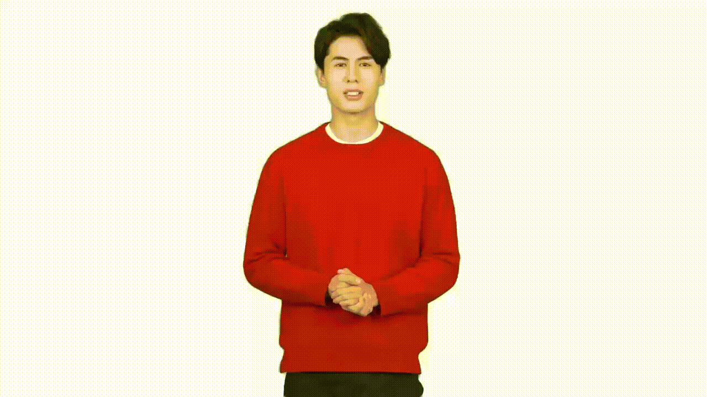
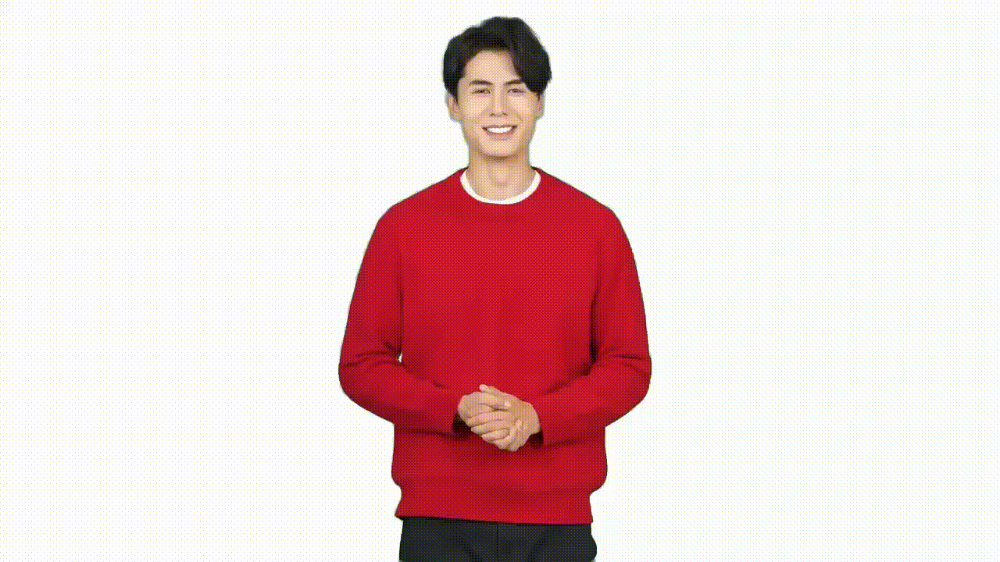

# Record video samples for custom text to speech avatar

This article explains how to prepare high-quality video samples for creating a custom text to speech avatar with Azure Speech in Foundry Tools.

Building a custom text to speech avatar model requires training on video recordings of a real person speaking. This person is the avatar talent. You must get sufficient consent under all relevant laws and regulations from the avatar talent to create a custom avatar from the talent's image or likeness. To learn about consent statement video requirements, see [Get consent file from the avatar talent](./custom-avatar-create.md#step-2-add-avatar-talent-consent).

## Recording environment

Record in a professional video recording studio or well-lit space.

### Background requirements

For commercial, multi-scene avatars, use a clean, smooth, solid-colored background. A green screen works best.

If your avatar will only be used in a single scene, you can record in a specific location like your office, but you can't change the background later.

Follow these best practices when using a solid-colored background like a green screen:
- Position the green screen behind the actor. For full-body shots, place a green screen on the floor under the actor's feet. Connect the back and floor green screens seamlessly.
- Keep the green screen flat with uniform color.
- Maintain 0.5-1 meter distance between the actor and background.
- Light the green screen properly to prevent shadows.
- Keep the actor's full outline within the green screen edges.
- Don't let the actor stand too close to the green screen.
- Keep the actor's head and hands within the green screen when speaking.

### Lighting requirements

- Use even, bright lighting on the actor's face. Avoid shadows on the face or reflections on glasses and clothing.
- Keep ambient lighting consistent. Turn off projectors, close curtains to avoid daylight changes, and use stable artificial light sources.

### Equipment

- Camera: Minimum 1080p resolution and 25 FPS (frames per second). To create a 4K resolution avatar, the video recording should be in 3840x2160 resolution.
- Keep lighting and camera positions fixed throughout recording.
- You can use a teleprompter during recording, but make sure it doesn't affect the actor's gaze toward the camera. Provide seating if the avatar needs to be in a sitting position.
- For half-length or seated avatars, provide seating for the actor. Choose an appropriate chair if you don't want it visible in the video. 

## Appearance of the actor

Custom text to speech avatar doesn't support customization of clothing or appearance. It's essential to carefully design and prepare the avatar's appearance when recording training data. Consider these tips:

| Categories | Dos          | Don'ts         |
|------------|----------------------------|-------------------|
| **Hair**   | - The actor's hair should have a smooth and glossy surface. - Even the actor's bangs or broken hair should have a clear and smooth border. - Choose a hairstyle that is easy to keep consistent during the whole video recording. | - Avoid messy hair or backgrounds showing through the hair. - Don't let hair block the eyes or eyebrows. - Avoid shadows on the face caused by hairstyle. - Avoid hair changes too much during speech and body gesture. For example, the high ponytail of an actor might appear, disappear, and swing during speaking. |
| **Clothing** | - Pay attention to clothing status and make sure no significant changes on the clothing during speaking. | - Avoid wearing clothing and accessories that are too loose, heavy, or complex, as they might affect the consistency of clothing status during speaking and body gesture. - Avoid wearing clothing that is too similar to the background color or reflective materials like white shirts or translucent materials. - Avoid clothing with obvious lines or items with logos and brand names you don't want to highlight. - Avoid reflective elements such as metal belts, shiny leather shoes, and leather pants. |
| **Face**    | - Ensure the actor's face is clearly visible.  | - Avoid face obscured by hair, sunglasses, or accessories. |

## What video clips to record

The video clips required to train a custom avatar model vary slightly depending on the use case—whether the avatar is intended for video content generation or real-time conversation.
Here is the video type list for each scenario.

**Interactive conversation (real-time)**

|Required|Optional|
|--|--|
| Consent video  Natural speaking video  Silent video| Interaction video|

**Video content generation (batch)**

|Required|Optional|
|--|--|
| Consent video  Natural speaking video| Status 0 video and Gesture video|

Below we describe the detailed requirements for each video type.

|Video type|Description|Samples|
|----|--------------------|---|
|Consent video |The consent video is required for creating a custom avatar.  - The consent video must show the same avatar talent speaking and follow the consent statement requirements. Ensure the statement is recorded correctly with each word spoken clearly. You can use any supported language. To learn about consent statement video requirements, see [Get consent file from the avatar talent](./custom-avatar-create.md#step-2-add-avatar-talent-consent).  - The avatar talent should always face the camera without large movements.  - Record the video in a quiet environment with clear audio at reasonable volume. Keep the signal-to-noise ratio above 20. For voice recording guidance, see the [Recording custom voice samples](../record-custom-voice-samples.md#recording-your-script) guide.  - Ensure the actor's head isn't blocked in any frame. - Keep other objects out of the camera view, including filming equipment and mobile phones.|-|
|Status 0 speaking video|**What is Status 0?** - Status 0 represents the posture you can naturally maintain most of the time while speaking. For example, arms crossed in front of the body or hanging naturally at the sides.  - Maintain a front-facing pose. The actor can move slightly to show a relaxed state, like moving the head or shoulder slightly, but don't sway or move the body too much.   - Status 0 video clip is used for avatar video creation (batch mode) when gestures insertion is needed during avatar speaking. Gesture video clips are used in combination with with Status 0 speaking video to support gesture insertion during avatar speech.  - The required video length is 3-5 minutes.| |
|Natural speaking video|The naturally speaking video clip is required for the avatar to speak naturally.  - The actor speaks in Status 0 while using natural hand gestures occasionally.  - Hand gestures should begin in Status 0 and return to Status 0 once completed.  - Gestures should remain natural and commonly used, avoiding any meaningful gestures such as pointing, applause, or thumbs-up.  - Multiple clips are allowed recorded. The combined duration should be more than 10 minutes, and at least one continuous clip of 5 minutes is required.| |
|Silent status video|The silent status video clip is required for building a real-time conversation with the custom avatar.  - Maintain Status 0, don't speak, but stay relaxed.  - Even while remaining in Status 0, don't stay completely still. You can move slightly but not too much. Act like you're waiting.  - Maintain a smile as if listening or waiting patiently. - Avoid nodding frequently. - Duration: 1 minute.| |
|Interaction video|Interaction videos are used to improve avatar body naturalness and gesture quality in interactive conversation mode. This capability is currently available as a private preview fine-tuning step and is supported through a manual process.Only a subset of customers who have prepared the required data are invited to evaluate this feature.  The clip should follow a listen–speak–listen interaction pattern. The listen–speak sequence should be repeated until the conversation is complete. If the recording is done by a single person, the actor should imagine another person speaking during the listening phase and respond naturally during the speaking phase. The following tips apply to each phase:   **Listening phase**  - Maintain Status 0. Do not speak, but remain relaxed.  - While staying in Status 0, avoid remaining completely still. Move slightly, as if waiting.  - Maintain a gentle smile, as if listening or waiting patiently.  - Avoid frequent nodding, swaying or large movements. - Length: Each listening segment should last approximately 3–5 seconds.   **Speaking phase**  - Speak naturally, using natural hand gestures occasionally. - Use only natural and common gestures. Avoid meaningful gestures such as pointing, applause, or thumbs-up. - Begin gestures after starting to speak, and stop them before finishing. - Length: Each speaking segment should last more than 5 seconds. **Total video length** - The total video length should be approximately 1–5 minutes.|
|Gesture video| Gesture video clips are used for avatar video creation (batch mode) when gestures insertion is needed during avatar speaking. Gesture insertion is only available for batch mode avatar; real-time avatar doesn't support gesture insertion. Each custom avatar model supports up to 10 gestures.   **Gesture tips**  - Each gesture clip should be 10 seconds or shorter.  - Gestures should start from Status 0 and end with Status 0. The character must maintain the same position as in Status 0, which is in the middle of the screen, throughout the gesture. Otherwise, the gesture clip can't be smoothly inserted into the avatar video.  - The gesture clip only captures body gestures; the actor doesn't have to speak while making gestures.  - Design a list of gestures before recording.|Delivering sell link/promotion code   Praising the product  |

## Additional recording tips
High-quality avatar models are built from high-quality video recordings, including audio quality. The following table has more tips for the actor's performance and recording video clips:

| **Dos** | **Don'ts**   |
|---------|--------------|
| - Ensure all video clips are taken in the same conditions. - During the recording process, design the size and display area of the character you need so that the character can be displayed on the screen appropriately.  - Actor should be steady during the recording.   - Mind facial expressions, which should be suitable for the avatar's use case. For example, look positive and smile if the custom text to speech avatar is used as customer service. Look professionally if the avatar is used for news reporting.  - Maintain eye gaze towards the camera, even when using a teleprompter.  - Return your body to status 0 when pausing speaking.  - Speak on a self-chosen topic, and minor speech mistakes like miss a word or mispronounced are acceptable. If the actor misses a word or mispronounces something, just go back to status 0, pause for 3 seconds, and then continue speaking.  - Consciously pause between sentences and paragraphs. When pausing, go back to the status 0 and close your lips.   - The audio should be clear and loud enough; bad audio quality impacts training result.  - Keep the shooting environment quiet. | - Don't adjust the camera parameters, focal length, position, angle of view. Don't move the camera; keep the person's position, size, angle, consistent in the camera.  - Characters that are too small might lead to a loss of image quality during post-processing. Characters that are too large might cause the screen to overflow during gestures and movements.  - Don't make too long gestures or too much movement for one gesture; for example, actor's hands are always making gestures and forget to go back to status 0.  - The actor's movements and gestures must not block the face.  - Avoid small movements of the actor like licking lips, touching hair, talking sideways, constant head shaking during speech, and not closing up after speaking.  - Avoid background noise; staff should avoid walking and talking during video recording.  - Avoid other people's voice recorded during the actor speaking. |

## Data requirements

Basic video processing helps improve model training efficiency:

- Keep the character centered on screen with consistent size and position throughout recording. Keep all video processing parameters like brightness and contrast consistent. The output avatar's size, position, brightness, and contrast directly reflect those in the training data. No alterations are applied during processing or model building.
- Start and end clips in status 0. Actors should close their mouths, smile, and look ahead. The video should be continuous, not abrupt.

**Avatar training video recording file format:** .mp4 or .mov.

**Resolution:** At least 1920x1080. 3840x2160 to train a 4K avatar

**Frame rate per second:** At least 25 FPS.

## Related content

* [What is text to speech avatar](what-is-text-to-speech-avatar.md)
* [What is custom text to speech avatar](what-is-custom-text-to-speech-avatar.md)
