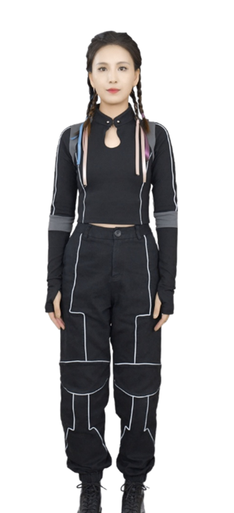
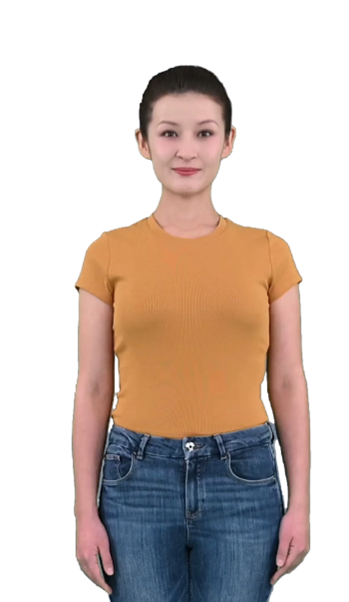
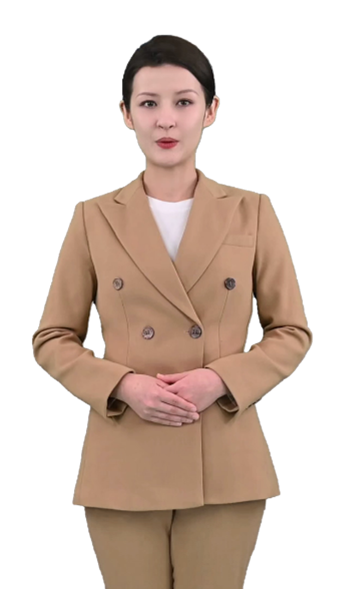
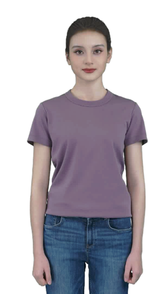
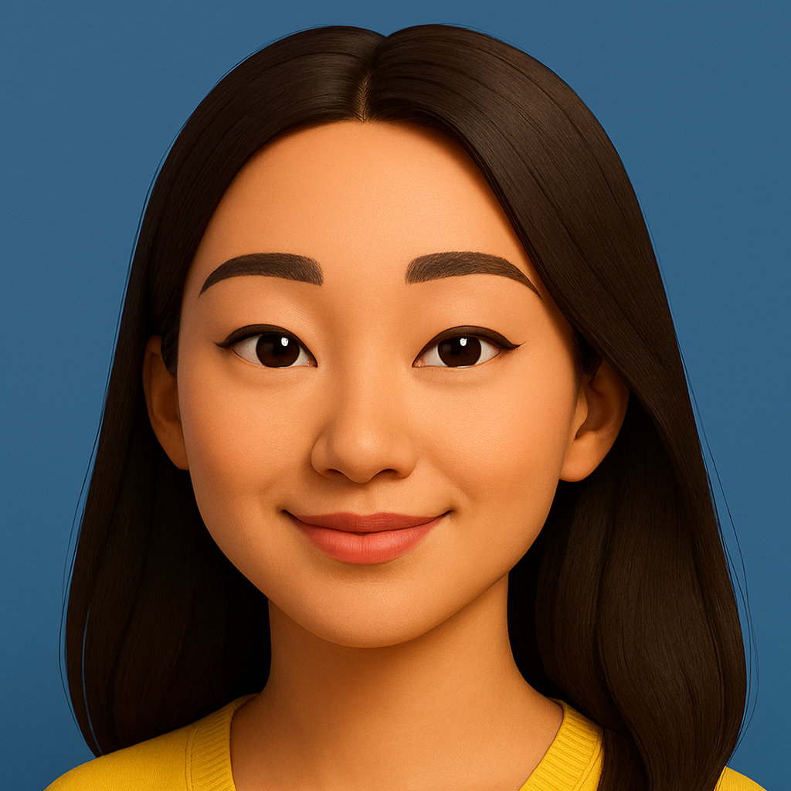
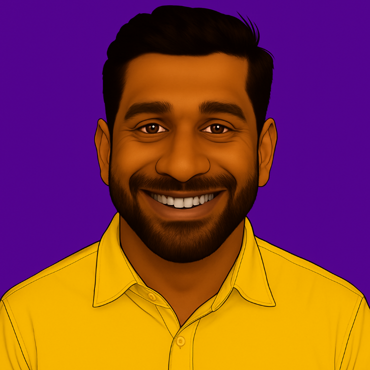

# Supported standard text to speech avatar
This article contains the full list of standard avatars with their preview images.
- Standard video avatars
- Standard photo avatars

## Standard video avatars
Avatars created from video typically include distinct body parts and can display various styles based on different clothing or poses. Many avatars in this group also allow users to add gestures when processing a batch of videos.

| Characters | Styles          | Preview Image         |Gestures|
|------------|----------------------------|-------------------|--------|
| **Harry** | business |  | 123 calm-down come-on five-star-reviews good hello introduce invite thanks welcome  |
| **Harry** | casual |  | 123 come-on five-star-reviews good happy-new-year hello please welcome  |
| **Harry** | youthful |  | 123 come-on down five-star good hello invite show-right-up-down welcome  |
| **Jeff** | business |  | 123 come-on five-star-reviews hands-up here meddle please2 show silence thanks  |
| **Jeff** | formal |  | 123 come-on five-star-reviews lift please silence thanks very-good  |
| **Lisa** | casual-sitting |  | numeric1-left-1 numeric2-left-1 numeric3-left-1 thumbsup-left-1 show-front-1 show-front-2 show-front-3 show-front-4 show-front-5 think-twice-1 show-front-6 show-front-7 show-front-8 show-front-9  |
| **Lisa** | graceful-sitting |  | wave-left-1 wave-left-2 thumbsup-left show-left-1 show-left-2 show-left-3 show-left-4 show-left-5 show-right-1 show-right-2 show-right-3 show-right-4 show-right-5  |
| **Lisa** | graceful-standing |  | |
| **Lisa** | technical-sitting |  | wave-left-1 wave-left-2 show-left-1 show-left-2 point-left-1 point-left-2 point-left-3 point-left-4 point-left-5 point-left-6 show-right-1 show-right-2 show-right-3 point-right-1 point-right-2 point-right-3 point-right-4 point-right-5 point-right-6  |
| **Lisa** | technical-standing |  | |
| **Lori** | casual |  | 123-left a-little beg calm-down come-on five-star-reviews good hello open please thanks  |
| **Lori** | graceful |  | 123-left applaud come-on introduce nod please show-left show-right thanks welcome  |
| **Lori** | formal |  | 123 come-on come-on-left down five-star good hands-triangle hands-up hi hopeful thanks  |
| **Max** | business |  | a-little-bit click-the-link display-number encourage-1 encourage-2 five-star-praise front-right good-01 good-02 introduction-to-products-1 introduction-to-products-2 introduction-to-products-3 left lower-left number-one press-both-hands-down-1 press-both-hands-down-2 push-forward raise-ones-hand right say-hi shrug-ones-shoulders slide-from-left-to-right slide-to-the-left thanks the-front top-middle-and-bottom-left top-middle-and-bottom-right upper-left upper-right welcome  |
| **Max** | casual |  | a-little-bit applaud click-the-link display-number encourage-1 encourage-2 five-star-praise front-left good-1 good-2 hello introduction-to-products-1 introduction-to-products-2 introduction-to-products-3 introduction-to-products-4 left length nodding number-one press-both-hands-down raise-ones-hand right right-front shrug-ones-shoulders slide-from-left-to-right slide-to-the-left thanks the-front upper-left upper-right welcome  |
| **Max** | formal |  | a-little-bit click-the-link display-number encourage-1 encourage-2 five-star-praise front-left front-right good-1 good-2 introduction-to-products-1 introduction-to-products-2 introduction-to-products-3 left lower-left lower-right press-both-hands-down push-forward right say-hi shrug-ones-shoulders slide-from-left-to-right slide-to-the-left the-front top-middle-and-bottom-right upper-left upper-right  |
| **Meg** | formal |  | a-little-bit click-the-link display-number encourage-1 encourage-2 five-star-praise front-left front-right good-1 good-2 hands-forward introduction-to-products-1 introduction-to-products-2 introduction-to-products-3 left number-one press-both-hands-down-1 press-both-hands-down-2 right say-hi shrug-ones-shoulders slide-from-left-to-right the-front upper-left upper-right  |
| **Meg** | casual |  | a-little-bit click-the-link cross-hand display-number encourage-1 encourage-2 five-star-praise front-left front-right good-1 good-2 handclap introduction-to-products-1 introduction-to-products-2 introduction-to-products-3 left length lower-left lower-right number-one press-both-hands-down right say-hi shrug-ones-shoulders slide-from-right-to-left slide-to-the-left spread-hands the-front top-middle-and-bottom-left top-middle-and-bottom-right upper-left upper-right  |
| **Meg** | business |  | a-little-bit encourage-1 encourage-2 five-star-praise front-left front-right good-1 good-2 introduction-to-products-1 introduction-to-products-2 introduction-to-products-3 left length number-one press-both-hands-down-1 press-both-hands-down-2 raise-ones-hand right say-hi shrug-ones-shoulders slide-from-left-to-right slide-to-the-left spread-hands thanks the-front upper-left  |

All styles except lisa-graceful-sitting, lisa-graceful-standing, lisa-technical-sitting, and lisa-technical-standing are supported via the real-time text to speech API. Gestures are only supported with the batch synthesis API and aren't supported via the real-time API.

## Standard photo avatars
| Characters | Preview Image |
|------------|----------------------------|
| **Adrian** |  |
| **Amara** |  |
| **Amira** |  |
| **Anika** |  |
| **Bianca** |  |
| **Camila** |  |
| **Carlos** |  |
| **Clara** |  |
| **Darius** |  |
| **Diego** |  |
| **Elise** |  |
| **Farhan** |  |
| **Faris** |  |
| **Gabrielle** |  |
| **Hyejin** |  |
| **Imran** |  |
| **Isabella** |  |
| **Layla** |  |
| **Liwei** |  |
| **Ling** |  |
| **Marcus** |  |
| **Matteo** |  |
| **Rahul** |  |
| **Rana** |  |
| **Ren** |  |
| **Riya** |  |
| **Sakura** |  |
| **Simone** |  |
| **Zayd** |  |
| **Zoe** |  |

