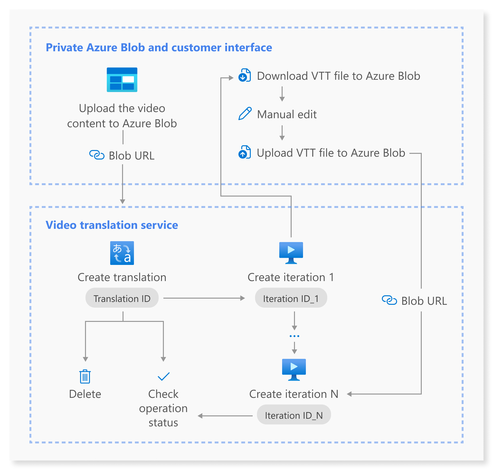

# What is video translation?

Video translation is a feature in Azure Speech in Foundry Tools that enables you to seamlessly translate and generate videos in multiple languages automatically. This feature is designed to help you localize your video content to cater to diverse audiences around the globe. You can efficiently create immersive, localized videos across various use cases such as vlogs, education, news, enterprise training, advertising, film, TV shows, and more.

The process of replacing the original language of a video with speech recorded in a different language is essential for catering to diverse audiences. This method, typically achieved through human recording and manual post-production, ensures that viewers can enjoy video content in their native language. However, it comes with key pain points:
- **High cost**: Traditional video translation methods often require expensive human voice actors and extensive post-production work, making it a costly endeavor for content creators.
- **Time-consuming**: The manual process of recording and editing translated speech can take a significant amount of time, delaying the release of localized content.
- **Inconsistent quality**: Human voice actors might not always accurately replicate the original speaker's voice, leading to a less immersive experience for viewers.

With video translation in Azure Speech, these challenges are effectively addressed. The feature automates the translation process, significantly reducing costs and production time while ensuring high-quality results. Accurately replicating the original speaker's voice creates a seamless and immersive viewing experience for audiences worldwide.
- **Cost-effective**: Reduces the need for expensive human voice actors and manual post-production work.
- **Time-efficient**: Significantly shortens the time required to produce localized videos.
- **High-quality**: Accurately replicates the original speaker's voice, ensuring a seamless and immersive viewing experience.
- **Scalable**: Enables the production of large volumes of localized content quickly and efficiently.

## Use case 

Video translation provided by Azure Speech has a wide range of use cases across various industries and content types. Here are some key applications: 

- **News + interviews**: News organizations can translate and dub news segments and interviews to provide accurate and timely information to audiences worldwide. 

- **Advertisement + marketing**: Businesses can localize their advertising and marketing videos to resonate with target audiences in different markets, enhancing brand awareness and customer engagement.

- **Education + learning**: Educational institutions and e-learning platforms can dub their instructional videos and lectures into different languages, making learning more accessible and inclusive. 

- **Film + TV show**: Film studios and production companies can dub their movies and TV shows for international distribution, reaching a broader audience and maximizing revenue potential. 

- **Vlog + short video**: Content owners can easily translate and dub their vlogs and short videos to reach international audiences, expanding their viewership and engagement. 

- **Enterprise training**: Corporations can localize their training videos for employees in different regions, ensuring consistent and effective communication across their workforce. 

## Core features

- **Dialogue audio extraction and spoken content transcription.**
  
  Automatically extracts dialogue audio from the source video and transcribes the spoken content.
- **Translation from language A to B and large language model (LLM) reformulation.**
  
  Translates the transcribed content from the original language (Language A) to the target language (Language B) using advanced language processing techniques. Enhances translation quality and refines gender-aware translated text through LLM reformulation. 
- **Automatic translation – voice generation in other language.**
  
  Utilizes AI-powered text-to-speech technology to automatically generate human-like voices in the target language. These voices are precisely synchronized with the video, ensuring a flawless translation experience. This includes utilizing standard voices for high-quality output and offering options for personal voice. 
- **Human in the loop for content editing.**
  
  Allows for human intervention to review and edit the translated content, ensuring accuracy and cultural appropriateness before finalizing the dubbed video. 
- **Subtitles generation.**
 
  Delivers the fully dubbed video with translated dialogue, synchronized subtitles, and generated voices, ready for download and distribution across various platforms. You can also set the subtitle length on each screen for optimal display. 

## How it works

This diagram provides a high-level overview of the workflow.

1. You upload the video file that you want translated to Azure Blob Storage. 
1. You create a translation by specifying the URL of the video file. Include other parameters, such as the source and target languages, voice type, and whether to burn subtitles into the video. 
    > [!NOTE]
    > Creating a translation doesn't initiate the translation process. 
1. You can start translating the video by creating an iteration. An iteration is a specific instance of the translation process. You can create multiple iterations for the same translation, allowing you to experiment with different settings or parameters.
1. After the first iteration, you can use the subtitle file in subsequent iterations. Upload your own subtitle file or make changes to the auto-generated subtitle file and upload the modified subtitle file.
1. Periodically get the status of the translation and iteration. The status will indicate whether the translation is in progress, completed, or failed.
1. Once the translation is complete, you can download the translated video and subtitles. The translated video will have the original speech replaced with the translated speech, and the subtitles will be synchronized with the translated speech.
1. You can also delete the translation and iteration if you no longer need them. Deleting a translation will remove all associated iterations and data.

## Supported regions and languages

For the most up-to-date information about regional availability for video translation, see the [Azure Speech regions table](regions.md?tabs=speech-translation).

We support video translation between various languages, enabling you to tailor your content to specific linguistic preferences. For the languages supported for video translation, refer to the [supported source and target languages](language-support.md?tabs=speech-translation#video-translation). 

## Pricing 

For pricing details on video translation, see [Speech service pricing](https://azure.microsoft.com/pricing/details/cognitive-services/speech-services/). Video translation pricing is only visible for service regions where the feature is available. See the [Speech service regions table](regions.md?tabs=speech-translation) for current regional availability.

## Related content

* To get started with video translation, see [how to use video translation](video-translation-get-started.md).
  