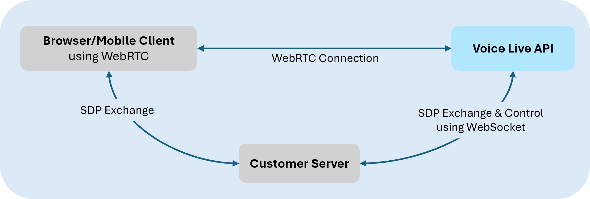

# Voice Live API with WebRTC (Preview)

[!INCLUDE [Feature preview](./includes/previews/preview-generic.md)]

Voice Live API supports a WebRTC (Web Real-Time Communication) connection, enabling low‑latency, real‑time voice interactions directly from web and mobile clients. 

WebRTC provides the following capabilities for real-time audio streaming:

- **Lower latency**: WebRTC is designed to minimize delay, making it more suitable for audio and video communication where low latency is critical for maintaining quality and synchronization.
- **Built-in media handling**: WebRTC has built-in support for audio and video codecs, providing optimized handling of media streams.
- **Network resilience**: WebRTC includes mechanisms for handling packet loss and jitter, which are essential for maintaining the quality of audio streams over unpredictable networks.
- **Peer-to-peer connection**: WebRTC establishes a direct connection between the client and the Voice Live API for real-time audio, eliminating the need for an intermediary server to relay audio data and further reducing latency. Meanwhile, your server retains full control of the session—it can send commands, configure behavior, and manage tool calls through the WebSocket signaling channel at any time.

> [!TIP]
> **WebRTC vs WebSocket:** WebRTC is recommended for real-time audio streaming because it uses UDP-based transport, which prioritizes speed and continuous delivery—if a packet is lost, playback continues without waiting for retransmission. WebSocket connections use TCP, which guarantees delivery order but can introduce delays when packets are lost as it waits for retransmission. For real-time voice interactions where natural, low-latency audio is critical, WebRTC provides a noticeably better experience.

## Prerequisites

Before using the WebRTC connection, see [how to use voice live](voice-live-how-to.md) for supported models and regions, authentication, and session configuration details.

> [!IMPORTANT]
> Voice Live API with WebRTC currently uses global standard deployments and automatically routes requests to the nearest region to optimize latency. For more information about the voice live supported regions, see [region support](regions.md?tabs=voice-live).
 
## Set up WebRTC connection

In a typical setup, the client establishes a WebSocket based signaling channel with the Voice Live API to exchange SDP offer/answer messages required for WebRTC session negotiation. Once negotiation completes, audio is transmitted over WebRTC RTP media tracks.

<p align="center">
  
</p>


### Step 1: Create a control channel

The WebRTC session negotiation is performed by exchanging SDP (Session Description Protocol) messages over a WebSocket control channel.

When initiating a WebRTC call session, use the `voice-live/realtime/calls` endpoint instead of `voice-live/realtime`. For example:

```text
wss://<your-ai-foundry-resource-name>.services.ai.azure.com/voice-live/realtime/calls?api-version=2026-01-01-preview&model=gpt-realtime
```
For general WebSocket setup guidance, see [WebSocket endpoint setup](voice-live-how-to.md#websocket-endpoint). 

### Step 2: Create WebRTC peer connection and SDP exchange

In the browser, use standard WebRTC APIs to create a peer connection and exchange SDP with the Voice Live API over a WebSocket connection. Audio is streamed over WebRTC media tracks, while non-audio events are exchanged separately.

The following example demonstrates a minimal browser setup.

```javascript
async function setupWebRTC(signalWs, model) {
  // Create peer connection
  const pc = new RTCPeerConnection();

  // Get microphone access
  const stream = await navigator.mediaDevices.getUserMedia({ audio: true });
  stream.getTracks().forEach(track => pc.addTrack(track, stream));

  // Setup audio playback for remote stream
  const audio = document.createElement('audio');
  audio.autoplay = true;
  document.body.appendChild(audio);

  pc.ontrack = event => {
    audio.srcObject = event.streams[0];
  };

  // Create and set local offer
  const offer = await pc.createOffer();
  await pc.setLocalDescription(offer);

  // Wait for ICE candidates in SDP
  await new Promise(resolve => {
    if (pc.iceGatheringState === 'complete') {
      resolve();
    } else {
      pc.addEventListener('icegatheringstatechange', () => {
        if (pc.iceGatheringState === 'complete') {
          resolve();
        }
      });
    }
  });

  // Send offer to server
  // If migrating from websocket to webrtc, you can use the same session config used in websocket
  signalWs.send(JSON.stringify({
     type: 'rtc.call.sdp.create',
     sdp_offer: pc.localDescription.sdp
     sdp_offer: pc.localDescription.sdp,
     session: {
       modalities: ['text', 'audio'],
       instructions: 'You are a helpful assistant. Respond concisely.',
       voice: { type: 'azure-realtime-native', name: 'diya' },
       turn_detection: {
         type: 'server_vad',
         threshold: 0.5,
         prefix_padding_ms: 300,
         silence_duration_ms: 500
       }
     }
   }));

  // Wait for answer from server
  const answer = await new Promise(resolve => {
    signalWs.addEventListener('message', event => {
      const message = JSON.parse(event.data);
      if (message.type === 'rtc.call.sdp.created' && message.sdp_answer) {
        resolve(message);
      }
    }, { once: true });
  });

  return { pc, stream, audio };
}
```

For more information about the WebRTC APIs used in this example, see [RTCPeerConnection](https://developer.mozilla.org/en-US/docs/Web/API/RTCPeerConnection)


### Step 3: Apply the remote SDP answer

After the SDP answer is received, apply it to complete WebRTC negotiation. After the remote description is set and connectivity checks complete, audio begins flowing.

```javascript
// Apply the remote SDP answer (activates WebRTC + starts audio flow)
await pc.setRemoteDescription({
  type: 'answer',
  sdp: answer.sdp_answer
});
```

### Step 4 (optional): Exchange non-audio events via data channel

Voice Live API sessions use client‑sent events from your app and server‑sent lifecycle events from the service. When using WebRTC, model-generated audio is delivered through RTP media tracks. Unlike WebSocket-based connections, audio data isn't sent as discrete events.

To send and receive non-audio client and server events and response metadata, use the WebRTC peer connection’s [data channel](https://developer.mozilla.org/en-US/docs/Web/API/WebRTC_API/Using_data_channels).

```javascript
// Data channel created on the WebRTC peer connection for non-audio events
const dataChannel = pc.createDataChannel('voice-live-events');
dataChannel.onmessage = (event) => {
  const message = JSON.parse(event.data);
  console.log('Event:', message.type);
};
```

### Step 5 (optional): Advanced controls
The WebSocket control channel is required for the initial SDP exchange. After negotiation completes, you can keep the channel open to use it for session control  (`session.update`), session configuration, monitoring, tool/function call events, and other advanced scenarios such as manual audio control  and interrupts. For more information about configuring and updating a voice live session, see [session configuration](voice-live-how-to.md#session-configuration).

> [!NOTE]
> Avatar configurations are currently unsupported with side-band control.

---

## Standalone browser sample

This sample shows a simple standalone app that uses Voice Live WebRTC. Enter your Cognitive Services endpoint and API key, and then connect.

<details>
<summary><strong>End-to-end sample (click to expand)</strong></summary>

```html
<!DOCTYPE html>
<html lang="en">
<head>
  <meta charset="UTF-8">
  <meta name="viewport" content="width=device-width, initial-scale=1.0">
  <title>Voice Live WebRTC - Starter</title>
  <style>
    * { box-sizing: border-box; }
    body { font-family: system-ui, sans-serif; margin: 0; padding: 20px; background: #f5f5f5; }
    .container { max-width: 700px; margin: 0 auto; }
    h1 { color: #1a1a2e; }
    label { display: block; margin-bottom: 4px; font-weight: 500; font-size: 14px; }
    input { width: 100%; padding: 10px; margin-bottom: 12px; border: 1px solid #ddd; border-radius: 6px; font-size: 14px; }
    button { padding: 12px 24px; border: none; border-radius: 6px; font-size: 14px; font-weight: 600; cursor: pointer; margin-right: 8px; }
    .btn-connect { background: #10b981; color: white; }
    .btn-disconnect { background: #ef4444; color: white; }
    .status { padding: 10px; background: white; border-radius: 8px; margin-bottom: 16px; font-weight: 500; }
    .log { font-family: monospace; font-size: 12px; background: #1a1a2e; color: #10b981; padding: 12px; border-radius: 6px; height: 300px; overflow-y: auto; white-space: pre-wrap; }
    .section { background: white; padding: 20px; border-radius: 8px; margin-bottom: 16px; box-shadow: 0 1px 3px rgba(0,0,0,0.1); }
  </style>
</head>
<body>
  <div class="container">
    <h1>🎙️ Voice Live WebRTC - Starter Example</h1>
    <p style="color:#666;">Minimal working example. Edit the fields below and click Connect.</p>

    <div class="section">
      <label>Endpoint</label>
      <input type="text" id="endpoint" value="wss://westus2.api.cognitive.microsoft.com/voice-live/realtime/calls" />
      <label>API Key</label>
      <input type="password" id="apiKey" placeholder="Enter your API key here" />
      <label>Model</label>
      <input type="text" id="model" value="azure-realtime" />
      <label>Voice</label>
      <input type="text" id="voice" value="ava" />
      <p style="color:#666;font-size:12px;margin:-8px 0 12px;">Try these voices (name only): aarti, andrew, ava, denise, diya, elsa, florian, francisca, meera, xiaoxiao, yunxi, ximena.</p>
      <label>API Version</label>
      <input type="text" id="apiVersion" value="2026-01-01-preview" />
    </div>

    <div class="section">
      <button class="btn-connect" onclick="connect()">🎤 Connect</button>
      <button class="btn-disconnect" onclick="disconnect()">🔌 Disconnect</button>
      <div class="status" id="status">Disconnected</div>
    </div>

    <div class="section">
      <h3 style="margin-top:0;">Event Log</h3>
      <div class="log" id="log"></div>
    </div>
  </div>

  <script>
    let pc = null, signalWs = null, localStream = null, audioEl = null;

    function log(msg) {
      const el = document.getElementById('log');
      el.textContent = '[' + new Date().toLocaleTimeString() + '] ' + msg + '\n' + el.textContent;
    }

    function setStatus(s) { document.getElementById('status').textContent = s; }

    // Pick a voice config that matches the selected model. The azure-realtime model
    // uses native voices; other models use Azure standard voices.
    function buildVoiceConfig(model, voice) {
      if (model === 'azure-realtime') {
        return { type: 'azure-realtime-native', name: voice || 'diya' };
      }
      return { type: 'azure-standard', name: voice || 'en-US-AvaNeural' };
    }

    async function connect() {
      const endpoint = document.getElementById('endpoint').value;
      const apiKey = document.getElementById('apiKey').value;
      const model = document.getElementById('model').value;
      const voice = document.getElementById('voice').value;
      const apiVersion = document.getElementById('apiVersion').value;
      if (!apiKey) { alert('Please enter your API key'); return; }

      setStatus('Connecting...');
      log('Starting WebRTC connection...');

      try {
        // 1. Create peer connection
        pc = new RTCPeerConnection();

        pc.onconnectionstatechange = () => {
          log('WebRTC: ' + pc.connectionState);
          if (pc.connectionState === 'connected') setStatus('Connected ✅ — Speak into your mic!');
          if (pc.connectionState === 'failed') disconnect();
        };

        // 2. Audio output
        audioEl = document.createElement('audio');
        audioEl.autoplay = true;
        document.body.appendChild(audioEl);
        pc.ontrack = (e) => { audioEl.srcObject = e.streams[0]; log('Remote audio track received'); };

        // 3. Microphone
        localStream = await navigator.mediaDevices.getUserMedia({ audio: true });
        localStream.getTracks().forEach(t => pc.addTrack(t, localStream));
        log('Microphone connected');

        // 4. Data channel
        const dc = pc.createDataChannel('voice-live-events');
        dc.onopen = () => log('📡 Data channel open');
        dc.onmessage = (e) => {
          try {
            const msg = JSON.parse(e.data);
            log('DC: ' + msg.type);
          } catch {}
        };

        // 5. SDP offer
        const offer = await pc.createOffer();
        await pc.setLocalDescription(offer);
        await new Promise(r => {
          if (pc.iceGatheringState === 'complete') r();
          else pc.onicegatheringstatechange = () => { if (pc.iceGatheringState === 'complete') r(); };
          setTimeout(r, 3000);
        });
        log('SDP offer created');

        // 6. WebSocket signaling
        const wsUrl = endpoint + '?api-version=' + encodeURIComponent(apiVersion) + '&model=' + encodeURIComponent(model) + '&api-key=' + encodeURIComponent(apiKey);
        signalWs = new WebSocket(wsUrl, ['realtime']);
        await new Promise((resolve, reject) => {
          signalWs.onopen = () => { log('WebSocket connected'); resolve(); };
          signalWs.onerror = () => reject(new Error('WebSocket failed'));
          setTimeout(() => reject(new Error('Timeout')), 10000);
        });

        // 7. Send SDP offer with session config
        const sdpMsg = {
          type: 'rtc.call.sdp.create',
          sdp_offer: pc.localDescription.sdp,
          session: {
            modalities: ["text", "audio"],
            instructions: "You are a helpful assistant. Respond concisely.",
            voice: buildVoiceConfig(model, voice),
            turn_detection: { type: "server_vad", threshold: 0.5, prefix_padding_ms: 300, silence_duration_ms: 500 }
          }
        };
        signalWs.send(JSON.stringify(sdpMsg));
        log('Sent rtc.call.sdp.create with session config');

        // 8. Wait for SDP answer
        const answer = await new Promise((resolve, reject) => {
          signalWs.onmessage = (e) => {
            const msg = JSON.parse(e.data);
            log('WS: ' + msg.type);
            if (msg.type === 'rtc.call.sdp.created') resolve(msg);
            else if (msg.type === 'error' || msg.type === 'rtc.call.error') reject(new Error(msg.error?.message || 'Error'));
          };
          setTimeout(() => reject(new Error('Timeout')), 30000);
        });

        // 9. Set remote SDP — audio flows after this!
        await pc.setRemoteDescription({ type: 'answer', sdp: answer.sdp_answer });
        log('🎉 WebRTC connected! SDP answer set.');

        // 10. Ongoing WebSocket events
        signalWs.onmessage = (e) => {
          try { const msg = JSON.parse(e.data); log('WS: ' + msg.type); } catch {}
        };
        signalWs.onclose = () => log('WebSocket closed');

      } catch (e) {
        log('Error: ' + e.message);
        setStatus('Error: ' + e.message);
        disconnect();
      }
    }

    function disconnect() {
      if (localStream) { localStream.getTracks().forEach(t => t.stop()); localStream = null; }
      if (pc) { pc.close(); pc = null; }
      if (signalWs) { signalWs.close(); signalWs = null; }
      if (audioEl) { audioEl.remove(); audioEl = null; }
      setStatus('Disconnected');
      log('Disconnected');
    }
  </script>
</body>
</html>
```

</details>

## Event routing

When using WebRTC, a Voice Live WebRTC session establishes three communication channels:

1. **WebSocket control channel**: The WebSocket connection used to initiate the session (SDP exchange). After negotiation completes, it remains open and carries session control  messages, error notifications, and tool/function call events that need to reach your backend for processing to control  the WebRTC session. This channel is typically initiated by your server to the Voice Live API.

2. **WebRTC data channel (`voice-live-events`)**: A peer-to-peer data channel on the RTCPeerConnection between the client and the Voice Live API. It carries voice activity detection (VAD) events, response lifecycle events, and transcription data. These are low-latency, non-audio events delivered directly to the client/browser.

3. **WebRTC media track (RTP)**: The real-time audio stream. Model-generated audio is delivered over RTP media tracks as a continuous stream, not as discrete message events. User audio from the microphone is also sent over RTP in the opposite direction.

> [!TIP]
> For the complete list of supported voice live API events, see the [API reference](voice-live-api-reference-2026-01-01-preview.md).

### Control channel events

The WebSocket control channel carries session control  messages and tool/function call events.

| Event | Direction | Description |
| --- | --- | --- |
| `rtc.call.sdp.created` | Server → Client | SDP answer after successful session creation |
| `rtc.call.error` | Server → Client | Error response for any failed operation |
| `session.created` | Server → Client | VoiceLive session established, includes session ID and model |
| `session.updated` | Server → Client | Session configuration confirmed |
| `error` | Server → Client | VoiceLive backend error |
| `response.function_call_arguments.delta` | Server → Client | Streaming function call arguments |
| `response.function_call_arguments.done` | Server → Client | Function call arguments complete |
| `response.output_item.added` | Server → Client | Function/tool call output item added |
| `response.output_item.done` | Server → Client | Function/tool call output item complete |
| `conversation.item.created` | Server → Client | Function call output item created |

Function and tool call events are routed to the control WebSocket so they can reach your backend for processing. The `response.output_item.*` and `conversation.item.created` events are routed to the data channel instead.

### Data channel events (`voice-live-events`)

The WebRTC data channel carries voice activity, response lifecycle, and transcription events.

**Events forwarded from VoiceLive backend:**

| Event | Description |
| --- | --- |
| `input_audio_buffer.speech_started` | User speech detected (VAD) |
| `input_audio_buffer.speech_stopped` | User speech ended |
| `response.created` | AI response generation started |
| `response.done` | AI response generation complete |
| `conversation.item.input_audio_transcription.completed` | User speech transcription complete |
| `conversation.item.input_audio_transcription.delta` | Streaming user speech transcription |
| `response.audio_transcript.delta` | Streaming AI response transcript |
| `response.audio_transcript.done` | AI response transcript complete |
| `response.text.delta` | Streaming text response |
| `response.text.done` | Text response complete |
| `conversation.item.created` | Conversation item created |
| `response.output_item.added` | Output item added |
| `response.output_item.done` | Output item complete |

## Error handling

When an error occurs, the service sends an `rtc.call.error` message on the control WebSocket:

```json
{
  "type": "rtc.call.error",
  "operation": "rtc.call.sdp.create",
  "rtc_call_id": "session-id",
  "error": {
    "type": "invalid_request_error",
    "code": "missing_sdp",
    "message": "SDP offer is required"
  }
}
```

The `error.type` field is either `invalid_request_error` for client errors or `server_error` for service-side failures. The `error.code` field contains a machine-readable identifier, and `error.message` provides a human-readable description.

## Related content

- Try out the [Voice Live API quickstart](./voice-live-quickstart.md)
- See the [Voice Live API reference](./voice-live-api-reference-2026-01-01-preview.md)
