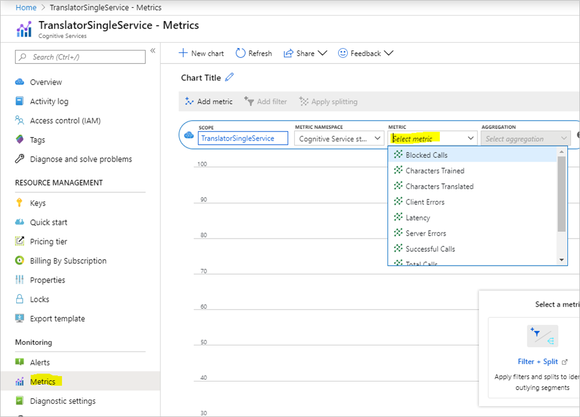

# Azure Translator in Foundry Tools v3.0

## What's new?

Version 3.0 of the Translator provides a modern JSON-based Web API. It improves usability and performance by consolidating existing features into fewer operations and it provides new features.

* Transliteration to convert text in one language from one script to another script.
* Translation to multiple languages in one request.
* Language detection, translation, and transliteration in one request.
* Dictionary to look up alternative translations of a term, to find back-translations and examples showing terms used in context.
* More informative language detection results.

## Base URLs

Requests to Translator are, in most cases, handled by the datacenter that's closest to where the request originated. If there's a datacenter failure when using the global endpoint, the request may be routed outside of the geography.

To force the request to be handled within a specific geography, use the desired geographical endpoint. All requests are processed among the datacenters within the geography.

✔️ Feature: **Translator Text** </br>

| Service endpoint | Request processing data center |
|------------------|--------------------------|
|**Global (recommended):**</br>**`api.cognitive.microsofttranslator.com`**|Closest available data center.|
|**Americas:**</br>**`api-nam.cognitive.microsofttranslator.com`**|East US 2 &bull; West US 2|
|**Asia Pacific:**</br>**`api-apc.cognitive.microsofttranslator.com`**|Japan East &bull; Southeast Asia|
|**Europe (except Switzerland):**</br>**`api-eur.cognitive.microsofttranslator.com`**|France Central &bull; West Europe|
|**Switzerland:**</br> For more information, *see* [Switzerland service endpoints](#switzerland-service-endpoints).|Switzerland North &bull; Switzerland West|

#### Switzerland service endpoints

Customers with a resource located in Switzerland North or Switzerland West can ensure that their Text API requests are served within Switzerland. To ensure that requests are handled in Switzerland, create the Translator resource in the `Resource region` `Switzerland North` or `Switzerland West`, then use the resource's custom endpoint in your API requests.

For example: If you create a Translator resource in Azure portal with `Resource region` as `Switzerland North` and your resource name is `my-swiss-n`, then your custom endpoint is `https&#8203;://my-swiss-n.cognitiveservices.azure.com`. And a sample request to translate is:

```curl
// Pass secret key and region using headers to a custom endpoint
curl -X POST "https://my-swiss-n.cognitiveservices.azure.com/translator/text/v3.0/translate?to=fr" \
-H "Ocp-Apim-Subscription-Key: xxx" \
-H "Ocp-Apim-Subscription-Region: switzerlandnorth" \
-H "Content-Type: application/json" \
-d "[{'Text':'Hello'}]" -v
```

Custom Translator isn't currently available in Switzerland.

## Virtual Network support

The Translator is now available with Virtual Network (`VNET`) capabilities in all regions of the Azure public cloud. To enable Virtual Network, *See* [Configuring Foundry Tools virtual networks](../../../../cognitive-services-virtual-networks.md?tabs=portal).

Once you turn on this capability, you must use the custom endpoint to call the Translator. You can't use the global translator endpoint ("api.cognitive.microsofttranslator.com") and you can't authenticate with an access token.

You can find the custom endpoint after you create a [translator resource](https://portal.azure.com/#create/Microsoft.CognitiveServicesTextTranslation) and allow access from selected networks and private endpoints.

1. Navigate to your Translator resource in the Azure portal.
1. Select **Networking** from the **Resource Management** section.
1. Under the **Firewalls and virtual networks** tab, choose **Selected Networks and Private Endpoints**.

   :::image type="content" source="../../../media/virtual-network-setting-azure-portal.png" alt-text="Screenshot of the virtual network setting in the Azure portal.":::

1. Select **Save** to apply your changes.
1. Select **Keys and Endpoint** from the **Resource Management** section.
1. Select the **Virtual Network** tab.
1. Listed there are the endpoints for Text translation and Document translation.

   :::image type="content" source="../../../media/virtual-network-endpoint.png" alt-text="Screenshot of the virtual network endpoint.":::

|Headers|Description|
|:-----|:----|
|Ocp-Apim-Subscription-Key| The value is the Azure secret key for your subscription to Translator.|
|Ocp-Apim-Subscription-Region| The value is the region of the translator resource. This value is optional if the resource is `global`|

Here's an example request to call the Translator using the custom endpoint

```curl
// Pass secret key and region using headers
curl -X POST "https://<your-custom-domain>.cognitiveservices.azure.com/translator/text/v3.0/translate?api-version=3.0&to=es" \
     -H "Ocp-Apim-Subscription-Key:<your-key>" \
     -H "Ocp-Apim-Subscription-Region:<your-region>" \
     -H "Content-Type: application/json" \
     -d "[{'Text':'Hello, what is your name?'}]"
```

## Metrics
Metrics allow you to view the translator usage and availability information in Azure portal. For more information, see [Data and platform metrics](/azure/azure-monitor/essentials/data-platform-metrics).



This table lists available metrics with description of how they're used to monitor translation API calls.

| Metrics | Description |
|:----|:-----|
| TotalCalls| Total number of API calls.|
| TotalTokenCalls| Total number of API calls via token service using authentication token.|
| SuccessfulCalls| Number of successful calls.|
| TotalErrors| Number of calls with error response.|
| BlockedCalls| Number of calls that exceeded rate or quota limit.|
| ServerErrors| Number of calls with server internal error(5XX).|
| ClientErrors| Number of calls with client-side error(4XX).|
| Latency| Duration to complete request in milliseconds.|
| CharactersTranslated| Total number of characters in incoming text request.|
