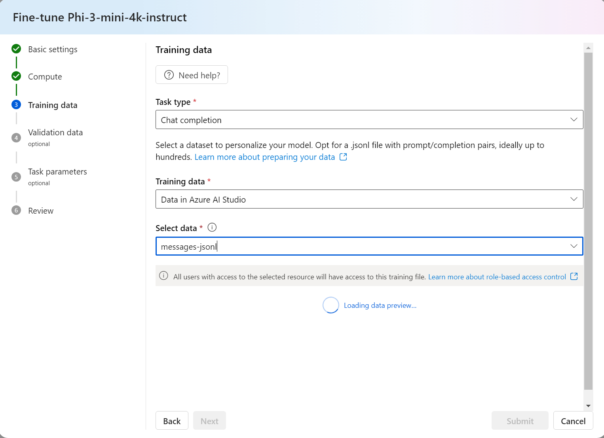

# Fine-tune using User-managed compute

This article explains how to fine-tune a machine learning model by adapting a pre-trained model to a new, related task or domain. The process involves using your own computational resources to adjust training parameters such as learning rate, batch size, and the number of training epochs, allowing you to optimize the model’s performance for specific tasks. This method is more efficient than building a model from scratch, as it leverages the pre-trained model's existing knowledge, reducing the time and data needed for training.

## Prerequisites

- An Azure subscription with a valid payment method. Free or trial Azure subscriptions won't work. If you don't have an Azure subscription, create a [paid Azure account](https://azure.microsoft.com/pricing/purchase-options/pay-as-you-go) to begin.

- An [Azure AI Studio hub](create-azure-ai-resource.md).

- An [Azure AI Studio project](create-projects.md).

- Azure role-based access controls (Azure RBAC) are used to grant access to operations in Azure AI Studio. To perform the steps in this article, your user account must be assigned the __owner__ or __contributor__ role for the Azure subscription. 

## How to fine-tune foundation models using your own training data

In order to improve model performance in your workload, you might want to fine tune a foundation model using your own training data. You can easily fine-tune these foundation models by using either the fine-tune settings in the studio or by using the code based samples.

## Fine-tune using the User-managed compute

You can access the fine-tune settings form using one of the following methods:
1.	Choose the "Fine-Tuning" option from the left menu, and then select any foundation model.

2.	Choose the "Model Card" option from the left menu for any foundation model, and then click the ‘Fine-tune’ button on the model card.
Select the suitable Service method to fine-tune your model. You can choose between 'Hosted fine-tuning' or 'User-managed compute'. If you intend to use your own compute resources, select the 'User-managed compute' option. To learn more about Fine-tuning using Serverless API, refer to the related content articles.

  > [!NOTE]
  > Some foundation models support only the 'User-managed compute' option.

### Fine-tune Settings:

#### Basic Settings

- In the basic settings, provide a name for the fine-tuned model.

#### Compute

- Provide the Azure Machine Learning Compute cluster you would like to use for fine-tuning the model. Fine-tuning needs to run on GPU compute. Ensure that you have sufficient compute quota for the compute SKUs you wish to use.

#### Training Data

1.	Pass in the training data you would like to use to fine-tune your model. You can choose to either upload a local file (in JSONL, CSV or TSV format) or select an existing registered dataset from your workspace.

2.	Once you've selected the dataset, you need to map the columns from your input data, based on the schema needed for the task. For example: map the column names that correspond to the 'sentence' and 'label' keys for Text Classification.

#### Validation data

- Pass in the data you would like to use to validate your model. Selecting Automatic split reserves an automatic split of training data for validation. Alternatively, you can provide a different validation dataset.

#### Test Parameters 

- Tuning hyperparameter is essential for optimizing large language models (LLMs) in real-world applications. It allows for improved performance and efficient resource usage. You can choose to keep the default settings or customize parameters like epochs or learning rate.

#### Review 

- Select Finish in the fine-tune form to submit your fine-tuning job. Once the job completes, you can view evaluation metrics for the fine-tuned model. You can then deploy this model to an endpoint for inferencing.

## Related Contents
- [Fine-tuning in Azure AI Studio - Azure AI Studio | Microsoft Learn](../concepts/fine-tuning-overview.md)
- [Deploy Phi-3 family of small language models with Azure AI Studio](../how-to/deploy-models-phi-3.md)