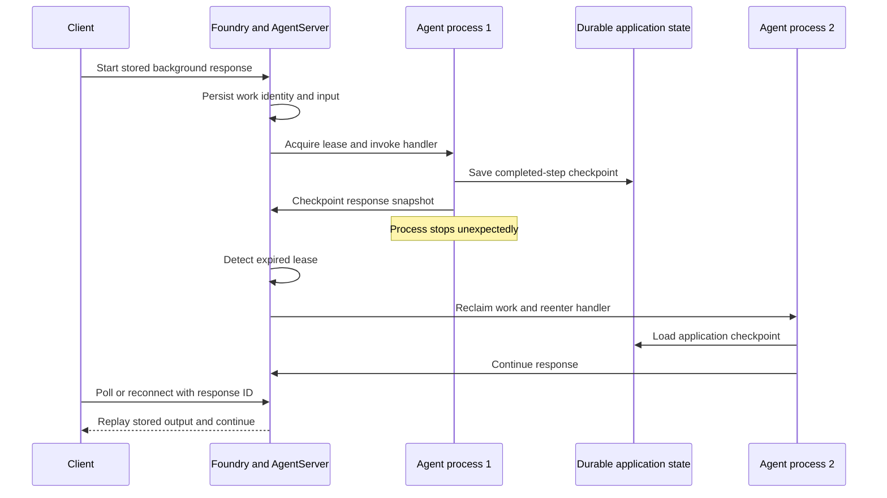

# Resilience for long-running Microsoft Foundry hosted agents (preview)

Long-running hosted agents can keep working after the request that started them disconnects. They can also recover after their hosting process stops unexpectedly. Foundry Agent Service and the AgentServer SDKs provide durable work identity, persisted inputs, lease-based recovery, and stream replay. Your agent is still responsible for preserving meaningful progress and preventing duplicate side effects.

These capabilities replace infrastructure that each agent would otherwise need
to build: a durable work queue, worker leases and heartbeats, abandoned-work
recovery, a stored response, and an event replay service. You choose the
application checkpoint boundary and how unfinished work safely runs again.

[!INCLUDE [feature-preview](../../includes/feature-preview.md)]

## Start with the recovery guarantee

For a stored background response with resilience enabled, Foundry preserves the
logical work and invokes your handler again when the process that owned the work
disappears. The recovered handler receives the persisted input and the same
logical work identity.

Design the handler for **at-least-once execution from its last durable
boundary**. The runtime doesn't restore process memory, the call stack, local
variables, or an external operation that completed without a durable record.

| Event | What Foundry guarantees | What your application must handle |
| --- | --- | --- |
| The initiating client disconnects. | Stored background work continues, and the client can poll or reconnect by using the response ID. | Retain the response ID or stream cursor. |
| The hosting process stops. | After the lease expires, another process can reclaim the same work and reenter the handler with the persisted input. | Restore application progress from a checkpoint or safely rerun the unfinished step. |
| The process stops inside a step. | The runtime task record and last durable response checkpoint remain available. | Expect the unconfirmed step to run again. |
| An external operation commits before the next checkpoint. | Foundry recovers the agent work, but it doesn't roll back or deduplicate the external operation. | Use a stable idempotency key or reconcile the operation before retrying it. |

For the Responses protocol, the complete behavior requires three separate
opt-ins:

| Setting | Owner | What it enables |
| --- | --- | --- |
| `store=true` | Client request | Persists the response and its retained events under a response ID. |
| `background=true` | Client request | Lets execution continue without the initiating HTTP connection. |
| `resilient_background=True` | Agent server | Lets a replacement process reenter the handler after process loss. |

No individual setting implies the other two.

## Background execution and resilience

Background execution and resilience solve different problems. Background execution lets work continue without keeping the original HTTP connection open. Resilience lets a later process lifetime recover work after a restart, crash, out-of-memory termination, or redeployment.

| Capability | What it provides | What it doesn't provide |
| --- | --- | --- |
| Background execution | Asynchronous work that clients can poll or reconnect to. | Recovery after the process that owns the work stops. |
| Resilient execution | Durable work identity, persisted input, process-loss detection, and handler reentry. | Automatic preservation of every intermediate application state or side effect. |
| Stream replay | Retained events that reconnecting clients can receive from a cursor. | A checkpoint of the agent's internal workflow state. |

For the Responses protocol, full crash recovery applies only to stored background responses when the server opts in to resilient background execution. Foreground responses remain tied to the client connection and aren't reinvoked after a process interruption.

For the Invocations protocol, your application defines the request, response,
and status contract. Use the AgentServer resilient task primitive to preserve
execution, and expose the polling or streaming behavior that your clients need.

Client reconnect by response ID is specific to the Responses protocol. An
Invocations client reconnects through the invocation or stream identity and
replay endpoint that your application defines.

## Resilient work model

A resilient unit of work has two identities:

- A **work identity** names the logical job or multi-turn conversation.
- An **input identity** names one input or turn within that work.

Before a handler starts, the runtime persists its input and acquires a lease on the work record. While the handler runs, the runtime renews the lease. If the process stops and abandons the lease, a later process can reclaim the record and invoke the registered handler with the same identities and input.

Recovery reenters the handler from its beginning. It isn't deterministic replay, and it doesn't restore local variables or an in-memory call stack. The handler uses durable checkpoints or watermarks to determine which work is already complete.

Recovery also differs from retry. A retry handles a failure reported by the running handler and can consume retry budget. Recovery continues the same durable attempt after its process disappears.

## Understand who owns recovery state

Resilience uses several durable records. They have different owners and
lifetimes.

| Component | State it manages | What happens after process loss |
| --- | --- | --- |
| Client | Response ID and last applied stream cursor. | The client polls or reconnects to the same stored response. |
| AgentServer | Work and input identities, serialized input, status, lease state, and recovery bookkeeping. | AgentServer detects the expired lease and reenters the handler. This record isn't an application checkpoint. |
| Responses protocol | Response ID and status, the last checkpointed response snapshot, response-internal metadata, and retained events. | The recovered handler restores the snapshot, and the client replays retained output. |
| Your framework or application | Workflow state, completed-step results, tool state, or a reference to larger data. | Your handler loads the checkpoint and selects the first unconfirmed step. |
| Foundry session storage | The session's `$HOME`, including files placed there through the `/files` endpoint. | Foundry restores the filesystem when the same session resumes. Other sessions can't access it. |
| Process | Memory, local variables, call stack, open handles, and unflushed buffers. | The state isn't preserved. Reconstruct it on every handler entry. |

`$HOME` is persistent **per session**, not per agent. Processes running in the
same session sandbox can access the same files. A different session receives a
different filesystem. Foundry deletes a session after 30 days of inactivity.
Use [session storage](hosted-agents.md#session-storage) for session-scoped files
and [Foundry State Store](agent-state-store.md) for JSON state that must persist
independently of session compute or support explicit user isolation.

Foundry doesn't commit a `$HOME` file update and a framework or response
checkpoint as one transaction. A file can become visible before the workflow
checkpoint advances, so a recovered step might run again against the newer
file. Use versioned or retry-safe file updates, or keep correctness-critical
progress in a transactional application store.

## Work shapes

Choose a work shape based on the lifetime and concurrency of the operation.

| Shape | Use when | Lifecycle |
| --- | --- | --- |
| One-shot resilient work | One operation must survive a process interruption. | One input produces one result, and the work can be removed after it reaches a terminal state. |
| Multi-turn chain | A conversation or agent session accepts multiple inputs over time. | One work identity remains active across turns until the application deletes it or its retention period expires. |

Calls that use the same one-shot work identity converge on the same logical operation instead of executing duplicate work. A multi-turn chain accepts turns sequentially. *Steering* is an optional mode that lets a newer turn queue behind the active turn and signal the current handler to finish early, so a conversation can redirect without starting a second concurrent handler.

## Platform and application responsibilities

The runtime preserves execution metadata. Your application preserves domain
progress. This division removes the need to provision a separate queue,
heartbeat service, recovery dispatcher, response store, and replay log for
each agent.

| Foundry and the AgentServer SDK provide | Your agent provides |
| --- | --- |
| Durable work and input identities. | Stable identifiers that map to your job or conversation model. |
| Input persistence before handler execution. | Inputs that fit the task payload limit, with large data stored externally. |
| Lease-based process-loss detection and handler reentry. | A safe rerun path or a recovery branch that resumes from durable progress. |
| Framework-owned recovery payload and response snapshots. | Checkpoint references, idempotency keys, and side-effect state in application-owned durable storage. |
| Conversation locking and optional steering queues. | User-visible behavior for queued, rejected, interrupted, and canceled turns. |
| Event retention and cursor-based replay. | Per-turn stream identities and reconnect-aware clients. |
| Cleanup of terminal or expired runtime records. | Cleanup of external checkpoints, sessions, and application data. |

## Preserve agent progress

The runtime task record isn't application storage. Keep application progress in
one of these locations:

- Use a response checkpoint for the current response snapshot. Store a small
  response-local resume hint in `stream.internal_metadata` when needed.
- Use Foundry State Store or another application store for completed-step
  results, framework checkpoints, idempotency keys, and references to larger
  data.
- Use session `$HOME` for files that belong only to that session.

Write the application result first, then advance the checkpoint that points to
it. Updating a progress reference doesn't save local variables or commit the
external work that the reference describes.

Choose one of these recovery strategies based on where progress lives:

| Strategy | Where progress lives | Recovery behavior |
| --- | --- | --- |
| Safe rerun | The operation is inexpensive and repeatable. | Run the handler again from the beginning. |
| Response checkpoints | Persisted response snapshots mark completed phases. | Restore the latest snapshot and continue after its completed output items. |
| Upstream-owned resume | An agent framework or application store owns checkpoints. | Resume the upstream session or workflow from its latest durable state. |

Any strategy can carry a stable operation ID for an external side effect. A
recovered handler uses that ID to retry through a downstream idempotency API or
to query whether the operation already committed.

## Replay streamed output

Use a separate stream identity for each request or turn. Don't reuse a multi-turn work identity as the stream identity because a completed stream closes while the conversation can continue with later turns.

Replayable streams retain events and assign cursors that clients use when they reconnect. A persistent replay backing also lets a recovered producer find its last emitted cursor and continue with the next event.

For a recovered Responses stream, a later `response.in_progress` event is a snapshot reset. A client replaces its locally accumulated output with the snapshot in that event, discards partial output that isn't in the snapshot, and then applies subsequent events. Output indexes identify slots in the current snapshot; they aren't guaranteed to increase across recovery attempts.

## Handle cancellation and shutdown

Cancellation and shutdown are cooperative. The runtime signals the handler, and the handler decides whether to return a partial result, finish normally, cancel, or defer unfinished work for recovery.

Treat graceful shutdown differently from failure. If the handler can't finish during the shutdown window, defer the work without writing a terminal state. A later process can then reclaim and reenter it.

When steering is enabled, queued input can also signal the current turn to wind down. The conversation remains sequential: steering doesn't create a fork or let two turns modify the same conversation concurrently.

## Design boundaries

Resilient tasks don't provide deterministic replay, workflow orchestration, or bulk storage. They compose with these systems instead.

- Use an agent framework checkpointer for graph state and human-in-the-loop suspension.
- Use a workflow engine for fan-out, fan-in, durable timers, or child workflows.
- Use application storage for large inputs, generated artifacts, and external state.
- Use idempotency support from downstream services whenever it's available.

Design each handler so that process loss at any point leads to one of two outcomes: the operation safely runs again, or durable state identifies the exact boundary from which it resumes.

## Related content

- [Hosted agents in Foundry Agent Service](hosted-agents.md)
- [Durable state store for hosted agents](agent-state-store.md)
- [Hosted agent runtime contract](hosted-agent-contract.md)
- [Add a protocol adapter to your hosted agent](../how-to/add-protocol-adapter.md)
- [Bring-your-own hosted agent samples](https://github.com/microsoft-foundry/foundry-samples/tree/main/samples)