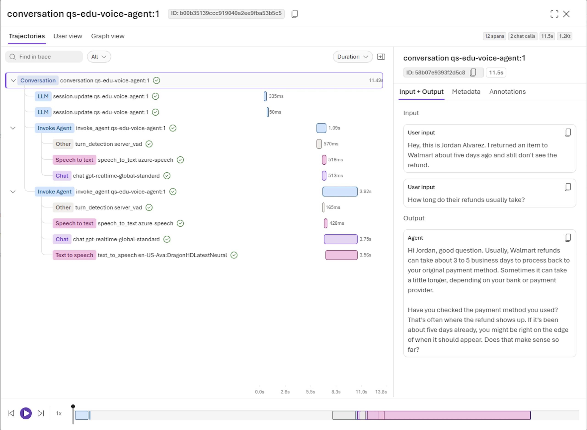
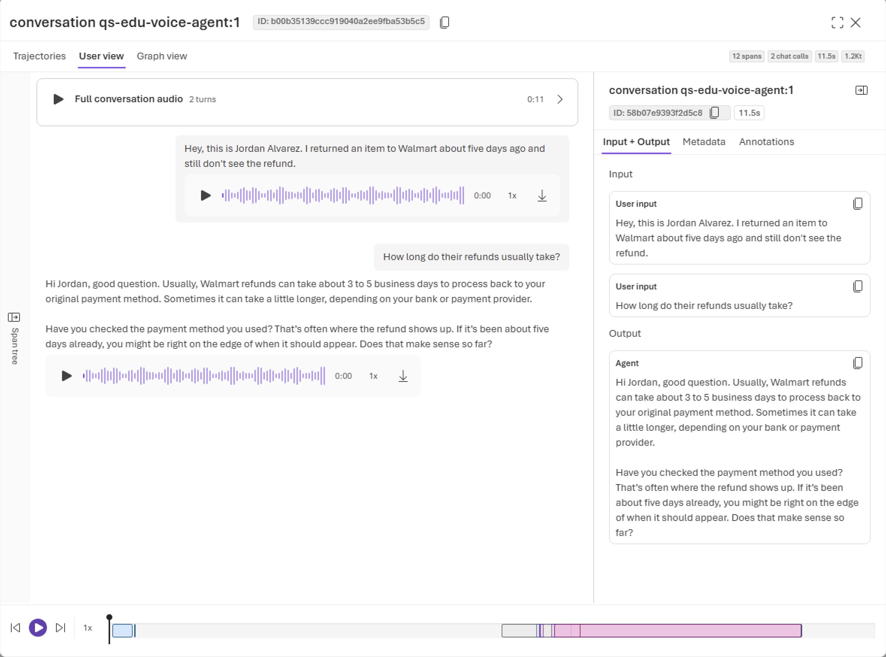
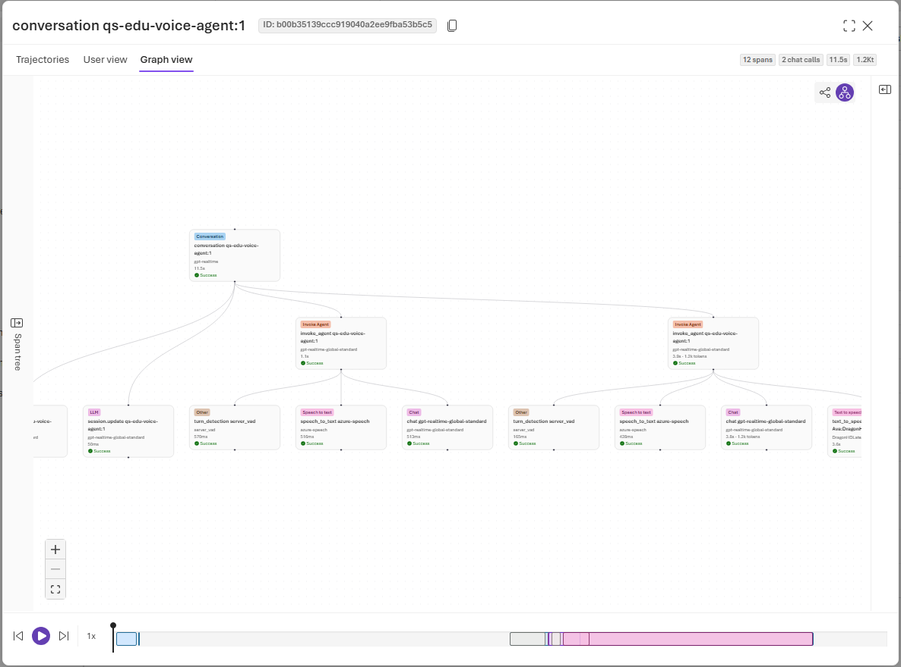
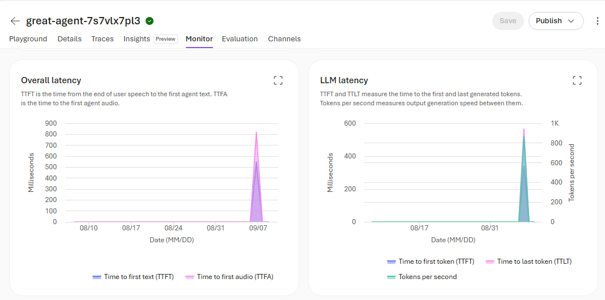
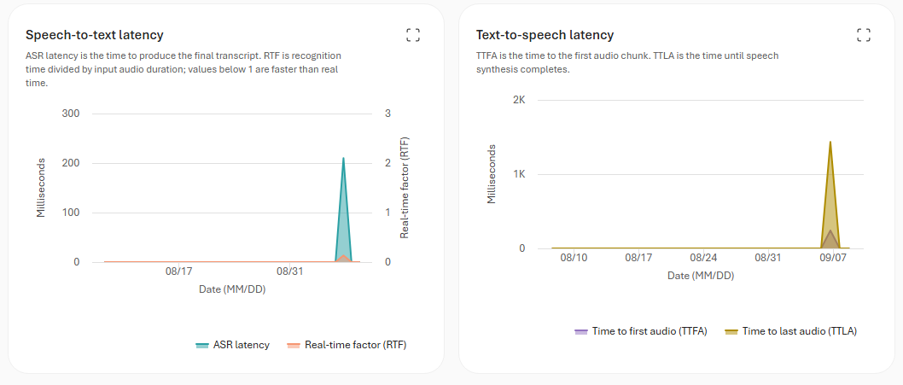
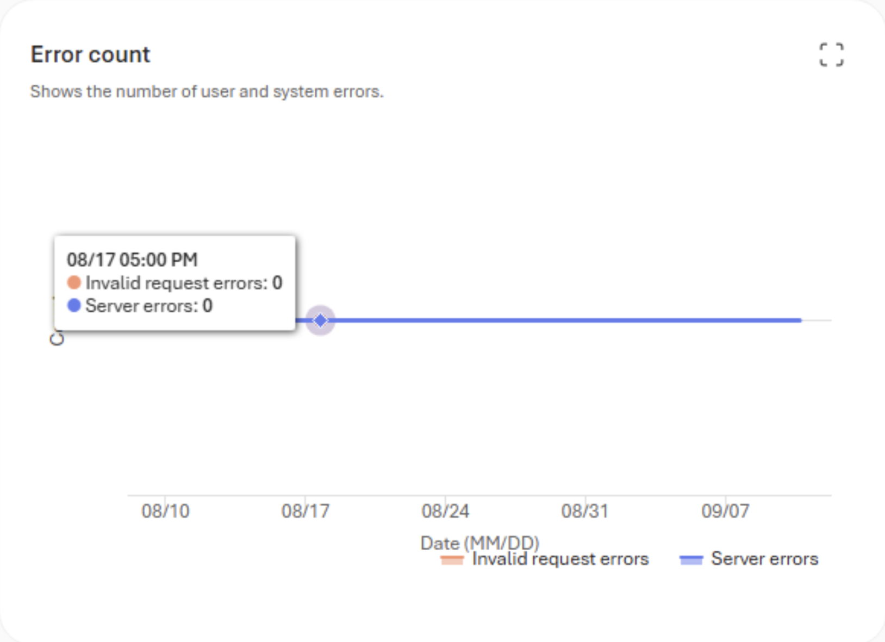

# Voice agent tracing, monitoring, and evaluation

Voice-based agents use the same observability and evaluation stack as other agents in Microsoft Foundry Agent Service. They use the same Application Insights connection, OpenTelemetry data, tracing tools, monitoring dashboard, and transcript-based evaluators.

This article describes only what is different for voice-based agents. For standard setup and workflows, use the linked Foundry observability articles.

[!INCLUDE [feature-preview](../../includes/feature-preview.md)]

## What's different for voice-based agents

| Area | What's different for voice |
| --- | --- |
| **Traces** | A trace represents a voice conversation and includes voice-pipeline operations, turn events, transcripts, and audio references when content capture is enabled. The replay experience can present both a technical span view and a conversation-oriented user view. |
| **Monitoring** | Voice dashboards emphasize time to first audio and provide separate charts for overall, model, speech-to-text, and text-to-speech latency. |
| **Evaluation** | Voice-based agents support dataset-based and trace-based evaluation with the standard transcript-based evaluators. Simulation-based evaluation adds voice synthesis, audio effects, and simulated interruption behavior. |
| **Conversation storage** | Tracing and conversation storage are separate. To read transcripts, event timelines, and audio from the agent endpoint after a session, [enable conversation storage](../how-to/configure-voice-agent.md#persist-conversations) on the agent. |

### Check access boundaries

Tracing, trace viewing, annotation writes, evaluation submission, and service-side trace reads are separate authorization operations:

- The signed-in user or application identity submits an evaluation and invokes its target.
- The Foundry project managed identity emits Foundry Agent Service server-side traces when the Application Insights connection uses project managed identity authentication.
- A hosted agent can use its own agent identity when its code emits telemetry.
- Human trace viewing requires **Log Analytics Reader**. Protected tables also require **Privileged Monitoring Data Reader** at the applicable scope.

Use [Foundry RBAC](../../concepts/rbac-foundry.md) for project and agent access, [trace setup](../../observability/how-to/trace-agent-setup.md) for Application Insights access, and [Microsoft Entra-authenticated trace ingestion](../../observability/how-to/trace-ingestion-entra-authentication.md) for telemetry-writer permissions. Protected trace content requires the additional access described in [Manage sensitive content in traces](../../observability/how-to/traces-sensitive-content.md).

Viewing a trace doesn't grant permission to save an annotation. Builder annotations are submitted from the trace detail page in the Foundry portal and are automatically tagged with a source of `builder`.

For trace evaluations, assign **Reader** to the project managed identity on the connected Application Insights resource. For protected trace tables, also assign **Privileged Monitoring Data Reader**. If the linked workspace requires workspace permissions, assign the applicable Log Analytics reader role on that workspace. For detailed role requirements, see [Add permissions for trace-based workflows](../../observability/how-to/evaluation-permissions.md#add-permissions-for-trace-based-workflows).

## Trace a voice-based agent

[Voice traces](../../observability/how-to/trace-agent-setup.md) flow to the Application Insights resource connected to your Foundry project. You don't need a voice-specific exporter or Application Insights connection.

A voice session produces one trace. The trace can contain a span for each conversational turn and child spans for the stages of that turn, including model calls, tool calls, speech recognition, speech synthesis, and voice activity detection. Voice telemetry can also record signals such as time to first audio and caller interruptions.

### Trace views

In the [**Traces** tab](../../observability/how-to/trace-agent-replay.md):

- Each trace represents one conversation. The **Responses** view and Response ID column don't appear because voice traces don't have a Responses API `response_id`.
- **Trajectories** shows the voice pipeline as a span tree and waterfall timeline.
- **User view** shows caller and agent turns, links each turn to its span, and provides audio playback when audio is available.

The **Trajectories** view shows the duration and hierarchy of each voice-pipeline stage for every turn.

The **User view** combines transcripts with full-conversation and per-turn audio playback.

The **Graph view** displays the relationships between the conversation, agent turns, and voice-pipeline operations.

Audio is requested only when you use playback or download. Foundry checks access before enabling those controls.

> [!WARNING]
> Audio, transcripts, model content, and tool data can contain personal, confidential, biometric, financial, health, or other regulated information. Apply appropriate notice, consent, access, retention, and download controls.

### Transcripts and audio

The system doesn't capture transcripts and audio references by default. Treat [content capture](../../observability/how-to/traces-sensitive-content.md) as a privacy decision rather than only a debugging setting. Anyone who can read the connected Application Insights resource and protected telemetry can read captured content, subject to the configured access controls.

For composed voice pipelines, user transcripts typically come from speech recognition. Realtime speech-to-speech models can emit input and output transcripts directly. The trace view uses the transcript and audio references available in the emitted telemetry.

Audio remains in voice-agent-owned storage and is referenced from the trace. Application Insights stores the telemetry reference, not the audio recording itself.

### What's the same as other agents

Application Insights setup, trace search, time filters, annotations, tool-call inspection, and the underlying OpenTelemetry pipeline work the same way as they do for other agents.

| Task | Article |
| --- | --- |
| Connect Application Insights and start tracing | [Set up tracing for agents](../../observability/how-to/trace-agent-setup.md) |
| Understand agent trace structure and semantics | [Agent tracing overview](../../observability/concepts/trace-agent-concept.md) |
| Understand trace data and storage | [Trace data](../../observability/concepts/trace-data.md) |
| Control sensitive-content capture | [Manage sensitive content in traces](../../observability/how-to/traces-sensitive-content.md) |
| Add human feedback to a trace | [Annotate traces](../../observability/how-to/trace-annotations.md) |
| Use trace replay | [Replay agent traces](../../observability/how-to/trace-agent-replay.md) |
| Troubleshoot tracing | [Troubleshoot observability](../../observability/how-to/troubleshooting.md) |

## Monitor a voice-based agent

Voice-based agents appear in the same [agent monitoring dashboard](../../observability/how-to/how-to-monitor-agents-dashboard.md) as other agents. The voice dashboard adds signals that show whether the spoken interaction feels responsive and where delay enters the pipeline.

### Summary metrics

| Metric | What it shows |
| --- | --- |
| **Average time to first audio** | Average time from the start of a caller turn until the first agent audio is returned. |
| **Total sessions** | Number of recorded voice sessions. |
| **Total and average session duration** | How long callers spend in voice sessions. |
| **Total turns and average turns per session** | Conversation depth and possible repetition. |
| **Audio token usage** | Input, output, and cached audio token categories when the selected model emits them. |

Time to first audio is the most customer-visible voice latency measure. If it shows `NaN`, telemetry was found but no valid sample could be calculated for the selected period. It doesn't mean zero seconds.

### Latency charts

The voice monitoring dashboard provides separate charts for each part of the voice pipeline:

| Chart | What it shows |
| --- | --- |
| **Overall latency** | Time to first text (TTFT), measured from the end of voice activity detection to the first generated token, and time to first audio (TTFA), measured from the end of voice activity detection to the first agent audio. |
| **LLM latency** | Time to first token (TTFT), time to last token (TTLT), and tokens per second. |
| **Speech-to-text latency** | Speech-recognition latency (ASR) and real-time factor (RTF). RTF is recognition time divided by input audio duration; values below 1 are faster than real time. |
| **Text-to-speech latency** | Time to first audio chunk (TTFA) and time to last audio (TTLA), when speech synthesis finishes. |

Use the **Overall latency** and **LLM latency** charts to compare response latency with model generation latency and speed.

Use the **Speech-to-text latency** and **Text-to-speech latency** charts to compare recognition and synthesis latency.

The error chart separates invalid request errors from server errors.

### What's the same as other agents

Time-range selection, agent and version filters, traffic and token trends, tool usage, error rate, drill-through to traces, and Application Insights retention and billing behavior are unchanged. See [Monitor your agents](../../observability/how-to/how-to-monitor-agents-dashboard.md).

The **Insights** and **ROI** tabs aren't currently available for voice-based agents. [Recurring evaluations](../../observability/how-to/how-to-monitor-agents-dashboard.md#create-a-recurring-evaluation) are supported on a fixed schedule, but event-triggered evaluations aren't supported for full-conversation voice evaluation.

## Evaluate a voice-based agent

Voice-based agent evaluation uses text transcripts and the standard Foundry evaluators. These evaluators can assess intent resolution, task adherence, tool-call accuracy, coherence, relevance, groundedness, and content safety. They don't assess pronunciation, prosody, echo, background noise, audio quality, or interruption timing.

### Evaluation workflows

Voice-based agents support three evaluation workflows:

| Workflow | Voice-based agent behavior |
| --- | --- |
| [**Dataset-based evaluation**](../../observability/how-to/cloud-evaluation-conversations.md) | Evaluate stored voice conversation transcripts from a JSONL dataset by using the standard turn-level or conversation-level evaluators that support the selected evaluation level. |
| [**Trace-based evaluation**](../../observability/how-to/cloud-evaluation-deployed-conversations.md) | Evaluate existing voice conversations ingested from Application Insights. Select conversations by trace ID, conversation ID, or agent and time-based filters. |
| [**Simulation-based evaluation**](../../observability/how-to/cloud-evaluation-simulate-conversations.md) | Generate voice conversations from test scenarios, run them against the voice agent, and apply conversation-level evaluators to the resulting transcripts. Voice simulation adds a text-to-speech voice, audio effects, and simulated user interruption behavior. |

Each eligible voice trace is treated as one conversation row. Telemetry typically takes several minutes to ingest. If a recent conversation isn't listed, wait for ingestion and extend the selected time range beyond the conversation time.

> [!NOTE]
> **No trace data found** doesn't uniquely identify a permissions problem. Check the connected Application Insights resource, ingestion delay, time range, agent and version filters, and the identity used to read traces before changing role assignments.

### Enhanced user conversation simulation

> [!NOTE]
> Each identity that runs conversation simulation needs the [Foundry User role](../../concepts/rbac-foundry.md), or equivalent permissions, at the Foundry account scope.

[!INCLUDE [role-rename-note](../../includes/role-rename-note.md)]

Voice simulation uses the same scenario-driven workflow as text conversation simulation, with additional configuration for spoken interactions:

- **Voice model**: Configure the Azure standard neural voice that converts simulated user text to speech. You can also set the voice model's synthesis temperature.
- **Audio conditions**: Add background or channel effects and control their volume to test how the agent performs under different listening conditions.
- **Interruption behavior**: Simulate a user speaking while the agent responds to test how the agent handles interruptions.

For scenario sources, conversation controls, test-case overrides, generated datasets, and request examples, see [Simulate conversations with the Microsoft Foundry SDK](../../observability/how-to/cloud-evaluation-simulate-conversations.md).

Voice-agent availability doesn't guarantee that every simulator or evaluator model is available in the same region. Check [evaluation regions and limits](../../concepts/evaluation-regions-limits-virtual-network.md), and then confirm deployment availability, SKU, and quota for the target voice model, simulated-user model, and evaluator model in your project.

Synthetic text-to-voice simulation doesn't establish microphone capture, speech-recognition quality, playback quality, or interruption timing on a real device.

### What's the same as other agents

Evaluator selection, custom rubrics, cloud evaluation runs, result interpretation, and troubleshooting use the standard evaluation workflow.

| Task | Article |
| --- | --- |
| Evaluate a single-turn dataset | [Evaluate existing datasets with the Microsoft Foundry SDK](../../observability/how-to/cloud-evaluation-datasets.md) |
| Evaluate a conversation dataset | [Evaluate conversation datasets with the Microsoft Foundry SDK](../../observability/how-to/cloud-evaluation-conversations.md) |
| Evaluate single-turn traces | [Evaluate traces with the Microsoft Foundry SDK](../../observability/how-to/cloud-evaluation-deployed-interactions.md#evaluate-traces-preview) |
| Evaluate multi-turn traces | [Evaluate deployed conversations with the Microsoft Foundry SDK](../../observability/how-to/cloud-evaluation-deployed-conversations.md) |
| Evaluate an agent as a single-turn target | [Evaluate an agent target with the Microsoft Foundry SDK](../../observability/how-to/cloud-evaluation-targets.md#evaluate-an-agent-target) |
| Evaluate simulated conversations | [Simulate conversations with the Microsoft Foundry SDK](../../observability/how-to/cloud-evaluation-simulate-conversations.md) |
| Evaluate with a rubric evaluator | [Use rubric evaluators to run an evaluation](../../concepts/evaluation-evaluators/rubric-evaluators.md#use-rubric-evaluators-to-run-evaluation) |
| Evaluate with an endpoint-based custom evaluator | [Run an evaluation with an endpoint-based evaluator](../../concepts/evaluation-evaluators/custom-evaluators.md#run-an-evaluation-with-an-endpoint-based-evaluator) |

Use custom rubric criteria for voice conversation outcomes that you can judge from the transcript and trace, such as whether the agent asked one question at a time, confirmed important details, handled recognition errors without guessing, and clearly stated the final outcome.

## Read stored conversations

Tracing and conversation storage are separate. Traces describe how a session behaved. A stored conversation preserves what was said and heard.

[Set `store` to `true`](../how-to/configure-voice-agent.md#persist-conversations) on the agent definition to persist the transcript, event timeline, and raw audio. The default is `false`. Read stored conversations from `/agents/{agent_name}/endpoint/protocols/voice/conversations`, including per-turn transcripts, per-turn audio, and a merged stereo recording with the caller on the left channel and the agent on the right.

A client can override `store` for one session by using the `store` query parameter when it connects.

Deleting a stored conversation also deletes its responses, items, and audio. If you use bring-your-own storage, the service returns recordings as a URI in your storage account, and Azure RBAC on that account governs access.

Application Insights retention controls trace telemetry, not the lifecycle of separately stored voice conversations and audio.

The `store` query parameter controls storage for the session being connected. This session override doesn't create or update an agent version.

Stored voice conversations and Microsoft-managed audio are retained for 60 days. For more information, see [Default service limits](limits-quotas-regions.md#default-service-limits).

## Related content

- [Configure a voice agent](../how-to/configure-voice-agent.md)
- [Best practices for voice-based agents](voice-agent-best-practice.md)
- [Pricing for voice-based agents](voice-agent-pricing.md)
- [Quickstart: Create a voice-based prompt agent](../quickstarts/prompt-voice-agent.md)
- [Azure Monitor Application Insights](/azure/azure-monitor/app/app-insights-overview)
