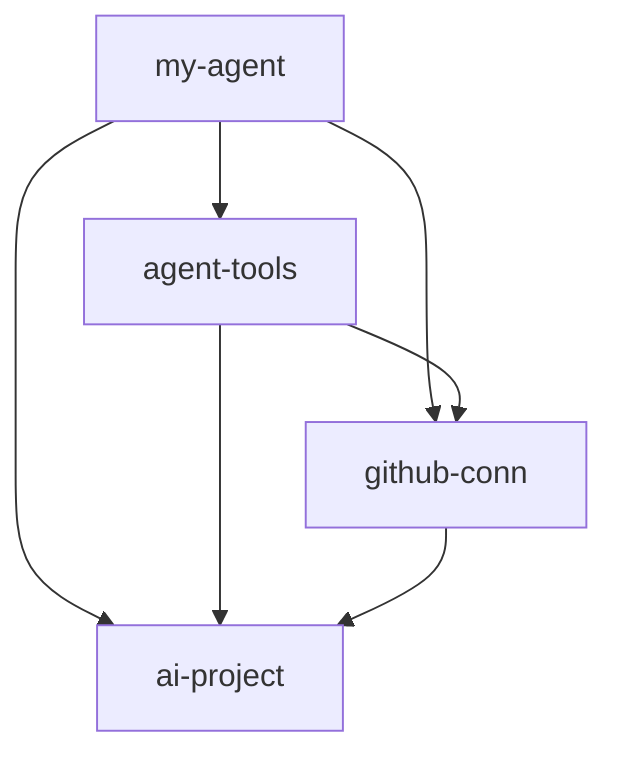

# Author azure.yaml for hosted agents

[!INCLUDE [feature-preview](../../includes/feature-preview.md)]

A hosted agent project keeps all its configuration in a single `azure.yaml` file at the project root. This file declares your Foundry resources - the project, model deployments, connections, toolboxes, and the agent itself - as a set of services. It also tells the Azure Developer CLI (`azd`) how to provision and deploy them. This article walks through each part of `azure.yaml` you're likely to edit: the project and its model, the agent service, tools, and how the agent deploys. You typically start from a file that `azd ai agent init` generates, so each section shows one block at a time to help you find and edit it.

For a field-by-field description of every service and property, see [azure.yaml reference for hosted agents](../concepts/azure-yaml-reference.md).

## Prerequisites

* An Azure subscription with permission to create resources, such as the Contributor role on the target subscription or resource group.
* The [Azure Developer CLI Foundry extensions](install-cli-foundry-extensions.md) installed.
* An authenticated Azure session (`azd auth login`).
* A hosted agent project. To scaffold one, see [Initialize a hosted agent project](init-agent-project.md).
* Sufficient model quota in your target region for the deployment you declare.
* Docker installed and running, but only if you deploy with `container` mode or build from a `Dockerfile`. Code deployment doesn't require Docker.

## Understand the structure

Every entry under `services` is a named service with a `host` field that identifies the kind of Foundry resource it declares. Services reference each other through the `uses` field, which forms a dependency graph that `azd` resolves when it provisions and deploys. A minimal project has two services: an `azure.ai.project` service that owns the model deployment, and an `azure.ai.agent` service that depends on it.

```yaml
# yaml-language-server: $schema=https://raw.githubusercontent.com/Azure/azure-dev/main/schemas/v1.0/azure.yaml.json
name: my-agent-project

services:
    ai-project:
        host: azure.ai.project
        # ... model deployments

    my-agent:
        host: azure.ai.agent
        uses:
            - ai-project
        # ... agent configuration
```

The first line is a schema annotation that turns on validation and autocompletion in editors that support the YAML language server.

## Start from a generated file

You rarely start with an empty file. When you run `azd ai agent init`, the CLI writes an `azure.yaml` for you, either from a template, from a sample's `azure.yaml` that you pass with `-m`, or wrapped around your existing code. The command is interactive and prompts for values such as the Foundry project, model deployment, and agent name. Open the generated file and adjust it to match your agent. The rest of this article explains each part you're likely to change.

## Declare the project and a model deployment

The `azure.ai.project` service provisions (or connects to) a Foundry project and owns its model deployments. Add a deployment under `deployments`:

```yaml
services:
    ai-project:
        host: azure.ai.project
        deployments:
            - name: gpt-5.4-mini
              model:
                format: OpenAI
                name: gpt-5.4-mini
                version: "2026-03-17"
              sku:
                name: GlobalStandard
                capacity: 10
```

To connect to an existing project instead of provisioning a new one, set the `endpoint` field to the project's endpoint URL and omit any deployments you don't want `azd` to manage.

The model version and SKU are illustrative. When you run `azd ai agent init`, the CLI resolves the current values from the model catalog.

To reference the deployment from your agent, expose the deployment name as an environment variable. During `azd ai agent init`, the CLI records the deployment name you select in your `azd` environment as `AZURE_AI_MODEL_DEPLOYMENT_NAME`, and the agent reads it with `${AZURE_AI_MODEL_DEPLOYMENT_NAME}`, as shown in the next step. To change the deployment later, run `azd env set AZURE_AI_MODEL_DEPLOYMENT_NAME <deployment-name>`.

## Configure the agent service

The `azure.ai.agent` service carries the agent definition. Set `kind: hosted` for a containerized agent built from source, point `project` at the source directory, and declare the protocol the agent implements:

```yaml
    my-agent:
        host: azure.ai.agent
        project: src/my-agent
        language: docker
        uses:
            - ai-project
        kind: hosted
        name: my-agent
        description: A hosted agent built from source.
        protocols:
            - protocol: responses
              version: 2.0.0
        env:
            AZURE_AI_MODEL_DEPLOYMENT_NAME: ${AZURE_AI_MODEL_DEPLOYMENT_NAME}
        startupCommand: python main.py
        container:
            resources:
                cpu: "0.25"
                memory: 0.5Gi
```

The `src/my-agent` directory holds your agent code and, for container builds, a `Dockerfile`. Running `azd ai agent init` scaffolds both. See [Initialize a hosted agent project](init-agent-project.md).

Key fields to set:

* **`language`** identifies the build language. Use `docker`. The example shows the container build path (`Dockerfile`, `startupCommand`, and `container.resources`); deploy mode is a separate choice, described in [Choose a deploy mode](#choose-a-deploy-mode).
* **`kind`** sets the agent kind. Use `hosted` so Foundry builds and runs your agent source, in either deploy mode.
* **`uses`** lists the services this agent depends on. Start with the project, then add connections and toolboxes as you introduce them.
* **`protocols`** declares the HTTP contract the agent serves. Use `responses` for the OpenAI Responses API; `invocations` and `a2a` are also available.
* **`env`** passes environment variables to the container. Use `${VAR_NAME}` to read values from your active `azd` environment (`.azure/<env>/.env`). Variables you define use your own names; platform-injected variables use the reserved `FOUNDRY_` prefix, such as `FOUNDRY_PROJECT_ENDPOINT`.
* **`startupCommand`** starts the agent server. `azd ai agent run` uses it locally, and the container uses it at startup.
* **`container.resources`** sets CPU and memory. Set `cpu` from `"0.25"` to `"4.0"` and `memory` from `0.5Gi` to `8.0Gi`.

> [!NOTE]
> Don't declare `FOUNDRY_PROJECT_ENDPOINT` in `env`. The platform injects it into hosted containers automatically, and `azd ai agent run` sets it for local development.

## Add a connection

A connection links your project to an external resource, such as a remote Model Context Protocol (MCP) server or a search index. Declare it as an `azure.ai.connection` service whose key is the connection name, and depend on the project:

```yaml
    github-conn:
        host: azure.ai.connection
        uses:
            - ai-project
        category: RemoteTool
        target: https://api.githubcopilot.com/mcp
        authType: CustomKeys
        credentials:
            Authorization: ${GITHUB_PAT}
```

Store secret values in your `azd` environment and reference them with `${VAR}` rather than hardcoding them. Set the secret with `azd env set GITHUB_PAT <value>`.

## Add a toolbox and wire it to the agent

A toolbox is a named bundle of tools that the agent uses at runtime. Declare an `azure.ai.toolbox` service, list its tools, and point connection-backed tools at a connection service:

```yaml
    agent-tools:
        host: azure.ai.toolbox
        uses:
            - ai-project
            - github-conn
        description: Web search and GitHub MCP tools.
        tools:
            - type: web_search
            - type: mcp
              connection: github-conn
```

Then wire the toolbox into the agent by adding its service name to both the agent's `uses` list and its `toolboxes` list:

```yaml
    my-agent:
        host: azure.ai.agent
        uses:
            - ai-project
            - github-conn
            - agent-tools
        toolboxes:
            - agent-tools
        # ... rest of the agent configuration
```

## Split large definitions with $ref

As a project grows, you can move a service or a list entry into its own file and include it with `$ref`. Relative paths resolve from the file that contains the reference:

```yaml
    triage:
        host: azure.ai.agent
        uses:
            - ai-project
        $ref: ./agents/triage.yaml
```

File includes keep `azure.yaml` readable and let you share definitions across projects. Remote URLs aren't supported.

## Choose a deploy mode

**Deploy mode is a separate choice from the `language: docker` build setting.** A hosted agent deploys in one of two modes:

| Mode | What it does | Default for | Docker required | Agent-service fields |
| ---- | ------------ | ----------- | --------------- | -------------------- |
| `code` | Uploads your source as a ZIP and builds it remotely. | Python and .NET projects | No | `azd` adds a `codeConfiguration` block with the runtime and entry point. |
| `container` | Builds a Docker image from your `Dockerfile` and deploys it. | -- | Yes, for local builds | The `Dockerfile`, `startupCommand`, and `container.resources` shown earlier. |

Select the mode at initialization time:

```bash
azd ai agent init --deploy-mode code
```

To deploy a prebuilt image instead of building from source, set the `image` field on the agent service to the image URL. For the `codeConfiguration` fields that `code` mode uses, see [Deploy a hosted agent from source code](deploy-hosted-agent-code.md).

## Choose infrastructure

The `azd ai agent init` command doesn't use Bicep by default. It doesn't create an `infra/` directory. Instead, `azd` generates the infrastructure from your `azure.yaml` services when you provision. To create infrastructure-as-code files that you can customize and check in, eject them:

```bash
# Eject Bicep into ./infra/
azd ai agent init --infra

# Eject Terraform and set infra.provider: terraform
azd ai agent init --infra=terraform
```

When an `infra` block is present in `azure.yaml`, `azd` uses those files instead of synthesizing infrastructure.

## Complete example

The following `azure.yaml` combines every block in this article into one file: the project and its model deployment, a connection, a toolbox wired to the agent, and the hosted agent itself. It introduces no new fields. Use it to check the indentation and the cross-service `uses` references in your own file.

```yaml
# yaml-language-server: $schema=https://raw.githubusercontent.com/Azure/azure-dev/main/schemas/v1.0/azure.yaml.json
name: my-agent-project

services:
    ai-project:
        host: azure.ai.project
        deployments:
            - name: gpt-5.4-mini
              model:
                format: OpenAI
                name: gpt-5.4-mini
                version: "2026-03-17"
              sku:
                name: GlobalStandard
                capacity: 10

    github-conn:
        host: azure.ai.connection
        uses:
            - ai-project
        category: RemoteTool
        target: https://api.githubcopilot.com/mcp
        authType: CustomKeys
        credentials:
            Authorization: ${GITHUB_PAT}

    agent-tools:
        host: azure.ai.toolbox
        uses:
            - ai-project
            - github-conn
        description: Web search and GitHub MCP tools.
        tools:
            - type: web_search
            - type: mcp
              connection: github-conn

    my-agent:
        host: azure.ai.agent
        project: src/my-agent
        language: docker
        uses:
            - ai-project
            - github-conn
            - agent-tools
        kind: hosted
        name: my-agent
        description: A hosted agent built from source.
        protocols:
            - protocol: responses
              version: 2.0.0
        env:
            AZURE_AI_MODEL_DEPLOYMENT_NAME: ${AZURE_AI_MODEL_DEPLOYMENT_NAME}
        startupCommand: python main.py
        toolboxes:
            - agent-tools
        container:
            resources:
                cpu: "0.25"
                memory: 0.5Gi
```

The `uses` fields form the dependency graph that `azd` resolves at provision and deploy time. Each arrow points from a service to the service it depends on:



## Validate your azure.yaml

Confirm the file provisions and deploys as expected:

```bash
# Provision the declared resources
azd provision

# Run the agent locally
azd ai agent run
```

A successful `azd provision` prints a summary of the resources it created or reused. `azd ai agent run` builds and starts the agent locally and prints the local URL it serves the Responses API on. To confirm the agent responds, send a request to that URL or run `azd ai agent invoke --local`.

If your editor supports the YAML language server, the schema annotation at the top of the file provides autocompletion and flags basic type mismatches as you type.

## Troubleshoot

| Problem | Cause | Fix |
| ------- | ----- | --- |
| `azd provision` fails with an authorization error | You're signed out, or your account lacks permission on the target subscription. | Run `azd auth login`, and confirm you have a role such as Contributor on the subscription or resource group. |
| Model deployment fails | The model name or version isn't available, or you're out of quota in the region. | Verify the deployment's `model.name` and `model.version` exist in the catalog, and confirm quota in your target region. |
| An unknown service appears in `uses` | A name in a `uses` list doesn't match a service key. | Make sure every entry in `uses` matches a service name defined under `services`. |
| A `${VAR}` value is empty at runtime | The variable isn't set in the active `azd` environment. | Set it with `azd env set <VAR> <value>` before you provision or run. |
| `azd ai agent run` can't reach the model | The agent's deployment name or endpoint is wrong. | Confirm `AZURE_AI_MODEL_DEPLOYMENT_NAME` matches a deployment, and don't override the platform-injected `FOUNDRY_PROJECT_ENDPOINT`. |

## Clean up resources

When you're finished, delete the resources you provisioned so they don't continue to incur cost:

```bash
azd down
```

## Related content

* [azure.yaml reference for hosted agents](../concepts/azure-yaml-reference.md)
* [Initialize a hosted agent project with the Azure Developer CLI](init-agent-project.md)
* [Quickstart: Deploy your first hosted agent](../quickstarts/quickstart-hosted-agent.md)
* [Hosted agent runtime contract](../concepts/hosted-agent-contract.md)
