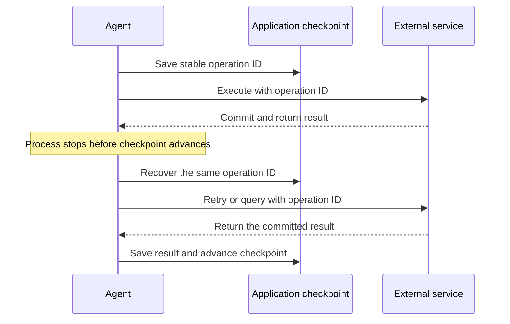

# Recover long-running work after a crash (preview)

A [long-running hosted agent](../concepts/long-running-agent-resilience.md) can be interrupted at any time by a crash, an out-of-memory kill, a redeploy, or a scale-in. This article shows how to make your agent's background responses recoverable and how to resume a recovered run from its last checkpoint.

> [!NOTE]
> Long-running agents are in preview. APIs and package versions are subject to change.

## Prerequisites

- A deployed hosted agent that uses the Responses protocol or the resilient
  task primitives.
- For Python, `azure-ai-agentserver-core` 2.1.0 or later. For Responses, also
  install `azure-ai-agentserver-responses` 2.1.0 or later.
- For a recoverable Responses request, set `store=true` and `background=true`
  in the client request.

## Enable the complete recovery path

For a Responses agent, enable all three settings. Each setting solves a
different part of the problem.

| Setting | Where to set it | Result |
| --- | --- | --- |
| `store=true` | Client request | Persists the response, response ID, and retained events. |
| `background=true` | Client request | Keeps work running after the client connection closes. |
| `resilient_background=True` | `ResponsesServerOptions` | Reenters the handler after the worker process stops. |

Create the host with process-loss recovery enabled:

```python
from azure.ai.agentserver.responses import (
    ResponsesAgentServerHost,
    ResponsesServerOptions,
)


app = ResponsesAgentServerHost(
    options=ResponsesServerOptions(resilient_background=True),
)
```

Reference: [`ResponsesServerOptions`](../concepts/long-running-agent-reference.md#resilient-responses-options)

Create each recoverable request with `store=true` and `background=true`. Save
the returned response ID. The client uses that ID to poll or reconnect; it
doesn't reconnect to the original HTTP invocation or worker process.

## Know what recovery preserves

Crash recovery reenters your handler. It doesn't resume the stopped process.

| State | Preserved after process loss? | How to use it |
| --- | --- | --- |
| Persisted request input, work ID, input ID, status, and lease state | Yes | AgentServer uses this platform-managed record to recover the same logical work. |
| Last response checkpoint and retained response events | Yes, for stored Responses work | Restore `context.persisted_response`, and let reconnecting clients replay events. |
| Session `$HOME` | Yes, for the same hosted-agent session | Store session-scoped files directly or upload them through the `/files` endpoint. Foundry restores the filesystem when the same session resumes. |
| Framework or application checkpoint | Only when your code writes it to durable storage | Restore workflow variables, completed-step results, and the next step. |
| Process memory, local variables, call stack, open handles, and unflushed buffers | No | Reconstruct them on every handler entry. |

Files under `$HOME`, including files uploaded through the `/files` endpoint,
are visible to processes in the same session sandbox. They aren't shared with
another session. Don't use `$HOME` as agent-wide shared storage. Use
[Foundry State Store](../concepts/agent-state-store.md), a database, or blob
storage when state must be independent of one session.

Foundry doesn't commit a `$HOME` file update and a response or workflow
checkpoint as one transaction. Use retry-safe, versioned file writes, or keep
correctness-critical progress in a transactional application store.

> [!IMPORTANT]
> Without `resilient_background=True`, a stored background response runs
> non-durably. If its process stops, the framework doesn't reinvoke the
> handler, and the response might remain `in_progress`. A foreground response
> isn't reentered after process loss.

## Enable invocations and task primitives

When you build directly on the task primitives, enable resilient tasks before
host startup. Declaring a `@task` or `@multi_turn_task` handler doesn't enable
the recovery subsystem:

```python
from azure.ai.agentserver.core.tasks import set_resilient_tasks_enabled

set_resilient_tasks_enabled(True)   # call at import time, before host lifespan startup
```

Reference: [Force-enable recovery](../concepts/long-running-agent-reference.md#force-enable-recovery)

The Responses reconnect endpoint doesn't apply to direct invocations. Define a
stable invocation or stream ID and expose the polling or streaming endpoint
that clients use to reconnect.

## Understand what the platform handles

Handler reinvocation applies to both supported surfaces. The stored response
and its replay endpoint are Responses-protocol capabilities.

| Behavior | Detail |
| --- | --- |
| Handler reinvocation | AgentServer reenters your handler with the same task and input identities and the persisted input. |
| Stored response | The Responses protocol preserves the latest response checkpoint and retained events. |
| Stream replay | A Responses client reconnects to the stored response. An Invocations app provides its own stream identity and replay endpoint. |
| Conversation serialization | A multi-turn task prevents two turns from modifying the same chain concurrently. |

A handler without application checkpoints reruns the whole turn. This approach
works only when repeating the turn and its external operations is safe.

## Detect a recovered entry

On reinvocation, branch on the recovery marker rather than reconstructing the original request.

# [Responses](#tab/responses)

```python
from azure.ai.agentserver.responses import (
    CreateResponse,
    ResponseContext,
    ResponseEventStream,
)


def open_response_stream(
    request: CreateResponse,
    context: ResponseContext,
) -> tuple[ResponseEventStream, int]:
    if context.is_recovery and context.persisted_response is not None:
        stream = ResponseEventStream(
            response_id=context.response_id,
            response=context.persisted_response,
        )
        return stream, len(stream.response.get("output") or [])

    return ResponseEventStream(
        response_id=context.response_id,
        request=request,
    ), 0
```

Reference: [Recovery-aware `ResponseContext`](../concepts/long-running-agent-reference.md#recovery-aware-responsecontext)

The handler starts with the returned phase index and calls
`yield stream.checkpoint()` after each completed phase. See the complete
[resilient-streaming sample](https://github.com/microsoft-foundry/foundry-samples/tree/main/samples/python/hosted-agents/bring-your-own/responses/resilient-streaming).

# [Tasks](#tab/tasks)

```python
from azure.ai.agentserver.core.storage import FoundryStateStore
from azure.ai.agentserver.core.tasks import TaskContext, multi_turn_task


async def load_last_completed_step(task_id: str) -> int:
    store = await FoundryStateStore.get_or_create(f"task-progress/{task_id}")
    async with store:
        progress = await store.get_item("progress")
    return 0 if progress is None else int(progress.value["last_done_step"])


async def get_resume_step(ctx: TaskContext[dict]) -> int:
    if ctx.entry_mode != "recovered":
        return 0

    return await load_last_completed_step(ctx.task_id)
```

Reference: [`TaskContext`](../concepts/long-running-agent-reference.md#taskcontext)

`ctx.entry_mode` is one of `"fresh"`, `"resumed"` (a later turn of a chain), or `"recovered"` (a previous lifetime didn't finish and the framework is reinvoking with the persisted input).

---

## Walk through one recovered response

Assume one response processes `A`, `B`, and `C`. It checkpoints after each
completed item and crashes while processing `B`.

| Point | Durable state | What runs next |
| --- | --- | --- |
| After `A` | The stored response contains output `A`. The application or framework checkpoint says `B` is next. | Start `B`. |
| During `B` | The process has local state for `B`, but no checkpoint confirms it. | A crash discards that local state. |
| After lease expiry | AgentServer still has the original input and stored response. | A replacement worker reenters the handler with `context.is_recovery=True`. |
| After restore | The handler restores the response snapshot and application checkpoint. | Run `B` again, then continue to `C`. |
| After client reconnect | The client uses the original response ID and last event cursor. | Replay retained output `A`, then receive new output. |

The recovery boundary is the last durable checkpoint, not the last line of code
that ran. Work after that checkpoint can run again.

The maintained
[resilient-streaming sample](https://github.com/microsoft-foundry/foundry-samples/tree/main/samples/python/hosted-agents/bring-your-own/responses/resilient-streaming)
implements this pattern with three stages and a deliberate hard-crash switch.

## Choose a resume strategy

Pick a strategy based on where your progress state lives.

| Strategy | Where progress lives | Recovery behavior |
| --- | --- | --- |
| Safe rerun | Nowhere | Rerun the whole turn when repeating every operation is safe. |
| Response checkpoint | Persisted response snapshot | Seed from `context.persisted_response`, then resume after the checkpointed output items. |
| Upstream-owned resume | Your framework or app store | Rebuild from an agent-framework checkpoint or your database. See [Manage state for long-running agents](manage-task-state.md). |
| Application checkpoint | Foundry State Store or your database | Load completed-step results and stable operation IDs before continuing. |

Prefer phase boundaries that checkpoint cleanly: complete one output item per phase, then checkpoint. If a phase crashes before its checkpoint it reruns; after the checkpoint the recovered attempt skips it.

## Protect external side effects

An agent checkpoint can't make an external operation exactly once. The process
can stop after the external system commits but before the agent advances its
checkpoint.

Use this sequence for email, payment, publication, and similar operations:

1. Derive a stable operation ID from the work ID and step name.
1. Persist the operation ID with the application checkpoint.
1. Send the operation ID to a downstream API that supports idempotency.
1. Persist the returned result.
1. Advance the workflow or response checkpoint.



On recovery, retry with the same operation ID or query the downstream system by
that ID. A Boolean `pending` or `completed` flag in application state can't, by
itself, determine whether an external commit occurred during the crash window.

## Handle graceful shutdown

Graceful shutdown is different from terminal failure. A handler that can't finish during shutdown should defer for recovery so the record stays in progress and a later lifetime reclaims it:

```python
if context.shutdown.is_set():
    await context.exit_for_recovery()
```

For a direct resilient task, check `ctx.shutdown.is_set()` and then call
`await ctx.exit_for_recovery()`.

Reference: [`exit_for_recovery`](../concepts/long-running-agent-reference.md#taskcontext)

Crash recovery reenters the same attempt state; it doesn't consume retry budget, and a wall-clock timeout doesn't reset because the process restarted.

## Related content

- [Resilience for long-running hosted agents](../concepts/long-running-agent-resilience.md)
- [Long-running agent API reference](../concepts/long-running-agent-reference.md)
- [Deploy a crash-resilient long-running agent](deploy-resilient-agent.md)
- [Manage state for long-running agents](manage-task-state.md)
- [Stream with reconnect](stream-with-reconnect.md)
