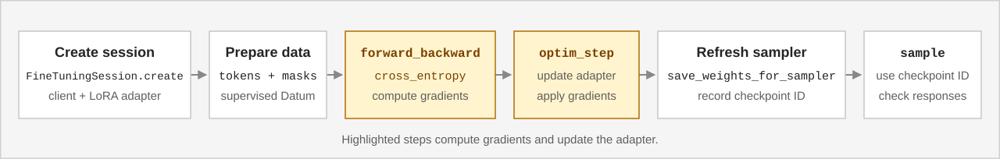

# SDK cheatsheet for interactive training (preview) in Microsoft Foundry

<a id="sdk-cheatsheet"></a>

[!INCLUDE [Interactive training preview access](../../includes/interactive-training-preview-access.md)]

Use this cheatsheet to map your training loop to the Python SDK's functions and parameters in Microsoft Foundry. The examples focus on the synchronous `FineTuningSession` convenience API. Asynchronous clients and cookbook wrappers use different interfaces and completion patterns.

## Prerequisites

- Complete [installation, authentication, and access setup](quickstart.md#install-and-configure).
- Use `azure-ai-finetuningsessions==1.0.0b1`, the public preview version installed by the cookbook.
- The **Foundry User** role for training, or the **Foundry Owner** role if you also deploy the fine-tuned model. See [Role-based access control for Microsoft Foundry](../../concepts/rbac-foundry.md).
- Select an eligible model and supported adapter configuration. Prepare tokens with its matching tokenizer and chat template.
- Set `AZURE_AI_PROJECT_ENDPOINT` and confirm an approved training budget. Creating a session and running training or sampling operations can incur charges.

The training, sampling, and checkpoint convenience methods wait for operation results. Raw operations and asynchronous helpers have different return types and completion behavior; use the full [SDK reference](#sdk-reference) for those interfaces.

The examples use the synchronous SDK unless labeled otherwise. Prepare the helper functions once, then run operations inside `with open_session() as session:`. Use real tokenized data; the snippets don't supply a dataset or implement a complete training algorithm.

## Supervised fine-tuning

Supervised fine-tuning (SFT) trains on prompts and desired responses.

[](../../media/interactive-training/supervised-training-workflow.svg)

The sequence is **create > prepare supervised data > forward/backward > optimizer step > evaluate > checkpoint**. Sampling isn't required for every supervised batch.

## Reinforcement learning

Reinforcement learning (RL) trains from scored model responses.

[](../../media/interactive-training/reinforcement-training-workflow.svg)

The sequence is **create > refresh sampler > collect rollouts > compute rewards and advantages > forward/backward > optimizer step**. Repeat from sampler refresh to collect responses from the updated policy.

Grouping, grading, and advantage computation belong in your driver, not an automatic SDK training algorithm. For complete training examples, explore the [fine-tuning samples repository](https://github.com/microsoft-foundry/fine-tuning).

## Create a session

`FineTuningSessionClient` connects to your project using an `endpoint` and `credential`. `FineTuningSession.create` initializes a model and adapter and starts the session heartbeat.

This helper authenticates with `DefaultAzureCredential`, creates a session, and unloads it when its context exits. Use your approved model and LoRA rank. The explicit credential scope is for Microsoft Entra authentication.

```python
import os
from collections.abc import Iterator
from contextlib import contextmanager

from azure.ai.finetuningsessions import (
    FineTuningSession,
    FineTuningSessionClient,
)
from azure.ai.finetuningsessions.models import LoRAConfig
from azure.identity import DefaultAzureCredential


@contextmanager
def open_session() -> Iterator[FineTuningSession]:
    with DefaultAzureCredential() as credential:
        with FineTuningSessionClient(
            endpoint=os.environ["AZURE_AI_PROJECT_ENDPOINT"],
            credential=credential,
            credential_scopes=["https://ai.azure.com/.default"],
        ) as client:
            session = FineTuningSession.create(
                client,
                base_model="Qwen/Qwen3.8-27B",
                lora_config=LoRAConfig(rank=32),
                type="training",
                timeout_sec=600.0,
            )
            try:
                print("Session:", session.session_id)
                yield session
            finally:
                session.close()
```

Reference: [FineTuningSession.create](/python/api/azure-ai-finetuningsessions/azure.ai.finetuningsessions.finetuningsession?view=azure-python-preview&preserve-view=true#azure-ai-finetuningsessions-finetuningsession-create), [FineTuningSessionClient](/python/api/azure-ai-finetuningsessions/azure.ai.finetuningsessions.finetuningsessionclient?view=azure-python-preview&preserve-view=true), and [DefaultAzureCredential](/python/api/azure-identity/azure.identity.defaultazurecredential).

Expect a session identifier after model loading completes. Keep the session open for the operations below; closing its context stops the heartbeat and submits an unload request.

| Parameter | Meaning |
| --- | --- |
| `base_model` | Exact supported training-model identifier. |
| `lora_config` | Explicit `LoRAConfig` with a supported `rank`. |
| `type` | Session type; use `training`. Sampling happens through the training session, not a separate inference session type. |
| `timeout_sec` | Maximum time to wait for model loading. A timeout doesn't confirm remote cleanup. |
| `from_checkpoint` | Optional `FromCheckpoint` with the source `source_session_id` and `checkpoint_id`. Use compatible saved training state. |
| `user_metadata` | Optional dictionary of run metadata to associate with the session. |
| `training_type` | Optional tier selector; known values are `GlobalStandard`, `DatazoneStandard`, and `DeveloperTier`. Eligibility still depends on the model and project. |

Record `session.session_id` when you use the SDK directly. To run an end-to-end training recipe, see [Get started](quickstart.md#run-the-recipe).

## Prepare supervised data

`Datum` groups `model_input` and `loss_fn_inputs` for one example.

| Type or field | Meaning |
| --- | --- |
| `ModelInput` | Ordered model-input chunks. |
| `ModelInputChunk.tokens` | Text token IDs from the model's tokenizer. |
| `LossFnInputs.target_tokens` | Next-token targets aligned with the input positions. |
| `LossFnInputs.weights` | Explicit per-token weights; zero excludes a target from cross-entropy training. |
| `TensorData.data` | Integer targets or floating-point learning signals. |

Shift inputs and targets by one token and align weights with the targets. Train on the intended assistant tokens, not prompts or observations. See [Loss functions and token weights](concepts.md#loss-functions-and-token-weights).

Pass prompt and completion tokens from the same model-specific chat renderer to this helper. It creates a single-turn SFT example and masks prompt targets.

```python
from azure.ai.finetuningsessions.models import (
    Datum,
    LossFnInputs,
    ModelInput,
    ModelInputChunk,
    TensorData,
)


def supervised_datum(
    prompt_tokens: list[int], completion_tokens: list[int]
) -> Datum:
    if not prompt_tokens or not completion_tokens:
        raise ValueError("Provide prompt and completion tokens.")
    tokens = prompt_tokens + completion_tokens
    weights = [0.0] * len(prompt_tokens) + [1.0] * len(completion_tokens)
    return Datum(
        model_input=ModelInput(
            chunks=[ModelInputChunk(tokens=tokens[:-1])]
        ),
        loss_fn_inputs=LossFnInputs(
            target_tokens=TensorData(data=tokens[1:]),
            weights=TensorData(data=weights[1:]),
        ),
    )
```

Reference: [Datum](/python/api/azure-ai-finetuningsessions/azure.ai.finetuningsessions.models.datum?view=azure-python-preview&preserve-view=true), [LossFnInputs](/python/api/azure-ai-finetuningsessions/azure.ai.finetuningsessions.models.lossfninputs?view=azure-python-preview&preserve-view=true), and [ModelInput](/python/api/azure-ai-finetuningsessions/azure.ai.finetuningsessions.models.modelinput?view=azure-python-preview&preserve-view=true).

Build `batch` as a list of these `Datum` values. The input, target, and weight arrays have the same length. For multi-turn data, preserve the renderer's masks rather than treating every token after the first prompt as an assistant token.

## Prepare RL data

For RL, use sampled responses and reward-derived learning signals:

| Field | Meaning |
| --- | --- |
| `SampledSequence.tokens` | Generated token IDs. |
| `SampledSequence.logprobs` | Token log probabilities from the policy that generated the response, when provided. |
| `LossFnInputs.logprobs` | Rollout log probabilities aligned with training targets. |
| `LossFnInputs.advantages` | Per-token advantages; zero excludes prompt and observation positions from the RL signal. |

Preserve alignment among targets, log probabilities, and advantages. Don't replace rollout probabilities with those from a newly updated model. Python's `LossFnInputs` constructor also requires explicit `weights`; RL masking uses the advantages.

For a single-turn rollout, pass a sampled `sequence` and an `advantage` computed by your driver. This helper puts zero advantages and log probabilities at prompt-target positions.

```python
from azure.ai.finetuningsessions.models import (
    Datum,
    LossFnInputs,
    ModelInput,
    ModelInputChunk,
    SampledSequence,
    TensorData,
)


def rollout_datum(
    prompt_tokens: list[int],
    sequence: SampledSequence,
    advantage: float,
) -> Datum:
    if not prompt_tokens or not sequence.tokens:
        raise ValueError("Provide prompt and sampled response tokens.")
    if sequence.logprobs is None:
        raise ValueError("The rollout needs token log probabilities.")
    if len(sequence.logprobs) != len(sequence.tokens):
        raise ValueError("Align log probabilities with sampled tokens.")
    tokens = prompt_tokens + sequence.tokens
    prefix = len(prompt_tokens) - 1
    count = len(sequence.tokens)
    return Datum(
        model_input=ModelInput(
            chunks=[ModelInputChunk(tokens=tokens[:-1])]
        ),
        loss_fn_inputs=LossFnInputs(
            target_tokens=TensorData(data=tokens[1:]),
            weights=TensorData(data=[1.0] * (prefix + count)),
            logprobs=TensorData(
                data=[0.0] * prefix + sequence.logprobs
            ),
            advantages=TensorData(
                data=[0.0] * prefix + [advantage] * count
            ),
        ),
    )
```

Reference: [SampledSequence](/python/api/azure-ai-finetuningsessions/azure.ai.finetuningsessions.models.sampledsequence?view=azure-python-preview&preserve-view=true) and [LossFnInputs](/python/api/azure-ai-finetuningsessions/azure.ai.finetuningsessions.models.lossfninputs?view=azure-python-preview&preserve-view=true).

For tool calls or multi-turn rollouts, use the recipe's renderer to distinguish sampled action tokens from environment observations.

## Compute gradients

`session.forward_backward(batch, loss_fn=...)` computes the objective and accumulates gradients. It doesn't update adapter weights.

`batch` contains `Datum` values. `loss_fn` selects `cross_entropy`, `importance_sampling`, `ppo`, `cispo`, or `sapo`. Optional `loss_fn_config` uses the SDK's `LossFnConfig` model; don't infer accepted configuration keys from an algorithm paper.

Complete gradient computation before its optimizer update. Keep [loss reduction consistent](concepts.md#keep-loss-reduction-consistent) when accumulating several calls.

With a live `session` and a nonempty SFT `batch`, compute gradients and inspect the per-example outputs:

```python
from azure.ai.finetuningsessions.models import LossFn

result = session.forward_backward(batch, loss_fn=LossFn.CROSS_ENTROPY)
print(result.loss_fn_outputs)
```

Reference: [FineTuningSession.forward_backward](/python/api/azure-ai-finetuningsessions/azure.ai.finetuningsessions.finetuningsession?view=azure-python-preview&preserve-view=true#azure-ai-finetuningsessions-finetuningsession-forward-backward) and [LossFn](/python/api/azure-ai-finetuningsessions/azure.ai.finetuningsessions.models.lossfn?view=azure-python-preview&preserve-view=true).

For a prepared RL batch, use `LossFn.IMPORTANCE_SAMPLING` or another supported policy loss. `LossFn` enum members and their string values select the same loss.

## Apply an optimizer step

`session.optim_step(adam_params)` applies accumulated gradients. Python's `AdamParams` requires all five fields:

| Field | Meaning |
| --- | --- |
| `learning_rate` | Optimizer update size. |
| `beta1` | First-moment decay factor. |
| `beta2` | Second-moment decay factor. |
| `eps` | Numerical-stability term. |
| `weight_decay` | Weight-decay setting. |

Choose values for your experiment rather than assuming universal defaults.

This helper supplies every required field and waits for the update. The values are example settings, not model-independent recommendations.

```python
from azure.ai.finetuningsessions import FineTuningSession
from azure.ai.finetuningsessions.models import AdamParams


def apply_optimizer_step(session: FineTuningSession) -> None:
    session.optim_step(
        AdamParams(
            learning_rate=2e-5,
            beta1=0.9,
            beta2=0.95,
            eps=1e-8,
            weight_decay=0.0,
        )
    )
```

Reference: [FineTuningSession.optim_step](/python/api/azure-ai-finetuningsessions/azure.ai.finetuningsessions.finetuningsession?view=azure-python-preview&preserve-view=true#azure-ai-finetuningsessions-finetuningsession-optim-step) and [AdamParams](/python/api/azure-ai-finetuningsessions/azure.ai.finetuningsessions.models.adamparams?view=azure-python-preview&preserve-view=true).

Recompute `learning_rate` when your driver uses a schedule; don't assume one optimizer configuration applies throughout the run.

## Sample text

`session.save_weights_for_sampler(seq_id, ...)` prepares weights and returns a sampler checkpoint identifier. Refresh sampler weights after updates before generating from the updated adapter.

`session.sample(prompt_tokens, sampling_params, checkpoint_id=..., ...)` generates responses from the selected sampler weights.

| Parameter or result | Meaning |
| --- | --- |
| `prompt_tokens` | Tokenized prompt, or supported `ModelInput`. |
| `checkpoint_id` | Completed sampler checkpoint identifier for this session, not a checkpoint path or deployment name. |
| `num_samples` | Number of responses for the prompt. |
| `SamplingParams.max_tokens` | Completion-token budget. |
| `temperature`, `top_p`, `top_k` | Sampling-distribution settings. |
| `stop_criteria` | A list of stop strings or a list of token IDs, not both. |
| `response_format` | Optional response-format request; support depends on the model and sampling provider. |
| `result.sequences` | Generated `SampledSequence` values. |

Python's `SamplingParams` requires `max_tokens`, `temperature`, `top_p`, and `top_k`. Set the same `seq_id` for sampler refresh and sampling. Supply either `path` or `sampling_session_seq_id` when saving sampler weights.

After one optimizer update, refresh the sampler and generate a response. Use the model's tokenized `prompt_tokens` and matching `tokenizer` from your driver.

```python
from azure.ai.finetuningsessions.models import SamplingParams

step = 1
sampler = session.save_weights_for_sampler(
    seq_id=step, sampling_session_seq_id=0
)
result = session.sample(
    prompt_tokens,
    SamplingParams(
        max_tokens=128,
        temperature=0.7,
        top_p=1.0,
        top_k=-1,
    ),
    checkpoint_id=sampler.checkpoint_id,
    seq_id=step,
    num_samples=1,
)
for sequence in result.sequences:
    print(tokenizer.decode(sequence.tokens, skip_special_tokens=True))
```

Reference: [FineTuningSession.save_weights_for_sampler](/python/api/azure-ai-finetuningsessions/azure.ai.finetuningsessions.finetuningsession?view=azure-python-preview&preserve-view=true#azure-ai-finetuningsessions-finetuningsession-save-weights-for-sampler), [FineTuningSession.sample](/python/api/azure-ai-finetuningsessions/azure.ai.finetuningsessions.finetuningsession?view=azure-python-preview&preserve-view=true#azure-ai-finetuningsessions-finetuningsession-sample), and [SamplingParams](/python/api/azure-ai-finetuningsessions/azure.ai.finetuningsessions.models.samplingparams?view=azure-python-preview&preserve-view=true).

The result contains one sampled sequence. Increment the step identifier with your updates and refresh sampler weights before sampling the updated policy.

Preparing sampler weights isn't the same as saving resumable training state.

### Persist or refresh sampler weights

The synchronous method uses `sampling_session_seq_id` to distinguish an in-memory refresh from a persisted sampler checkpoint.

| Purpose | Synchronous call |
| --- | --- |
| Refresh sampler weights without persistence | `session.save_weights_for_sampler(seq_id=step, sampling_session_seq_id=0)` |
| Persist a sampler checkpoint | `session.save_weights_for_sampler(seq_id=step, path="sampler-final")`, without `sampling_session_seq_id`. |

Both calls return a sampler checkpoint identifier. Keep it with its owning session ID. A durable sampler save doesn't establish indefinite retention or make the checkpoint usable in another session.

## Run a forward-only pass

`session.forward(batch, loss_fn=...)` returns loss-function outputs without accumulating gradients. Use it to inspect a prepared batch or calculate evaluation metrics.

Its result doesn't populate the training-only `total_loss`. Inspect `loss_fn_outputs`; don't treat a missing aggregate as zero loss.

With a live `session` and a prepared `batch`, inspect the per-example outputs without changing accumulated gradients:

```python
from azure.ai.finetuningsessions.models import LossFn

result = session.forward(batch, loss_fn=LossFn.CROSS_ENTROPY)
print(result.loss_fn_outputs)
```

Reference: [FineTuningSession.forward](/python/api/azure-ai-finetuningsessions/azure.ai.finetuningsessions.finetuningsession?view=azure-python-preview&preserve-view=true#azure-ai-finetuningsessions-finetuningsession-forward).

## Save and resume training

`session.save_weights(path)` saves adapter weights and optimizer state. Record the checkpoint reference with its source session and driver state.

After a completed update, save training state and record its source-session/checkpoint reference:

```python
saved = session.save_weights("example-final")
checkpoint_path = f"{session.session_id}/{saved.checkpoint_id}"
print("Training checkpoint:", checkpoint_path)
```

Reference: [FineTuningSession.save_weights](/python/api/azure-ai-finetuningsessions/azure.ai.finetuningsessions.finetuningsession?view=azure-python-preview&preserve-view=true#azure-ai-finetuningsessions-finetuningsession-save-weights).

The method returns only after the save completes. Store `checkpoint_path` with the dataset position and other driver state before closing the session.

`FineTuningSession.create_from_checkpoint` restores training state in a new session:

| Parameter | Meaning |
| --- | --- |
| `checkpoint_path` | Saved training-checkpoint reference in `<source-session-id>/<checkpoint-name>` form. |
| `base_model` | Base model compatible with the original checkpoint. |
| `lora_config` | Compatible adapter configuration with an explicit rank. |

A sampler checkpoint isn't a full-state training checkpoint. Restore dataset position and scheduling separately in your driver. See [Checkpoints](concepts.md#checkpoints).

This helper restores the saved training state through an authenticated `client`. Pass the recorded training `checkpoint_path`, and keep the base model and LoRA rank compatible with the source session.

```python
from azure.ai.finetuningsessions import (
    FineTuningSession,
    FineTuningSessionClient,
)
from azure.ai.finetuningsessions.models import LoRAConfig


def restore_session(
    client: FineTuningSessionClient, checkpoint_path: str
) -> FineTuningSession:
    return FineTuningSession.create_from_checkpoint(
        client,
        checkpoint_path=checkpoint_path,
        base_model="Qwen/Qwen3.8-27B",
        lora_config=LoRAConfig(rank=32),
        timeout_sec=600.0,
    )
```

Reference: [FineTuningSession.create_from_checkpoint](/python/api/azure-ai-finetuningsessions/azure.ai.finetuningsessions.finetuningsession?view=azure-python-preview&preserve-view=true#azure-ai-finetuningsessions-finetuningsession-create-from-checkpoint).

The returned session has a new session ID and starts its own heartbeat. Close the resumed session when its loop exits, just as you close a newly created session.

## Use asynchronous operations

The SDK's async client and cookbook wrappers aren't interchangeable. Import the async client from `azure.ai.finetuningsessions.aio`; model types still come from `azure.ai.finetuningsessions.models`.

| Interface | Completion pattern |
| --- | --- |
| Synchronous `FineTuningSession` | The method returns a completed operation result. |
| Raw async SDK convenience methods such as `save_weights_for_sampler_async` | Await submission, then await the returned `asyncio.Task` for completion. |
| Cookbook training-wrapper methods such as `save_state_async` | Await submission, then await the future's `result_async()`. |

For a live session owned by an async `client`, this helper persists sampler weights and returns the completed checkpoint identifier:

```python
from azure.ai.finetuningsessions.aio import (
    FineTuningSessionClient as AsyncSessionClient,
)


async def persist_sampler_checkpoint(
    client: AsyncSessionClient, session_id: str, name: str
) -> str:
    task = await client.save_weights_for_sampler_async(session_id, name)
    saved = await task
    return saved.checkpoint_id
```

Reference: [Async FineTuningSessionClient.save_weights_for_sampler_async](/python/api/azure-ai-finetuningsessions/azure.ai.finetuningsessions.aio.finetuningsessionclient?view=azure-python-preview&preserve-view=true#azure-ai-finetuningsessions-aio-finetuningsessionclient-save-weights-for-sampler-async).

Use `save_weights_and_get_sampling_client_async` instead for an ephemeral sampler refresh. On the raw SDK client, that method still returns a task with an operation result, not a cookbook sampling client.

Await required saves before unloading a session. The cookbook's compatibility `ttl_seconds` argument isn't forwarded to these SDK saves; don't treat it as an enforced retention setting.

For custom objectives, cookbook `forward_backward_custom_async` composes service forward outputs with client-side differentiable loss computation. It isn't a method on `FineTuningSession`, and the SDK's `loss_fn` parameter doesn't accept an arbitrary Python callable.

## Close resources

`session.close()` stops its heartbeat and submits an unload request. Call it when the loop exits, including on failure; then close the HTTP client and credential.

Closing doesn't confirm remote cleanup completion or delete checkpoints. `session.delete()` can cascade to saved resources. See [Inspect and unload sessions](concepts.md#inspect-and-unload-sessions).

Use the `open_session` context manager to run a single SFT update and save training state. Define `open_session` and `apply_optimizer_step` from the earlier examples, and pass a nonempty rendered SFT `batch`.

```python
from azure.ai.finetuningsessions.models import Datum


def train_one_batch(batch: list[Datum]) -> str:
    if not batch:
        raise ValueError("Provide at least one rendered training datum.")
    with open_session() as session:
        session.forward_backward(batch, loss_fn="cross_entropy")
        apply_optimizer_step(session)
        saved = session.save_weights("example-final")
        return f"{session.session_id}/{saved.checkpoint_id}"
```

Reference: [FineTuningSession.close](/python/api/azure-ai-finetuningsessions/azure.ai.finetuningsessions.finetuningsession?view=azure-python-preview&preserve-view=true#azure-ai-finetuningsessions-finetuningsession-close) and [FineTuningSession.save_weights](/python/api/azure-ai-finetuningsessions/azure.ai.finetuningsessions.finetuningsession?view=azure-python-preview&preserve-view=true#azure-ai-finetuningsessions-finetuningsession-save-weights).

The helper returns a training-checkpoint reference. Its context submits an unload request even if a training operation raises an exception, then closes the client and credential.

## SDK reference

Use the full reference for executable examples, method signatures, asynchronous APIs, result types, and errors:

- [Python SDK documentation](/python/api/overview/azure/ai-finetuningsessions-readme?view=azure-python-preview&preserve-view=true).
- [FineTuningSession API reference](/python/api/azure-ai-finetuningsessions/azure.ai.finetuningsessions.finetuningsession?view=azure-python-preview&preserve-view=true).
- [SDK models](/python/api/azure-ai-finetuningsessions/azure.ai.finetuningsessions.models?view=azure-python-preview&preserve-view=true).
- [Fine-tuning samples on GitHub](https://github.com/microsoft-foundry/fine-tuning).
