# foundry Image Map

## (no ms.author)

### [foundry/openai/includes/batch/batch-studio.md](openai/includes/batch/batch-studio.md)

* [batch-create.png](openai/media/how-to/global-batch/batch-create.png)\
  [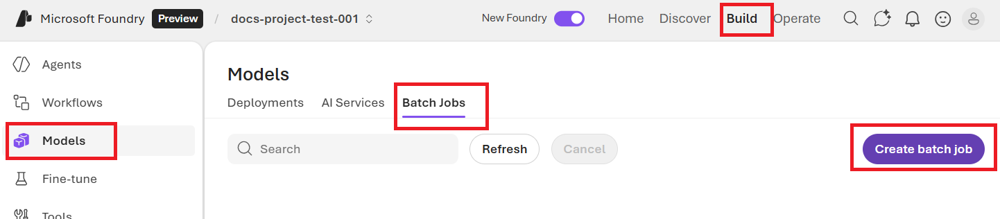](openai/media/how-to/global-batch/batch-create.png)

### [foundry/openai/includes/dall-e-python.md](openai/includes/dall-e-python.md)

* [endpoint.png](openai/media/quickstarts/endpoint.png)\
  [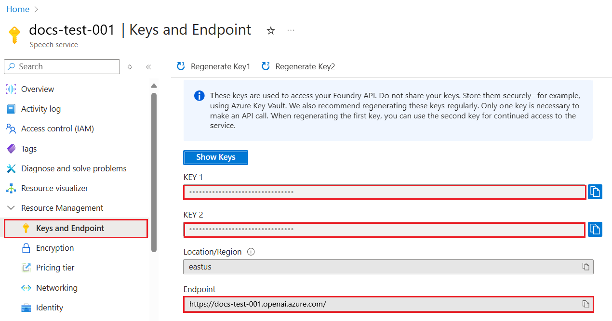](openai/media/quickstarts/endpoint.png)

### [foundry/openai/includes/dall-e-rest.md](openai/includes/dall-e-rest.md)

* [endpoint.png](openai/media/quickstarts/endpoint.png)\
  

### [foundry/openai/includes/get-key-endpoint.md](openai/includes/get-key-endpoint.md)

* [endpoint.png](openai/media/quickstarts/endpoint.png)\
  

### [foundry/openai/includes/gpt-v-rest.md](openai/includes/gpt-v-rest.md)

* [endpoint.png](openai/media/quickstarts/endpoint.png)\
  

### [foundry/openai/includes/gpt-v-studio.md](openai/includes/gpt-v-studio.md)

* ↗️ [car-accident.png](../../../../azure/ai-foundry/media/quickstarts/multimodal-vision/car-accident.png)\
  

## aahi

### [foundry/agents/concepts/runtime-components.md](agents/concepts/runtime-components.md)

* [runtime-components.png](agents/media/runtime-components.png)\
  [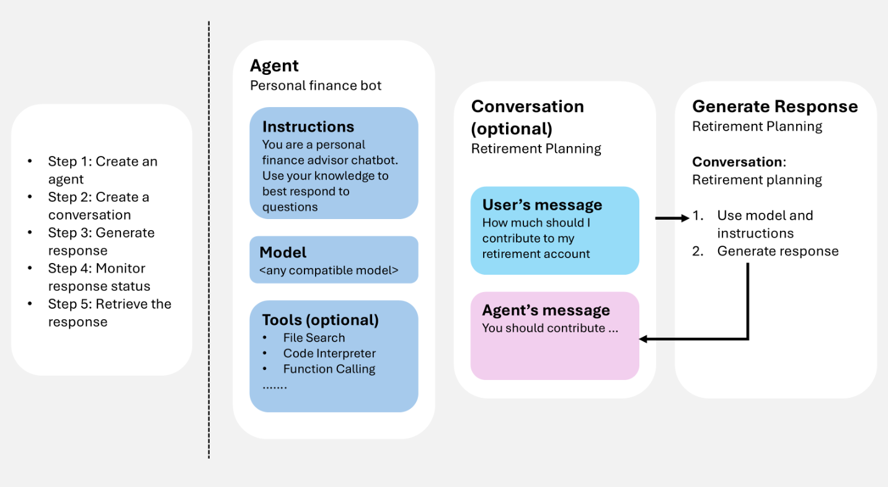](agents/media/runtime-components.png)

### [foundry/agents/concepts/tool-catalog.md](agents/concepts/tool-catalog.md)

* [tool-example.png](agents/media/tool-catalog/tool-example.png)\
  [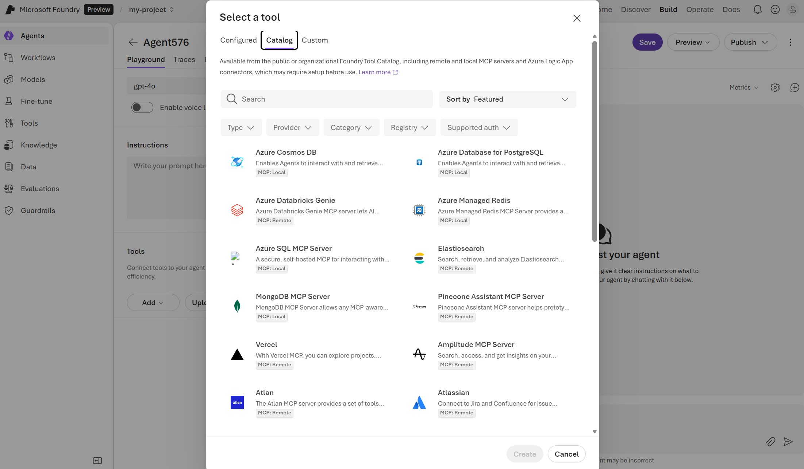](agents/media/tool-catalog/tool-example.png)

* [tool-view.png](agents/media/tool-catalog/tool-view.png)\
  [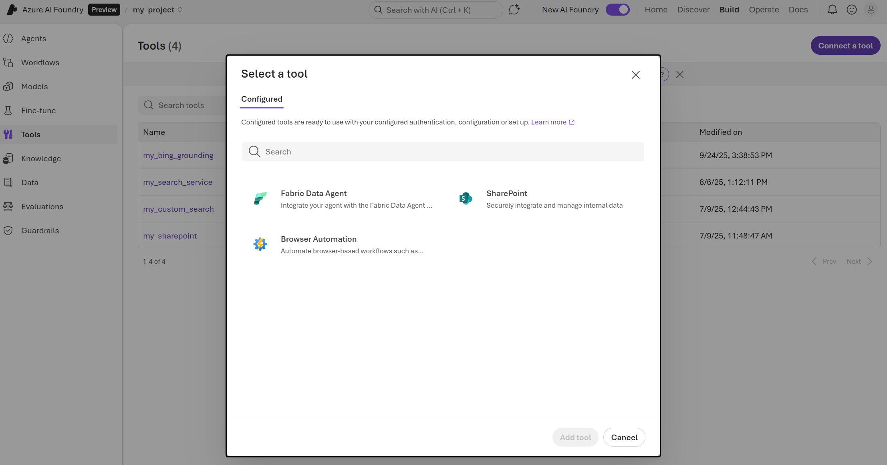](agents/media/tool-catalog/tool-view.png)

### [foundry/agents/environment-setup.md](agents/environment-setup.md)

* [basic-setup-resources-foundry.png](agents/media/quickstart/basic-setup-resources-foundry.png)\
  [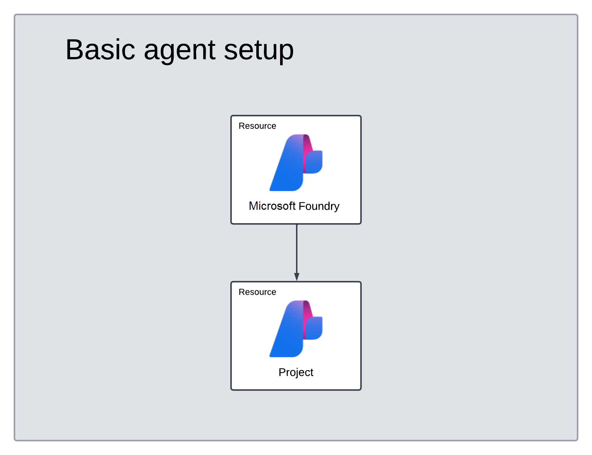](agents/media/quickstart/basic-setup-resources-foundry.png)

* [standard-agent-setup.png](agents/media/quickstart/standard-agent-setup.png)\
  [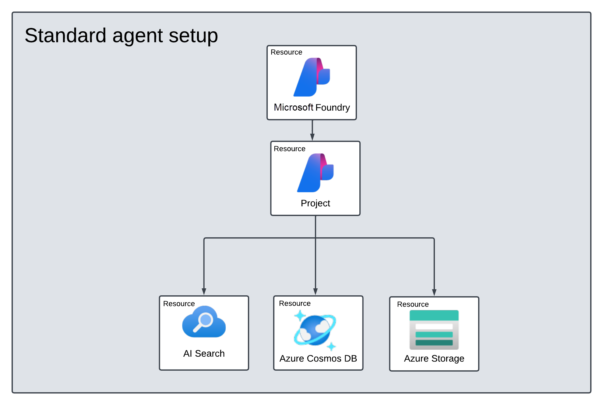](agents/media/quickstart/standard-agent-setup.png)

### [foundry/agents/how-to/agent-365.md](agents/how-to/agent-365.md)

* [approve-agent.png](agents/media/approve-agent.png)\
  [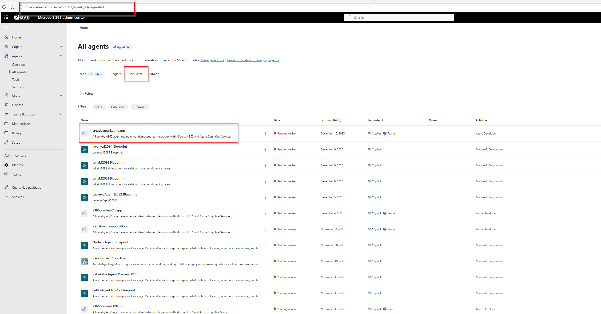](agents/media/approve-agent.png)

* [agent-in-registry.png](agents/media/agent-in-registry.png)\
  [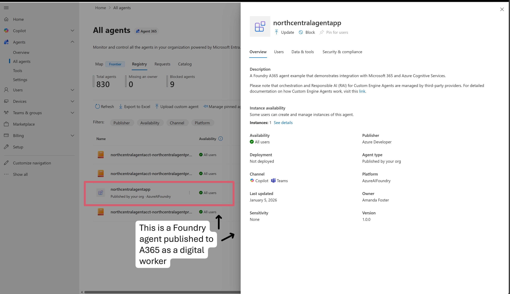](agents/media/agent-in-registry.png)

* [create-instance.png](agents/media/create-instance.png)\
  

### [foundry/agents/how-to/ai-gateway.md](agents/how-to/ai-gateway.md)

* [gateway.png](agents/media/gateway.png)\
  [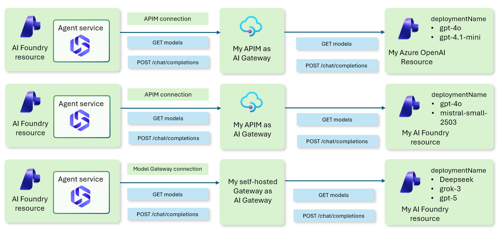](agents/media/gateway.png)

### [foundry/agents/how-to/mcp-authentication.md](agents/how-to/mcp-authentication.md)

* [foundry-open-consent.png](media/mcp/foundry-open-consent.png)\
  [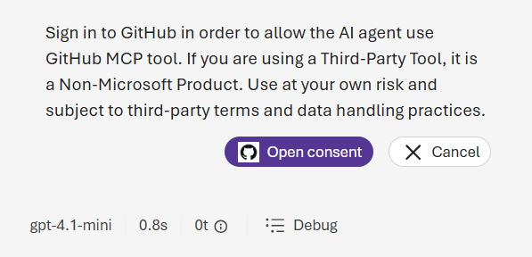](media/mcp/foundry-open-consent.png)

* [foundry-close-me.png](media/mcp/foundry-close-me.png)\
  [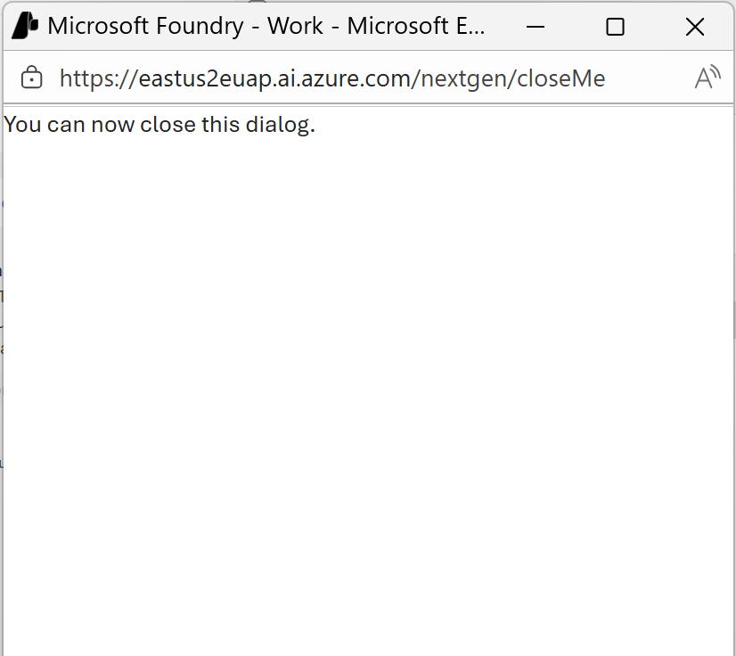](media/mcp/foundry-close-me.png)

### [foundry/agents/how-to/metrics.md](agents/how-to/metrics.md)

* [dashboard.png](agents/media/monitoring/dashboard.png)\
  [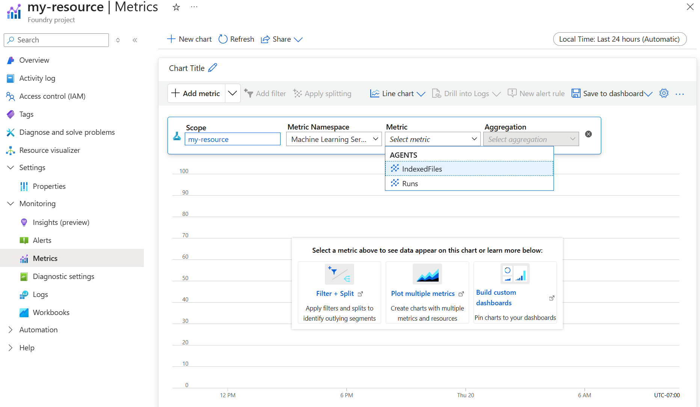](agents/media/monitoring/dashboard.png)

### [foundry/agents/how-to/private-tool-catalog.md](agents/how-to/private-tool-catalog.md)

* [api-center-resource.png](agents/media/tool-catalog/api-center-resource.png)\
  [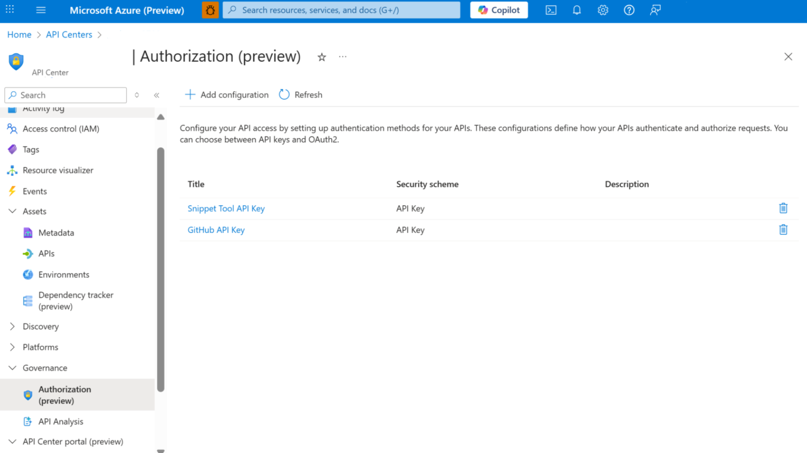](agents/media/tool-catalog/api-center-resource.png)

* [api-center-versions.png](agents/media/tool-catalog/api-center-versions.png)\
  [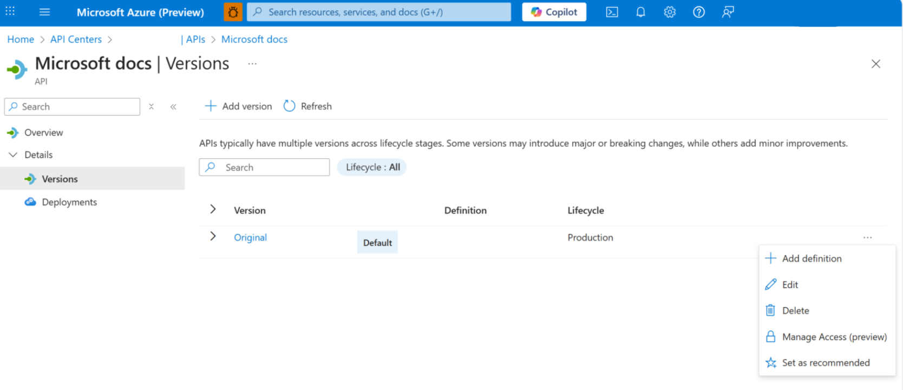](agents/media/tool-catalog/api-center-versions.png)

### [foundry/agents/how-to/publish-copilot.md](agents/how-to/publish-copilot.md)

* [publish-agent.png](agents/media/publish-agent.png)\
  [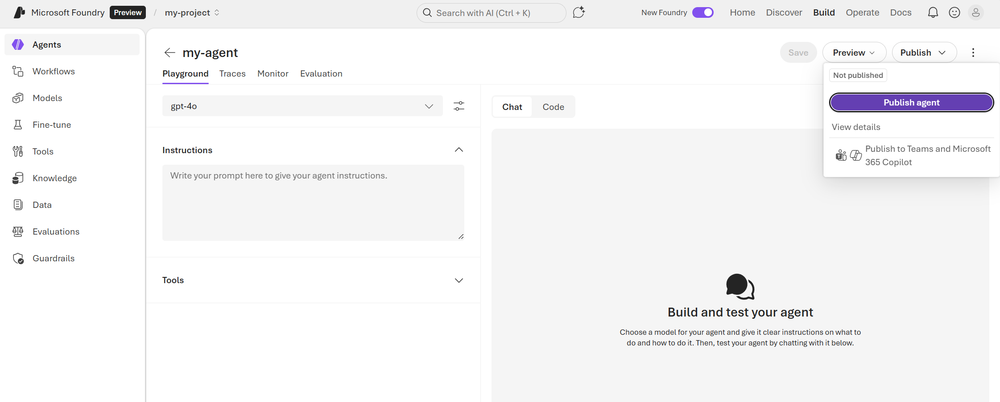](agents/media/publish-agent.png)

* [agent-store.png](agents/media/agent-store.png)\
  [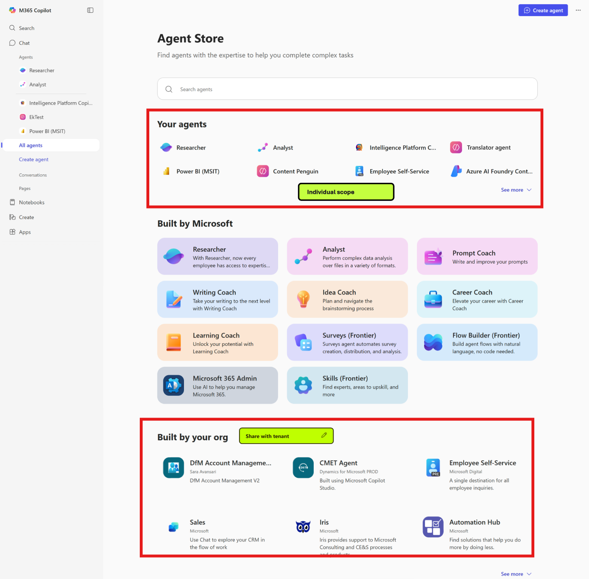](agents/media/agent-store.png)

* [share-published-agent.png](agents/media/share-published-agent.png)\
  [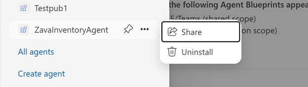](agents/media/share-published-agent.png)

### [foundry/agents/how-to/use-your-own-resources.md](agents/how-to/use-your-own-resources.md)

* [connection-string.png](media/quickstarts/azure-ai-sdk/connection-string.png)\
  [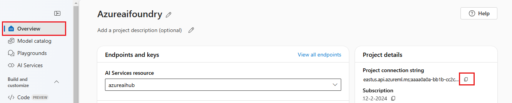](media/quickstarts/azure-ai-sdk/connection-string.png)

### [foundry/agents/how-to/virtual-networks.md](agents/how-to/virtual-networks.md)

* [private-network-isolation.png](agents/media/private-network-isolation.png)\
  

### [foundry/agents/overview.md](agents/overview.md)

* [agent-service-the-glue.png](agents/media/agent-service-the-glue.png)\
  [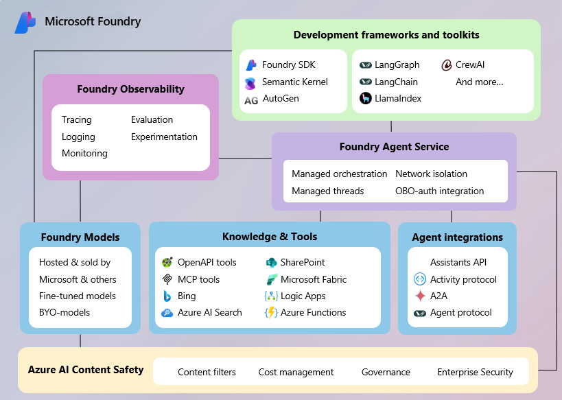](agents/media/agent-service-the-glue.png)

* [what-is-an-agent.png](agents/media/what-is-an-agent.png)\
  

* [agent-factory.png](agents/media/agent-factory.png)\
  [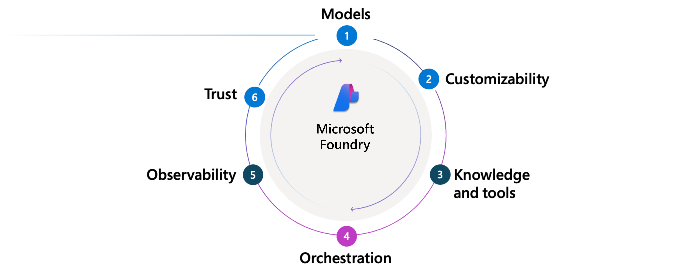](agents/media/agent-factory.png)

### [foundry/responsible-ai/agents/data-privacy-security.md](responsible-ai/agents/data-privacy-security.md)

* [agents-diagram.png](responsible-ai/agents/media/agents-diagram.png)\
  [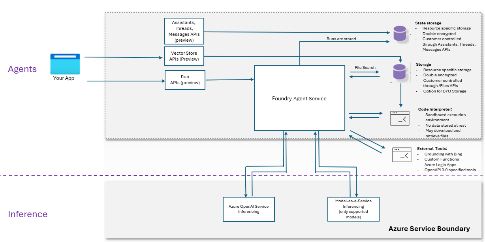](responsible-ai/agents/media/agents-diagram.png)

### [foundry/responsible-ai/agents/transparency-note.md](responsible-ai/agents/transparency-note.md)

* [agents-capabilities.jpg](responsible-ai/agents/media/agents-capabilities.jpg)\
  [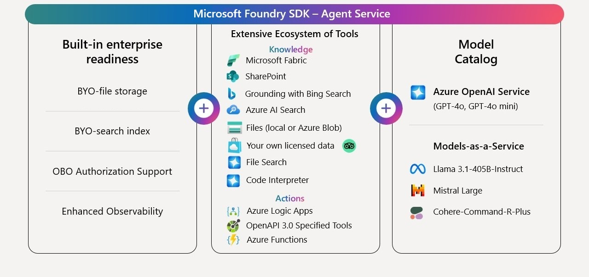](responsible-ai/agents/media/agents-capabilities.jpg)

## aashcraft

### [foundry/agents/how-to/tools/ai-search.md](agents/how-to/tools/ai-search.md)

* [connection-endpoint.png](agents/media/tools/ai-search/connection-endpoint.png)\
  [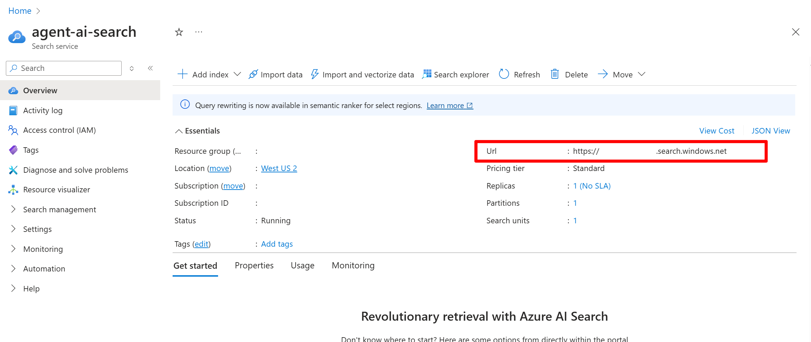](agents/media/tools/ai-search/connection-endpoint.png)

* [azure-portal.png](agents/media/tools/ai-search/azure-portal.png)\
  [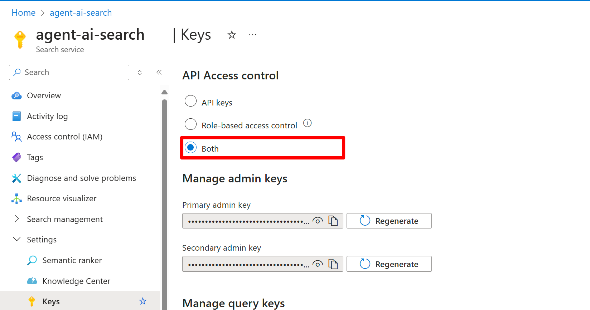](agents/media/tools/ai-search/azure-portal.png)

### [foundry/agents/how-to/tools/bing-tools.md](agents/how-to/tools/bing-tools.md)

* [website-citations.png](agents/media/tools/bing/website-citations.png)\
  [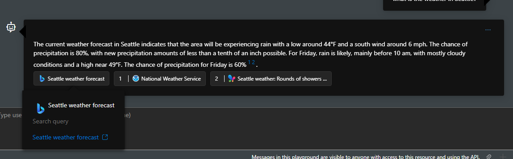](agents/media/tools/bing/website-citations.png)

### [foundry/agents/how-to/tools/openapi.md](agents/how-to/tools/openapi.md)

* [managed-identity-portal.png](agents/media/tools/managed-identity-portal.png)\
  [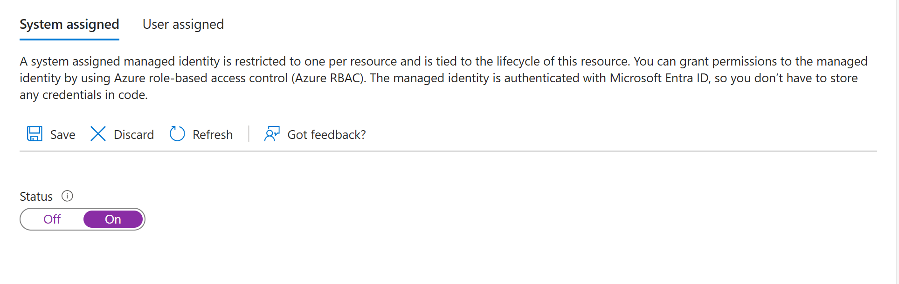](agents/media/tools/managed-identity-portal.png)

* [role-assignment-portal.png](agents/media/tools/role-assignment-portal.png)\
  [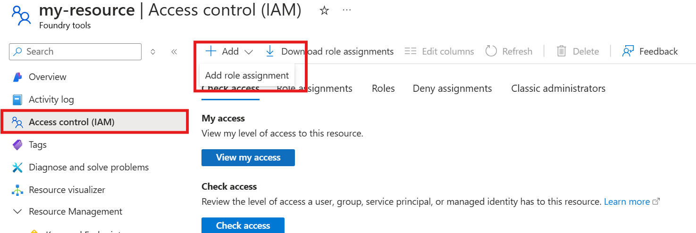](agents/media/tools/role-assignment-portal.png)

## fasantia

### [foundry/foundry-models/includes/configure-entra-id/portal.md](foundry-models/includes/configure-entra-id/portal.md)

* [locate-resource-ai-services.png](foundry-models/media/configure-entra-id/locate-resource-ai-services.png)\
  [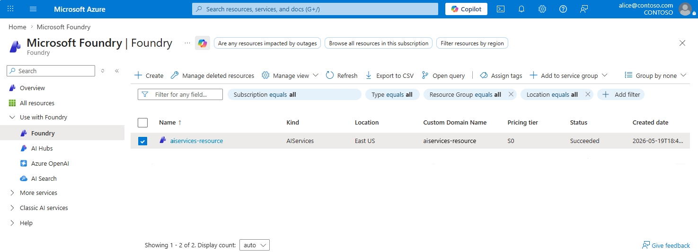](foundry-models/media/configure-entra-id/locate-resource-ai-services.png)

* [resource-aim.png](foundry-models/media/configure-entra-id/resource-aim.png)\
  [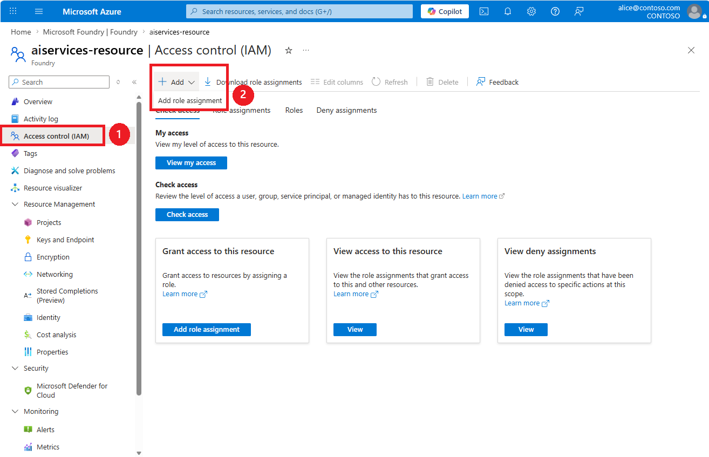](foundry-models/media/configure-entra-id/resource-aim.png)

* [cognitive-services-user.png](foundry-models/media/configure-entra-id/cognitive-services-user.png)\
  [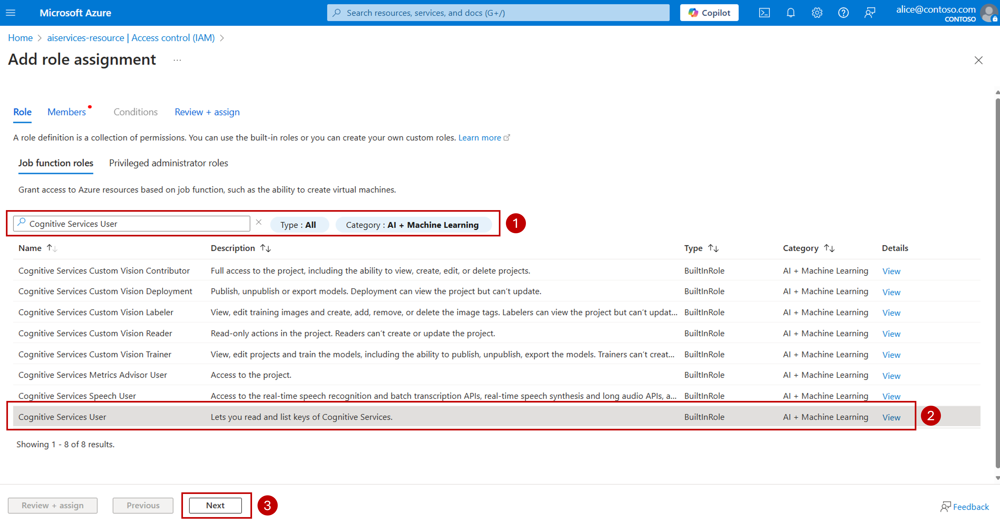](foundry-models/media/configure-entra-id/cognitive-services-user.png)

* [select-user.png](foundry-models/media/configure-entra-id/select-user.png)\
  [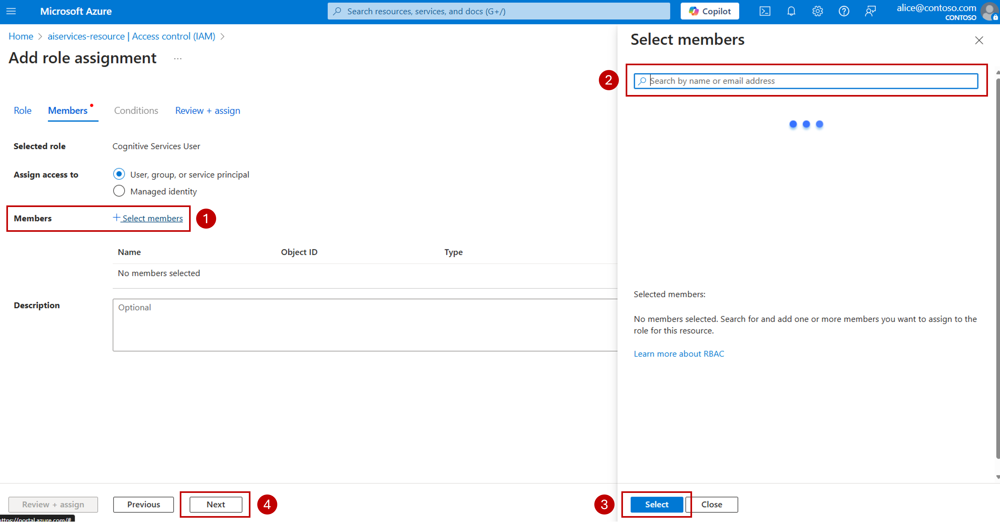](foundry-models/media/configure-entra-id/select-user.png)

### [foundry/foundry-models/includes/create-resources/intro.md](foundry-models/includes/create-resources/intro.md)

* [resources-architecture.png](foundry-models/media/create-resources/resources-architecture.png)\
  [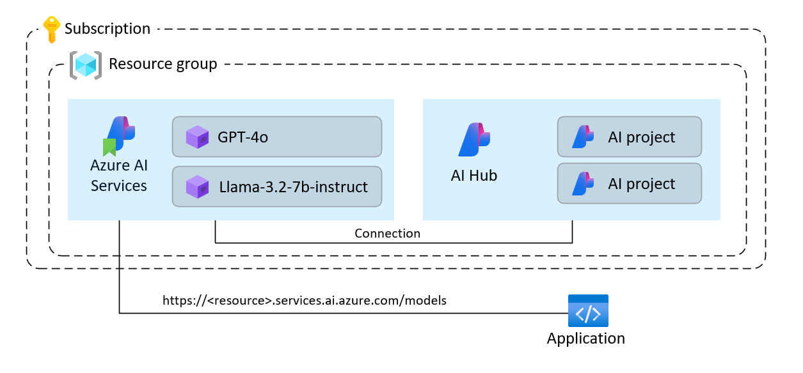](foundry-models/media/create-resources/resources-architecture.png)

### [foundry/foundry-models/includes/create-resources/portal.md](foundry-models/includes/create-resources/portal.md)

* [create-project-with-hub-details.png](foundry-models/media/create-resources/create-project-with-hub-details.png)\
  [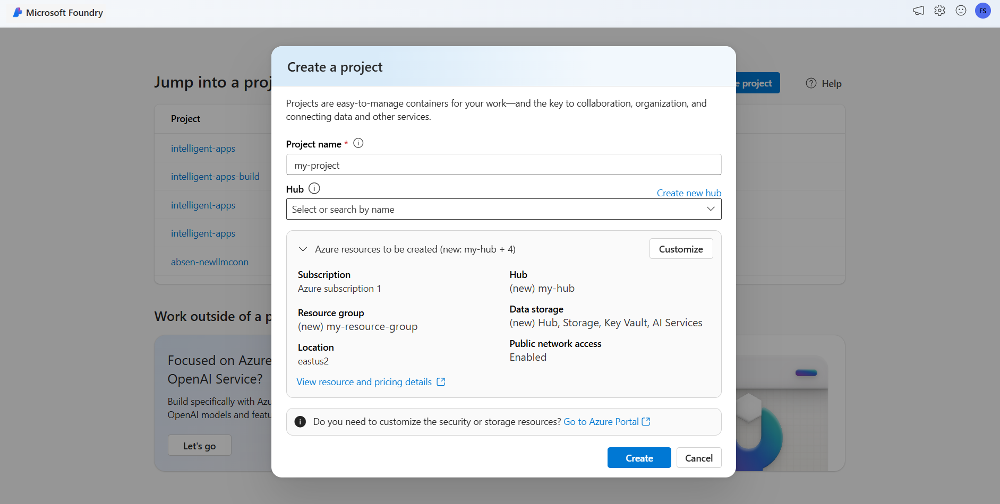](foundry-models/media/create-resources/create-project-with-hub-details.png)

## haileytapia

### [foundry/agents/concepts/what-is-memory.md](agents/concepts/what-is-memory.md)

* [agent-memory-diagram.svg](agents/media/memory/agent-memory-diagram.svg)\
  [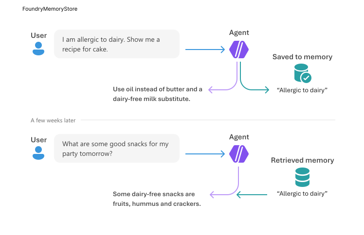](agents/media/memory/agent-memory-diagram.svg)

## jburchel

### [foundry/concepts/authentication-authorization-foundry.md](concepts/authentication-authorization-foundry.md)

* [foundry-rbac-control-data-separation.png](media/authentication-authorization/foundry-rbac-control-data-separation.png)\
  [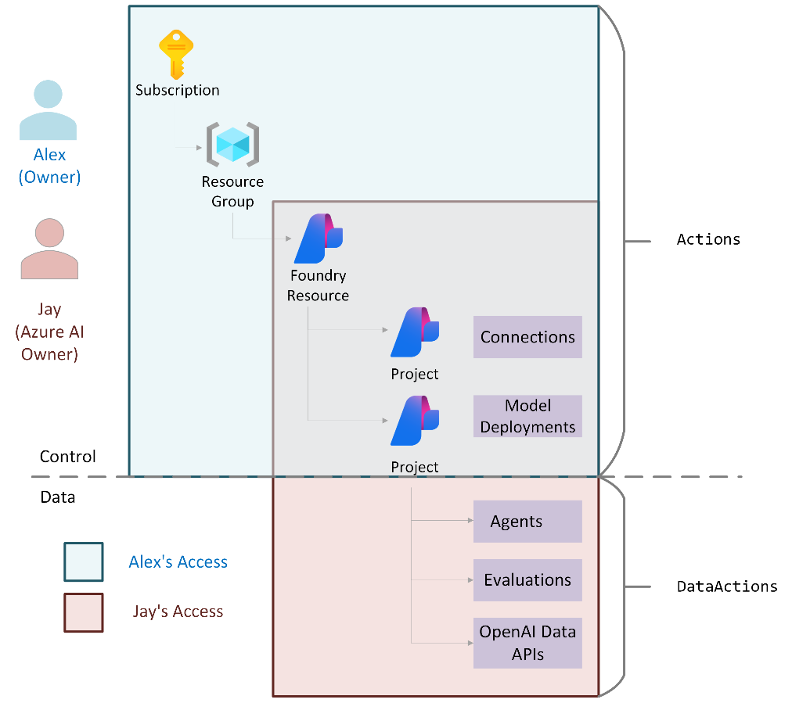](media/authentication-authorization/foundry-rbac-control-data-separation.png)

* [role-mapping-diagram.png](media/authentication-authorization/role-mapping-diagram.png)\
  [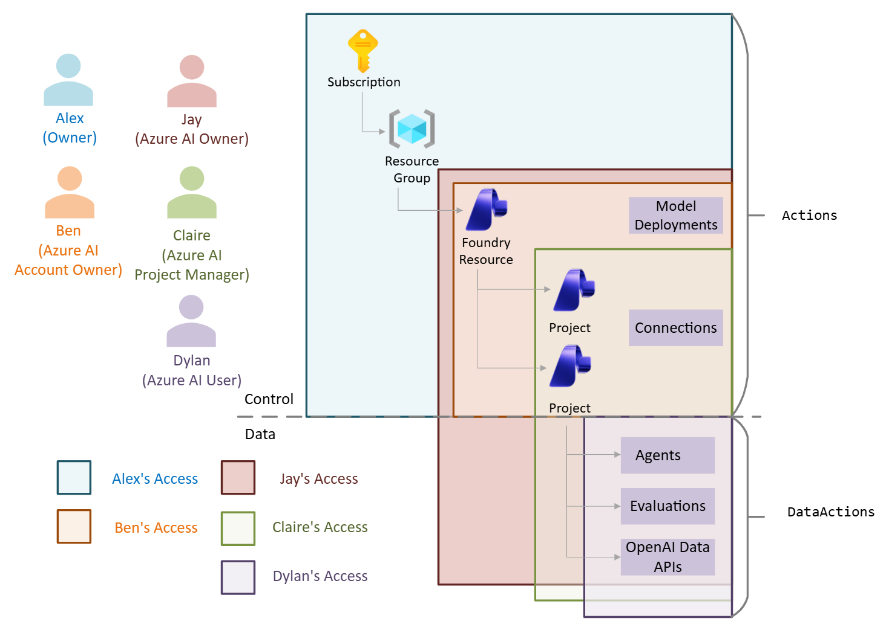](media/authentication-authorization/role-mapping-diagram.png)

### [foundry/configuration/enable-ai-api-management-gateway-portal.md](configuration/enable-ai-api-management-gateway-portal.md)

* [foundry-add-ai-gateway.png](media/enable-ai-api-management-gateway-portal/foundry-add-ai-gateway.png)\
  [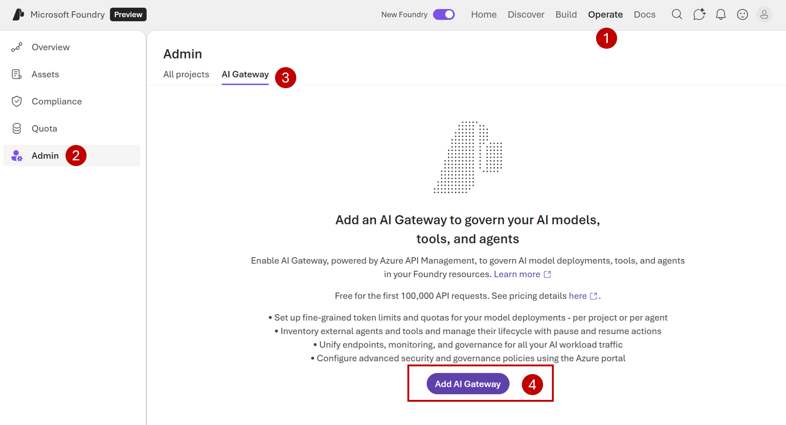](media/enable-ai-api-management-gateway-portal/foundry-add-ai-gateway.png)

* [create-ai-gateway-portal.png](media/enable-ai-api-management-gateway-portal/create-ai-gateway-portal.png)\
  [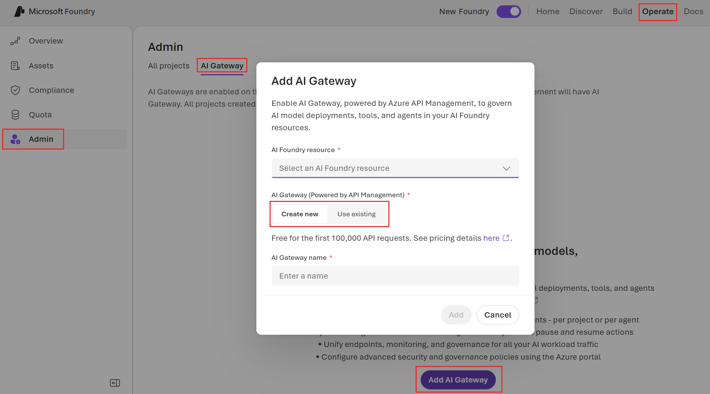](media/enable-ai-api-management-gateway-portal/create-ai-gateway-portal.png)

* [verify-ai-gateway-project.png](control-plane/media/register-custom-agent/verify-ai-gateway-project.png)\
  [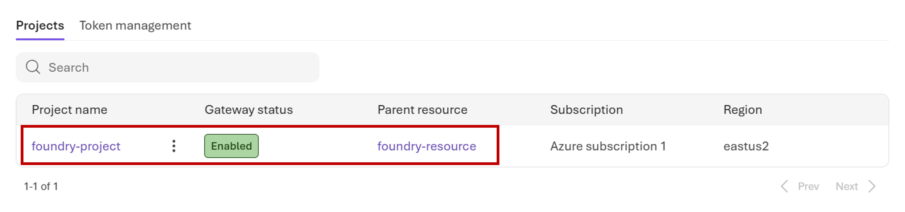](control-plane/media/register-custom-agent/verify-ai-gateway-project.png)

* [gateway-architecture-diagram.png](media/enable-ai-api-management-gateway-portal/gateway-architecture-diagram.png)\
  [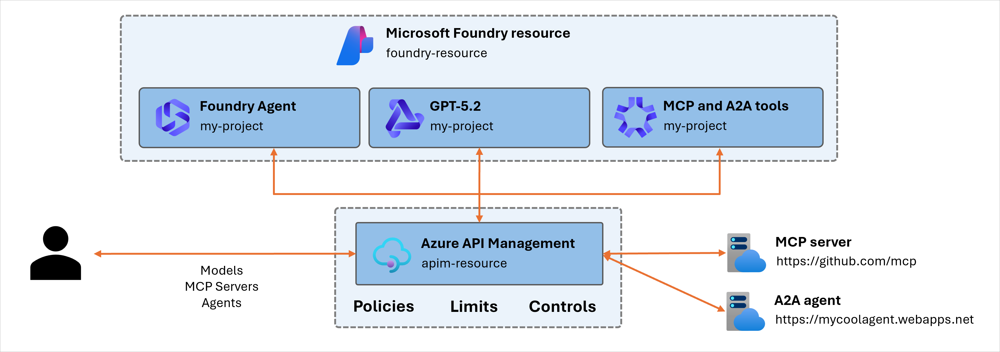](media/enable-ai-api-management-gateway-portal/gateway-architecture-diagram.png)

### [foundry/how-to/add-foundry-to-network-security-perimeter.md](how-to/add-foundry-to-network-security-perimeter.md)

* [network-security-perimeter-diagram.png](media/how-to/network/network-security-perimeter-diagram.png)\
  

### [foundry/how-to/configure-private-link.md](how-to/configure-private-link.md)

* [foundry-portal-firewall.png](media/how-to/network/foundry-portal-firewall.png)\
  [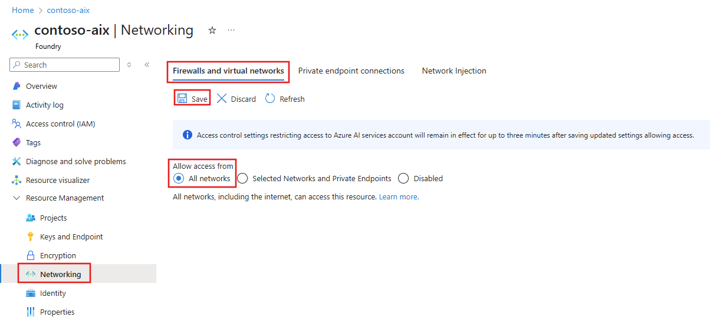](media/how-to/network/foundry-portal-firewall.png)

* [agent-eval-networking.png](media/how-to/network/agent-eval-networking.png)\
  [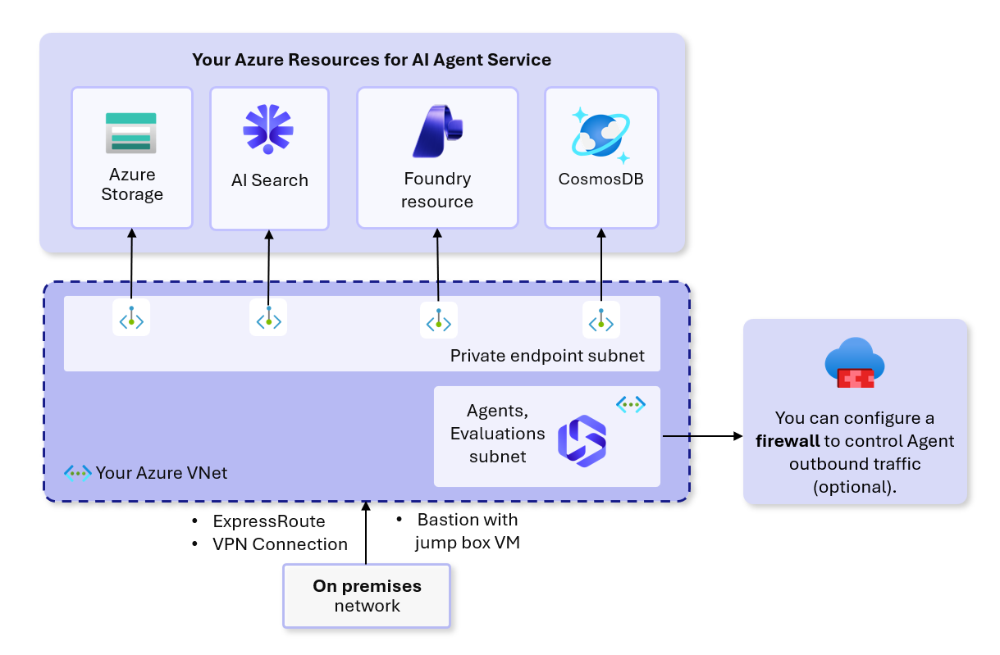](media/how-to/network/agent-eval-networking.png)

* [network-diagram-agents.png](media/how-to/network/network-diagram-agents.png)\
  [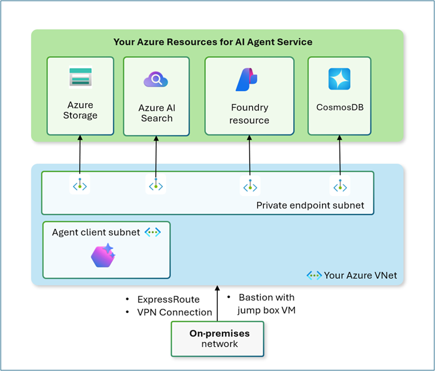](media/how-to/network/network-diagram-agents.png)

### [foundry/how-to/managed-virtual-network.md](how-to/managed-virtual-network.md)

* [diagram-managed-network.png](how-to/media/managed-virtual-network/diagram-managed-network.png)\
  [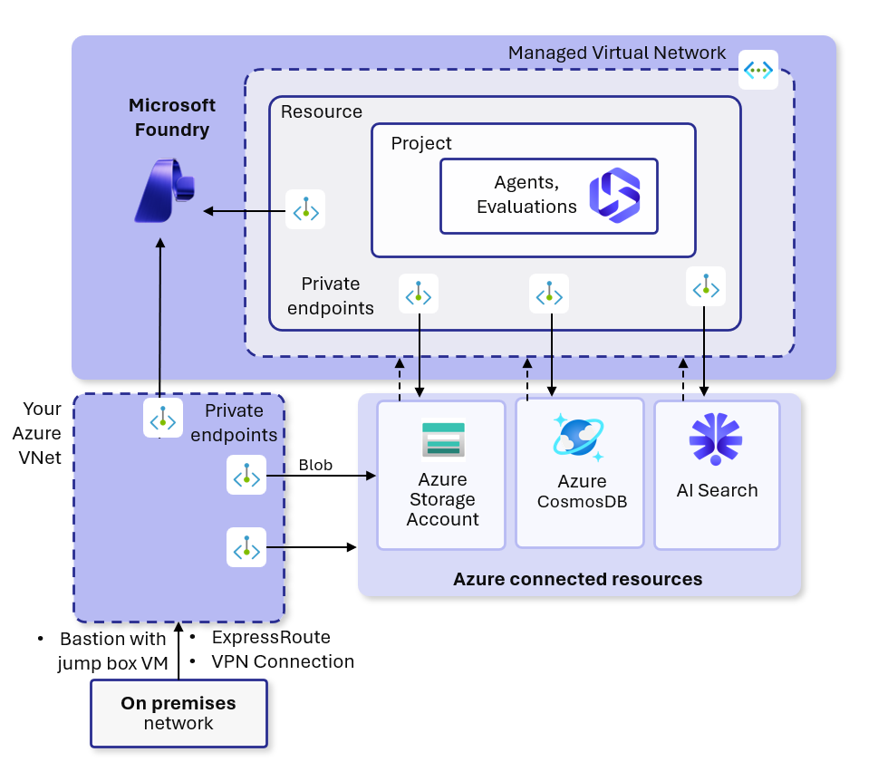](how-to/media/managed-virtual-network/diagram-managed-network.png)

* [diagram-allow-internet-outbound-managed-network.png](how-to/media/managed-virtual-network/diagram-allow-internet-outbound-managed-network.png)\
  [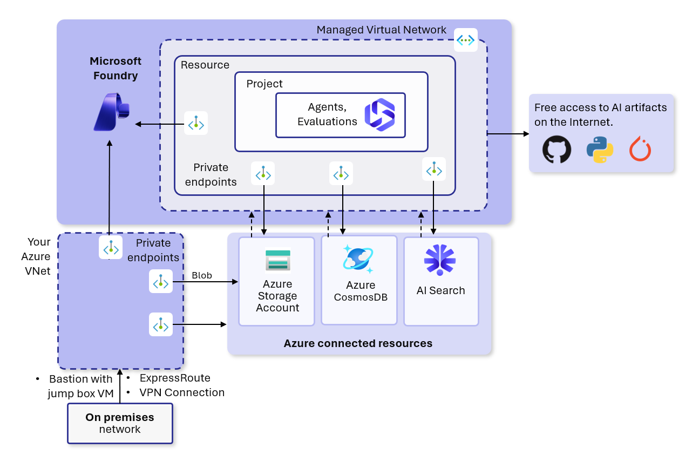](how-to/media/managed-virtual-network/diagram-allow-internet-outbound-managed-network.png)

* [diagram-allow-only-approved-outbound-managed-network.png](how-to/media/managed-virtual-network/diagram-allow-only-approved-outbound-managed-network.png)\
  [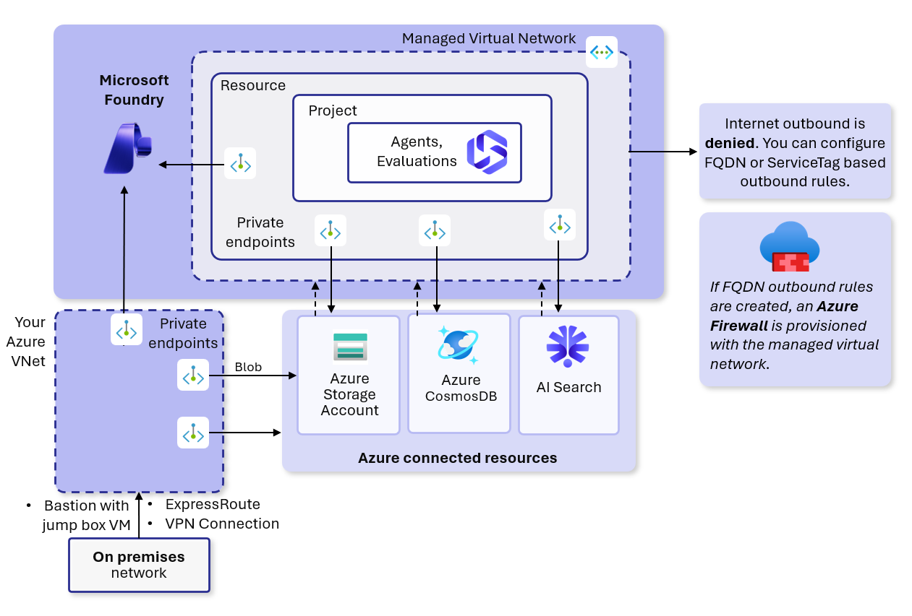](how-to/media/managed-virtual-network/diagram-allow-only-approved-outbound-managed-network.png)

### [foundry/how-to/model-deployment-policy.md](how-to/model-deployment-policy.md)

* [gpt-5-model-card.png](how-to/media/model-deployment-policy/gpt-5-model-card.png)\
  [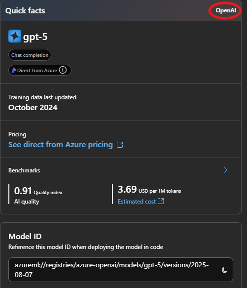](how-to/media/model-deployment-policy/gpt-5-model-card.png)

### [foundry/mcp/build-your-own-mcp-server.md](mcp/build-your-own-mcp-server.md)

* [azure-api-center-authorization-page.png](media/build-your-own-mcp-server/azure-api-center-authorization-page.png)\
  [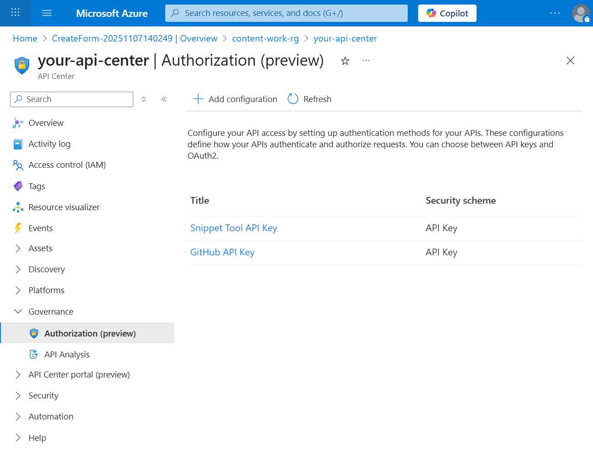](media/build-your-own-mcp-server/azure-api-center-authorization-page.png)

## johalexander

### [foundry/how-to/develop/get-started-projects-vs-code.md](how-to/develop/get-started-projects-vs-code.md)

* [visual-studio-command-palette-small.png](media/how-to/get-started-projects-vs-code/visual-studio-command-palette-small.png)\
  [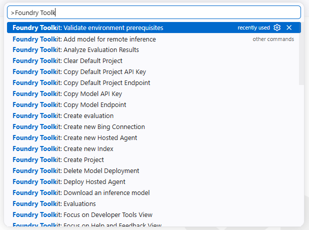](media/how-to/get-started-projects-vs-code/visual-studio-command-palette-small.png)

* [initial-view.png](media/how-to/get-started-projects-vs-code/initial-view.png)\
  [](media/how-to/get-started-projects-vs-code/initial-view.png)

* [display-model-catalog.png](media/how-to/get-started-projects-vs-code/display-model-catalog.png)\
  [](media/how-to/get-started-projects-vs-code/display-model-catalog.png)

* [sample-code-file.png](media/how-to/get-started-projects-vs-code/sample-code-file.png)\
  [](media/how-to/get-started-projects-vs-code/sample-code-file.png)

### [foundry/includes/sdk/csharp.md](includes/sdk/csharp.md)

* [speech.svg](includes/sdk/~/reusable-content/ce-skilling/azure/media/ai-services/speech.svg)\
  

* [language.svg](includes/sdk/~/reusable-content/ce-skilling/azure/media/ai-services/language.svg)\
  

* [translator.svg](includes/sdk/~/reusable-content/ce-skilling/azure/media/ai-services/translator.svg)\
  

* [search.svg](includes/sdk/~/reusable-content/ce-skilling/azure/media/ai-services/search.svg)\
  

* [content-safety.svg](includes/sdk/~/reusable-content/ce-skilling/azure/media/ai-services/content-safety.svg)\
  

* [document-intelligence.svg](includes/sdk/~/reusable-content/ce-skilling/azure/media/ai-services/document-intelligence.svg)\
  

* [vision.svg](includes/sdk/~/reusable-content/ce-skilling/azure/media/ai-services/vision.svg)\
  

### [foundry/includes/sdk/java.md](includes/sdk/java.md)

* [speech.svg](includes/sdk/~/reusable-content/ce-skilling/azure/media/ai-services/speech.svg)\
  

* [language.svg](includes/sdk/~/reusable-content/ce-skilling/azure/media/ai-services/language.svg)\
  

* [translator.svg](includes/sdk/~/reusable-content/ce-skilling/azure/media/ai-services/translator.svg)\
  

* [search.svg](includes/sdk/~/reusable-content/ce-skilling/azure/media/ai-services/search.svg)\
  

* [content-safety.svg](includes/sdk/~/reusable-content/ce-skilling/azure/media/ai-services/content-safety.svg)\
  

* [document-intelligence.svg](includes/sdk/~/reusable-content/ce-skilling/azure/media/ai-services/document-intelligence.svg)\
  

* [vision.svg](includes/sdk/~/reusable-content/ce-skilling/azure/media/ai-services/vision.svg)\
  

### [foundry/includes/sdk/javascript.md](includes/sdk/javascript.md)

* [speech.svg](includes/sdk/~/reusable-content/ce-skilling/azure/media/ai-services/speech.svg)\
  

* [language.svg](includes/sdk/~/reusable-content/ce-skilling/azure/media/ai-services/language.svg)\
  

* [translator.svg](includes/sdk/~/reusable-content/ce-skilling/azure/media/ai-services/translator.svg)\
  

* [search.svg](includes/sdk/~/reusable-content/ce-skilling/azure/media/ai-services/search.svg)\
  

* [content-safety.svg](includes/sdk/~/reusable-content/ce-skilling/azure/media/ai-services/content-safety.svg)\
  

* [document-intelligence.svg](includes/sdk/~/reusable-content/ce-skilling/azure/media/ai-services/document-intelligence.svg)\
  

* [vision.svg](includes/sdk/~/reusable-content/ce-skilling/azure/media/ai-services/vision.svg)\
  

### [foundry/includes/sdk/python.md](includes/sdk/python.md)

* [speech.svg](includes/sdk/~/reusable-content/ce-skilling/azure/media/ai-services/speech.svg)\
  

* [language.svg](includes/sdk/~/reusable-content/ce-skilling/azure/media/ai-services/language.svg)\
  

* [translator.svg](includes/sdk/~/reusable-content/ce-skilling/azure/media/ai-services/translator.svg)\
  

* [search.svg](includes/sdk/~/reusable-content/ce-skilling/azure/media/ai-services/search.svg)\
  

* [content-safety.svg](includes/sdk/~/reusable-content/ce-skilling/azure/media/ai-services/content-safety.svg)\
  

* [document-intelligence.svg](includes/sdk/~/reusable-content/ce-skilling/azure/media/ai-services/document-intelligence.svg)\
  

* [vision.svg](includes/sdk/~/reusable-content/ce-skilling/azure/media/ai-services/vision.svg)\
  

## lagayhar

### [foundry/concepts/ai-red-teaming-agent.md](concepts/ai-red-teaming-agent.md)

* [map-measure-mitigate-ai-red-teaming.png](media/evaluations/red-teaming-agent/map-measure-mitigate-ai-red-teaming.png)\
  [](media/evaluations/red-teaming-agent/map-measure-mitigate-ai-red-teaming.png)

* [how-ai-red-teaming-works.png](media/evaluations/red-teaming-agent/how-ai-red-teaming-works.png)\
  [](media/evaluations/red-teaming-agent/how-ai-red-teaming-works.png)

### [foundry/concepts/observability.md](concepts/observability.md)

* [lifecycle.png](media/evaluations/lifecycle.png)\
  [](media/evaluations/lifecycle.png)

* [evaluation-models-diagram.png](media/evaluations/evaluation-models-diagram.png)\
  [](media/evaluations/evaluation-models-diagram.png)

### [foundry/how-to/benchmark-model-in-catalog.md](how-to/benchmark-model-in-catalog.md)

* [compare-model-overview.png](how-to/media/observability/model-benchmarks/compare-model-overview.png)\
  [](how-to/media/observability/model-benchmarks/compare-model-overview.png)

* [benchmark-overview.png](how-to/media/observability/model-benchmarks/benchmark-overview.png)\
  [](how-to/media/observability/model-benchmarks/benchmark-overview.png)

### [foundry/how-to/evaluate-results.md](how-to/evaluate-results.md)

* [evaluation-runs.png](media/observability/evaluation-runs.png)\
  [](media/observability/evaluation-runs.png)

### [foundry/how-to/evaluation-azure-devops.md](how-to/evaluation-azure-devops.md)

* [github-action-agent-output.png](how-to/media/observability/github-action-agent-output.png)\
  [](how-to/media/observability/github-action-agent-output.png)

### [foundry/how-to/evaluation-github-action.md](how-to/evaluation-github-action.md)

* [github-action-agent-output.png](how-to/media/observability/github-action-agent-output.png)\
  

### [foundry/includes/evaluations-agent-playground.md](includes/evaluations-agent-playground.md)

* [agent-playground-evaluation-metrics.png](media/observability/agent-playground-evaluation-metrics.png)\
  [](media/observability/agent-playground-evaluation-metrics.png)

### [foundry/observability/how-to/cluster-analysis.md](observability/how-to/cluster-analysis.md)

* [cluster-analysis-set-up.png](media/observability/cluster-analysis-set-up.png)\
  [](media/observability/cluster-analysis-set-up.png)

* [cluster-analysis-map.png](media/observability/cluster-analysis-map.png)\
  [](media/observability/cluster-analysis-map.png)

* [cluster-analysis-side-panel.png](media/observability/cluster-analysis-side-panel.png)\
  [](media/observability/cluster-analysis-side-panel.png)

* [cluster-analysis-sub-cluster-side-panel.png](media/observability/cluster-analysis-sub-cluster-side-panel.png)\
  [](media/observability/cluster-analysis-sub-cluster-side-panel.png)

* [cluster-analysis-entry-id.png](media/observability/cluster-analysis-entry-id.png)\
  [](media/observability/cluster-analysis-entry-id.png)

* [cluster-analysis-filter.png](media/observability/cluster-analysis-filter.png)\
  [](media/observability/cluster-analysis-filter.png)

* [cluster-analysis-advanced-filtering.png](media/observability/cluster-analysis-advanced-filtering.png)\
  [](media/observability/cluster-analysis-advanced-filtering.png)

### [foundry/observability/how-to/evaluate-agent.md](observability/how-to/evaluate-agent.md)

* [agent-evaluation-results.png](media/observability/agent-evaluation-results.png)\
  [](media/observability/agent-evaluation-results.png)

### [foundry/observability/how-to/how-to-monitor-agents-dashboard.md](observability/how-to/how-to-monitor-agents-dashboard.md)

* [foundry-metrics-dashboard.png](media/observability/how-to-monitor-agents-dashboard/foundry-metrics-dashboard.png)\
  [](media/observability/how-to-monitor-agents-dashboard/foundry-metrics-dashboard.png)

* [monitor-settings-panel.png](media/observability/how-to-monitor-agents-dashboard/monitor-settings-panel.png)\
  [](media/observability/how-to-monitor-agents-dashboard/monitor-settings-panel.png)

### [foundry/observability/how-to/optimization-dashboard.md](observability/how-to/optimization-dashboard.md)

* [monitor-dashboard.png](media/observability/monitor-dashboard.png)\
  [](media/observability/monitor-dashboard.png)

* [monitor-dashboard-overview.png](media/observability/monitor-dashboard-overview.png)\
  [](media/observability/monitor-dashboard-overview.png)

* [monitor-dashboard-summary.png](media/observability/monitor-dashboard-summary.png)\
  [](media/observability/monitor-dashboard-summary.png)

### [foundry/observability/how-to/optimization-model-upgrade.md](observability/how-to/optimization-model-upgrade.md)

* [model-upgrade-predefined-prompts.png](media/observability/model-upgrade-predefined-prompts.png)\
  [](media/observability/model-upgrade-predefined-prompts.png)

* [model-upgrade-ask-ai.png](media/observability/model-upgrade-ask-ai.png)\
  [](media/observability/model-upgrade-ask-ai.png)

* [model-upgrade-selected-model.png](media/observability/model-upgrade-selected-model.png)\
  [](media/observability/model-upgrade-selected-model.png)

* [model-upgrade-evaluations.png](media/observability/model-upgrade-evaluations.png)\
  [](media/observability/model-upgrade-evaluations.png)

### [foundry/observability/how-to/trace-agent-setup.md](observability/how-to/trace-agent-setup.md)

* [conversation.png](media/observability/tracing/conversation.png)\
  [](media/observability/tracing/conversation.png)

## lajanuar

### [foundry/responsible-ai/document-intelligence/transparency-note.md](responsible-ai/document-intelligence/transparency-note.md)

* [wer-definition.png](responsible-ai/document-intelligence/media/wer-definition.png)\
  

### [foundry/responsible-ai/language-service/custom-named-entity-recognition-data-privacy-security.md](responsible-ai/language-service/custom-named-entity-recognition-data-privacy-security.md)

* [custom-named-entity-recognition-rai-privacy-chart.png](responsible-ai/language-service/media/custom-named-entity-recognition-rai-privacy-chart.png)\
  [](responsible-ai/language-service/media/custom-named-entity-recognition-rai-privacy-chart.png)

### [foundry/responsible-ai/language-service/custom-text-classification-data-privacy-security.md](responsible-ai/language-service/custom-text-classification-data-privacy-security.md)

* [custom-text-classification-rai-privacy-chart.png](responsible-ai/language-service/media/custom-text-classification-rai-privacy-chart.png)\
  [](responsible-ai/language-service/media/custom-text-classification-rai-privacy-chart.png)

### [foundry/responsible-ai/language-service/transparency-note-health.md](responsible-ai/language-service/transparency-note-health.md)

* [named-entity-resolution-false-positive.png](responsible-ai/language-service/media/named-entity-resolution-false-positive.png)\
  [](responsible-ai/language-service/media/named-entity-resolution-false-positive.png)

* [substance-use-misclassification.png](responsible-ai/language-service/media/substance-use-misclassification.png)\
  

* [named-entity-resolution-false-negative.png](responsible-ai/language-service/media/named-entity-resolution-false-negative.png)\
  [](responsible-ai/language-service/media/named-entity-resolution-false-negative.png)

* [ethnicity-misclassification.png](responsible-ai/language-service/media/ethnicity-misclassification.png)\
  

* [employment-misclassification.png](responsible-ai/language-service/media/employment-misclassification.png)\
  [](responsible-ai/language-service/media/employment-misclassification.png)

* [relation-extraction-false-negative.png](responsible-ai/language-service/media/relation-extraction-false-negative.png)\
  [](responsible-ai/language-service/media/relation-extraction-false-negative.png)

* [entity-linking-false-negative.png](responsible-ai/language-service/media/entity-linking-false-negative.png)\
  

* [negation-detection-resolution-false-positive.png](responsible-ai/language-service/media/negation-detection-resolution-false-positive.png)\
  [](responsible-ai/language-service/media/negation-detection-resolution-false-positive.png)

* [negation-detection-resolution-false-negative.png](responsible-ai/language-service/media/negation-detection-resolution-false-negative.png)\
  [](responsible-ai/language-service/media/negation-detection-resolution-false-negative.png)

### [foundry/responsible-ai/language-service/transparency-note-question-answering.md](responsible-ai/language-service/transparency-note-question-answering.md)

* [qna-table.png](responsible-ai/language-service/media/qna-table.png)\
  

### [foundry/responsible-ai/qnamaker/data-privacy-security-qnamaker.md](responsible-ai/qnamaker/data-privacy-security-qnamaker.md)

* [qnamaker-data-process.png](responsible-ai/qnamaker/media/qnamaker-data-process.png)\
  [](responsible-ai/qnamaker/media/qnamaker-data-process.png)

### [foundry/responsible-ai/qnamaker/transparency-note-qnamaker.md](responsible-ai/qnamaker/transparency-note-qnamaker.md)

* [qnamaker-qna-table.png](responsible-ai/qnamaker/media/qnamaker-qna-table.png)\
  [](responsible-ai/qnamaker/media/qnamaker-qna-table.png)

* [qnamaker-request-response.png](responsible-ai/qnamaker/media/qnamaker-request-response.png)\
  [](responsible-ai/qnamaker/media/qnamaker-request-response.png)

### [foundry/responsible-ai/translator/data-privacy-security.md](responsible-ai/translator/data-privacy-security.md)

* [translator-data.png](responsible-ai/translator/media/translator-data.png)\
  [](responsible-ai/translator/media/translator-data.png)

* [translator-document-data.png](responsible-ai/translator/media/translator-document-data.png)\
  [](responsible-ai/translator/media/translator-document-data.png)

## mbullwin

### [foundry/openai/concepts/advanced-prompt-engineering.md](openai/concepts/advanced-prompt-engineering.md)

* [system-message-flow.svg](openai/media/concepts/system-message-flow.svg)\
  [](openai/media/concepts/system-message-flow.svg)

### [foundry/openai/concepts/prompt-engineering.md](openai/concepts/prompt-engineering.md)

* [space-efficiency.png](openai/media/prompt-engineering/space-efficiency.png)\
  [](openai/media/prompt-engineering/space-efficiency.png)

### [foundry/openai/concepts/system-message.md](openai/concepts/system-message.md)

* [system-message-flow.svg](openai/media/concepts/system-message-flow.svg)\
  

### [foundry/openai/how-to/latency.md](openai/how-to/latency.md)

* [processed-prompt-token-graph.png](openai/how-to/media/latency/processed-prompt-token-graph.png)\
  [](openai/how-to/media/latency/processed-prompt-token-graph.png)

### [foundry/openai/includes/embeddings-python.md](openai/includes/embeddings-python.md)

* [initial-dataframe.png](openai/media/tutorials/initial-dataframe.png)\
  

* [cleanup-dataframe.png](openai/media/tutorials/cleanup-dataframe.png)\
  

* [tokens-dataframe.png](openai/media/tutorials/tokens-dataframe.png)\
  

* [embed-text-documents.png](openai/media/tutorials/embed-text-documents.png)\
  

* [query-result.png](openai/media/tutorials/query-result.png)\
  [](openai/media/tutorials/query-result.png)

### [foundry/openai/includes/fine-tuning-openai-in-ai-studio.md](openai/includes/fine-tuning-openai-in-ai-studio.md)

* [fine-tune-new.png](openai/media/fine-tuning/ai-foundry/fine-tune-new.png)\
  [](openai/media/fine-tuning/ai-foundry/fine-tune-new.png)

* [fine-tune-basic-settings.png](openai/media/fine-tuning/ai-foundry/fine-tune-basic-settings.png)\
  [](openai/media/fine-tuning/ai-foundry/fine-tune-basic-settings.png)

* [fine-tune-training-data-local.png](openai/media/fine-tuning/ai-foundry/fine-tune-training-data-local.png)\
  [](openai/media/fine-tuning/ai-foundry/fine-tune-training-data-local.png)

* [fine-tune-training-data-preview.png](openai/media/fine-tuning/ai-foundry/fine-tune-training-data-preview.png)\
  [](openai/media/fine-tuning/ai-foundry/fine-tune-training-data-preview.png)

* [checkpoints.png](openai/media/fine-tuning/checkpoints.png)\
  [](openai/media/fine-tuning/checkpoints.png)

* [pause.png](openai/media/how-to/reinforcement-fine-tuning/pause.png)\
  [](openai/media/how-to/reinforcement-fine-tuning/pause.png)

* [metrics.png](openai/media/fine-tuning/metrics.png)\
  [](openai/media/fine-tuning/metrics.png)

### [foundry/openai/includes/fine-tuning-studio.md](openai/includes/fine-tuning-studio.md)

* [studio-create-custom-model.png](openai/media/fine-tuning/studio-create-custom-model.png)\
  [](openai/media/fine-tuning/studio-create-custom-model.png)

* [studio-model-selection.png](openai/media/fine-tuning/studio-model-selection.png)\
  [](openai/media/fine-tuning/studio-model-selection.png)

* [studio-create-fine-tuned-model.png](openai/media/fine-tuning/studio-create-fine-tuned-model.png)\
  [](openai/media/fine-tuning/studio-create-fine-tuned-model.png)

* [studio-training-data.png](openai/media/fine-tuning/studio-training-data.png)\
  

* [studio-validation-data.png](openai/media/fine-tuning/studio-validation-data.png)\
  [](openai/media/fine-tuning/studio-validation-data.png)

* [studio-create-hyperparams.png](openai/media/fine-tuning/studio-create-hyperparams.png)\
  [](openai/media/fine-tuning/studio-create-hyperparams.png)

* [studio-create-auto-deploy.png](openai/media/fine-tuning/studio-create-auto-deploy.png)\
  [](openai/media/fine-tuning/studio-create-auto-deploy.png)

* [pause.png](openai/media/how-to/reinforcement-fine-tuning/pause.png)\
  

* [studio-continuous.png](openai/media/fine-tuning/studio-continuous.png)\
  [](openai/media/fine-tuning/studio-continuous.png)

### [foundry/openai/includes/safety-evaluation.md](openai/includes/safety-evaluation.md)

* [failure.png](openai/media/fine-tuning/failure.png)\
  [](openai/media/fine-tuning/failure.png)

### [foundry/openai/includes/whisper-python.md](openai/includes/whisper-python.md)

* [endpoint.png](openai/media/quickstarts/endpoint.png)\
  

### [foundry/responsible-ai/openai/data-privacy.md](responsible-ai/openai/data-privacy.md)

* [flow-3.png](responsible-ai/openai/media/flow-3.png)\
  [](responsible-ai/openai/media/flow-3.png)

* [logging-status-verification.png](responsible-ai/openai/media/logging-status-verification.png)\
  [](responsible-ai/openai/media/logging-status-verification.png)

### [foundry/responsible-ai/openai/overview.md](responsible-ai/openai/overview.md)

* [mitigation-layers.png](responsible-ai/openai/media/mitigation-layers.png)\
  [](responsible-ai/openai/media/mitigation-layers.png)

### [foundry/responsible-ai/openai/transparency-note.md](responsible-ai/openai/transparency-note.md)

* [generated-seattle.png](responsible-ai/openai/media/generated-seattle.png)\
  

* [generated-seattle-prompt-transformed.png](responsible-ai/openai/media/generated-seattle-prompt-transformed.png)\
  [](responsible-ai/openai/media/generated-seattle-prompt-transformed.png)

* [tomatoes.png](responsible-ai/openai/media/tomatoes.png)\
  

* [soup.png](responsible-ai/openai/media/soup.png)\
  

## mopeakande

### [foundry/foundry-models/concepts/deployment-types.md](foundry-models/concepts/deployment-types.md)

* [models-deploy-deployment-type.png](foundry-models/media/add-model-deployments/models-deploy-deployment-type.png)\
  [](foundry-models/media/add-model-deployments/models-deploy-deployment-type.png)

### [foundry/foundry-models/concepts/endpoints.md](foundry-models/concepts/endpoints.md)

* [endpoint-openai.png](foundry-models/media/endpoint/endpoint-openai.png)\
  [](foundry-models/media/endpoint/endpoint-openai.png)

### [foundry/foundry-models/how-to/quickstart-github-models.md](foundry-models/how-to/quickstart-github-models.md)

* [github-models-get-production-key.png](foundry-models/media/quickstart-github-models/github-models-get-production-key.png)\
  [](foundry-models/media/quickstart-github-models/github-models-get-production-key.png)

### [foundry/foundry-models/includes/use-chat-multi-modal/csharp.md](foundry-models/includes/use-chat-multi-modal/csharp.md)

* ↗️ [small-language-models-chart-example.jpg](../ai-foundry/media/how-to/sdks/small-language-models-chart-example.jpg)\
  [](../ai-foundry/media/how-to/sdks/small-language-models-chart-example.jpg)

### [foundry/foundry-models/includes/use-chat-multi-modal/java.md](foundry-models/includes/use-chat-multi-modal/java.md)

* ↗️ [small-language-models-chart-example.jpg](../ai-foundry/media/how-to/sdks/small-language-models-chart-example.jpg)\
  

### [foundry/foundry-models/includes/use-chat-multi-modal/javascript.md](foundry-models/includes/use-chat-multi-modal/javascript.md)

* ↗️ [small-language-models-chart-example.jpg](../ai-foundry/media/how-to/sdks/small-language-models-chart-example.jpg)\
  

### [foundry/foundry-models/includes/use-chat-multi-modal/python.md](foundry-models/includes/use-chat-multi-modal/python.md)

* ↗️ [small-language-models-chart-example.jpg](../ai-foundry/media/how-to/sdks/small-language-models-chart-example.jpg)\
  

### [foundry/foundry-models/includes/use-chat-multi-modal/rest.md](foundry-models/includes/use-chat-multi-modal/rest.md)

* ↗️ [small-language-models-chart-example.jpg](../ai-foundry/media/how-to/sdks/small-language-models-chart-example.jpg)\
  

### [foundry/openai/concepts/priority-processing.md](openai/concepts/priority-processing.md)

* [enable-priority-processing-foundry.png](openai/media/priority-processing/enable-priority-processing-foundry.png)\
  [](openai/media/priority-processing/enable-priority-processing-foundry.png)

* [azure-monitor-priority-processsing-utilization.png](openai/media/priority-processing/azure-monitor-priority-processsing-utilization.png)\
  [](openai/media/priority-processing/azure-monitor-priority-processsing-utilization.png)

* [cost-analysis-priority-processing.png](openai/media/priority-processing/cost-analysis-priority-processing.png)\
  [](openai/media/priority-processing/cost-analysis-priority-processing.png)

### [foundry/openai/concepts/provisioned-throughput.md](openai/concepts/provisioned-throughput.md)

* [utilization.jpg](openai/media/provisioned/utilization.jpg)\
  [](openai/media/provisioned/utilization.jpg)

### [foundry/openai/how-to/provisioned-get-started.md](openai/how-to/provisioned-get-started.md)

* [azure-monitor-utilization.jpg](openai/media/provisioned/azure-monitor-utilization.jpg)\
  [](openai/media/provisioned/azure-monitor-utilization.jpg)

### [foundry/openai/how-to/provisioned-throughput-onboarding.md](openai/how-to/provisioned-throughput-onboarding.md)

* [model-independent-quota.png](openai/media/provisioned/model-independent-quota.png)\
  [](openai/media/provisioned/model-independent-quota.png)

* [hourly-billing.png](openai/media/provisioned/hourly-billing.png)\
  [](openai/media/provisioned/hourly-billing.png)

### [foundry/openai/how-to/spillover-traffic-management.md](openai/how-to/spillover-traffic-management.md)

* [spillover-metrics-menu.png](openai/media/provisioned/spillover-metrics-menu.png)\
  [](openai/media/provisioned/spillover-metrics-menu.png)

* [add-splitting.png](openai/media/provisioned/add-splitting.png)\
  [](openai/media/provisioned/add-splitting.png)

* [model-filter.png](openai/media/provisioned/model-filter.png)\
  [](openai/media/provisioned/model-filter.png)

* [spillover-chart-simplified.png](openai/media/provisioned/spillover-chart-simplified.png)\
  [](openai/media/provisioned/spillover-chart-simplified.png)

* [spillover-chart-errors.png](openai/media/provisioned/spillover-chart-errors.png)\
  [](openai/media/provisioned/spillover-chart-errors.png)

* [spillover-chart.png](openai/media/provisioned/spillover-chart.png)\
  [](openai/media/provisioned/spillover-chart.png)

## pafarley

### [foundry/openai/concepts/gpt-4-v-prompt-engineering.md](openai/concepts/gpt-4-v-prompt-engineering.md)

* [tent-chairs.jpg](openai/media/concepts/gpt-v/tent-chairs.jpg)\
  

* [car-crash.jpg](openai/media/concepts/gpt-v/car-crash.jpg)\
  

* [dinner-spread.jpg](openai/media/concepts/gpt-v/dinner-spread.jpg)\
  

* [border-collie.jpg](openai/media/concepts/gpt-v/border-collie.jpg)\
  

* [pomeranian.jpg](openai/media/concepts/gpt-v/pomeranian.jpg)\
  

* [bulldog.jpg](openai/media/concepts/gpt-v/bulldog.jpg)\
  

* [grandmas-recipe.jpg](openai/media/concepts/gpt-v/grandmas-recipe.jpg)\
  [](openai/media/concepts/gpt-v/grandmas-recipe.jpg)

* [rental-listing.jpg](openai/media/concepts/gpt-v/rental-listing.jpg)\
  

### [foundry/openai/concepts/prompt-transformation.md](openai/concepts/prompt-transformation.md)

* [generated-seattle.png](openai/media/how-to/generated-seattle.png)\
  

* [generated-seattle-prompt-transformed.png](openai/media/how-to/generated-seattle-prompt-transformed.png)\
  

### [foundry/openai/concepts/safety-system-message-templates.md](openai/concepts/safety-system-message-templates.md)

* [navigate-chat-playground.png](openai/media/navigate-chat-playground.png)\
  [](openai/media/navigate-chat-playground.png)

* [navigate-system-message.png](openai/media/navigate-system-message.png)\
  [](openai/media/navigate-system-message.png)

* [select-system-message.png](openai/media/select-system-message.png)\
  [](openai/media/select-system-message.png)

* [review-system-message.png](openai/media/review-system-message.png)\
  [](openai/media/review-system-message.png)

* [apply-system-message.png](openai/media/apply-system-message.png)\
  [](openai/media/apply-system-message.png)

### [foundry/openai/how-to/model-router.md](openai/how-to/model-router.md)

* [model-router-deploy.png](openai/how-to/media/working-with-models/model-router-deploy.png)\
  [](openai/how-to/media/working-with-models/model-router-deploy.png)

* [model-router-routing-mode.png](openai/how-to/media/working-with-models/model-router-routing-mode.png)\
  [](openai/how-to/media/working-with-models/model-router-routing-mode.png)

* [model-router-model-subset.png](openai/how-to/media/working-with-models/model-router-model-subset.png)\
  [](openai/how-to/media/working-with-models/model-router-model-subset.png)

### [foundry/openai/how-to/realtime-audio-websockets.md](openai/how-to/realtime-audio-websockets.md)

* [realtime-api-sequence.png](openai/media/how-to/real-time/realtime-api-sequence.png)\
  [](openai/media/how-to/real-time/realtime-api-sequence.png)

### [foundry/openai/how-to/realtime-audio.md](openai/how-to/realtime-audio.md)

* [input-audio-buffer-client-managed.png](openai/media/how-to/real-time/input-audio-buffer-client-managed.png)\
  [](openai/media/how-to/real-time/input-audio-buffer-client-managed.png)

* [input-audio-buffer-server-vad.png](openai/media/how-to/real-time/input-audio-buffer-server-vad.png)\
  [](openai/media/how-to/real-time/input-audio-buffer-server-vad.png)

* [conversation-item-sequence.png](openai/media/how-to/real-time/conversation-item-sequence.png)\
  [](openai/media/how-to/real-time/conversation-item-sequence.png)

### [foundry/openai/includes/audio-completions-foundry.md](openai/includes/audio-completions-foundry.md)

* [audio-completions-chat-playground.png](openai/media/quickstarts/audio-completions-chat-playground.png)\
  [](openai/media/quickstarts/audio-completions-chat-playground.png)

### [foundry/openai/includes/realtime-portal.md](openai/includes/realtime-portal.md)

* [real-time-playground.png](openai/media/how-to/real-time/real-time-playground.png)\
  [](openai/media/how-to/real-time/real-time-playground.png)

### [foundry/openai/includes/whisper-powershell.md](openai/includes/whisper-powershell.md)

* [endpoint.png](openai/media/quickstarts/endpoint.png)\
  

### [foundry/openai/includes/whisper-rest.md](openai/includes/whisper-rest.md)

* [endpoint.png](openai/media/quickstarts/endpoint.png)\
  

### [foundry/responsible-ai/computer-vision/image-analysis-data-privacy-security.md](responsible-ai/computer-vision/image-analysis-data-privacy-security.md)

* [api-working.png](responsible-ai/computer-vision/media/image-analysis/api-working.png)\
  [](responsible-ai/computer-vision/media/image-analysis/api-working.png)

### [foundry/responsible-ai/computer-vision/ocr-characteristics-and-limitations.md](responsible-ai/computer-vision/ocr-characteristics-and-limitations.md)

* [wer-definition.png](responsible-ai/computer-vision/media/ocr/wer-definition.png)\
  [](responsible-ai/computer-vision/media/ocr/wer-definition.png)

* [ocr-difficult-images-demo.gif](responsible-ai/computer-vision/media/ocr/ocr-difficult-images-demo.gif)\
  [](responsible-ai/computer-vision/media/ocr/ocr-difficult-images-demo.gif)

### [foundry/responsible-ai/computer-vision/ocr-data-privacy-security.md](responsible-ai/computer-vision/ocr-data-privacy-security.md)

* [ocr-read-api-working.png](responsible-ai/computer-vision/media/ocr/ocr-read-api-working.png)\
  [](responsible-ai/computer-vision/media/ocr/ocr-read-api-working.png)

### [foundry/responsible-ai/content-understanding/transparency-note.md](responsible-ai/content-understanding/transparency-note.md)

* [wer-definition.png](responsible-ai/computer-vision/media/ocr/wer-definition.png)\
  

### [foundry/responsible-ai/face/characteristics-and-limitations.md](responsible-ai/face/characteristics-and-limitations.md)

* [1.png](responsible-ai/face/media/Accuracy/1.png)\
  

* [2.png](responsible-ai/face/media/Accuracy/2.png)\
  

* [3.png](responsible-ai/face/media/Accuracy/3.png)\
  

* [4.png](responsible-ai/face/media/Accuracy/4.png)\
  

* [face-size.png](responsible-ai/face/media/face-size.png)\
  

* [face-orientation.png](responsible-ai/face/media/face-orientation.png)\
  

* [head-pose.jpg](responsible-ai/face/media/head-pose.jpg)\
  [](responsible-ai/face/media/head-pose.jpg)

* [Lighting.png](responsible-ai/face/media/Lighting.png)\
  

* [Occlusion.png](responsible-ai/face/media/Occlusion.png)\
  

* [appearance-changes.png](responsible-ai/face/media/appearance-changes.png)\
  

* [Motion.png](responsible-ai/face/media/Motion.png)\
  

* [biometric-twins.png](responsible-ai/face/media/biometric-twins.png)\
  

### [foundry/responsible-ai/face/data-privacy-security.md](responsible-ai/face/data-privacy-security.md)

* [face-api-rai-diagram-data-processing.png](responsible-ai/face/media/face-api-rai-diagram-data-processing.png)\
  [](responsible-ai/face/media/face-api-rai-diagram-data-processing.png)

### [foundry/responsible-ai/speech-service/speech-to-text/data-privacy-security.md](responsible-ai/speech-service/speech-to-text/data-privacy-security.md)

* [data-flow-speech-to-text.png](responsible-ai/speech-service/speech-to-text/media/data-flow-speech-to-text.png)\
  [](responsible-ai/speech-service/speech-to-text/media/data-flow-speech-to-text.png)

### [foundry/responsible-ai/speech-service/text-to-speech/concepts-disclosure-guidelines.md](responsible-ai/speech-service/text-to-speech/concepts-disclosure-guidelines.md)

* [flowchart.png](responsible-ai/speech-service/text-to-speech/media/flowchart.png)\
  [](responsible-ai/speech-service/text-to-speech/media/flowchart.png)

### [foundry/responsible-ai/speech-service/text-to-speech/concepts-disclosure-patterns-avatar.md](responsible-ai/speech-service/text-to-speech/concepts-disclosure-patterns-avatar.md)

* [transparent-intro-first-avatar.png](responsible-ai/speech-service/text-to-speech/media/transparent-intro-first-avatar.png)\
  

* [transparent-intro-return-avatar.png](responsible-ai/speech-service/text-to-speech/media/transparent-intro-return-avatar.png)\
  [](responsible-ai/speech-service/text-to-speech/media/transparent-intro-return-avatar.png)

* [verbal-transparent.png](responsible-ai/speech-service/text-to-speech/media/verbal-transparent.png)\
  [](responsible-ai/speech-service/text-to-speech/media/verbal-transparent.png)

* [explicit-byline-2.png](responsible-ai/speech-service/text-to-speech/media/explicit-byline-2.png)\
  [](responsible-ai/speech-service/text-to-speech/media/explicit-byline-2.png)

* [parent-disclosure-avatar.png](responsible-ai/speech-service/text-to-speech/media/parent-disclosure-avatar.png)\
  [](responsible-ai/speech-service/text-to-speech/media/parent-disclosure-avatar.png)

* [learn-more-entry-point-avatar.png](responsible-ai/speech-service/text-to-speech/media/learn-more-entry-point-avatar.png)\
  [](responsible-ai/speech-service/text-to-speech/media/learn-more-entry-point-avatar.png)

* [learn-more.png](responsible-ai/speech-service/text-to-speech/media/learn-more.png)\
  [](responsible-ai/speech-service/text-to-speech/media/learn-more.png)

* [consistency.png](responsible-ai/speech-service/text-to-speech/media/consistency.png)\
  [](responsible-ai/speech-service/text-to-speech/media/consistency.png)

* [visual-affordances.png](responsible-ai/speech-service/text-to-speech/media/visual-affordances.png)\
  [](responsible-ai/speech-service/text-to-speech/media/visual-affordances.png)

* [capability-disclosure.png](responsible-ai/speech-service/text-to-speech/media/capability-disclosure.png)\
  

### [foundry/responsible-ai/speech-service/text-to-speech/concepts-disclosure-patterns.md](responsible-ai/speech-service/text-to-speech/concepts-disclosure-patterns.md)

* [affordances.png](responsible-ai/speech-service/text-to-speech/media/affordances.png)\
  [](responsible-ai/speech-service/text-to-speech/media/affordances.png)

* [transparent-intro-first.png](responsible-ai/speech-service/text-to-speech/media/transparent-intro-first.png)\
  [](responsible-ai/speech-service/text-to-speech/media/transparent-intro-first.png)

* [transparent-intro-return.png](responsible-ai/speech-service/text-to-speech/media/transparent-intro-return.png)\
  [](responsible-ai/speech-service/text-to-speech/media/transparent-intro-return.png)

* [spoken-prompt-1.png](responsible-ai/speech-service/text-to-speech/media/spoken-prompt-1.png)\
  

* [spoken-prompt-2.png](responsible-ai/speech-service/text-to-speech/media/spoken-prompt-2.png)\
  

* [explicit-byline.png](responsible-ai/speech-service/text-to-speech/media/explicit-byline.png)\
  [](responsible-ai/speech-service/text-to-speech/media/explicit-byline.png)

* [customization-user-control.png](responsible-ai/speech-service/text-to-speech/media/customization-user-control.png)\
  [](responsible-ai/speech-service/text-to-speech/media/customization-user-control.png)

* [customization-voice-type.png](responsible-ai/speech-service/text-to-speech/media/customization-voice-type.png)\
  [](responsible-ai/speech-service/text-to-speech/media/customization-voice-type.png)

* [parental-disclosure.png](responsible-ai/speech-service/text-to-speech/media/parental-disclosure.png)\
  [](responsible-ai/speech-service/text-to-speech/media/parental-disclosure.png)

* [learn-more-entry-point.png](responsible-ai/speech-service/text-to-speech/media/learn-more-entry-point.png)\
  

* [learn-more.png](responsible-ai/speech-service/text-to-speech/media/learn-more.png)\
  

* [consistency.png](responsible-ai/speech-service/text-to-speech/media/consistency.png)\
  

* [visual-affordances.png](responsible-ai/speech-service/text-to-speech/media/visual-affordances.png)\
  

* [capability-disclosure.png](responsible-ai/speech-service/text-to-speech/media/capability-disclosure.png)\
  

* [conversational-transparency-1.png](responsible-ai/speech-service/text-to-speech/media/conversational-transparency-1.png)\
  [](responsible-ai/speech-service/text-to-speech/media/conversational-transparency-1.png)

* [conversational-transparency-2.png](responsible-ai/speech-service/text-to-speech/media/conversational-transparency-2.png)\
  [](responsible-ai/speech-service/text-to-speech/media/conversational-transparency-2.png)

* [touchpoints.png](responsible-ai/speech-service/text-to-speech/media/touchpoints.png)\
  [](responsible-ai/speech-service/text-to-speech/media/touchpoints.png)

### [foundry/responsible-ai/speech-service/text-to-speech/data-privacy-security.md](responsible-ai/speech-service/text-to-speech/data-privacy-security.md)

* [prebuilt-voices-data-processing.png](responsible-ai/speech-service/text-to-speech/media/prebuilt-voices-data-processing.png)\
  [](responsible-ai/speech-service/text-to-speech/media/prebuilt-voices-data-processing.png)

* [data-privacy-image.png](responsible-ai/speech-service/text-to-speech/media/data-privacy-image.png)\
  [](responsible-ai/speech-service/text-to-speech/media/data-privacy-image.png)

* [text-to-speech-avatar-data-process.png](responsible-ai/speech-service/text-to-speech/media/text-to-speech-avatar-data-process.png)\
  [](responsible-ai/speech-service/text-to-speech/media/text-to-speech-avatar-data-process.png)

* [video-translation-data-process.png](responsible-ai/speech-service/text-to-speech/media/video-translation-data-process.png)\
  [](responsible-ai/speech-service/text-to-speech/media/video-translation-data-process.png)

### [foundry/responsible-ai/speech-service/voice-live/data-privacy-security.md](responsible-ai/speech-service/voice-live/data-privacy-security.md)

* [voice-live-diagram.png](responsible-ai/speech-service/voice-live/media/voice-live-diagram.png)\
  [](responsible-ai/speech-service/voice-live/media/voice-live-diagram.png)

## scottpolly

### [foundry/control-plane/how-to-enforce-limits-models.md](control-plane/how-to-enforce-limits-models.md)

* [gateway-architecture-diagram.png](media/enable-ai-api-management-gateway-portal/gateway-architecture-diagram.png)\
  

* [set-token-limits.png](media/enable-ai-api-management-gateway-portal/set-token-limits.png)\
  [](media/enable-ai-api-management-gateway-portal/set-token-limits.png)

### [foundry/control-plane/how-to-manage-agents.md](control-plane/how-to-manage-agents.md)

* [inventory-all-agents.png](control-plane/media/how-to-manage-agents/inventory-all-agents.png)\
  [](control-plane/media/how-to-manage-agents/inventory-all-agents.png)

* [inventory-foundry-agent.png](control-plane/media/how-to-manage-agents/inventory-foundry-agent.png)\
  [](control-plane/media/how-to-manage-agents/inventory-foundry-agent.png)

* [inventory-traces-list.png](control-plane/media/how-to-manage-agents/inventory-traces-list.png)\
  [](control-plane/media/how-to-manage-agents/inventory-traces-list.png)

* [inventory-traces-view.png](control-plane/media/how-to-manage-agents/inventory-traces-view.png)\
  [](control-plane/media/how-to-manage-agents/inventory-traces-view.png)

* [how-to-manage-agents-stop.png](control-plane/media/how-to-manage-agents/how-to-manage-agents-stop.png)\
  [](control-plane/media/how-to-manage-agents/how-to-manage-agents-stop.png)

* [register-custom-agent-block.png](control-plane/media/register-custom-agent/register-custom-agent-block.png)\
  [](control-plane/media/register-custom-agent/register-custom-agent-block.png)

### [foundry/control-plane/how-to-manage-compliance-security.md](control-plane/how-to-manage-compliance-security.md)

* [microsoft-purview-toggle.png](control-plane/media/how-to-manage-compliance-security/microsoft-purview-toggle.png)\
  [](control-plane/media/how-to-manage-compliance-security/microsoft-purview-toggle.png)

### [foundry/control-plane/monitoring-across-fleet.md](control-plane/monitoring-across-fleet.md)

* [observability-app-insights-architecture.png](control-plane/media/monitoring-across-fleet/observability-app-insights-architecture.png)\
  [](control-plane/media/monitoring-across-fleet/observability-app-insights-architecture.png)

* [verify-app-insights.png](control-plane/media/register-custom-agent/verify-app-insights.png)\
  [](control-plane/media/register-custom-agent/verify-app-insights.png)

* [control-plane-overview.gif](control-plane/media/overview/control-plane-overview.gif)\
  [](control-plane/media/overview/control-plane-overview.gif)

* [agents-tab-overview-metrics.png](control-plane/media/monitoring-across-fleet/agents-tab-overview-metrics.png)\
  [](control-plane/media/monitoring-across-fleet/agents-tab-overview-metrics.png)

* [agent-details.png](control-plane/media/monitoring-across-fleet/agent-details.png)\
  [](control-plane/media/monitoring-across-fleet/agent-details.png)

### [foundry/control-plane/overview.md](control-plane/overview.md)

* [control-plane-overall.png](control-plane/media/overview/control-plane-overall.png)\
  [](control-plane/media/overview/control-plane-overall.png)

* [control-plane-operate.png](control-plane/media/overview/control-plane-operate.png)\
  [](control-plane/media/overview/control-plane-operate.png)

* [control-plane-overview.gif](control-plane/media/overview/control-plane-overview.gif)\
  

* [assets-view.png](control-plane/media/overview/assets-view.png)\
  [](control-plane/media/overview/assets-view.png)

* [compliance.png](control-plane/media/overview/compliance.png)\
  [](control-plane/media/overview/compliance.png)

* [quota-view.png](control-plane/media/overview/quota-view.png)\
  [](control-plane/media/overview/quota-view.png)

* [admin-tab-overview.png](control-plane/media/overview/admin-tab-overview.png)\
  [](control-plane/media/overview/admin-tab-overview.png)

### [foundry/control-plane/quickstart-create-guardrail-policy.md](control-plane/quickstart-create-guardrail-policy.md)

* [compliance-tab.png](control-plane/media/quickstart-create-a-guardrail-policy/compliance-tab.png)\
  [](control-plane/media/quickstart-create-a-guardrail-policy/compliance-tab.png)

* [create-new-policy.png](control-plane/media/quickstart-create-a-guardrail-policy/create-new-policy.png)\
  [](control-plane/media/quickstart-create-a-guardrail-policy/create-new-policy.png)

* [select-scope.png](control-plane/media/quickstart-create-a-guardrail-policy/select-scope.png)\
  [](control-plane/media/quickstart-create-a-guardrail-policy/select-scope.png)

* [select-exception.png](control-plane/media/quickstart-create-a-guardrail-policy/select-exception.png)\
  [](control-plane/media/quickstart-create-a-guardrail-policy/select-exception.png)

* [submit-policy.png](control-plane/media/quickstart-create-a-guardrail-policy/submit-policy.png)\
  [](control-plane/media/quickstart-create-a-guardrail-policy/submit-policy.png)

### [foundry/control-plane/register-custom-agent.md](control-plane/register-custom-agent.md)

* [custom-agent-architecture.png](control-plane/media/register-custom-agent/custom-agent-architecture.png)\
  [](control-plane/media/register-custom-agent/custom-agent-architecture.png)

* [verify-ai-gateway.png](control-plane/media/register-custom-agent/verify-ai-gateway.png)\
  [](control-plane/media/register-custom-agent/verify-ai-gateway.png)

* [verify-app-insights.png](control-plane/media/register-custom-agent/verify-app-insights.png)\
  

* [register-custom-agent.png](control-plane/media/register-custom-agent/register-custom-agent.png)\
  [](control-plane/media/register-custom-agent/register-custom-agent.png)

* [register-custom-agent-example.png](control-plane/media/register-custom-agent/register-custom-agent-example.png)\
  [](control-plane/media/register-custom-agent/register-custom-agent-example.png)

* [register-custom-agent-url.png](control-plane/media/register-custom-agent/register-custom-agent-url.png)\
  [](control-plane/media/register-custom-agent/register-custom-agent-url.png)

* [register-custom-agent-block.png](control-plane/media/register-custom-agent/register-custom-agent-block.png)\
  

* [custom-agent-trace.png](control-plane/media/register-custom-agent/custom-agent-trace.png)\
  [](control-plane/media/register-custom-agent/custom-agent-trace.png)

### [foundry/includes/capability-new-portal.md](includes/capability-new-portal.md)

* [new-foundry.png](media/version-banner/new-foundry.png)\
  

## sgilley

### [foundry/agents/concepts/agent-identity.md](agents/concepts/agent-identity.md)

* [azure-agent-identity-json-view.png](agents/media/agent-identity/azure-agent-identity-json-view.png)\
  [](agents/media/agent-identity/azure-agent-identity-json-view.png)

* [entra-admin-center-agent-identities.png](agents/media/agent-identity/entra-admin-center-agent-identities.png)\
  [](agents/media/agent-identity/entra-admin-center-agent-identities.png)

### [foundry/agents/how-to/publish-agent.md](agents/how-to/publish-agent.md)

* [azure-agent-identity-overview.png](media/publish-agent/azure-agent-identity-overview.png)\
  [](media/publish-agent/azure-agent-identity-overview.png)

* [agent-application-routing-diagram.png](media/publish-agent/agent-application-routing-diagram.png)\
  [](media/publish-agent/agent-application-routing-diagram.png)

### [foundry/concepts/ask-ai.md](concepts/ask-ai.md)

* [ask-ai.png](concepts/media/ask-foundry-agent/ask-ai.png)\
  

* [ask-ai-approval-flow.png](concepts/media/ask-foundry-agent/ask-ai-approval-flow.png)\
  [](concepts/media/ask-foundry-agent/ask-ai-approval-flow.png)

* [ask-ai-approval-settings.png](concepts/media/ask-foundry-agent/ask-ai-approval-settings.png)\
  [](concepts/media/ask-foundry-agent/ask-ai-approval-settings.png)

### [foundry/concepts/manage-costs.md](concepts/manage-costs.md)

* [agent-costs.png](concepts/media/manage-costs/agent-costs.png)\
  [](concepts/media/manage-costs/agent-costs.png)

* [agent-list.png](concepts/media/manage-costs/agent-list.png)\
  [](concepts/media/manage-costs/agent-list.png)

* [agent-build-cost.png](concepts/media/manage-costs/agent-build-cost.png)\
  [](concepts/media/manage-costs/agent-build-cost.png)

* [model-costs.png](concepts/media/manage-costs/model-costs.png)\
  [](concepts/media/manage-costs/model-costs.png)

* [cost-overview-deployment-tags.png](media/manage-costs/cost-overview-deployment-tags.png)\
  [](media/manage-costs/cost-overview-deployment-tags.png)

* [azure-foundry-cost-split.png](media/manage-costs/azure-foundry-cost-split.png)\
  [](media/manage-costs/azure-foundry-cost-split.png)

* [cost-by-meter.png](foundry-models/media/manage-cost/cost-by-meter.png)\
  [](foundry-models/media/manage-cost/cost-by-meter.png)

* [cost-by-meter-1p.png](foundry-models/media/manage-cost/cost-by-meter-1p.png)\
  [](foundry-models/media/manage-cost/cost-by-meter-1p.png)

* [cost-by-resource.png](foundry-models/media/manage-cost/cost-by-resource.png)\
  [](foundry-models/media/manage-cost/cost-by-resource.png)

* [cost-by-resource-saas.png](foundry-models/media/manage-cost/cost-by-resource-saas.png)\
  [](foundry-models/media/manage-cost/cost-by-resource-saas.png)

* [cost-analyzer.png](openai/media/manage-costs/cost-analyzer.png)\
  [](openai/media/manage-costs/cost-analyzer.png)

* [subscription.png](openai/media/manage-costs/subscription.png)\
  [](openai/media/manage-costs/subscription.png)

* [service-tier.png](openai/media/manage-costs/service-tier.png)\
  [](openai/media/manage-costs/service-tier.png)

### [foundry/concepts/planning.md](concepts/planning.md)

* [foundry-resource.png](media/planning/foundry-resource.png)\
  [](media/planning/foundry-resource.png)

* [connectivity.png](media/planning/connectivity.png)\
  [](media/planning/connectivity.png)

### [foundry/concepts/rbac-foundry.md](concepts/rbac-foundry.md)

* [detailed-rbac-diagram.png](media/how-to/network/detailed-rbac-diagram.png)\
  [](media/how-to/network/detailed-rbac-diagram.png)

### [foundry/concepts/retrieval-augmented-generation.md](concepts/retrieval-augmented-generation.md)

* [rag-pattern.png](media/index-retrieve/rag-pattern.png)\
  [](media/index-retrieve/rag-pattern.png)

* [rag-pattern-with-index.png](media/index-retrieve/rag-pattern-with-index.png)\
  [](media/index-retrieve/rag-pattern-with-index.png)

### [foundry/how-to/disable-preview-features.md](how-to/disable-preview-features.md)

* [disable-preview-tag.png](media/disable-preview-features/disable-preview-tag.png)\
  [](media/disable-preview-features/disable-preview-tag.png)

### [foundry/how-to/upgrade-azure-openai.md](how-to/upgrade-azure-openai.md)

* [azure-portal-upgrade.png](media/upgrade-azure-openai/azure-portal-upgrade.png)\
  [](media/upgrade-azure-openai/azure-portal-upgrade.png)

* [rollback.png](media/upgrade-azure-openai/rollback.png)\
  [](media/upgrade-azure-openai/rollback.png)

* [rollback-azure-portal.png](media/upgrade-azure-openai/rollback-azure-portal.png)\
  [](media/upgrade-azure-openai/rollback-azure-portal.png)

### [foundry/includes/classic-sign-in.md](includes/classic-sign-in.md)

* [classic-foundry.png](media/version-banner/classic-foundry.png)\
  

### [foundry/includes/create-second-fdp-project.md](includes/create-second-fdp-project.md)

* [projects-multi-setup.png](media/how-to/projects/projects-multi-setup.png)\
  [](media/how-to/projects/projects-multi-setup.png)

### [foundry/includes/deploy-model.md](includes/deploy-model.md)

* [select-model.png](media/tutorials/chat/select-model.png)\
  [](media/tutorials/chat/select-model.png)

### [foundry/includes/find-endpoint.md](includes/find-endpoint.md)

* [project-endpoint.png](media/quickstarts/project-endpoint.png)\
  [](media/quickstarts/project-endpoint.png)

### [foundry/includes/foundry-portals.md](includes/foundry-portals.md)

* [classic-foundry.png](media/version-banner/classic-foundry.png)\
  

* [new-foundry.png](media/version-banner/new-foundry.png)\
  

### [foundry/includes/foundry-sign-in.md](includes/foundry-sign-in.md)

* [new-foundry.png](media/version-banner/new-foundry.png)\
  

### [foundry/includes/sdk/cpp.md](includes/sdk/cpp.md)

* [speech.svg](includes/sdk/~/reusable-content/ce-skilling/azure/media/ai-services/speech.svg)\
  

### [foundry/includes/sdk/go.md](includes/sdk/go.md)

* [custom-vision.svg](includes/sdk/~/reusable-content/ce-skilling/azure/media/ai-services/custom-vision.svg)\
  

* [speech.svg](includes/sdk/~/reusable-content/ce-skilling/azure/media/ai-services/speech.svg)\
  

### [foundry/includes/sdk/objective-c.md](includes/sdk/objective-c.md)

* [speech.svg](includes/sdk/~/reusable-content/ce-skilling/azure/media/ai-services/speech.svg)\
  

### [foundry/includes/sdk/swift.md](includes/sdk/swift.md)

* [speech.svg](includes/sdk/~/reusable-content/ce-skilling/azure/media/ai-services/speech.svg)\
  

### [foundry/mcp/get-started.md](mcp/get-started.md)

* [foundry-mcp-server-tools.png](media/mcp/foundry-mcp-server-tools.png)\
  [](media/mcp/foundry-mcp-server-tools.png)

* [foundry-mcp-server-run-tool.png](media/mcp/foundry-mcp-server-run-tool.png)\
  [](media/mcp/foundry-mcp-server-run-tool.png)

### [foundry/mcp/security-best-practices.md](mcp/security-best-practices.md)

* [foundry-find-mcp-app.png](media/mcp/foundry-find-mcp-app.png)\
  [](media/mcp/foundry-find-mcp-app.png)

* [foundry-conditional-access.png](media/mcp/foundry-conditional-access.png)\
  [](media/mcp/foundry-conditional-access.png)

* [foundry-new-access-policy.png](media/mcp/foundry-new-access-policy.png)\
  [](media/mcp/foundry-new-access-policy.png)

* [foundry-block-access.png](media/mcp/foundry-block-access.png)\
  [](media/mcp/foundry-block-access.png)

## ssalgado

### [foundry/agents/concepts/workflow.md](agents/concepts/workflow.md)

* [select-parameters.png](media/workflows/select-parameters.png)\
  [](media/workflows/select-parameters.png)

* [response-format.png](media/workflows/response-format.png)\
  [](media/workflows/response-format.png)

* [save-output.png](media/workflows/save-output.png)\
  [](media/workflows/save-output.png)

* [ask-a-question-node.png](media/workflows/ask-a-question-node.png)\
  [](media/workflows/ask-a-question-node.png)

* [variable-message.png](media/workflows/variable-message.png)\
  [](media/workflows/variable-message.png)

* [type-question.png](media/workflows/type-question.png)\
  [](media/workflows/type-question.png)

* [if-else-condition.png](media/workflows/if-else-condition.png)\
  [](media/workflows/if-else-condition.png)

### [foundry/fine-tuning/data-generation.md](fine-tuning/data-generation.md)

* [generate-data.png](media/data-generation/generate-data.png)\
  [](media/data-generation/generate-data.png)

* [upload-data.png](media/data-generation/upload-data.png)\
  [](media/data-generation/upload-data.png)

### [foundry/foundry-models/how-to/monitor-models.md](foundry-models/how-to/monitor-models.md)

* [deployment-metrics.png](foundry-models/media/monitor-models/deployment-metrics.png)\
  [](foundry-models/media/monitor-models/deployment-metrics.png)

* [deployment-metrics-azmonitor.png](foundry-models/media/monitor-models/deployment-metrics-azmonitor.png)\
  [](foundry-models/media/monitor-models/deployment-metrics-azmonitor.png)

* [azmon-add-metric.png](foundry-models/media/monitor-models/azmon-add-metric.png)\
  [](foundry-models/media/monitor-models/azmon-add-metric.png)

* [azmon-add-filter.png](foundry-models/media/monitor-models/azmon-add-filter.png)\
  [](foundry-models/media/monitor-models/azmon-add-filter.png)

* [azmon-add-splitting.png](foundry-models/media/monitor-models/azmon-add-splitting.png)\
  [](foundry-models/media/monitor-models/azmon-add-splitting.png)

* [azmon-diagnostic.png](foundry-models/media/monitor-models/azmon-diagnostic.png)\
  [](foundry-models/media/monitor-models/azmon-diagnostic.png)

### [foundry/openai/how-to/fine-tuning-deploy.md](openai/how-to/fine-tuning-deploy.md)

* [deploy-dialogue.png](openai/media/fine-tuning/fine-tuning-deploy/deploy-dialogue.png)\
  [](openai/media/fine-tuning/fine-tuning-deploy/deploy-dialogue.png)

* [playground-load-new.png](openai/media/quickstarts/playground-load-new.png)\
  [](openai/media/quickstarts/playground-load-new.png)

* [global-standard.png](openai/media/fine-tuning/global-standard.png)\
  [](openai/media/fine-tuning/global-standard.png)

### [foundry/openai/how-to/fine-tuning-safety-evaluation.md](openai/how-to/fine-tuning-safety-evaluation.md)

* [failure.png](openai/media/fine-tuning/failure.png)\
  

