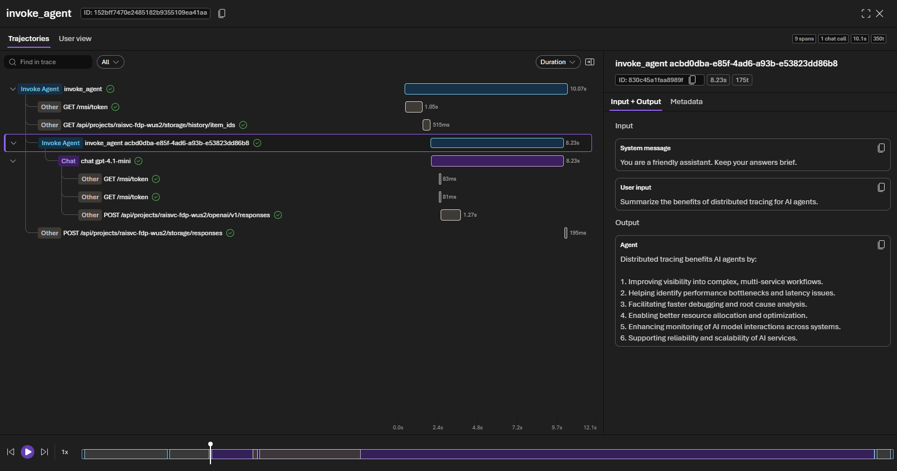

# Quickstart: Trace your hosted agent

> [!NOTE]
> Tracing is currently in preview.

In this quickstart, you view end-to-end traces for the hosted agent you deployed in [Deploy your first hosted agent](../../agents/quickstarts/quickstart-hosted-agent.md). You invoke your agent to generate trace data and review traces in the Foundry portal.

The hosting libraries ([`azure-ai-agentserver-responses`](https://pypi.org/project/azure-ai-agentserver-responses/) and [`azure-ai-agentserver-invocations`](https://pypi.org/project/azure-ai-agentserver-invocations/)) smoothly integrate the [Microsoft OpenTelemetry distro](https://pypi.org/project/microsoft-opentelemetry/), which provides out-of-the-box instrumentation for Microsoft Agent Framework and LangChain, and exports traces to Application Insights. In addition, Foundry Agent Service emits server-side telemetry for agent invocation automatically—no code changes required.

Tracing gives you visibility into how your agent handles each request so you can debug issues, monitor latency, and understand agent behavior before releasing changes to users.

## Prerequisites

Before you begin, you need:

* A deployed, invokable hosted agent from [Deploy your first hosted agent](../../agents/quickstarts/quickstart-hosted-agent.md), and the `azd` project directory you created in that quickstart.
* The **Foundry User** role on the Foundry resource.
* To use the UI path, access to the [Foundry portal](https://ai.azure.com). For the azd path, see the next requirements.
* [Azure Developer CLI (AZD) 1.25.3 or later](/azure/developer/azure-developer-cli/install-azd) with the `azd microsoft.foundry` extension:

    ```bash
    azd ext install microsoft.foundry
    ```

* An authenticated `azd` session. Check your status with `azd auth status`, and run `azd auth login` if you're not signed in.

  [!INCLUDE [role-rename-note](../../includes/role-rename-note.md)]

* An [Azure Monitor Application Insights resource](/azure/azure-monitor/app/app-insights-overview) connected to your Foundry project. To set it up, see [Set up tracing in Microsoft Foundry](../how-to/trace-agent-setup.md).
* The [Log Analytics Reader role](/azure/azure-monitor/logs/manage-access?tabs=portal#log-analytics-reader) on the Application Insights resource connected to your project. If the underlying Log Analytics tables are [protected](/azure/azure-monitor/logs/protected-tables-configure), also assign the [Privileged Monitoring Data Reader role](/azure/azure-monitor/logs/manage-access?tabs=portal#privileged-monitoring-data-reader).

## Step 1: Invoke your agent

Generate trace data by sending a request to your deployed agent.

### [Azure Developer CLI](#tab/azd)

From your `azd` project directory, send a test prompt:

```bash
azd ai agent invoke "Summarize the benefits of distributed tracing for AI agents."
```

You should see a response within a few seconds.

### [Foundry portal](#tab/portal)

1. Open the [Foundry portal](https://ai.azure.com) and go to your project.
1. Select your agent, and then select the **Playground** tab.
1. Send a test prompt, such as `Summarize the benefits of distributed tracing for AI agents.`

You should see a response within a few seconds.

---

Each invocation generates a complete trace. For richer traces, send prompts that trigger tool calls or multi-turn reasoning.

## Step 2: View traces in the Foundry portal

Traces can be viewed in the Foundry portal after invocation.

1. In the [Foundry portal](https://ai.azure.com), open your project.
1. In the left navigation, select **Agents**.
1. At the top, select **Traces**.
1. Find your trace in the list. You can search by **Trace ID**, **Response ID**, or filter by time range.

### Trajectory



### User view

:::image type="content" source="../../media/observability/tracing/user-view.gif" alt-text="Animation of the user view of traces in the Foundry portal." lightbox="../../media/observability/tracing/user-view.gif":::


> [!TIP]
> If your agent uses **Microsoft Agent Framework**, it emits its own OpenTelemetry spans automatically. These spans appear as children of the hosting layer spans, giving you a complete trace tree from the HTTP request through agent orchestration to individual tool calls and LLM interactions.

## Clean up resources

Tracing data is stored in Application Insights and follows your workspace's data retention settings. No additional resources are created in this quickstart. To remove everything you created across this and the previous quickstart, run `azd down` from your agent project directory.

> [!WARNING]
> `azd down` permanently deletes every resource in the resource group, including the Foundry project, model deployments, Application Insights, and the hosted agent.

## Troubleshooting

| Issue | Solution |
| ----- | -------- |
| Not using Foundry hosted agents and traces aren't showing | This quickstart covers hosted agents only. For tracing agents hosted outside of Foundry, see [Register an external agent](../../agents/how-to/register-external-agent.md). |
| No traces appear after invoking agent | Confirm Application Insights is connected to your Foundry project. If it isn't enabled, see [Set up tracing in Microsoft Foundry](../how-to/trace-agent-setup.md). Verify the agent responded successfully with `azd ai agent invoke`. |
| Traces appear but spans are missing input/output data attributes | Enable content recording by setting the environment variable `OTEL_INSTRUMENTATION_GENAI_CAPTURE_MESSAGE_CONTENT=true` in your agent configuration. |
| `AuthorizationFailed` when viewing traces | You need the [Log Analytics Reader role](/azure/azure-monitor/logs/manage-access?tabs=portal#log-analytics-reader) on the Application Insights resource. If the tables are [protected](/azure/azure-monitor/logs/protected-tables-configure), also assign [Privileged Monitoring Data Reader](/azure/azure-monitor/logs/manage-access?tabs=portal#privileged-monitoring-data-reader). |
| Traces appear but are missing tool call spans | Verify your agent defines tools and the model invokes them during the request. If using Microsoft Agent Framework, confirm tools are registered with the `Agent` constructor via the `tools` parameter. See [Add tools to your agent](/agent-framework/get-started/add-tools). |
| `AuthenticationError` or `DefaultAzureCredential` failure | Refresh credentials with `azd auth logout` and then `azd auth login`. |

## What you learned

In this quickstart, you:

* Learned that hosting libraries integrate the Microsoft OpenTelemetry distro for out-of-the-box instrumentation.
* Invoked your deployed agent to generate trace data.
* Viewed end-to-end traces in the Foundry portal.

## Next steps

> [!div class="nextstepaction"]
> [Set up tracing in Microsoft Foundry](../how-to/trace-agent-setup.md)

- [Set up tracing in Microsoft Foundry](../how-to/trace-agent-setup.md) for detailed tracing configuration.
- [Configure tracing for AI agent frameworks](../how-to/trace-agent-framework.md) to instrument LangChain and other frameworks.
- [Monitor AI agents with the Agent Monitoring Dashboard](../how-to/how-to-monitor-agents-dashboard.md) for production monitoring.

## Related content

* [Agent tracing overview](../concepts/trace-agent-concept.md)
* [What are hosted agents?](../../agents/concepts/hosted-agents.md)
* [Deploy your first hosted agent](../../agents/quickstarts/quickstart-hosted-agent.md)
* [Observability in generative AI](../../concepts/observability.md)
