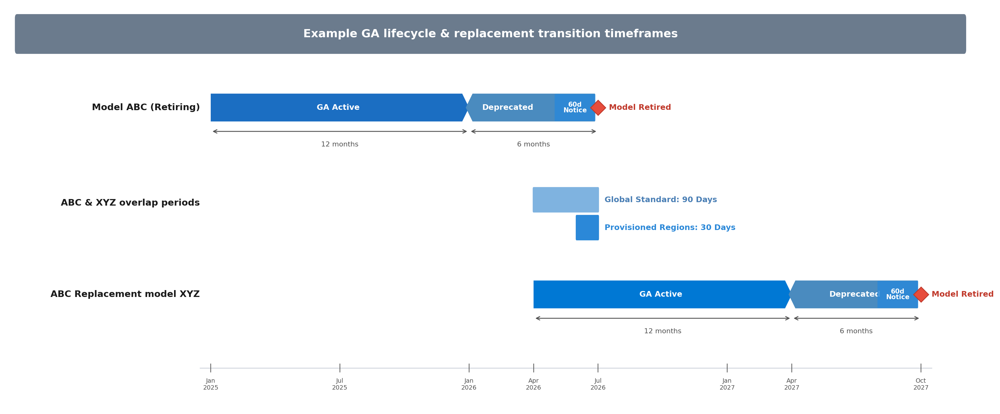
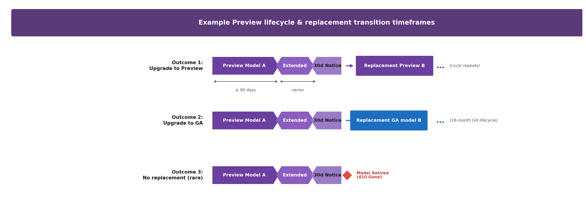

# Model Lifecycle and Support Policy

> **Scope**: All models available through Microsoft Foundry — Azure OpenAI models and Foundry Models (third-party/open-source via the model catalog).
>
> **Purpose**: One place to understand how models move from launch to retirement, what commitments we make for replacement overlap, and how customers are notified.
>
> **Retirement tables**: For specific model dates, see [Model Retirement Schedule](../concepts/model-retirements.md#current-models).

---

## How model lifecycle works

Microsoft Foundry continuously refreshes its model catalog with newer, more capable models. When a model is superseded, it moves through a predictable lifecycle that gives customers time to evaluate replacements and migrate. The lifecycle applies uniformly across Azure OpenAI models and Foundry Models (catalog/third-party), though notification timelines differ slightly by model origin.

### Lifecycle stages

Every model in the Foundry catalog belongs to exactly one of five stages:

| Stage | What it means | Can create new deployments? | Existing deployments work? |
|-------|--------------|----------------------------|---------------------------|
| **Preview** | Experimental. Weights, runtime, and API schema may change. Not guaranteed to become GA. Labeled "Preview" in the catalog. | Yes | Yes |
| **Generally Available (GA)** | Production-ready. Weights and APIs are fixed. Runtime patches for security vulnerabilities don't affect outputs. No label shown (default state). | Yes | Yes |
| **Legacy** | Newer, more capable models exist. You should plan on migrating workloads. This stage is **optional** — models may skip directly from GA to Deprecated. | Yes (until deprecation) | Yes |
| **Deprecated** | Existing customers may continue to create and manage deployments. No longer available to new customers — new customers cannot create deployments or access the model. | Existing customers: Yes. New customers: **No** | Yes |
| **Retired** | Removed from service. All inference requests return `410 Gone`. | **No** | **No** |

> [!NOTE]
> **"Existing customer" = subscription-level.** Whether a subscription is an existing or new customer is determined by whether that Azure subscription has ever deployed the specific model version. A new subscription under the same tenant does not inherit access to deprecated models from other subscriptions.

> [!NOTE]
> **Foundry Models (catalog)**: Some model providers define a shorter GA lifecycle — for example, 12 months instead of 18. When this applies, it is noted directly on the model in the [Model Retirement Schedule](../concepts/model-retirements.md#current-models).

> [!NOTE]
> **Fine-tuned models** follow a separate retirement schedule for training and deployment. See [Fine-tuned models](#fine-tuned-models) for details.

### Stage transitions at a glance

```
Preview ──► GA ──► Legacy ──► Deprecated ──► Retired
              │     optional      (+6 mo)            │
              │                   existing            │
              │                   customers           │
              │                   only                │
              └────── 18 months total (GA lifecycle) ─┘
```

---

## Model launch and availability

New models become available through deployment types in a predictable order:

1. **Global Standard** — Models launch here first, offering the broadest availability and lowest latency across regions.
2. **Global Provisioned** — Follows closely after Global Standard, providing reserved throughput with global routing.
3. **Data Zone Standard and Data Zone Provisioned** — Availability expands to data zone deployment types, keeping data processing within a defined geographic boundary.
4. **Standard and Provisioned** — Regional-only deployments come last, only as older models retire and capacity is reallocated.

### Availability rollout at a glance

```
Global Standard ──► Global Provisioned ──► Data Zone Standard ──► Standard
                                           Data Zone Provisioned   Provisioned
       (launch)         (follows              (expands to             (regional,
                         closely)              data zones)            as capacity
                                                                      permits)
```

> [!TIP]
> For a full comparison of deployment types, see [Deployment type comparison](https://learn.microsoft.com/en-us/azure/foundry/foundry-models/concepts/deployment-types?view=foundry-classic#deployment-type-comparison).

---

## Special considerations

### Regional availability

- Not all model + version combinations are available in all regions.
- Typically, more specialized models—for example, audio, image, and video generation—are only available as Data Zone or Global deployment types.
- Successive model versions may not be available in the same regions. A newer version may appear in some regions before upgrades are scheduled in others.
- Microsoft may limit new customers in specific regions to maintain service quality for existing customers.

### Azure Government clouds

- Global Standard deployments are not available in government clouds.
- Not all models or versions available in commercial clouds are available in government clouds.
- Government clouds typically support only one version of a given model at a time, with a **30-day overlap** when a new version becomes available.

### Security-driven retirements

If a model is found to have compliance or security issues, Microsoft reserves the right to invoke an **emergency retirement** with shortened notice. Refer to the Azure terms of service for details.

---

## Lifecycle timeline commitments

### Generally Available (GA) replacement model overlap commitments

We commit to meaningful overlap between a retiring GA model and its replacement so customers can test, evaluate, and migrate with confidence.



| Phase | Pattern |
|-------|---------|
| **GA launch** | Each model launches per its own offer/region availability matrix. Retirement date (18 months out) is set programmatically and available via the [Models API](https://learn.microsoft.com/en-us/rest/api/aiservices/accountmanagement/models?view=rest-aiservices-accountmanagement-2024-10-01). |
| **Deprecated (existing customers only)** | At +12 months, existing customers may continue to create and manage deployments. New customers cannot access the model. |
| **Replacement available in global standard** | Customers can use and test the replacement model in global standard ~90 days before retirement. |
| **Replacement available in provisioned regions** | Replacement becomes available to test in provisioned regions where the predecessor is retiring ~30 days before retirement, giving provisioned customers a manual migration window. |
| **Model version retired** | At +18 months, all inference returns `410 Gone`. |

> [!TIP]
> **Why 90–120 days?** The official replacement model is selected and declared approximately 90–120 days before the retiring model's retirement date — not sooner. Given the rapid pace of improvement in generative AI, declaring a replacement too early risks directing customers to a model that is no longer the best available option by the time they need to migrate.

### Preview model lifecycle

Preview models have a fundamentally different lifecycle than GA models. They launch with a "not sooner than" retirement date (typically 90 days out), but are sometimes extended beyond that initial window, until a suitable replacement preview or GA model version is available. When a retirement decision is made, customers are **force-upgraded** to a replacement (a newer preview version or the GA model) or the model is **retired with no replacement**. There is no option to remain on a retiring preview model — all preview deployments are either upgraded or terminated.



| Outcome | What happens |
|---------|-------------|
| **Upgrade to newer Preview** | Existing preview deployments are force-upgraded to a newer preview version. Customers get at least **30 days notice**. The cycle repeats until a GA version is available. |
| **Upgrade to GA** | When the GA model launches, preview deployments are force-upgraded to the GA version. Customers get at least **30 days notice**. The GA model then follows the standard 18-month GA lifecycle. |
| **No replacement (rare)** | If no replacement exists, customers get **30 days notice** before the model retires and inference returns `410 Gone`. |

### Understanding automatic upgrades

For **Global Standard**, **Data Zone Standard**, and **Standard** deployment types, Microsoft manages automatic upgrades when a model version is retired:

- Auto-upgrades are scheduled on a **rolling, region-by-region** basis.
- The upgrade schedule is published in advance in the [Model Retirement Schedule](../concepts/model-retirements.md#current-models).
- Upgrades may occur even if the new model version isn't yet separately available in that region, or for that SKU — the upgrade process will make it available.

> [!IMPORTANT]
> **Provisioned deployments are NOT auto-upgraded.** Provisioned customers must manually migrate to the replacement model.
>
> Use the [Models API](https://learn.microsoft.com/en-us/rest/api/aiservices/accountmanagement/models?view=rest-aiservices-accountmanagement-2024-10-01) to programmatically check `lifecycleStatus`, `deprecation`, and per-SKU `deprecationDate` for any model at any time.

### Example: gpt-4o → gpt-5.1 upgrade

When gpt-4o versions `2024-05-13` and `2024-08-06` retired on **2026-03-31**, they were auto-upgraded to gpt-5.1 on the Standard SKU. Before the upgrade, gpt-5.1 had no Standard presence at all. After the upgrade, gpt-5.1 Standard was added to all 8 regions that previously had those gpt-4o versions (centralus, eastus, eastus2, northcentralus, southcentralus, swedencentral, westus, westus3). Version `2024-11-20` was unaffected (retires 2026-10-01).

### Migrating to a replacement model

When a model you use enters the Legacy or Deprecated stage, check the "Suggested Replacement" column in the [Model Retirement Schedule](../concepts/model-retirements.md#current-models) and follow the steps in [Working with models](https://learn.microsoft.com/en-us/azure/foundry/openai/how-to/working-with-models) to deploy, test, and migrate to the replacement.

---

## Notifications

GA models have their retirement date set programmatically at launch (18 months out) — there is no separate "announcement." Legacy and Deprecated transitions follow the published timeline and are visible in real time via the [Models API](https://learn.microsoft.com/en-us/rest/api/aiservices/accountmanagement/models?view=rest-aiservices-accountmanagement-2024-10-01).

### When you receive active notifications

| Event | Timing | Applies to |
|-------|--------|-----------|
| **GA model retirement notice** | At least **60 days** before retirement | All GA models. Sent to subscription owners with active deployments. |
| **Preview model retirement notice** | At least **30 days** before retirement | Preview models. Preview deployments may be auto-upgraded to the replacement if a replacement model is available and applicable (e.g., doesn't require a different API contract). |

### How you're notified

| Channel | Details |
|---------|---------|
| **Email** | Sent automatically to subscription owners with active deployments. |
| **Azure Service Health** | Health advisories appear for affected subscriptions. Go to [Service Health > Health advisories](https://portal.azure.com/#blade/Microsoft_Azure_Health/AzureHealthBrowseBlade/healthAdvisories), filter by `Azure OpenAI Service`, and create an alert rule for email, SMS, or webhook notifications. |

### Want to use programmatic methods?

Customers can check lifecycle and deprecation fields on any model using the [Models API](https://learn.microsoft.com/en-us/rest/api/aiservices/accountmanagement/models?view=rest-aiservices-accountmanagement-2024-10-01) (subscription-scoped, all models in a region):
```http
GET https://management.azure.com/subscriptions/{sub}/providers/Microsoft.CognitiveServices/locations/{location}/models?api-version=2024-10-01
```
Fields: `lifecycleStatus`, `deprecation.inference`, `deprecation.fineTune`, per-SKU `deprecationDate` (ISO dates).

---

## Fine-tuned models

Fine-tuned models retire in two phases: training and deployment.

Unless explicitly stated, training retires no earlier than the base model retirement date. After a model is retired for training, it's no longer available for fine-tuning but any models you've trained remain available for deployment.

At deployment retirement, inference and deployment return error responses.

| Model | Version | Training retirement date | Deployment retirement date |
|-------|---------|--------------------------|----------------------------|
| gpt-4o | 2024-08-06 | No earlier than 2027-04-01¹ | 2027-10-01 |
| gpt-4o-mini | 2024-07-18 | No earlier than 2027-04-01¹ | 2027-10-01 |
| gpt-4.1 | 2025-04-14 | No earlier than 2027-04-14¹ | 2027-10-14 |
| gpt-4.1-mini | 2025-04-14 | No earlier than 2027-04-14¹ | 2027-10-14 |
| gpt-4.1-nano | 2025-04-14 | No earlier than 2027-04-14¹ | 2027-10-14 |
| o4-mini | 2025-04-16 | Base model retirement | One year after training retirement |

¹ For existing customers only. Otherwise, training retirement occurs at base model retirement.

---

## Frequently asked questions

| Question | Answer | Learn more |
|----------|--------|------------|
| **What's the difference between a model family, version, and variant?** | A *model family* is a generation of models (e.g., GPT-4o, GPT-5). A *model version* is a dated release within a family (e.g., gpt-4o 2024-05-13 vs. 2024-08-06). A *model variant* is a size/capability tier within the same family (e.g., GPT-5, GPT-5-mini, GPT-5-nano). | [Model versions](https://learn.microsoft.com/en-us/azure/foundry/foundry-models/concepts/model-versions) |
| **Can I control when my Standard deployment auto-upgrades?** | Yes. Set the `versionUpgradeOption` property on your deployment to one of three values: `OnceNewDefaultVersionAvailable` (upgrade when a new default is set), `OnceCurrentVersionExpired` (upgrade only at retirement), or `NoAutoUpgrade` (never auto-upgrade — deployment stops working at retirement). You can set this via REST API, Azure PowerShell, or the Foundry portal. | [Working with models — upgrade configuration](https://learn.microsoft.com/en-us/azure/foundry/openai/how-to/working-with-models#model-deployment-upgrade-configuration) |
| **How do I migrate a Provisioned deployment?** | Provisioned deployments are not auto-upgraded. You have two options: *In-place migration* (Azure handles traffic migration over a 20–30 minute window with no downtime) or *Side-by-side (multi-deployment) migration* (you create a new deployment, test, switch traffic, and delete the old one). | [Managing models on provisioned deployment types](https://learn.microsoft.com/en-us/azure/foundry/openai/how-to/working-with-models#managing-models-on-provisioned-deployment-types) |
| **Will my quota carry over to the replacement model?** | For Standard auto-upgrades, yes — quota is handled automatically. For Provisioned deployments, you must ensure quota is available for the target model before migrating. PTU capacity is model-agnostic and fungible across provisioned managed deployments. | [Provisioned throughput — quota](https://learn.microsoft.com/en-us/azure/foundry/openai/concepts/provisioned-throughput) |
| **Can I get an exception to extend a model's retirement date?** | No. Retirement dates are not extendable. Plan your migration using the timelines published in the [Model Retirement Schedule](../concepts/model-retirements.md#current-models) and the [Models API](https://learn.microsoft.com/en-us/rest/api/aiservices/accountmanagement/models?view=rest-aiservices-accountmanagement-2024-10-01). | — |
| **What tools can help me evaluate a replacement model?** | Use the model leaderboard in the [Foundry portal](https://ai.azure.com/explore/models) to compare benchmarks, the model comparison feature when deploying, and [Evaluations](https://learn.microsoft.com/en-us/azure/foundry/openai/concepts/model-retirements?tabs=text#preparation-for-model-retirements-and-version-upgrades) for custom workload testing. Apply prompt engineering and fine-tuning as needed to match prior accuracy. | [Preparation for model retirements](https://learn.microsoft.com/en-us/azure/foundry/openai/concepts/model-retirements?tabs=text#preparation-for-model-retirements-and-version-upgrades) |
| **Do embeddings models follow the same lifecycle?** | Embeddings models (text-embedding-3-large, text-embedding-3-small, text-embedding-ada-002) have extended timelines and are handled differently from inference models. Check the [Model Retirement Schedule](../concepts/model-retirements.md#current-models) for specific dates. | [Model retirements — embeddings](https://learn.microsoft.com/en-us/azure/foundry/openai/concepts/model-retirements?tabs=text#current-models) |
| **How do Priority Processing and Batch deployments upgrade?** | Priority Processing follows the same upgrade process as Standard deployments (auto-upgrade supported). Batch deployments follow the side-by-side (multi-deployment) migration approach — deploy the new model, resubmit jobs, then retire the old deployment. | [Working with models](https://learn.microsoft.com/en-us/azure/foundry/openai/how-to/working-with-models) |
| **I can't find "Microsoft Foundry" in Azure Service Health — how do I set up alerts?** | Select `Azure OpenAI Service` as the service name when configuring Service Health alerts. There is no separate "Microsoft Foundry" service in Service Health. | [Set up Service Health alerts](https://learn.microsoft.com/en-us/azure/service-health/alerts-activity-log-service-notifications-portal) |

For additional questions about pricing and more, see [Model Lifecycle FAQ](../concepts/model-retirements.md#frequently-asked-questions).

---

## Related content

- [Model Retirement Schedule](../concepts/model-retirements.md#current-models) — specific dates for all current, deprecated, and retired models
- [Models API reference](https://learn.microsoft.com/en-us/rest/api/aiservices/accountmanagement/models?view=rest-aiservices-accountmanagement-2024-10-01) — programmatically query `lifecycleStatus`, `deprecation`, and per-SKU `deprecationDate` for any model
- [Azure OpenAI model versions](https://learn.microsoft.com/en-us/azure/foundry/foundry-models/concepts/model-versions) — how version upgrades work
- [Getting started with model evaluation](https://techcommunity.microsoft.com/t5/ai-azure-ai-services-blog/how-to-evaluate-amp-upgrade-model-versions-in-the-azure-openai/ba-p/4218880) — evaluation guide
- [Managing models on provisioned deployment types](https://learn.microsoft.com/en-us/azure/foundry/openai/how-to/working-with-models#managing-models-on-provisioned-deployment-types)
- [Set up Service Health alerts](https://learn.microsoft.com/en-us/azure/service-health/alerts-activity-log-service-notifications-portal)


