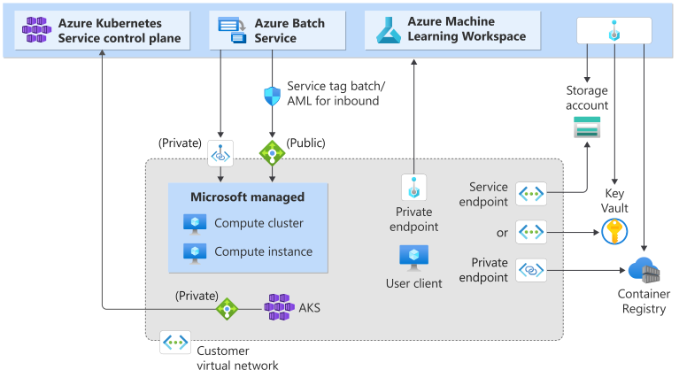

# Secure Azure Kubernetes Service inferencing environment

If you have an Azure Kubernetes Service (AKS) cluster behind a virtual network, you need to secure Azure Machine Learning workspace resources and a compute environment by using the same or peered virtual network. In this article, you learn about: 
  * What a secure AKS inferencing environment is
  * How to configure a secure AKS inferencing environment

## Limitations

* If your AKS cluster is behind a virtual network, your workspace and its associated resources (storage, key vault, Azure Container Registry) must have private endpoints or service endpoints in the same or peered virtual network as the AKS cluster's virtual network. For more information on securing the workspace and associated resources, see [create a secure workspace](tutorial-create-secure-workspace.md).
* If your workspace has a __private endpoint__, the Azure Kubernetes Service cluster must be in the same Azure region as the workspace.
* Using a [public fully qualified domain name (FQDN) with a private AKS cluster](/azure/aks/private-clusters) isn't supported with Azure Machine Learning.

## What is a secure AKS inferencing environment

An Azure Machine Learning AKS inferencing environment consists of a workspace, your AKS cluster, and workspace associated resources - Azure Storage, Azure Key Vault, and Azure Container Registry (ACR). The following table compares how services access different parts of Azure Machine Learning network with or without a virtual network.

| Scenario | Workspace | Associated resources (Storage account, Key Vault, ACR) | AKS cluster |
|-|-|-|-|-|
|**No virtual network**| Public IP | Public IP | Public IP |
|**Public workspace, all other resources in a virtual network** | Public IP | Public IP (service endpoint)   **- or -**   Private IP (private endpoint) | Private IP  |
|**Secure resources in a virtual network**| Private IP (private endpoint) | Public IP (service endpoint)   **- or -**   Private IP (private endpoint) | Private IP  | 

In a secure AKS inferencing environment, the AKS cluster accesses different parts of Azure Machine Learning services by using private endpoints only (private IP). The following network diagram shows a secured Azure Machine Learning workspace with a private AKS cluster or default AKS cluster behind a virtual network.

 

## How to configure a secure AKS inferencing environment

To configure a secure AKS inferencing environment, you need virtual network information for AKS. You can create a [virtual network](/azure/virtual-network/quick-create-portal) independently or during AKS cluster deployment. Two options exist for AKS cluster in a virtual network:
  * Deploy default AKS cluster to your virtual network
  * Create private AKS cluster to your virtual network

For default AKS cluster, find virtual network information under the resource group `MC_<resourcegroupname>_<clustername>_<location>`. 

> [!TIP]
> If you're securing managed online endpoints rather than AKS-based inferencing, use [workspace managed network isolation](how-to-managed-network.md) instead of manually configuring VNets.

After you get virtual network information for AKS cluster and if you already have workspace available, use following steps to configure a secure AKS inferencing environment:
  
  * Use your AKS cluster virtual network information to add new private endpoints for the Azure Storage Account, Azure Key Vault, and Azure Container Registry used by your workspace. These private endpoints should exist in the same or peered virtual network as AKS cluster. For more information, see the [secure workspace with private endpoint](./how-to-secure-workspace-vnet.md#secure-the-workspace-with-private-endpoint) article.
  * If you have other storage that Azure Machine Learning workloads use, add a new private endpoint for that storage. The private endpoint should be in the same or peered virtual network as AKS cluster and have private DNS zone integration enabled.
  * Add a new private endpoint to your workspace. This private endpoint should be in the same or peered virtual network as your AKS cluster and have private DNS zone integration enabled.

If you have AKS cluster ready but don't have workspace created yet, use AKS cluster virtual network when creating the workspace. Use the AKS cluster virtual network information when following the [create secure workspace](./tutorial-create-secure-workspace.md) tutorial. Once the workspace is created, add a new private endpoint to your workspace as the last step. For all the preceding steps, ensure that all private endpoints exist in the same AKS cluster virtual network and have private DNS zone integration enabled.

Special notes for configuring a secure AKS inferencing environment:
  * When creating a workspace, storage accounts configured with private endpoints use the workspace's system-assigned managed identity for trusted access. If your workspace uses a user-assigned managed identity, you can also enable **Allow Azure services on the trusted services list to access this storage account** to grant access.
  * When attaching AKS cluster to a high business impact (HBI) workspace, assign a system-assigned managed identity with both `Storage Blob Data Contributor` and `Storage Account Contributor` roles.
  * If you're using default ACR created by workspace, ensure you have the __premium SKU__ for ACR. Also enable the `Firewall exception` to allow trusted Microsoft services to access ACR.
  * If your workspace is also behind a virtual network, follow the instructions in [securely connect to your workspace](./how-to-secure-workspace-vnet.md#securely-connect-to-your-workspace) to access the workspace.
  * For storage account private endpoint, make sure to enable `Allow Azure services on the trusted services list to access this storage account`.

> [!NOTE]
>
> If your AKS that is behind a virtual network is stopped and **restarted**, you need to:
> 1. First, follow the steps in [Stop and start an Azure Kubernetes Service (AKS) cluster](/azure/aks/start-stop-cluster) to delete and recreate a private endpoint linked to this cluster. 
> 1. Then, reattach the Kubernetes computes attached from this AKS in your workspace. 
>
> Otherwise, the creation, update, and deletion of endpoints and deployments to this AKS cluster fail.

## Related content

This article is part of a series on securing an Azure Machine Learning workflow. See the other articles in this series:

* [Virtual network overview](how-to-network-security-overview.md)
* [Secure the training environment](how-to-secure-training-vnet.md)
* [Secure online endpoints (inference)](how-to-secure-online-endpoint.md)
* [Enable studio functionality](how-to-enable-studio-virtual-network.md)
* [Use custom DNS](how-to-custom-dns.md)
* [Use a firewall](how-to-access-azureml-behind-firewall.md)
* [Tutorial: Create a secure workspace](tutorial-create-secure-workspace.md)
* [Bicep template](/samples/azure/azure-quickstart-templates/machine-learning-end-to-end-secure/)
* [Terraform template](https://github.com/Azure/terraform/tree/master/quickstart/201-machine-learning-moderately-secure).
* [API platform network isolation](how-to-configure-network-isolation-with-v2.md)
