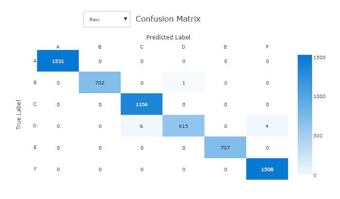
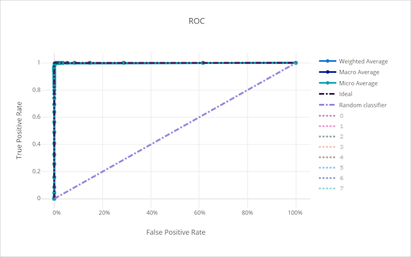
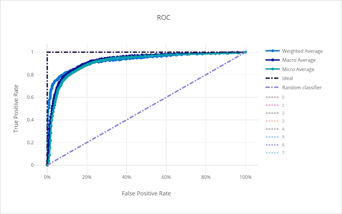
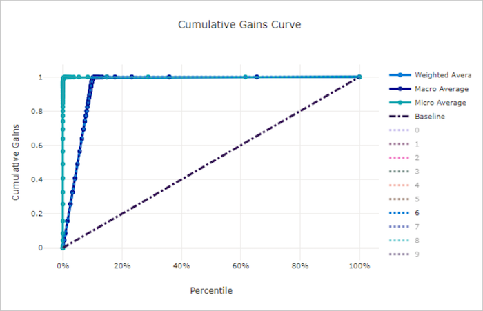
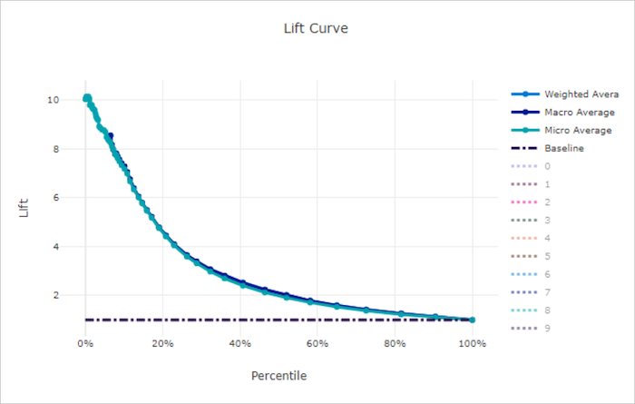
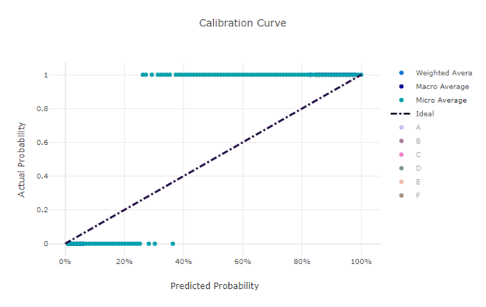
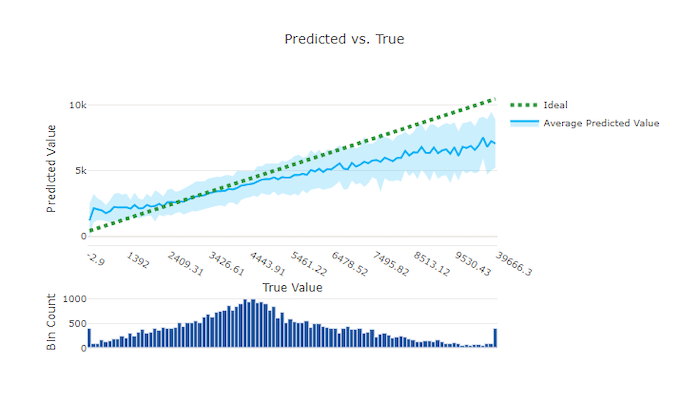
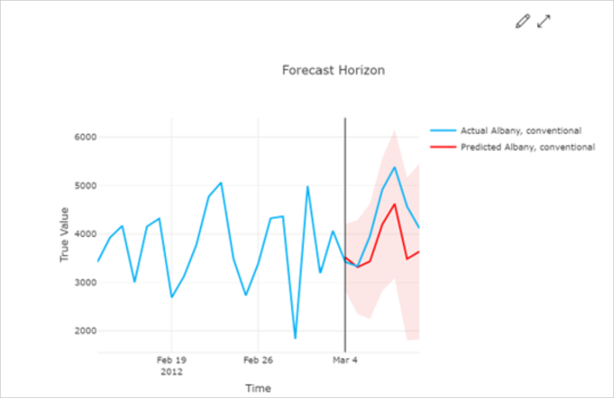

# Evaluate automated machine learning experiment results

Automated machine learning (AutoML) records metrics and charts for the models
created during a training job. Use these results together to compare models,
select an operating threshold, and identify errors that an aggregate score
might hide.

## Prerequisites

- An Azure subscription. If you don't have one, [create a free Azure
  account](https://azure.microsoft.com/pricing/purchase-options/azure-account?cid=msft_learn).
- An AutoML job created with [Azure Machine Learning
  studio](how-to-use-automated-ml-for-ml-models.md) or the [Azure Machine
  Learning CLI or Python SDK](how-to-configure-auto-train.md).

## Choose evaluation results

Start with the result type that matches your task, and then use complementary
metrics and charts to test the same behavior from different perspectives.

| Task | Start with | Complement with |
|---|---|---|
| **Classification** | [Classification metrics](#choose-classification-metrics) | [Confusion matrix](#confusion-matrix) and [classification curves](#classification-curves) |
| **Regression** | [Regression metrics](#choose-regression-and-forecasting-metrics) | [Residuals](#residuals) and [predicted versus actual values](#predicted-versus-actual-values) |
| **Forecasting** | [Forecasting metrics](#choose-regression-and-forecasting-metrics) | Per-series inspection and the [forecast horizon](#forecast-horizon) |
| **Image models** | Task-specific primary metrics | [Image model results](#evaluate-image-model-results) |
| **Model debugging** | Aggregate metrics and charts | [Responsible AI insights](#use-responsible-ai-insights) |

The following guidance helps you choose an initial metric. No single metric
captures every model behavior.

| Scenario | Start with | Complement with | Important caution |
|---|---|---|---|
| **Imbalanced classification** | Macro recall, balanced accuracy, or PR AUC | Confusion matrix and per-class precision and recall | Accuracy and micro averages can hide minority-class failures. |
| **Ranking positive cases** | ROC AUC or PR AUC | Threshold-specific precision and recall | AUC doesn't select an operating threshold. |
| **Probability quality** | Log loss and calibration curve | Accuracy or AUC | A well-calibrated model isn't necessarily accurate. |
| **Regression with outliers** | MAE or median absolute error | RMSE and residual histogram | RMSE gives large errors more influence. |
| **Relative regression error** | MAPE, only when actual values remain away from zero | MAE or RMSE | Zero and near-zero actual values make MAPE unreliable. |
| **Nonnegative, scale-relative targets** | RMSLE | RMSE or MAE | RMSLE doesn't support negative targets or predictions. |
| **Multiseries forecasting** | Macro-normalized metrics | Micro metrics and per-series inspection | High-volume series can dominate micro metrics. |
| **Model debugging** | Responsible AI insights | Aggregate metrics and charts | The integrated AutoML dashboard has [workflow prerequisites](#use-responsible-ai-insights). |

## View job results

After the AutoML job finishes, view its model metrics and charts in the studio:

1. Sign in to [Azure Machine Learning studio](https://ml.azure.com/) and open
   your workspace.
1. Select **Jobs**.
1. Select the experiment, and then select the AutoML job.
1. Select **Models**, and then select the **Algorithm name** of the model to
   evaluate.
1. Select **Metrics**, and use the checkboxes to display metrics and charts.

For programmatic access, use the SDK v2 [`MLClient.jobs`
operations](/python/api/azure-ai-ml/azure.ai.ml.mlclient) or [log and view
metrics with MLflow](how-to-log-view-metrics.md). If you maintain SDK v1 code,
see [Upgrade to SDK v2](how-to-migrate-from-v1.md). SDK v2 doesn't provide a
direct replacement for the SDK v1 notebook results widget.

## Evaluate classification results

### Choose classification metrics

Use threshold-independent metrics such as ROC AUC and average precision to
compare ranking across decision thresholds. Use accuracy, precision, recall,
and F1 to evaluate predictions at a selected threshold. For imbalanced data,
inspect macro or per-class results and the confusion matrix instead of relying
only on accuracy or micro averages. For definitions and implementation details,
see the [scikit-learn model evaluation
guide](https://scikit-learn.org/stable/modules/model_evaluation.html).

### Classification metric reference

AutoML calculates the following metrics for classification models. Exact
metric identifiers are shown in code formatting.

| Metric | What it measures | When to use it | Better value | Reference |
|---|---|---|---|---|
| **`AUC_macro`, `AUC_micro`, `AUC_weighted`, `AUC_binary`** | Area under the ROC curve across decision thresholds. It measures ranking, not the proportion of correct predictions. | Compare how well models rank positive samples above negative samples. | Closer to `1`; `0.5` represents random ranking. | [scikit-learn `roc_auc_score` reference](https://scikit-learn.org/stable/modules/generated/sklearn.metrics.roc_auc_score.html) |
| **`accuracy`** | Proportion of predictions that match the actual class label. | Use when class frequencies and error costs are reasonably balanced. | Closer to `1`. | [scikit-learn `accuracy_score` reference](https://scikit-learn.org/stable/modules/generated/sklearn.metrics.accuracy_score.html) |
| **`average_precision_score_macro`, `average_precision_score_micro`, `average_precision_score_weighted`, `average_precision_score_binary`** | Summary of the precision-recall curve that weights precision by each increase in recall. | Compare ranking when the positive class is uncommon. | Closer to `1`. | [scikit-learn `average_precision_score` reference](https://scikit-learn.org/stable/modules/generated/sklearn.metrics.average_precision_score.html) |
| **`balanced_accuracy`** | Unweighted mean of recall across classes. | Compare models when class frequencies differ. | Closer to `1`. | [scikit-learn `balanced_accuracy_score` reference](https://scikit-learn.org/stable/modules/generated/sklearn.metrics.balanced_accuracy_score.html) |
| **`f1_score_macro`, `f1_score_micro`, `f1_score_weighted`, `f1_score_binary`** | Harmonic mean of precision and recall. | Balance false positives and false negatives without using true negatives. | Closer to `1`. | [scikit-learn `f1_score` reference](https://scikit-learn.org/stable/modules/generated/sklearn.metrics.f1_score.html) |
| **`log_loss`** | Negative log-likelihood of the actual labels from predicted probabilities. | Evaluate probability quality and strongly penalize confident incorrect predictions. | Closer to `0`. | [scikit-learn `log_loss` reference](https://scikit-learn.org/stable/modules/generated/sklearn.metrics.log_loss.html) |
| **`norm_macro_recall`** | Macro recall adjusted so balanced random guessing is `0` and perfect recall is `1`. Values can be negative when performance is worse than the random baseline. | Compare recall across classes while accounting for the number of classes. | Closer to `1`. | [scikit-learn `recall_score` reference](https://scikit-learn.org/stable/modules/generated/sklearn.metrics.recall_score.html) |
| **`matthews_correlation`** | Correlation between actual and predicted classes. | Evaluate classification when class sizes differ. | Closer to `1`; `0` indicates random prediction and `-1` inverse prediction. | [scikit-learn `matthews_corrcoef` reference](https://scikit-learn.org/stable/modules/generated/sklearn.metrics.matthews_corrcoef.html) |
| **`precision_score_macro`, `precision_score_micro`, `precision_score_weighted`, `precision_score_binary`** | Share of predicted positives that are positive: `TP / (TP + FP)`. | Use when false positives are costly. | Closer to `1`. | [scikit-learn `precision_score` reference](https://scikit-learn.org/stable/modules/generated/sklearn.metrics.precision_score.html) |
| **`recall_score_macro`, `recall_score_micro`, `recall_score_weighted`, `recall_score_binary`** | Share of actual positives detected: `TP / (TP + FN)`. False positives don't appear in recall. | Use when false negatives are costly. | Closer to `1`. | [scikit-learn `recall_score` reference](https://scikit-learn.org/stable/modules/generated/sklearn.metrics.recall_score.html) |
| **`weighted_accuracy`** | Accuracy that changes each class's contribution to the result. | Compare models when class imbalance makes ordinary accuracy misleading. | Closer to `1`. | [AutoML classification metric guidance](how-to-configure-auto-train.md#metrics-for-classification-multi-class-scenarios) |

### Binary and multiclass metrics

For `K` classes, macro recall is the unweighted mean of per-class recall:
`macro_recall = (1 / K) * sum(recall_k)`. Each class therefore has equal
influence, regardless of its number of samples.

Micro recall aggregates counts before calculating the result:
`micro_recall = sum(TP) / (sum(TP) + sum(FN))`. It gives each sample equal
weight, so majority classes can dominate. In single-label multiclass
classification, micro recall equals overall accuracy. Weighted averaging
calculates a metric for each class and weights the results by class support.
For more information, see the [scikit-learn guidance for multiclass and
multilabel metrics](https://scikit-learn.org/stable/modules/model_evaluation.html#multiclass-and-multilabel-classification).

AutoML calculates normalized macro recall as
`(macro_recall - baseline) / (1 - baseline)`, where the balanced random
baseline is `1 / K`. A result of `1` is perfect, `0` is the random baseline,
and a negative result is worse than that baseline.

For binary one-versus-rest metrics, configure the **Positive class label**.
The SDK v2 property is
[`positive_label`](/python/api/azure-ai-ml/azure.ai.ml.automl.classificationjob).
AutoML treats every other label as negative for this calculation. This
selection affects binary precision, recall, F1, AUC, average precision, and
related binary metrics. It doesn't change the ground-truth labels.

### Confusion matrix

**What it shows.** A confusion matrix counts samples by actual class in each row
and predicted class in each column.

**How to read it.** In the studio, darker cells contain more samples. Select
**Normalized** to show row percentages or **Raw** to inspect counts and class
imbalance.

**What to watch for.** Concentration along the diagonal indicates correct
classification. Off-diagonal concentrations reveal class pairs that the model
frequently confuses.

**Observations concentrated along the diagonal**

**Frequent confusion away from the diagonal**

### Classification curves

For each classification curve in the studio, select class labels in the legend
to compare per-class and averaged results.

#### ROC curve

**What it shows.** The receiver operating characteristic (ROC) curve plots the
true-positive rate against the false-positive rate as the decision threshold
changes.

**How to read it.** A curve approaching the upper-left corner combines a high
true-positive rate with a low false-positive rate. The area under the curve
(ROC AUC) is the probability that the classifier ranks a randomly selected
positive sample above a randomly selected negative sample. A value of `1`
represents perfect ranking, and `0.5` represents random ranking. For the formal
definition, see the [scikit-learn ROC AUC
guidance](https://scikit-learn.org/stable/modules/model_evaluation.html#roc-metrics).

**What to watch for.** ROC can obscure minority-class behavior when classes are
highly imbalanced. Compare it with the precision-recall curve. Unlike accuracy,
ROC AUC summarizes ranking across thresholds; accuracy measures correct
predictions at a selected threshold.

**ROC curve approaching the upper-left corner**

**ROC curve near the random-model baseline**

#### Precision-recall curve

**What it shows.** The precision-recall curve plots precision against recall as
the decision threshold changes.

**How to read it.** Curves closer to the upper-right retain high precision as
recall increases. Choose a point on the curve according to the relative cost of
false positives and false negatives.

**What to watch for.** The class prevalence affects the baseline, so compare
models evaluated on the same population. Precision-recall curves are often
more informative than ROC curves when positive samples are uncommon. See the
[scikit-learn precision-recall
guidance](https://scikit-learn.org/stable/modules/model_evaluation.html#precision-recall-f-measure-metrics).

**Precision and recall remain high**

**Precision falls as recall increases**

#### Cumulative gains curve

**What it shows.** The cumulative gains curve orders samples by predicted
probability and plots the share of positive samples found against the share of
the population examined.

**How to read it.** At a selected population fraction, the curve reports the
fraction of all positive samples captured. A random model follows the diagonal
`y = x`; a useful model rises above that line.

**What to watch for.** Compare curves at the population fraction that matches
your capacity. A high gain at one fraction doesn't establish probability
calibration or performance at a different operating point.

**Cumulative gain rises rapidly**

**Cumulative gain stays near the random baseline**

#### Lift curve

**What it shows.** At each sampled-population fraction, lift divides the model's
cumulative gain by the random model's cumulative gain at that same fraction.

**How to read it.** The random-model lift baseline is the horizontal line
`y = 1`. A lift of `2` means that the selected fraction captures twice the
positive-sample share expected from random selection.

**What to watch for.** Lift normally decreases as more of the population is
included. Compare models at the fraction that the application can act on.

**Lift remains above the random baseline**

**Lift approaches the random baseline**

#### Calibration curve

**What it shows.** A calibration curve compares predicted probability with the
observed positive-class frequency.

**How to read it.** A calibrated model follows the diagonal `y = x`. For
example, among predictions near `0.7`, about 70 percent should be positive.

**What to watch for.** Calibration doesn't measure classification accuracy or
ranking. Small validation sets can also produce a noisy curve. See the
[scikit-learn calibration
guide](https://scikit-learn.org/stable/modules/calibration.html).

**Predicted probabilities align with observed frequency**

**Predicted probabilities deviate from observed frequency**

## Evaluate regression and forecasting results

### Choose regression and forecasting metrics

Use MAE or median absolute error when you need an error in target units and
want less sensitivity to large errors. Use RMSE when large errors should have
more influence. Use MAPE only when actual values remain safely away from zero,
and use RMSLE only when actual and predicted values are nonnegative.

### Regression and forecasting metric reference

AutoML reports the following regression and forecasting metrics.

| Metric | What it measures | When to use it | Better value | Reference |
|---|---|---|---|---|
| **`explained_variance`** | Proportion of target variance accounted for by the predictions. | Compare how much variation models explain. | Closer to `1`. | [scikit-learn `explained_variance_score` reference](https://scikit-learn.org/stable/modules/generated/sklearn.metrics.explained_variance_score.html) |
| **`mean_absolute_error`, `normalized_mean_absolute_error`** | Mean absolute difference between actual and predicted values. | Use an error in target units with less sensitivity to large errors than RMSE. | Closer to `0`. | [scikit-learn `mean_absolute_error` reference](https://scikit-learn.org/stable/modules/generated/sklearn.metrics.mean_absolute_error.html) |
| **`mean_absolute_percentage_error`** | Mean absolute error relative to each actual value. | Compare relative error only when actual values remain away from zero. | Closer to `0`. | [scikit-learn `mean_absolute_percentage_error` reference](https://scikit-learn.org/stable/modules/generated/sklearn.metrics.mean_absolute_percentage_error.html) |
| **`median_absolute_error`, `normalized_median_absolute_error`** | Median absolute difference between actual and predicted values. | Use a measure that is robust to outliers. | Closer to `0`. | [scikit-learn `median_absolute_error` reference](https://scikit-learn.org/stable/modules/generated/sklearn.metrics.median_absolute_error.html) |
| **`r2_score`** | Proportional reduction in squared error relative to predicting the target mean. | Compare fit against a mean-prediction baseline. | Closer to `1`; values can be negative. | [scikit-learn `r2_score` reference](https://scikit-learn.org/stable/modules/generated/sklearn.metrics.r2_score.html) |
| **`root_mean_squared_error`, `normalized_root_mean_squared_error`** | Square root of mean squared prediction error. | Give large errors more influence than MAE. | Closer to `0`. | [scikit-learn root mean squared error reference](https://scikit-learn.org/stable/modules/generated/sklearn.metrics.root_mean_squared_error.html) |
| **`root_mean_squared_log_error`, `normalized_root_mean_squared_log_error`** | Square root of mean squared differences after applying `log(1 + value)`. | Compare scale-relative errors for nonnegative values. | Closer to `0`. | [scikit-learn `mean_squared_log_error` reference](https://scikit-learn.org/stable/modules/generated/sklearn.metrics.mean_squared_log_error.html) |
| **`spearman_correlation`** | Rank correlation between actual and predicted values. | Evaluate whether predictions preserve a monotonic ordering. | Closer to `1`; values range from `-1` to `1`. | [SciPy `spearmanr` reference](https://docs.scipy.org/doc/scipy/reference/generated/scipy.stats.spearmanr.html) |

MAPE is `mean(abs((y_true - y_pred) / y_true))`. Some implementations display
the result as a fraction, while others multiply it by 100 to show a percentage.
MAPE is undefined when an actual value is zero, and actual values near zero can
produce extremely large results. For these target series, use MAE or RMSE
instead. For implementation behavior, see the [scikit-learn MAPE
reference](https://scikit-learn.org/stable/modules/generated/sklearn.metrics.mean_absolute_percentage_error.html).

RMSLE is
`sqrt(mean((log(1 + y_true) - log(1 + y_pred))^2))`. Actual and predicted
values must be nonnegative. RMSLE measures relative differences and gives
underprediction more influence than an equivalent overprediction. Use RMSE or
MAE if negative values are possible. See the [scikit-learn mean squared
logarithmic error
reference](https://scikit-learn.org/stable/modules/generated/sklearn.metrics.mean_squared_log_error.html).

### Metric normalization

AutoML reports normalized versions of several error metrics to make results
more comparable across targets with different scales. Because normalization
depends on the evaluation data, don't compare normalized values from different
datasets without confirming that they use a consistent basis. Use the
unnormalized metric when you need error in the target's original units.

### Forecasting aggregation

Forecasting evaluation over multiple time series can aggregate results in two
ways:

- **Macro averaging** gives each series equal influence after calculating its
  metric.
- **Micro averaging** gives each prediction equal influence across all series.

High-volume series can dominate micro metrics. Macro-normalized metrics are
often more useful when each series has similar business importance, but inspect
both aggregate and per-series results before selecting a model.

### Residuals

**What it shows.** The residuals chart displays the distribution of prediction
errors for regression and forecasting models.

**How to read it.** A distribution concentrated near zero with few extreme
errors indicates that predictions are usually close to actual values.

**What to watch for.** A distribution shifted away from zero suggests bias.
Wide or asymmetric tails can reveal large errors or behavior that an aggregate
metric hides.

**Residual errors concentrated near zero**

**Residual errors widely dispersed**

### Predicted versus actual values

**What it shows.** This chart bins actual target values on the horizontal axis
and plots the mean prediction and its variation for each bin.

**How to read it.** Predictions close to the ideal diagonal `y = x` align with
actual values. Use the accompanying histogram to see how much data supports
each region.

**What to watch for.** Large departures from the diagonal reveal systematic
underprediction or overprediction. Sparse regions can produce less stable
estimates.

**Predictions close to the ideal diagonal**

**Predictions deviating from the ideal diagonal**

### Forecast horizon

**What it shows.** For forecasting jobs, the forecast horizon chart compares
predicted and actual values over time for cross-validation folds and time
series. The forecast origin is the point where predictions begin.

**How to read it.** To the left of the horizon line, use historical values to
understand the preceding trend. To the right, compare predictions with actual
values and inspect the prediction interval.

**What to watch for.** Select different folds and series in the chart to find
errors hidden by aggregate metrics. Look for drift, delayed responses to
changes, and intervals that don't cover actual values.

## Evaluate image model results

### Image classification

For multiclass image classification, the primary metric is accuracy. For
multilabel image classification, the primary metric is intersection over union
(IoU).

Multilabel classification applies a confidence threshold to decide whether
each label is present. Multiclass classification instead selects the class with
the highest confidence score.

### Object detection and instance segmentation

Object detection and instance segmentation use IoU to measure overlap between
a predicted region and its ground-truth region. Mean average precision (mAP)
summarizes average precision across classes.

Keep inference filtering separate from validation matching:

| Setting | Purpose |
|---|---|
| **`box_score_threshold`** | Filters inference output. At prediction time, AutoML returns only boxes whose classification confidence is greater than this threshold. It doesn't configure validation metrics. |
| **`validation_metric_type`** | Selects the validation metric convention, such as `coco` or `voc`. |
| **`validation_iou_threshold`** | Sets the IoU cutoff used to match predicted and ground-truth boxes when validation metrics are calculated. |

For accepted values and defaults, see [object detection and instance
segmentation hyperparameters](reference-automl-images-hyperparameters.md#object-detection-and-instance-segmentation-task-specific-hyperparameters).
For the COCO convention, see the [official COCO detection evaluation
reference](https://cocodataset.org/#detection-eval). For Pascal VOC, see the
[official Pascal VOC evaluation
documentation](http://host.robots.ox.ac.uk/pascal/VOC/voc2012/htmldoc/).

## Use Responsible AI insights

The integrated AutoML Responsible AI dashboard isn't generated by default. It
can provide model performance, fairness, data exploration, explanation, and
error-analysis insights for the best recommended model.

> [!IMPORTANT]
> The integrated workflow requires:
>
> - A supported new AutoML classification or regression job.
> - The **Explain best model** option enabled when you configure the job.
> - Suitable compute for the job.
> - The best recommended model produced by that job.

The integrated workflow doesn't retroactively create a dashboard for an
existing AutoML model. To configure and open it, see [Create an AutoML
Responsible AI dashboard in the
studio](how-to-use-automated-ml-for-ml-models.md#responsible-ai-dashboard-preview).

The generic Responsible AI SDK and CLI workflow is separate from the integrated
AutoML experience. Build that pipeline when you need a dashboard for an
arbitrary supported model. For supported inputs and components, see [Generate
Responsible AI insights with YAML and
Python](how-to-responsible-ai-insights-sdk-cli.md).

## Related content

- [Configure AutoML training with the CLI and Python
  SDK](how-to-configure-auto-train.md)
- [Create and inspect AutoML jobs in the
  studio](how-to-use-automated-ml-for-ml-models.md)
- [Monitor and analyze jobs in Azure Machine Learning
  studio](how-to-track-monitor-analyze-runs.md)
- [Use the Responsible AI
  dashboard](how-to-responsible-ai-dashboard.md)
