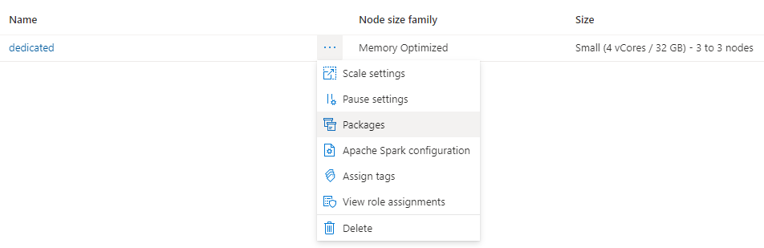
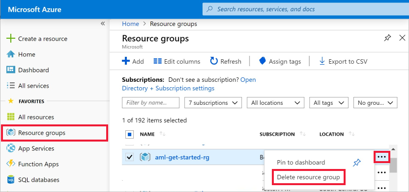

# Track Azure Synapse Analytics ML experiments with MLflow and Azure Machine Learning

In this article, you learn how to enable MLflow to connect to Azure Machine Learning while working in an Azure Synapse Analytics workspace. Use this configuration for tracking, model management, and model deployment.

[MLflow](https://www.mlflow.org) is an open-source library for managing the life cycle of your machine learning experiments. MLflow Tracking is a component of MLflow that logs and tracks your training run metrics and model artifacts. For more information, see [MLflow](concept-mlflow.md).

> [!WARNING]
> Support for MLflow Projects in Azure Machine Learning is retiring in September 2026. For code-based training jobs, use [Azure Machine Learning Jobs](how-to-use-mlflow-cli-runs.md) with MLflow tracking instead.

## Prerequisites

* Python 3.10 or later installed in your Azure Synapse Analytics environment.
* An [Azure Synapse Analytics workspace and cluster](/azure/synapse-analytics/quickstart-create-workspace).
* An [Azure Machine Learning Workspace](quickstart-create-resources.md).

## Install libraries

To install libraries on your dedicated cluster in Azure Synapse Analytics, follow these steps:

1. Create a `requirements.txt` file with the packages your experiments require, including the following packages:

    __requirements.txt__

    ```pip
    mlflow
    azureml-mlflow
    azure-ai-ml
    ```

    > [!TIP]
    > Use [`mlflow-skinny`](https://github.com/mlflow/mlflow/blob/master/libs/skinny/README_SKINNY.md) instead of `mlflow`. It's a lightweight package without SQL storage, the server UI, or full data science dependencies. If you primarily need tracking and logging, use `mlflow-skinny`.

1. Go to the Azure Synapse Analytics workspace portal.

1. Go to the **Manage** tab and select **Apache Spark Pools**.

1. Select the **...** (ellipsis) next to the cluster name, and then select **Packages**.

    

1. In the **Requirements files** section, select **Upload**.

1. Upload the `requirements.txt` file.

1. Wait for your cluster to restart.

## Track experiments with MLflow

You can configure Azure Synapse Analytics to track experiments by using MLflow to Azure Machine Learning workspace. Azure Machine Learning provides a centralized repository to manage the entire lifecycle of experiments, models, and deployments. It also has the advantage of enabling easier path to deployment by using Azure Machine Learning deployment options.

### Configuring your notebooks to use MLflow connected to Azure Machine Learning

To use Azure Machine Learning as your centralized repository for experiments, you can use MLflow. On each notebook you're working on, configure the tracking URI to point to the workspace you're using. The following example shows how it can be done:

__Configure tracking URI__

[!INCLUDE [configure-mlflow-tracking](includes/machine-learning-mlflow-configure-tracking.md)]

__Configure authentication__

Once the tracking is configured, you'll also need to configure how the authentication needs to happen to the associated workspace. By default, the Azure Machine Learning plugin for MLflow will perform interactive authentication by opening the default browser to prompt for credentials. Refer to [Configure MLflow for Azure Machine Learning: Configure authentication](how-to-use-mlflow-configure-tracking.md#configure-authentication) to additional ways to configure authentication for MLflow in Azure Machine Learning workspaces.

[!INCLUDE [configure-mlflow-auth](includes/machine-learning-mlflow-configure-auth.md)]

### Experiment's names in Azure Machine Learning

By default, Azure Machine Learning tracks runs in a default experiment called `Default`. It is usually a good idea to set the experiment you will be going to work on. Use the following syntax to set the experiment's name:

```python
mlflow.set_experiment(experiment_name="experiment-name")
```

### Tracking parameters, metrics and artifacts

You can use then MLflow in Azure Synapse Analytics in the same way as you're used to. For details see [Log & view metrics and log files](how-to-log-view-metrics.md).

## Registering models in the registry with MLflow

Models can be registered in Azure Machine Learning workspace, which offers a centralized repository to manage their lifecycle. The following example logs a model trained with Spark MLLib and also registers it in the registry.

```python
mlflow.spark.log_model(model, 
                       artifact_path = "model", 
                       registered_model_name = "model_name")  
```

* **If a registered model with the name doesn't exist**, the method registers a new model, creates version 1, and returns a ModelVersion MLflow object. 

* **If a registered model with the name already exists**, the method creates a new model version and returns the version object. 

You can manage models registered in Azure Machine Learning using MLflow. View [Manage models registries in Azure Machine Learning with MLflow](how-to-manage-models-mlflow.md) for more details.

## Deploying and consuming models registered in Azure Machine Learning

Models registered in Azure Machine Learning Service using MLflow can be consumed as:

* An Azure Machine Learning online endpoint (real-time) or batch endpoint: This deployment uses Azure Machine Learning managed inferencing. See [Deploy MLflow models to online endpoints](how-to-deploy-mlflow-models-online-endpoints.md) for details.

* MLflow model objects or Pandas UDFs, which can be used in Azure Synapse Analytics notebooks in streaming or batch pipelines.

### Deploy models to Azure Machine Learning endpoints

You can use the `azureml-mlflow` plugin to deploy a model to your Azure Machine Learning workspace. See [How to deploy MLflow models](how-to-deploy-mlflow-models.md) for complete details about deploying models to different targets.

> [!IMPORTANT]
> Models need to be registered in Azure Machine Learning registry in order to deploy them. Deployment of unregistered models is not supported in Azure Machine Learning.

### Deploy models for batch scoring using UDFs

You can choose Azure Synapse Analytics clusters for batch scoring. The MLflow model is loaded and used as a Spark Pandas UDF to score new data.

```python
from pyspark.sql.types import ArrayType, FloatType

# Replace model_path with the relative path to your model artifact (for example, "model")
model_uri = f"runs:/{last_run_id}/{model_path}"

# Create a Spark UDF for the MLflow model
pyfunc_udf = mlflow.pyfunc.spark_udf(spark, model_uri)

# Load scoring data into Spark DataFrame
# Replace table_name and required_conditions with your values
scoreDf = spark.table(table_name).where(required_conditions)

# Make prediction
preds = (scoreDf
           .withColumn('target_column_name', pyfunc_udf('Input_column1', 'Input_column2', 'Input_column3'))
        )

display(preds)
```

## Clean up resources

If you wish to keep your Azure Synapse Analytics workspace, but no longer need the Azure Machine Learning workspace, you can delete the Azure Machine Learning workspace. If you don't plan to use the logged metrics and artifacts in your workspace, the ability to delete them individually is unavailable at this time. Instead, delete the resource group that contains the storage account and workspace, so you don't incur any charges:

1. In the Azure portal, select **Resource groups** on the far left.

   

1. From the list, select the resource group you created.

1. Select **Delete resource group**.

1. Enter the resource group name. Then select **Delete**.


## Next steps
* [Track experiment runs with MLflow and Azure Machine Learning](how-to-use-mlflow.md). 
* [Deploy MLflow models in Azure Machine Learning](how-to-deploy-mlflow-models.md). 
* [Manage your models with MLflow](how-to-manage-models-mlflow.md).
