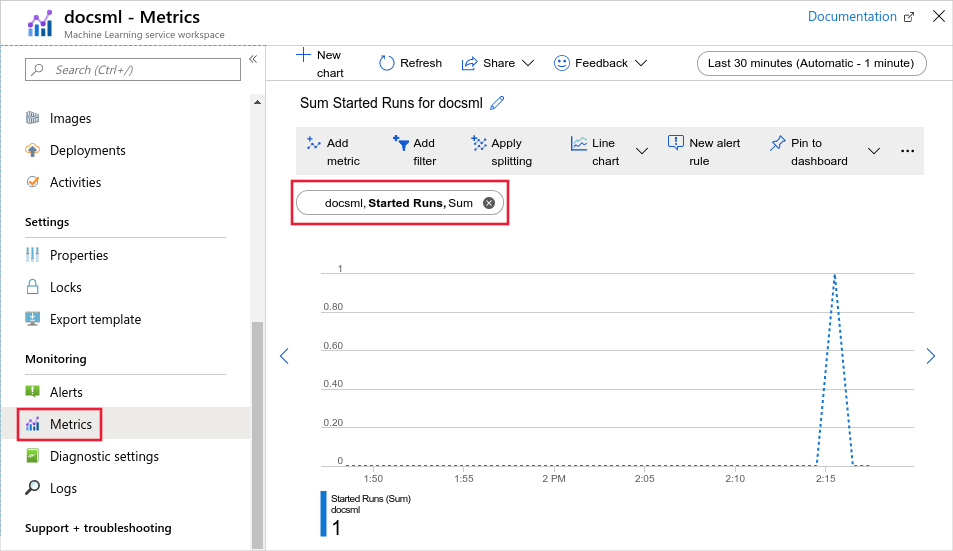

# Monitor Azure Machine Learning

<a name="what-is-azure-monitor"></a>
[!INCLUDE [horz-monitor-intro](~/reusable-content/ce-skilling/azure/includes/azure-monitor/horizontals/horz-monitor-intro.md)]

> [!NOTE]
> This article is primarily for __administrators__, as it describes monitoring for the Azure Machine Learning service and associated Azure services. If you're a __data scientist__ or __developer__ and want to monitor information specific to your *model training runs*, see the following documents:
>
> * [Monitor and analyze jobs in studio](how-to-track-monitor-analyze-runs.md)
> * [Log metrics, parameters, and files with MLflow](how-to-log-view-metrics.md)
> * [Track experiments and models by using MLflow](how-to-use-mlflow-cli-runs.md)
>
> To monitor information generated by models deployed to online endpoints, see [Monitor online endpoints](how-to-monitor-online-endpoints.md).

[!INCLUDE [horz-monitor-insights](~/reusable-content/ce-skilling/azure/includes/azure-monitor/horizontals/horz-monitor-insights.md)]

Azure Machine Learning can use Application Insights to track metrics and logs. You can send built-in metrics and logs to Application Insights, and use Application Insights features such as Live metrics, Transaction search, Failures, and Performance for further analysis. For more information, see [Monitor online endpoints](how-to-monitor-online-endpoints.md).

[!INCLUDE [horz-monitor-resource-types](~/reusable-content/ce-skilling/azure/includes/azure-monitor/horizontals/horz-monitor-resource-types.md)]
For more information about the resource types for Azure Machine Learning, see [Machine Learning monitoring data reference](monitor-azure-machine-learning-reference.md).

[!INCLUDE [horz-monitor-data-storage](~/reusable-content/ce-skilling/azure/includes/azure-monitor/horizontals/horz-monitor-data-storage.md)]

[!INCLUDE [horz-monitor-platform-metrics](~/reusable-content/ce-skilling/azure/includes/azure-monitor/horizontals/horz-monitor-platform-metrics.md)]
For a list of available metrics for Azure Machine Learning, see [Machine Learning monitoring data reference](monitor-azure-machine-learning-reference.md#metrics).

All metrics for Azure Machine Learning are in the namespace **Machine Learning Service Workspace**.



[!INCLUDE [horz-monitor-resource-logs](~/reusable-content/ce-skilling/azure/includes/azure-monitor/horizontals/horz-monitor-resource-logs.md)]

For the available resource log categories, their associated Log Analytics tables, and the logs schemas for Azure Machine Learning, see [Machine Learning monitoring data reference](monitor-azure-machine-learning-reference.md#resource-logs).

[!INCLUDE [horz-monitor-activity-log](~/reusable-content/ce-skilling/azure/includes/azure-monitor/horizontals/horz-monitor-activity-log.md)]

<a id="analyzing-log-data"></a>
[!INCLUDE [horz-monitor-analyze-data](~/reusable-content/ce-skilling/azure/includes/azure-monitor/horizontals/horz-monitor-analyze-data.md)]

[!INCLUDE [horz-monitor-external-tools](~/reusable-content/ce-skilling/azure/includes/azure-monitor/horizontals/horz-monitor-external-tools.md)]

[!INCLUDE [horz-monitor-kusto-queries](~/reusable-content/ce-skilling/azure/includes/azure-monitor/horizontals/horz-monitor-kusto-queries.md)]

Use the following queries to help you monitor your Azure Machine Learning resources: 

+ Get failed jobs in the last five days:

    ```Kusto
    AmlComputeJobEvent
    | where TimeGenerated > ago(5d) and EventType == "JobFailed"
    | project  TimeGenerated , ClusterId , EventType , ExecutionState , ToolType
    ```

+ Get records for a specific job name:

    ```Kusto
    AmlComputeJobEvent
    | where JobName == "automl_a9940991-dedb-4262-9763-2fd08b79d8fb_setup"
    | project  TimeGenerated , ClusterId , EventType , ExecutionState , ToolType
    ```

+ Get cluster events in the last five days for clusters where the VM size is Standard_D2s_v5:

    ```Kusto
    AmlComputeClusterEvent
    | where TimeGenerated > ago(4d) and VmSize == "STANDARD_D2S_V5"
    | project  ClusterName , InitialNodeCount , MaximumNodeCount , QuotaAllocated , QuotaUtilized
    ```

+ Get the cluster node allocations in the last eight days:

    ```Kusto
    AmlComputeClusterEvent
    | where TimeGenerated > ago(8d) and TargetNodeCount  > CurrentNodeCount
    | project TimeGenerated, ClusterName, CurrentNodeCount, TargetNodeCount
    ```

When you connect multiple Azure Machine Learning workspaces to the same Log Analytics workspace, you can query across all resources. 

+ Get number of running nodes across workspaces and clusters in the last day:

    ```Kusto
    AmlComputeClusterEvent
    | where TimeGenerated > ago(1d)
    | summarize avgRunningNodes=avg(TargetNodeCount), maxRunningNodes=max(TargetNodeCount)
             by Workspace=tostring(split(_ResourceId, "/")[8]), ClusterName, ClusterType, VmSize, VmPriority
    ```

+ Get failed online endpoint requests in the last day:

    ```Kusto
    AmlOnlineEndpointTrafficLog
    | where TimeGenerated > ago(1d) and ResponseCode != 200
    | project TimeGenerated, EndpointName, DeploymentName, ResponseCode, ResponseCodeReason
    ```

[!INCLUDE [horz-monitor-alerts](~/reusable-content/ce-skilling/azure/includes/azure-monitor/horizontals/horz-monitor-alerts.md)]

[!INCLUDE [horz-monitor-insights-alerts](~/reusable-content/ce-skilling/azure/includes/azure-monitor/horizontals/horz-monitor-insights-alerts.md)]

### Machine Learning alert rules
The following table lists common and recommended alert rules for Machine Learning.

| Alert type | Condition | Description |
|:---|:---|:---|
| Model Deploy Failed | Aggregation type: Total, Operator: Greater than, Threshold value: 0 | When one or more model deployments fail |
| Quota Utilization Percentage | Aggregation type: Average, Operator: Greater than, Threshold value: 90| When the quota utilization percentage is greater than 90% |
| Unusable Nodes | Aggregation type: Total, Operator: Greater than, Threshold value: 0 | When there are one or more unusable nodes |

[!INCLUDE [horz-monitor-advisor-recommendations](~/reusable-content/ce-skilling/azure/includes/azure-monitor/horizontals/horz-monitor-advisor-recommendations.md)]

## Related content

- For a reference of the metrics, logs, and other important values created for Machine Learning, see [Machine Learning monitoring data reference](monitor-azure-machine-learning-reference.md).
- For general details on monitoring Azure resources, see [Monitoring Azure resources with Azure Monitor](/azure/azure-monitor/essentials/monitor-azure-resource).
- For information on working with quotas related to Machine Learning, see [Manage and request quotas for Azure resources](how-to-manage-quotas.md).
