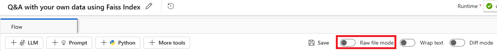
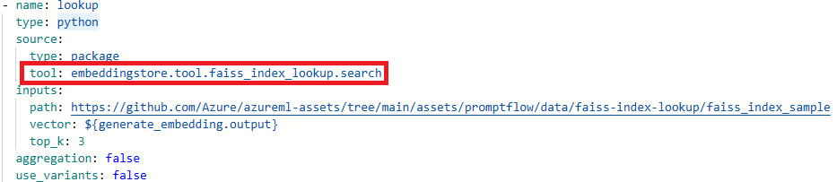

# Troubleshoot guidance

[!INCLUDE [prompt-flow-retirement](../includes/prompt-flow-retirement.md)]

This article addresses frequent questions about prompt flow usage.

## Flow authoring related issues

### "Package tool isn't found" error occurs when you update the flow for a code-first experience

When you update flows for a code-first experience, if the flow uses the Faiss Index Lookup, Vector Index Lookup, Vector DB Lookup, or Content Safety (Text) tools, you might encounter the following error message:

<code><i>Package tool 'embeddingstore.tool.faiss_index_lookup.search' is not found in the current environment.</i></code>

To resolve the issue, use one of the following options:

- **Option 1**
  - Update your compute session to the latest base image version.
  - Select **Raw file mode** to switch to the raw code view. Then open the *flow.dag.yaml* file.
  
     
  - Update the tool names.
  
     
     
      | Tool | New tool name |
      | ---- | ---- |
      | Faiss Index Lookup | promptflow_vectordb.tool.faiss_index_lookup.FaissIndexLookup.search |
      | Vector Index Lookup | promptflow_vectordb.tool.vector_index_lookup.VectorIndexLookup.search |
      | Vector DB Lookup | promptflow_vectordb.tool.vector_db_lookup.VectorDBLookup.search |
      | Content Safety (Text) | content_safety_text.tools.content_safety_text_tool.analyze_text |

  - Save the *flow.dag.yaml* file.

- **Option 2**
  - Update your compute session to the latest base image version.
  - Remove the old tool and re-create a new tool.

### "No such file or directory" error

Prompt flow relies on a file share storage to store a snapshot of the flow. If the file share storage has an issue, you might encounter the following problem. Here are some workarounds you can try:

- If you're using a private storage account, see [Network isolation in prompt flow](./how-to-secure-prompt-flow.md) to make sure your workspace can access your storage account.
- If the storage account is enabled for public access, check whether there's a datastore named `workspaceworkingdirectory` in your workspace. It should be a file share type.

    :::image type="content" source="./media/faq/working-directory.png" alt-text="Screenshot that shows workspaceworkingdirectory." lightbox = "./media/faq/working-directory.png":::
  
    - If you didn't get this datastore, you need to add it in your workspace.
        - Create a file share with the name `code-391ff5ac-6576-460f-ba4d-7e03433c68b6`.
        - Create a datastore with the name `workspaceworkingdirectory`. See [Create datastores](../how-to-datastore.md).
    - If you have a `workspaceworkingdirectory` datastore but its type is `blob` instead of `fileshare`, create a new workspace. Use storage that doesn't enable hierarchical namespaces for Azure Data Lake Storage Gen2 as a workspace default storage account. For more information, see [Create workspace](../how-to-manage-workspace.md#create-a-workspace).
     
### Flow is missing

:::image type="content" source="./media/faq/flow-missing.png" alt-text="Screenshot that shows a flow missing an authoring page." lightbox = "./media/faq/flow-missing.png":::

This problem can happen for several reasons:
- If you disable public access to your storage account, you must ensure access by either adding your IP to the storage firewall or enabling access through a virtual network that has a private endpoint connected to the storage account.

    :::image type="content" source="./media/faq/storage-account-networking-firewall.png" alt-text="Screenshot that shows firewall setting on storage account." lightbox = "./media/faq/storage-account-networking-firewall.png":::

- If the account key in the datastore is out of sync with the storage account, update the account key in the datastore detail page to fix the problem.

    :::image type="content" source="./media/faq/datastore-with-wrong-account-key.png" alt-text="Screenshot that shows datastore with wrong account key." lightbox = "./media/faq/datastore-with-wrong-account-key.png":::
 
- If you're using Microsoft Foundry, the storage account needs to set CORS to allow Foundry access the storage account. Otherwise, you see the flow missing problem. Add the following CORS settings to the storage account to fix this problem.
    - Go to the storage account page, select `Resource sharing (CORS)` under `settings`, and select the `File service` tab.
    - Allowed origins: `https://mlworkspace.azure.ai,https://ml.azure.com,https://*.ml.azure.com,https://ai.azure.com,https://*.ai.azure.com,https://mlworkspacecanary.azure.ai,https://mlworkspace.azureml-test.net`
    - Allowed methods: `DELETE, GET, HEAD, POST, OPTIONS, PUT`

    :::image type="content" source="./media/faq/resource-sharing-setting-storage-account.png" alt-text="Screenshot that shows Resource sharing config of storage account." lightbox = "./media/faq/resource-sharing-setting-storage-account.png":::

## Compute session related problems

### Run failed because of "No module named XXX"

This type of error related to compute session lacks required packages. If you're using a default environment, make sure the image of your compute session is using the latest version.  If you're using a custom base image, make sure you installed all the required packages in your docker context. For more information, see [Customize base image for compute session](./how-to-customize-session-base-image.md).

### Where can I find the serverless instance used by a compute session?

You can view the serverless instance used by a compute session in the compute session list tab under the compute page. To learn more, see [how to manage serverless instance](how-to-manage-compute-session.md#manage-serverless-instance-used-by-a-compute-session).


### Compute session failures when using a custom base image

#### Compute session start failure when using requirements.txt or custom base image

A compute session supports using `requirements.txt` or a custom base image in `flow.dag.yaml` to customize the image. Use `requirements.txt` for common cases, which uses `pip install -r requirements.txt` to install the packages. If you have dependencies beyond Python packages, follow the [Customize base image](./how-to-customize-session-base-image.md) guide to create and build a new image based on the prompt flow base image. Then use it in `flow.dag.yaml`. To learn more, see [how to specify base image in compute session](./how-to-manage-compute-session.md#change-the-base-image-for-compute-session).

- You can't use an arbitrary base image to create a compute session. You need to use the base image provided by prompt flow.
- Don't pin the version of `promptflow` and `promptflow-tools` in `requirements.txt`, because the base image already includes them. Using old versions of `promptflow` and `promptflow-tools` might cause unexpected behavior.

## Flow run related issues

### How can I find the raw inputs and outputs of an LLM tool for further investigation?

In prompt flow, on the flow page with a successful run and the run detail page, you can find the raw inputs and outputs of the LLM tool in the output section. Select the `view full output` button to view the full output. 

:::image type="content" source="./media/faq/view-full-output.png" alt-text="Screenshot that shows view full output on LLM node." lightbox = "./media/faq/view-full-output.png":::

The `Trace` section includes each request and response to the LLM tool. You can check the raw message sent to the LLM model and the raw response from the LLM model.

:::image type="content" source="./media/faq/trace-large-language-model-tool.png" alt-text="Screenshot that shows raw request send to LLM model and response from LLM model." lightbox = "./media/faq/trace-large-language-model-tool.png":::

### How do I fix a 409 error from Azure OpenAI? 

If you encounter a 409 error from Azure OpenAI, it means you reached the rate limit for Azure OpenAI. You can check the error message in the output section of the LLM node. For more information, see [Azure OpenAI rate limit](/azure/ai-services/openai/quotas-limits).

:::image type="content" source="./media/faq/429-rate-limit.png" alt-text="Screenshot that shows 429 rate limit error from Azure OpenAI." lightbox = "./media/faq/429-rate-limit.png":::

### Identify which node consumes the most time

1. Check the compute session logs.

1. Try to find the following warning log format:

    {node_name} runs for {duration} seconds.

    For example:

   - **Case 1:** Python script node runs for a long time.

        :::image type="content" source="./media/how-to-create-manage-runtime/runtime-timeout-running-for-long-time.png" alt-text="Screenshot that shows a timeout run sign in the studio UI." lightbox = "./media/how-to-create-manage-runtime/runtime-timeout-running-for-long-time.png":::

        In this case, you see that `PythonScriptNode` runs for a long time (almost 300 seconds). Then you can check the node details to see what's the problem.

   - **Case 2:** LLM node runs for a long time.

        :::image type="content" source="./media/how-to-create-manage-runtime/runtime-timeout-by-language-model-timeout.png" alt-text="Screenshot that shows timeout logs caused by an LLM timeout in the studio UI." lightbox = "./media/how-to-create-manage-runtime/runtime-timeout-by-language-model-timeout.png":::

        In this case, if you find the message `request canceled` in the logs, it might be because the OpenAI API call is taking too long and exceeds the timeout limit.

        An OpenAI API timeout could be caused by a network issue or a complex request that requires more processing time. For more information, see [OpenAI API timeout](https://platform.openai.com/docs/actions/production#timeouts).

        Wait a few seconds and retry your request. This action usually resolves any network issues.

        If retrying doesn't work, check whether you're using a long context model, such as `gpt-4-32k`, and set a large value for `max_tokens`. If so, the behavior is expected because your prompt might generate a long response that takes longer than the interactive mode's upper threshold. In this situation, try `Bulk test` because this mode doesn't have a timeout setting.

1. If you can't find anything in the logs to indicate it's a specific node issue:

    - Contact the prompt flow team ([promptflow-eng](mailto:aml-pt-eng@microsoft.com)) with the logs. They try to identify the root cause.

## Flow deployment related issues

### Lack authorization to perform action "Microsoft.MachineLearningService/workspaces/datastores/read"

If your flow contains the Index Look Up tool, after deploying the flow, the endpoint needs to access the workspace datastore to read the MLIndex YAML file or FAISS folder containing chunks and embeddings. You need to manually grant the endpoint identity permission to access these resources.

You can either grant the endpoint identity the **AzureML Data Scientist** role on the workspace scope, or assign a custom role that contains the "MachineLearningService/workspace/datastore/reader" action.

### Upstream request timeout issue when consuming the endpoint

If you use CLI or SDK to deploy the flow, you might encounter a timeout error. By default, the `request_timeout_ms` value is 5,000. You can specify up to 5 minutes, which is 300,000 ms. The following example shows how to specify the request timeout in the deployment YAML file. To learn more, see [deployment schema](../reference-yaml-deployment-managed-online.md).

```yaml
request_settings:
  request_timeout_ms: 300000
```

### OpenAI API hits authentication error

If you regenerate your Azure OpenAI key and manually update the connection used in prompt flow, you might encounter errors like "Unauthorized. Access token is missing, invalid, audience is incorrect or expired." when invoking an existing endpoint created before key regenerating.

This error occurs because the connections used in the endpoints and deployments aren't automatically updated. To avoid impacting online production deployment due to unintentional offline operation, you must manually update any change for key or secrets in deployments.

- If you deployed the endpoint in the studio UI, redeploy the flow to the existing endpoint by using the same deployment name.
- If you deployed the endpoint by using SDK or CLI, modify the deployment definition, such as adding a dummy environment variable. Then, use `az ml online-deployment update` to update your deployment. 


### Vulnerability issues in prompt flow deployments

To address prompt flow runtime vulnerabilities, use the following approaches:

- Update the dependency packages in your `requirements.txt` file in your flow folder.
- If you're using a customized base image for your flow, update the prompt flow runtime to the latest version, rebuild your base image, and redeploy the flow.
 
For any other vulnerabilities in managed online deployments, Azure Machine Learning fixes the issues on a monthly basis.

### "MissingDriverProgram Error" or "Could not find driver program in the request"

If you deploy your flow and encounter the following error, the deployment environment might be related to the error.

```text
'error': 
{
    'code': 'BadRequest', 
    'message': 'The request is invalid.', 
    'details': 
         {'code': 'MissingDriverProgram', 
          'message': 'Could not find driver program in the request.', 
          'details': [], 
          'additionalInfo': []
         }
}
```

```text
Could not find driver program in the request
```

Fix this error in two ways:

- (Recommended) Find the container image URI in your custom environment detail page, and set it as the flow base image in the `flow.dag.yaml` file. When you deploy the flow in the UI, select **Use environment of current flow definition**. The backend service creates the customized environment based on this base image and `requirement.txt` for your deployment. For more information, see [the environment specified in the flow definition](how-to-deploy-for-real-time-inference.md#use-environment-of-current-flow-definition). 

    :::image type="content" source="./media/how-to-deploy-for-real-time-inference/custom-environment-image-uri.png" alt-text="Screenshot of custom environment detail page. " lightbox = "./media/how-to-deploy-for-real-time-inference/custom-environment-image-uri.png":::

    :::image type="content" source="./media/how-to-deploy-for-real-time-inference/flow-environment-image.png" alt-text="Screenshot of specifying base image in raw yaml file of the flow. " lightbox = "./media/how-to-deploy-for-real-time-inference/flow-environment-image.png":::

- Add `inference_config` in your custom environment definition to fix this error.

    The following example shows a customized environment definition.

```yaml
$schema: https://azuremlschemas.azureedge.net/latest/environment.schema.json
name: pf-customized-test
build:
  path: ./image_build
  dockerfile_path: Dockerfile
description: promptflow customized runtime
inference_config:
  liveness_route:
    port: 8080
    path: /health
  readiness_route:
    port: 8080
    path: /health
  scoring_route:
    port: 8080
    path: /score
```

### Model response takes too long

Sometimes, the deployment takes too long to respond. Several factors can cause this delay, such as: 

- The model used in the flow isn't powerful enough (for example, using GPT 3.5 instead of text-ada).
- The index query isn't optimized and takes too long.
- The flow has many steps to process.

To improve the performance of the model, consider optimizing the endpoint by addressing these factors.

### Unable to fetch deployment schema

After you deploy the endpoint and want to test it in the **Test tab** in the endpoint detail page, if the **Test tab** shows **Unable to fetch deployment schema**, try the following two methods to mitigate this issue:

:::image type="content" source="./media/how-to-deploy-for-real-time-inference/unable-to-fetch-deployment-schema.png" alt-text="Screenshot of the error unable to fetch deployment schema in Test tab in endpoint detail page. " lightbox = "./media/how-to-deploy-for-real-time-inference/unable-to-fetch-deployment-schema.png":::

- Make sure you grant the correct permission to the endpoint identity. Learn more about [how to grant permission to the endpoint identity](how-to-deploy-for-real-time-inference.md#grant-permissions-to-the-endpoint).
- The error might occur because you ran your flow in an old version runtime and then deployed the flow. The deployment used the environment of the runtime that was in old version as well. To update the runtime, follow [Update a runtime on the UI](./how-to-create-manage-runtime.md#update-a-runtime-on-the-ui). Rerun the flow in the latest runtime and then deploy the flow again.

### Access denied to list workspace secret

If you encounter an error like "Access denied to list workspace secret", check whether you grant the correct permission to the endpoint identity. Learn more about [how to grant permission to the endpoint identity](how-to-deploy-for-real-time-inference.md#grant-permissions-to-the-endpoint).

## Authentication and identity related issues

### How do I use credential-less datastore in prompt flow?

To use credential-less storage in Foundry portal, complete the following steps:
- Change the data store authentication type to None.
- Grant the project MSI and user blob or file data contributor permission on storage.

#### Change authentication type of datastore to None

To make your datastore credential-less, see [Identity-based data authentication](../how-to-administrate-data-authentication.md#identity-based-data-authentication). 

Change the authentication type of the datastore to None, which stands for meid_token based authentication. You can make this change from the datastore detail page, or use CLI or SDK: https://github.com/Azure/azureml-examples/tree/main/cli/resources/datastore

:::image type="content" source="./media/faq/datastore-auth-type.png" alt-text="Screenshot of auth type for datastore. " lightbox = "./media/faq/datastore-auth-type.png":::

For blob based datastore, you can change the authentication type and also enable workspace MSI to access the storage account.

:::image type="content" source="./media/faq/datastore-update-auth-type-file.png" alt-text="Screenshot of update auth type for blob based datastore. " lightbox = "./media/faq/datastore-update-auth-type-file.png":::

For file share based datastore, you can change the authentication type only.

:::image type="content" source="./media/faq/datastore-update-auth-type.png" alt-text="Screenshot of update auth type for file share based datastore. " lightbox = "./media/faq/datastore-update-auth-type.png":::


#### Grant permission to user identity or managed identity

To use credential-less datastore in prompt flow, grant enough permissions to user identity or managed identity to access the datastore.

- Make sure workspace system assigned managed identity has `Storage Blob Data Contributor` and `Storage File Data Privileged Contributor` on the storage account, at least need read and write (better also include delete) permission.
- If you're using user identity this default option in prompt flow, make sure the user identity has following role on the storage account:
    - `Storage Blob Data Contributor` on the storage account, at least need read and write (better also include delete) permission.
    - `Storage File Data Privileged Contributor` on the storage account, at least need read and write (better also include delete) permission.
- If you're using user assigned managed identity, make sure the managed identity has following role on the storage account:
    - `Storage Blob Data Contributor` on the storage account, at least need read and write (better also include delete) permission.
    - `Storage File Data Privileged Contributor` on the storage account, at least need read and write (better also include delete) permission.
    - Meanwhile, assign user identity `Storage Blob Data Read` role to storage account at least, if you want to use prompt flow to authoring and test flow.
- If you still can't view the flow detail page and the first time you using prompt flow is earlier than 2024-01-01, grant workspace MSI as `Storage Table Data Contributor` to storage account linked with workspace.