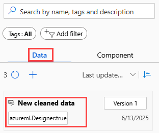

# Import data into Azure Machine Learning designer

[!INCLUDE [v1 deprecation](../includes/sdk-v1-deprecation.md)]

In this article, you learn how to import your own data into the Azure Machine Learning designer to create custom solutions. There are two ways you can import data into the designer: 

* **Azure Machine Learning datasets**: Register [datasets](concept-data.md#reference-data-in-storage-with-datasets) in Azure Machine Learning to enable advanced features that help you manage your data.
* **Import Data component**: Use the [Import Data](../algorithm-module-reference/import-data.md) component to directly access data from online data sources.

> [!IMPORTANT]
> If you don't see graphical elements mentioned in this document, such as buttons in studio or designer, you might not have the right level of permissions to the workspace. Contact your Azure subscription administrator to verify that you have been granted the correct level of access. For more information, see [Manage users and roles](../how-to-assign-roles.md).

## Use Azure Machine Learning datasets

We recommend that you use [datasets](concept-data.md#reference-data-in-storage-with-datasets) to import data into the designer. When you register a dataset, you can take full advantage of advanced data features like [versioning and tracking](how-to-version-track-datasets.md) and [data monitoring](how-to-monitor-datasets.md).

### Register a dataset

You can register existing datasets [programmatically with the SDK](how-to-create-register-datasets.md#create-datasets-from-datastores) or [visually in the Azure Machine Learning studio](how-to-connect-data-ui.md#create-data-assets).

You can also register the output for any designer component as a dataset.

1. Select the component that outputs the data you want to register.

1. In the properties pane, select **Outputs + logs** > **Data outputs** > **Register data**.

    :::image type="content" source="media/how-to-designer-import-data/register-dataset-designer.png" alt-text="Screenshot showing how to navigate to the Register Dataset option.":::

If the component output data is in a tabular format, you must choose to register the output as a **file dataset** or **tabular dataset**.

- **File dataset** registers the component's output folder as a file dataset. The output folder contains a data file and meta files that the designer uses internally. Select this option if you want to continue to use the registered dataset in the designer. 

- **Tabular dataset** registers only the component's the output data file as a tabular dataset. This format is easily consumed by other tools, for example in Automated Machine Learning or the Python SDK. Select this option if you plan to use the registered dataset outside of the designer.  
 

### Use a dataset

Your registered datasets can be found in the component palette, under **Data**. To use a dataset, drag and drop it onto the pipeline canvas. Then, connect the output port of the dataset to other components in the canvas. 

If you register a file dataset, the output port type of the dataset is **AnyDirectory**. If you register a Tabular dataset, the output port type of the dataset if **DataFrameDirectory**. Note that if you connect the output port of the dataset to other components in the designer, the port type of datasets and components need to be aligned.

> [!NOTE]
> The designer supports [dataset versioning](how-to-version-track-datasets.md). Specify the dataset version in the property panel of the dataset component.

### Limitations 

- Currently you can only visualize a tabular dataset in the designer. If you register a file dataset outside designer, you can't visualize it in the designer canvas.
- Currently the designer only supports preview outputs that are stored in **Azure blob storage**. You can check and change your output datastore in the **Output settings** under **Parameters** tab in the right panel of the component.
- If your data is stored in a virtual network and you want to preview, you need to enable workspace managed identity of the datastore.
    1. Go the related datastore and select **Update authentication**.
    :::image type="content" source="../media/resource-known-issues/datastore-update-credential.png" alt-text="Screenshot that shows how to update credentials.":::
    1. Select the toggle switch to use workspace managed identity.
    :::image type="content" source="../media/resource-known-issues/enable-workspace-managed-identity.png" alt-text="Screenshot that shows how to Enable Workspace Managed Identity.":::

## Import data using the Import Data component

While we recommend that you use datasets to import data, you can also use the [Import Data](../algorithm-module-reference/import-data.md) component. The **Import Data** component skips registering your dataset in Azure Machine Learning and imports data directly from a [datastore](concept-data.md) or HTTP URL.

For detailed information on how to use the Import Data component, see the [Import Data reference page](../algorithm-module-reference/import-data.md).

> [!NOTE]
> If your dataset has too many columns, you might encounter the following error: "Validation failed due to size limitation". To avoid this, [register the dataset in the Datasets interface](how-to-connect-data-ui.md#create-data-assets).

## Supported sources

This section lists the data sources supported by the designer. Data comes into the designer from either a datastore or from a [tabular dataset](how-to-create-register-datasets.md#dataset-types).

### Datastore sources

For a list of supported datastore sources, see [Access data in Azure storage services](how-to-access-data.md#supported-data-storage-service-types).

### Tabular dataset sources

The designer supports tabular datasets created from the following sources:
* Delimited files
* JSON files
* Parquet files
* SQL queries

## Data types

The designer internally recognizes the following data types:

* String
* Integer
* Decimal
* Boolean
* Date

The designer uses an internal data type to pass data between components. You can explicitly convert your data into data table format using the [Convert to Dataset](../algorithm-module-reference/convert-to-dataset.md) component. Any component that accepts formats other than the internal format will convert the data silently before passing it to the next component.

## Data constraints

Modules in the designer are limited by the size of the compute target. For larger datasets, you should use a larger Azure Machine Learning compute resource. For more information on Azure Machine Learning compute, see [What are compute targets in Azure Machine Learning?](../concept-compute-target.md#azure-machine-learning-compute-managed)

## Access data in a virtual network

If your workspace is in a virtual network, you must perform additional configuration steps to visualize data in the designer. For more information on how to use datastores and datasets in a virtual network, see [Use Azure Machine Learning studio in an Azure virtual network](../how-to-enable-studio-virtual-network.md).

## Next step

> [!div class="nextstepaction"]
> [Tutorial: Train a no-code regression model using designer](tutorial-designer-automobile-price-train-score.md)
