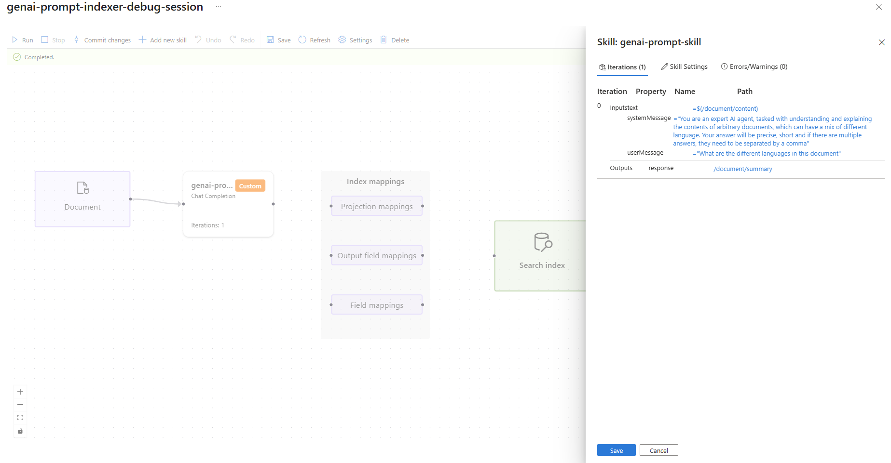
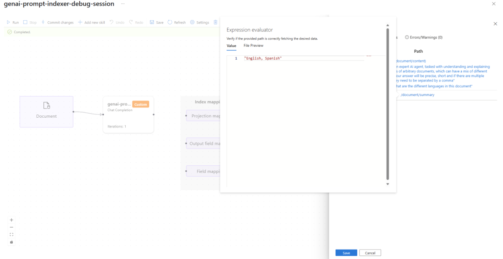
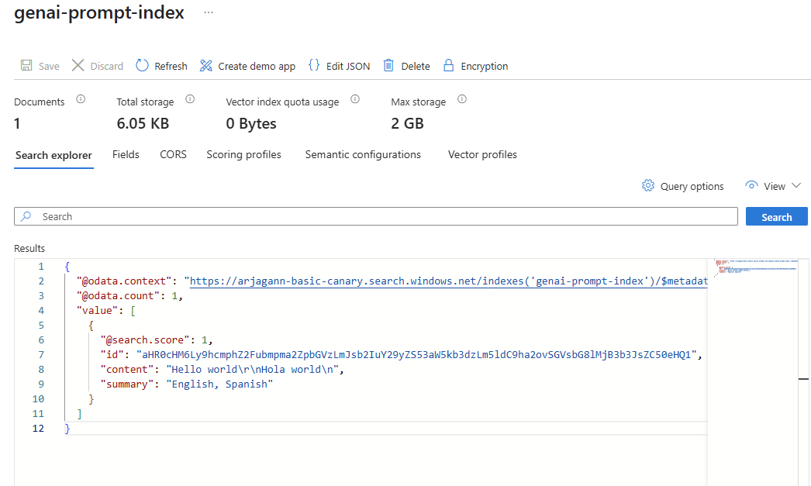

# Best practices - GenAI Prompt skill

Incorporating the GenAI Prompt custom skill as part of an indexer's ingestion flow allows developers to harness the content generation capabilities of language models to enrich the content from the data source. This document outlines some recommendations and best practices that can be incorporated when utilizing this capability to ensure good system performance and behavior.

## Functionality of GenAI Prompt skill

The [GenAI Prompt custom skill](cognitive-search-skill-genai-prompt.md) is a new addition to Azure AI Search's catalog of skills, allowing search customers to pass their document contents and customer-created prompts to a language model they own, hosted within Microsoft Foundry. The resulting enriched content, along with the source document is ingested into the search index. We envision developers utilizing this for various scenarios to power Retrieval Augmented Generation (RAG) applications. Some key scenarios are AI-generated document summaries, image captioning, and entity/fact finding based on customizable criteria through user specified prompts. 

The content generation capabilities of language models are continuing to evolve rapidly and their integration into content ingestion pipeline offers exciting possibilities for search retrieval relevance. However, the challenge for developers would be to ensure that the prompts and data they use for their scenarios are safe and protect users against any inadvertent results from the language model.

## Personas interacting with a RAG application

In order to list out the various challenges in incorporating AI content generation capabilities into an Azure AI Search indexer pipeline, it's important to understand the various personas that interact with the RAG application as each of them might carry a different set of challenges.

| Persona | Description |
|---------|-------------|
| End user | The person asking questions of the RAG application, expecting a well-cited answer to their question based on results from the source document. In addition to accuracy of the answer, the end-user expects that any citations provided by the application make it clear if it was from verbatim content from a source file or an AI-powered summary from the model. |
| RAG application developer/search index admin | The person responsible for configuring the search index schema, and setting up the indexer and skillset to ingest language model augmented data into the index. GenAI Prompt custom skill allows developers to configure free-form prompts to several models hosted in Microsoft Foundry, thereby offering significant flexibility to light up various scenarios. However, developers need to ensure that the combination of data and skills used in the pipeline doesn't produce harmful or unsafe content. Developers also need to evaluate the content generated by the language models for bias, inaccuracies, and incorrect information. Although this task can be challenging for documents at a large scale, it should be one of the first steps when building a RAG application, along with the index schema definition. |
| Data authority | The person expected to be the key subject matter expert (SME) for the content from the data source. The SME is expected to be the best judge of language model powered enrichments ingested into the index and the answer generated by the language model in the RAG application. The key role for the data authority to be able to get a representative sample and verify the quality of the enrichments and the answer, which can be challenging if dealing with data at large scale. |

The rest of this document lists out these various challenges along with tips and best practices that RAG application developers can follow to mitigate any risks.

## Challenges

The following challenges are faced by the various personas that interact with a RAG systems that utilize language models to augment content ingested into a search index (using the GenAI Prompt custom skill) and to formulate answers for questions:

* Transparency: Users of RAG systems should understand that AI models might not always produce accurate or well-formulated answers. Azure AI Search has a robustly documented [Transparency Note](/legal/search/transparency-note) that developers should read through to understand the various ways in which AI is used to augment the capabilities of the core search engine. It's recommended that developers who build RAG applications share the transparency note to users of their applications, since they might be unaware of how AI interfaces with various aspects of the application being used. Additionally, when utilizing the GenAI Prompt custom skill developers should note that only part of the content ingested into the search index is generated by the language model and should highlight this to users of their applications.

* Content sampling/inspection of content quality: Developers and data SMEs should consider sampling some of the content ingested into the search index after being augmented by the GenAI Prompt custom skill in order to inspect the quality of the enrichment performed by their language model. [Debug sessions](cognitive-search-debug-session.md) and [search explorer](search-explorer.md) on the Azure portal can be used for this purpose.

* Content safety filtering and evaluations: It's important for developers to ensure that the language models they use with the GenAI Prompt custom skill have appropriate filters to ensure safety of the content generated and after ingested into the search index. Developers and data SMEs should also make sure they evaluate the content generated by the language model on various metrics such as accuracy, task specific performance, bias, and risk. Foundry offers a robust set of tools for developers to add [content safety filters](../ai-foundry/ai-services/content-safety-overview.md) and [clear guidance for evaluation approaches](../ai-foundry/concepts/evaluation-approach-gen-ai.md).

* Agility in rolling back changes or modifying skill configuration: It's possible for the language model used with the GenAI Prompt custom skill to have issues over time (such as producing low-quality content). Developers should be prepared to roll back these changes either by altering their indexer and skillset configuration or by excluding index fields with AI generated content from search queries.

## Best practices to mitigate risks

When utilizing the GenAI Prompt custom skill to power RAG applications, there's a risk of over-reliance on AI as outlined in the challenges from the previous section. In this part of the document, we present some patterns and strategies to use to mitigate the risks and overcome the challenges.

### Content sampling and inspection before ingestion into the search index

[Debug sessions](cognitive-search-debug-session.md) is a tool built into the Azure portal. You can use it to inspect the state of enrichment for a single document. To start a debug session, create a skillset, and an indexer and have the indexer complete one run. We recommend that you begin with a "development" index before moving forward with solution. While the index is in development, use a debug session to inspect the entire structure and contents of the enriched document that will be written into the index. A single run of a debug session works with one specific live document, and will have the content generated by the language model show up in a specific part of the enriched document. Developers can utilize several runs of their debug session, pointing to different documents from their data source to get a reasonable idea of the state of the content produced by their language model (and its relationship to the enriched document structure).

 The screenshots below show how developers can inspect both the configuration of a skill and the values produced by the skill after calling the language model.

#### Example: Inspect the configuration of the GenAI Prompt skill

[  ](./media/responsible-ai-practices-genai-prompt-skill/debug-session-skill-inspection.png#lightbox)

#### Example: Inspect the output from the GenAI Prompt skill

[  ](./media/responsible-ai-practices-genai-prompt-skill/debug-session-skill-output-inspection.png#lightbox)

#### Use Search Explorer to inspect output

In addition to debug sessions, Azure AI Search also offers the ability to explore multiple documents at once by querying the search index via the Azure portal [search explorer](search-explorer.md). Developers can issue a broad query to retrieve a large number of documents from their search index and can inspect the fields which have their content generated by the GenAI Prompt custom skill. To be able to view the contents of the field, when defining the index schema it needs to be configured with the "Retrievable" property. For the same document that was inspected via the debug session, the image below shows the full contents of the search document that ends up into the index.

[  ](./media/responsible-ai-practices-genai-prompt-skill/search-explorer-inspect-document.png#lightbox)

Developers can utilize both of these tools to have a reasonable sampling of the data generated by their language models after it gets ingested into their "development" index. At this point, we recommend developers to work with data SMEs to ensure the sampled data meets quality and accuracy standards. Once desired bars have been met, developers can then transition the indexer to target a "production" index which will be the source of knowledge for their RAG applications.

### Content safety filtering and evaluation

[Azure AI content safety](../ai-services/content-safety/overview.md) is an AI service that detects harmful user-generated and AI-generated content in applications and services. Foundry has a [robust integration with the Azure AI content safety service](../ai-foundry/ai-services/content-safety-overview.md) for many scenarios across both text and image content. The GenAI Prompt custom skill is flexible enough to allow developers to specify any kinds of prompts and content, since we want developers to tailor the skill configuration to their scenario. But this means that there's a possibility that the content generated by the model could be harmful, biased, explicit, or violent in nature. We highly encourage developers, who configure the GenAI Prompt skill to interact with Foundry language models, to set up appropriate content safety filters for the models that they have deployed.

Foundry has an [elaborate guide on responsible AI practices](../ai-foundry/responsible-use-of-ai-overview.md) and we strongly recommend developers review the contents of the guide and ensure they have implemented them for the models being used with the GenAI Prompt custom skill. One of the key factors that can determine quality and accuracy of results produced by a language model is a well-crafted system message. Foundry also has published a [system message template guide](../ai-foundry/openai/concepts/system-message.md) to mitigate against potential RAI harms and guide systems to interact safely with users.

Foundry has also published a [detailed guide on evaluation criteria](../ai-foundry/concepts/evaluation-approach-gen-ai.md) for selecting the models that developers can choose to deploy for their various applications. While the GenAI Prompt skill is flexible enough to work with almost all chat completion models in Foundry, depending on the criteria for the end-user, some models might work better than others. Certain chat completion models have advanced image processing capabilities at a high level of accuracy, but come at the expense of cost. Some models might be more prone to attacks via prompts, incorrect information, and so on. Developers who configure the GenAI Prompt custom skill must be aware of these characteristics of the models they choose to utilize for content generation and ingestion into the search index. We strongly recommend developers utilize the "development" index and many sampling to clearly understand the nature of these models as they interact with data before switching it over to production.

### Being agile in rolling back or modifying ingestion configuration

The previous two sections stressed the importance for developers to have a "development" environment, where they configure a "development" index with a built-in mechanism for developers/data SMEs to evaluate the contents of the search index.

[  ](./media/responsible-ai-practices-genai-prompt-skill/development-index-pattern.png#lightbox)

Once the evaluation in the development environment is satisfactory, developers should transition the ingestion process to a production environment, where the indexer operates on the full customer data. However, it's possible for there to be unexpected drops in quality or performance when operating on this data set. It's also possible for the model to be updated without undergoing evaluation in the development environment - both these cases can result in a suboptimal experience for users interacting with RAG applications, and developers need to be agile in detecting and mitigating such conditions. To catch such situations, developers should ensure that they also have a constant monitoring of their "production" index and be ready to modify configurations as needed. The following sections describe some patterns developers could adopt to be responsive to such scenarios.

#### Primary-Secondary index powering RAG applications

Developers should consider having a primary and a secondary index to power their RAG applications. The primary and secondary indexes would be similar in the configuration of fields - the only difference would be that the primary index will have an extra (searchable and retrievable) field which will contain content generated from the language model through the GenAI Prompt custom skill. Developers should configure their RAG applications such that the AI model being augmented can use either the primary or the secondary index as it's knowledge source. The primary index should be preferred, but if the quality of the results produced by the RAG application seems to be adversely impacted, the application should swap to using the secondary index which doesn't have generated content as part of the knowledge source. This can be achieved without needing any code change/redeployment of the RAG app by utilizing the [index alias feature](search-how-to-alias.md) and having the RAG application query the alias, and then swapping the indexes that map to the alias if necessary.

The following diagram illustrates this pattern.

[  ](./media/responsible-ai-practices-genai-prompt-skill/fallback-index-pattern.png#lightbox)

#### Dropping use of generated field in search queries

A lighter weight alternative to having two copies of the search index, is to ensure that the RAG application can modify the search query issued to Azure AI Search easily. By default when a search query is issued, all searchable fields are scanned, however Azure AI Search allows specifying which fields must be analyzed to produce a set of search results. 

Consider an index which has two content fields – a "name" field and a (verbose) “description” field for a sample data set containing hotel information. Let's say the RAG developer/search index admin has configured a third field called "summary", which will hold an AI generated summary of the description via the GenAI Prompt skill. When configuring a RAG application, developers can specify two kinds of search queries - the default search query which analyzes all searchable fields, and another specific query that only looks at those searchable fields whose content isn't generated by a language model. The following is an example of such a specific query, that explicitly omits the "summary" field.

```http
POST https://[service-name].search.windows.net/indexes/[index-name]?api-version=[api-version] 

{ 
    "search": "Spacious, air-condition* +\"Ocean view\"", 
    "searchFields": "description, name", 
    "searchMode": "any",  
    "queryType": "full"  
} 
```

The RAG application can fall back to this specific query (might require a code change/redeployment), if the default query starts to degrade in performance or evaluation metrics, illustrated by the following diagram.

[  ](./media/responsible-ai-practices-genai-prompt-skill/fallback-query-pattern.png#lightbox)

#### Resetting indexer after modifying skill configuration

Sometimes the system or user message specified to the GenAI Prompt custom skill might be impacted due to new data in the "full" customer data set and tuning these messages might provide a faster alternative than the previous options. However we recommend developers to also [reset and rerun](search-howto-run-reset-indexers.md) an indexer if the system or user messages are modified for the GenAI Prompt custom skill, to apply this to all documents in the data source. This option can possibly incur additional costs.

## Limitations

The risk mitigation strategies and patterns suggested in this document can have limitations based on either scenario specific or data dependent reasons as well as for storage and cost reasons. It's the responsibility of the RAG developer to ensure that they fully understand any specific risks associated with AI content generation as part of the ingestion pipeline and have appropriate strategies in place to mitigate them.

### Human in the loop oversight

Given the scale of data ingestion, it might not be feasible to have a human in the loop oversight for "production" applications. We recommend extensive validation by data SMEs in the "development" environment to minimize the need for this in production. Follow an evaluation process that: (1) uses some internal stakeholders to evaluate results, (2) uses A/B experimentation to roll out this capability to users and (3) incorporates key performance indicators (KPIs) and metrics monitoring when the capability is deployed.

## Learn more about responsible AI

* [Azure AI Search transparency note](/legal/search/transparency-note)
* [Microsoft AI principles](https://www.microsoft.com/ai/responsible-ai)
* [Microsoft responsible AI resources](https://www.microsoft.com/ai/responsible-ai-resources)

## Learn more about Azure AI Search

* [Introduction to Azure AI Search](search-what-is-azure-search.md)
* [AI enrichment concepts](cognitive-search-concept-intro.md)
* [Retrieval Augmented Generation (RAG) in Azure AI Search](retrieval-augmented-generation-overview.md)
