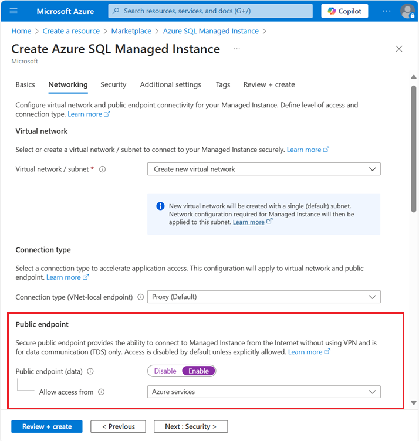
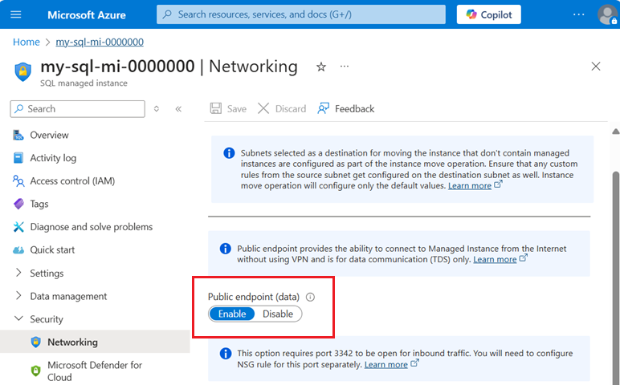

# Indexer connections to Azure SQL Managed Instance through a public endpoint

Indexers in Azure AI Search connect to external data sources over a public endpoint. If you're setting up an [Azure SQL indexer](search-how-to-index-sql-database.md) for a connection to a SQL managed instance, follow the steps in this article to ensure the public endpoint is set up correctly. 

Alternatively, for private connections, [create a shared private link](search-indexer-how-to-access-private-sql.md) instead.

> [!NOTE]
> [Always Encrypted](/sql/relational-databases/security/encryption/always-encrypted-database-engine) columns are not currently supported by Azure AI Search indexers.

## Enable a public endpoint

This article highlights just the steps for an indexer connection in Azure AI Search. If you want more background, see [Configure public endpoint in Azure SQL Managed Instance](/azure/azure-sql/managed-instance/public-endpoint-configure) instead.

1. For a new SQL Managed Instance, create the resource with the **Enable public endpoint** option selected.

   

1. Alternatively, if the instance already exists, you can enable public endpoint on an existing SQL Managed Instance under **Security** > **Networking** > **Public endpoint** > **Enable**.

   

## Get public endpoint connection string

1. To get a connection string, go to **Settings** > **Connection strings**.

1. Copy the connection string to use in the search indexer's data source connection. Be sure to copy the connection string for the **public endpoint** (port 3342, not port 1433).

## Next steps

With configuration out of the way, you can now specify a SQL managed instance as an indexer data source using the basic instructions for [setting up an Azure SQL indexer](search-how-to-index-sql-database.md).
