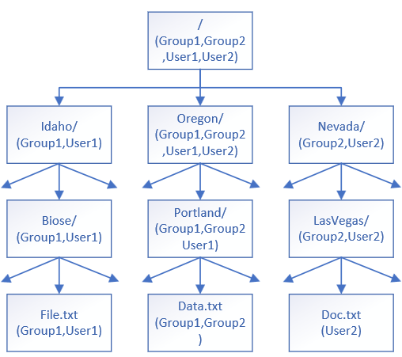

---  
title: Use ADLS Gen2 indexer to ingest permission metadata
titleSuffix: Azure AI Search  
description: Learn how to configure Azure AI Search indexers for ingesting Access Control Lists (ACLs) and Azure Role-Based Access (RBAC) metadata on Azure Data Lake Storage (ADLS) Gen2 blobs.
ms.service: azure-ai-search
ms.topic: how-to
ms.date: 11/18/2025  
author: gmndrg
ms.author: gimondra
---  

# Use an ADLS Gen2 indexer to ingest permission metadata and filter search results based on user access rights

[!INCLUDE [Feature preview](./includes/previews/preview-generic.md)]

The permission model in Azure Data Lake Storage (ADLS) Gen2 allows for per-user access to specific directories or files. Preview APIs in Azure AI Search now support ingestion of user permissions alongside document ingestion so that you can use those permissions to control access to search results. If a user lacks permissions on a specific directory or file in ADLS Gen2, that user doesn't have access to the corresponding documents in Azure AI Search results.

+ 2025-05-01-preview and later, ADLS Gen2 permissions can be ingested using the [ADLS Gen2 indexer](search-how-to-index-azure-data-lake-storage.md).
+ 2025-11-01-preview provides equivalent support for [ADLS Gen2 blob knowledge sources](agentic-knowledge-source-how-to-blob.md) in Azure Storage.

You can use the push APIs to upload and index content and permission metadata manually, or you can use an indexer or knowledge source to automate data ingestion. 

This article focuses on the indexing automation approaches, built on this foundation:

+ [The ADLS Gen2 access control model](/azure/storage/blobs/data-lake-storage-access-control-model) that provides [Access control lists (ACLs)](/azure/storage/blobs/data-lake-storage-access-control-model#access-control-lists-acls) and [Role-based access control (Azure RBAC)](/azure/storage/blobs/data-lake-storage-access-control-model#role-based-access-control-azure-rbac). There's no support for Attribute-based access control (Azure ABAC).

+ [An ADLS Gen2 indexer](#configure-adls-gen2) or [ADLS Gen2 blob knowledge source](#configure-a-knowledge-source) that retrieves and ingests data and metadata, including permission filters. To get permission filter support, use the latest preview REST API or a preview package of an Azure SDK that supports the feature.

+ [An index in Azure AI Search](search-how-to-create-search-index.md) containing the ingested documents and corresponding permissions. Permission metadata is stored as fields in the index. To set up [queries that respect the permission filters](search-query-access-control-rbac-enforcement.md), use the latest preview REST API or a preview package of an Azure SDK that supports the feature.

This functionality helps align [document-level permissions](search-security-trimming-for-azure-search.md) in the search index with the access controls defined in ADLS Gen2, allowing users to retrieve content in a way that reflects their existing permissions.

This article supplements [**Index data from ADLS  Gen2**](search-how-to-index-azure-data-lake-storage.md) and [**ADLS Gen2 blob knowledge sources**](agentic-knowledge-source-how-to-blob.md) with information that's specific to ingesting permissions alongside document content into an Azure AI Search index. 

## Prerequisites

+ [Microsoft Entra ID authentication and authorization](/entra/identity/authentication/overview-authentication). Services and apps must be in the same tenant. Users can be in different tenants as long as all of the tenants are Microsoft Entra ID. Role assignments are used for each authenticated connection.

+ Azure AI Search, any region, but you must have a billable tier (basic and higher) for managed identity support. The search service must be [configured for role-based access](search-security-enable-roles.md) and it must [have a managed identity (either system or user)](search-how-to-managed-identities.md).

+ ADLS Gen2 blobs in a hierarchical namespace, with user permissions granted through ACLs or roles.

## Limitations

+ [Limits on Azure role assignments and ACL entries](/azure/storage/blobs/data-lake-storage-access-control-model#limits-on-azure-role-assignments-and-acl-entries) in ADLS Gen2 impose a maximum number of role assignments and ACL entries.

+ The `owning users`, `owning groups`, `Other` (`all`),  [ACL identities categories](/azure/storage/blobs/data-lake-storage-access-control#users-and-identities) aren't supported during public preview. Use `named users` and `named groups` assignments instead.
  
+ The following indexer features don't support permission inheritance in indexed documents originating from ADLS Gen2. If you use any of these features in a skillset or indexer, document-level permissions aren't included in the indexed content.

  + [Custom Web API skill](cognitive-search-custom-skill-web-api.md)
  + [GenAI Prompt skill](cognitive-search-skill-genai-prompt.md)
  + [Knowledge store](knowledge-store-concept-intro.md)
  + [Indexer enrichment cache](enrichment-cache-how-to-configure.md)
  + [Debug sessions](cognitive-search-debug-session.md)
 
+ This functionality is currently not supported in the Azure portal.

## Support for the permission model

This section compares document-level access control features between ADLS Gen2 and Azure AI Search. It explains which Azure Data Lake Storage (ADLS) Gen2 access control mechanisms AI Search supports or maps. This helps you understand how permissions are enforced at the document level.

| ADLS Gen2 Feature | Description | Supported | Notes |
|-|-|-|-|
| [RBAC](/azure/storage/blobs/data-lake-storage-access-control-model#role-based-access-control-azure-rbac) | Coarse-grained access at container level | Yes | AI Search honors RBAC for access to all documents in the entire container. |
| [ABAC](/azure/storage/blobs/data-lake-storage-access-control-model#attribute-based-access-control-azure-abac) | Attribute-based conditions on top of RBAC | No | AI Search doesn't evaluate ABAC conditions for document-level access. |
| [ACL](/azure/storage/blobs/data-lake-storage-access-control-model#access-control-lists-acls) | Fine-grained permissions at directory/file (document) level  | Yes | AI Search uses document-level ACLs for [permission filters](./search-query-access-control-rbac-enforcement.md). |
| [Security Groups](/azure/storage/blobs/data-lake-storage-access-control-model#security-groups) | Group-based permission assignments  | Yes  | Supported if security groups are mapped inside the document-level ACL. |

## About ACL hierarchical permissions

Indexers and knowledge sources can retrieve ACL assignments from the specified container and all directories leading to each file by following the ADLS Gen2 [hierarchical access evaluation flow](/azure/storage/blobs/data-lake-storage-access-control#common-scenarios-related-to-acl-permissions). The final effective access lists for each file are computed and the different access categories are indexed into the corresponding index fields.

For example, in [ADLS Gen2 common scenarios related to permissions](/azure/storage/blobs/data-lake-storage-access-control#common-scenarios-related-to-acl-permissions) as the file path /Oregon/Portland/Data.txt.

| Operation |	/ |	Oregon/ |	Portland/ |	Data.txt |
| - | - | - | - | - |
| Read Data.txt	| --X	| --X	| --X	| R-- |

The indexer or knowledge source collects ACLs from each container and directory. It then determines effective access at lower levels and continues until it resolves permissions for every file.

```txt
/ assigned access vs Oregon/ assigned access
  => Oregon/ effective access vs Portland/ assigned access
    => Portland/ effective access vs Data.txt assigned access
      => Data.txt effective access
```

## Configure ADLS Gen2

An indexer or knowledge source can retrieve ACLs on a storage account if the following criteria are met. For more information about ACL assignments, see [ADLS Gen2 ACL assignments](/azure/storage/blobs/data-lake-storage-access-control#how-to-set-acls).

### Authorization

For indexing, your search service identity must have **Storage Blob Data Reader** permission. 

If you're testing locally, you should also have a **Storage Blob Data Reader** role assignment. For more information, see [Connect to Azure Storage using a managed identity](search-howto-managed-identities-storage.md).

### Root container permissions:

1. Assign all `Group` and `User` sets (security principals) at the root container `/` with `Read` and `Execute` permissions.

1. Ensure both `Read` and `Execute` are added as "Default permissions" so they propagate to newly created files and directories automatically.

### Propagate permissions down the file hierarchy

Although new directories and files inherit permissions, existing directories and files don't automatically inherit these assignments. 

Use the ADLS Gen2 tool to [apply ACLs recursively](/azure/storage/blobs/data-lake-storage-acl-azure-portal#apply-an-acl-recursively) for assignments propagation on existing content. This tool propagates the root container's ACL assignments to all underlying directories and files.

### Remove excess permissions

After applying ACLs recursively, review permissions for each directory and file. 

Remove any `Group` or `User` sets that shouldn't have access to specific directories or files. For example, remove `User2` on folder `Portland/`, and for folder `Idaho` remove `Group2` and `User2` from its assignments, and so on.

### Sample ACL assignments structure

Here's a diagram of the ACL assignment structure for the [fictitious directory hierarchy](/azure/storage/blobs/data-lake-storage-access-control#common-scenarios-related-to-acl-permissions) in the ADLS Gen2 documentation.



### Updating ACL assignments over time

Over time, as any new ACL assignments are added or modified, repeat the above steps to ensure proper propagation and permissions alignment. Updated permissions in ADLS Gen2 are updated in the search index when you re-ingest the content using the indexer or knowledge source.

## Configure Azure AI Search

Recall that the search service must have:

+ [Role-based access enabled](search-security-enable-roles.md)
+ [Managed identity configured](search-how-to-managed-identities.md)

### Authorization

For indexing, the client issuing the API call must have **Search Service Contributor** permission to create objects, **Search Index Data Contributor** permission to perform data import, and **Search Index Data Reader** to query an index. 

If you're testing locally, you should have the same role assignments. For more information, see [Connect to Azure AI Search using roles](search-security-rbac.md).

## Configure a knowledge source

If you're using a knowledge source, definitions in the knowledge source are used to generate a full indexing pipeline (indexer, data source, and index). ACL assignments are detected and automatically included in the generated index. There's no need to modify any of the generated objects if you want permission inheritance in your indexed content.

Key points about the configuration that make it work for this scenario:

+ `isADLSGen2` is set to true, meeting the data source requirement for this scenario.
+ `ingestionPermissionOptions` specifies user and group IDs.
+ `disableImageVerbalization` is set to true because the GenAI Prompt skill that backs this experience isn't currently supported in ADLS Gen2 permission inheritance.

```http
# Create / Update Azure Blob Knowledge Source
###
PUT {{url}}/knowledgesources/azure-blob-ks?api-version=2025-11-01-preview
api-key: {{key}}
Content-Type: application/json
 
{
    "name": "azure-blob-ks",
    "kind": "azureBlob",
    "description": "A sample azure blob knowledge source",
    "azureBlobParameters": {
        "connectionString": "{{blob-connection-string}}",
        "containerName": "blobcontainer",
        "folderPath": null,
        "isADLSGen2": true,
        "ingestionParameters": {
            "identity": null,
            "embeddingModel": {
                "kind": "azureOpenAI",
                "azureOpenAIParameters": {
                    "deploymentId": "text-embedding-3-large",
                    "modelName": "text-embedding-3-large",
                    "resourceUri": "{{aoai-endpoint}}",
                    "apiKey": "{{aoai-key}}"
                }
            },
            "chatCompletionModel": null,
            "disableImageVerbalization": true,
            "ingestionSchedule": null,
             "ingestionPermissionOptions": [
                "userIds","groupIds"
                           ],
            "contentExtractionMode": "minimal",
            "aiServices": {
                "uri": "{{ai-endpoint}}",
                "apiKey": "{{ai-key}}"
            }
        }
    }
}
###
```

## Configure indexer-based indexing

If you're using an indexer, configure it, the data source, and the index to pull permission metadata from ADLS Gen2 blobs.

### Create the data source

This section supplements  [**Index data from ADLS  Gen2**](search-how-to-index-azure-data-lake-storage.md) with information that's specific to ingesting permissions alongside document content into an Azure AI Search index.

+ Data Source type must be `adlsgen2`.

+ Data source must have `indexerPermissionOptions` with `userIds`, `groupIds` and/or `rbacScope`.

  + For`rbacScope`, configure the [connection string](search-how-to-index-azure-data-lake-storage.md#supported-credentials-and-connection-strings) with managed identity format.
  
  + For connection strings using a [user-assigned managed identity](search-howto-managed-identities-storage.md#user-assigned-managed-identity-preview), you must also specify the `identity` property.

<!-- Question/Comment: check this example -->
JSON example with system managed identity:

```json
{
    "name" : "my-adlsgen2-acl-datasource",
    "type": "adlsgen2",
    "indexerPermissionOptions": ["userIds", "groupIds", "rbacScope"],
    "credentials": {
    "connectionString": "ResourceId=/subscriptions/<your subscription ID>/resourceGroups/<your resource group name>/providers/Microsoft.Storage/storageAccounts/<your storage account name>/;"
    },
    "container": {
    "name": "<your container name>",
    "query": "<optional-virtual-directory-name>"
    }
}
```

JSON schema example with a user-managed identity in the connection string:

```json
{
    "name" : "my-adlsgen2-acl-datasource",
    "type": "adlsgen2",
    "indexerPermissionOptions": ["userIds", "groupIds", "rbacScope"],
    "credentials": {
    "connectionString": "ResourceId=/subscriptions/<your subscription ID>/resourceGroups/<your resource group name>/providers/Microsoft.Storage/storageAccounts/<your storage account name>/;"
    },
    "container": {
    "name": "<your container name>",
    "query": "<optional-virtual-directory-name>"
    },
    "identity": {
    "@odata.type": "#Microsoft.Azure.Search.DataUserAssignedIdentity",
    "userAssignedIdentity": "/subscriptions/{subscription-ID}/resourceGroups/{resource-group-name}/providers/Microsoft.ManagedIdentity/userAssignedIdentities/{user-assigned-managed-identity-name}"
    }
}
```

### Create permission fields in the index

In Azure AI Search, make sure your index contains field definitions for the permission metadata. Permission metadata can be indexed when `indexerPermissionOptions` is specified in the data source definition.

Recommended schema attributes for ACL (UserIds, GroupIds) and RBAC Scope:

+ User identifier (ID) field with `userIds` permissionFilter value.
+ Group IDs filed with `groupIds` permissionFilter value.
+ RBAC scope field with `rbacScope` permissionFilter value.
+ Property `permissionFilterOption` to enable filtering at querying time.
+ Use string fields for permission metadata
+ Set `filterable` to true on all fields.

Notice that `retrievable` is false. You can set it true during development to verify permissions are present, but remember to set to back to false before deploying to a production environment.

JSON schema example:

```json
{
  ...
  "fields": [
    ...
    { "name": "UserIds", "type": "Collection(Edm.String)", "permissionFilter": "userIds", "filterable": true, "retrievable": false },
    { "name": "GroupIds", "type": "Collection(Edm.String)", "permissionFilter": "groupIds", "filterable": true, "retrievable": false },
    { "name": "RbacScope", "type": "Edm.String", "permissionFilter": "rbacScope", "filterable": true, "retrievable": false }
  ],
  "permissionFilterOption": "enabled"
}
```

### Configure the indexer

Field mappings within an indexer set the data path to fields in an index. Target and destination fields that vary by name or data type require an explicit field mapping. The following metadata fields in ADLS Gen2 might need field mappings if you vary the field name:

+ **metadata_user_ids** (`Collection(Edm.String)`) - the ACL user IDs list.
+ **metadata_group_ids** (`Collection(Edm.String)`) - the ACL group IDs list.
+ **metadata_rbac_scope** (`Edm.String`) - the container RBAC scope.

Specify `fieldMappings` in the indexer to route the permission metadata to target fields during indexing.

JSON schema example:

```json
{
  ...
  "fieldMappings": [
    { "sourceFieldName": "metadata_user_ids", "targetFieldName": "UserIds" },
    { "sourceFieldName": "metadata_group_ids", "targetFieldName": "GroupIds" },
    { "sourceFieldName": "metadata_rbac_scope", "targetFieldName": "RbacScope" }
  ]
}
```

## Recommendations and best practices

+ Plan the ADLS Gen2 folder structure carefully before creating any folders.

+ Organize identities into groups and use groups whenever possible, rather than granting access directly to individual users. Continuously adding individual users instead of applying groups increases the number of access control entries that must be tracked and evaluated. Not following this best practice can lead to more frequent security metadata updates required to the index as this metadata changes, causing increased delays and inefficiencies in the refresh process.

## Synchronize permissions between indexed and source content

Enabling ACL or RBAC enrichment on an indexer works automatically only in two situations: 

- **The very first full indexer run / data crawl:** all permission metadata that exists at that moment for each document is captured. 

- **Brand-new documents added after ACL/RBAC support is enabled:** their ACL/RBAC information is ingested along with their content. 

If you change document permissions, such as adding a user to an ACL or updating a role assignment, the change doesn’t appear in the search index unless you tell the indexer to crawl the document's permission metadata again.

Choose one of the following mechanisms, depending on how many items changed: 

| **Scope of your change**       | **Best trigger**                                            | **What gets refreshed on the next run**                    |  
|-----------------------------|---------------------------------------------------------|-------------------------------------------------------|  
| **A single blob or just a handful** | Update the blob’s `Last-Modified` timestamp in storage (touch the file) | Document content **and** ACL/RBAC metadata               |  
| **Dozens to thousands of blobs** | Call [/resetdocs (preview)](search-howto-run-reset-indexers.md#how-to-reset-docs-preview) and list the affected document keys. | Document content **and** ACL/RBAC metadata               |  
| **Entire data source**          | Call [/resync (preview)](search-howto-run-reset-indexers.md#how-to-resync-indexers-preview) with the permissions option.              | **Only** ACL/RBAC metadata (content is left untouched)    |

**Resetdocs (preview) API example:**

   ```http
   POST https://{service}.search.windows.net/indexers/{indexer}/resetdocs?api-version=2025-11-01-preview 
   { 
     "documentKeys": [ 
       "1001", 
       "4452" 
     ]
   }
   ```

**Resync (preview) API example:**

   ```http
   POST https://{service}.search.windows.net/indexers/{indexer}/resync?api-version=2025-11-01-preview 
   { 
     "options": [ 
       "permissions" 
     ] 
   } 
   ```

> [!IMPORTANT]
> If you change permissions on indexed documents and don't trigger one of the mechanisms above, the search index continues serving outdated ACL or RBAC data.
> New documents continue to be indexed automatically; no manual trigger is needed for them. 

## Deletion tracking 

To manage blob deletion effectively, make sure [deletion tracking](search-how-to-index-azure-blob-changed-deleted.md) is enabled before your indexer runs for the first time. This feature lets the system detect deleted blobs in your source and remove them from the index.

## See also

+ [Connect to Azure AI Search using roles](search-security-rbac.md)
+ [Query-time ACL and RBAC enforcement](search-query-access-control-rbac-enforcement.md)
+ [azure-search-python-samples/Quickstart-Document-Permissions-Push-API](https://github.com/Azure-Samples/azure-search-python-samples/blob/main/Quickstart-Document-Permissions-Push-API)
